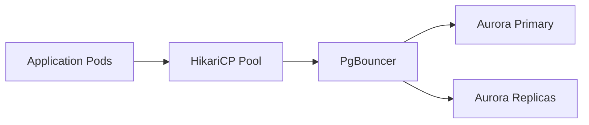

# 🏎️ Database Performance Tuning

  

---

## 🎯 1. Overview

Database performance is the foundation of service reliability. A single unoptimized query can saturate a connection pool, cascade into upstream timeouts, and trigger a full outage. This guide defines the standards for query optimization, connection management, and database monitoring at {Company}.

> **Rule:** Every query must have an execution plan review before merging. Queries exceeding 50ms at p95 must be optimized or justified in an ADR.

---

## 📐 2. Connection Management

### 2.1 Connection Pool Configuration

| Parameter | Recommended Value | Rationale |
|-----------|-------------------|-----------|
| **Pool size** | `(2 * CPU cores) + effective_spindle_count` | PostgreSQL performance FAQ guideline |
| **Minimum idle** | 2 - 5 connections | Avoid cold start latency |
| **Maximum lifetime** | 30 minutes | Prevent stale connections after failover |
| **Connection timeout** | 5 seconds | Fail fast rather than queue indefinitely |
| **Idle timeout** | 10 minutes | Release unused connections back to pool |
| **Validation query** | `SELECT 1` | Verify connection health before use |

### 2.2 Connection Pool Architecture

**Visual overview:**

| Layer | Tool | Mode |
|-------|------|------|
| **Application pool** | HikariCP (JVM), node-postgres pool (Node) | Per-pod connection pool |
| **Connection proxy** | PgBouncer | Transaction-level pooling for high pod counts |
| **Database** | Aurora PostgreSQL | Primary for writes, replicas for reads |

### 2.3 Read/Write Splitting

| Query Type | Target | Acceptable Lag |
|-----------|--------|----------------|
| Writes and read-after-write | Primary | N/A |
| Read-heavy dashboards | Replica | < 1 second |
| Analytics / reporting | Replica | < 5 seconds |
| Background jobs | Replica | < 10 seconds |

---

## 🔍 3. Query Optimization

### 3.1 Mandatory Practices

| Practice | Standard |
|----------|----------|
| **EXPLAIN ANALYZE** | Run on every new or modified query before merge |
| **Index strategy** | Create indexes for all WHERE, JOIN, and ORDER BY columns used in hot queries |
| **Pagination** | Keyset pagination for large result sets; no OFFSET-based pagination |
| **SELECT fields** | Name columns explicitly; never `SELECT *` in application code |
| **Parameterized queries** | Always use prepared statements; never string concatenation |
| **Batch operations** | Use bulk INSERT/UPDATE for > 10 rows; avoid row-by-row loops |

### 3.2 Index Guidelines

| Index Type | When to Use |
|-----------|-------------|
| **B-tree** (default) | Equality and range queries on scalar columns |
| **GIN** | Full-text search, JSONB containment queries |
| **GiST** | Geometric data, range types |
| **Partial index** | Queries that filter on a common condition (e.g., `WHERE active = true`) |
| **Covering index** | Index-only scans for frequently accessed column sets |

### 3.3 N+1 Query Detection

N+1 queries are the most common performance issue. Detect and prevent them:

| Strategy | Implementation |
|----------|----------------|
| **ORM eager loading** | Configure `@BatchSize` (Hibernate) or `.include()` (TypeORM) |
| **Query logging** | Log query count per request in non-production; alert on > 10 queries |
| **CI detection** | Use tools like `pg_stat_statements` analysis in integration tests |

---

## 📊 4. Performance Budgets

| Metric | Target | Alert Threshold |
|--------|--------|-----------------|
| Query p95 latency | < 50ms | > 100ms for 5 min |
| Query p99 latency | < 200ms | > 500ms for 5 min |
| Active connections | < 80% of pool size | > 90% for 5 min |
| Replication lag | < 1 second | > 5 seconds for 5 min |
| Dead tuples ratio | < 10% of table size | > 20% |
| Index bloat | < 30% | > 50% |

---

## 🛠️ 5. Maintenance and Monitoring

| Task | Frequency | Source |
|------|-----------|--------|
| **VACUUM ANALYZE** | Autovacuum (tuned per table) | PostgreSQL autovacuum |
| **Unused index review** | Monthly | `pg_stat_user_indexes` |
| **Slow query review** | Weekly | `pg_stat_statements` dashboard |
| **Connection pool review** | Weekly | HikariCP / PgBouncer metrics in Grafana |
| **Replication lag** | Continuous | Aurora CloudWatch metrics |
| **Lock contention** | Continuous | `pg_stat_activity` + `pg_locks` in Grafana |

---

## ⚠️ 7. Anti-Patterns

| Anti-Pattern | Problem | Fix |
|-------------|---------|-----|
| No connection pooling | Connection churn exhausts database limits | Use HikariCP or PgBouncer |
| OFFSET pagination | Performance degrades linearly with page depth | Use keyset (cursor) pagination |
| SELECT * | Transfers unnecessary data, prevents covering index scans | Select only needed columns |
| Missing indexes on FK columns | JOIN performance degrades as tables grow | Index all foreign key columns |
| ORM-generated N+1 | Hundreds of queries for a single page load | Configure eager loading or batch fetching |
| No query timeout | Runaway queries consume all connections | Set `statement_timeout` at connection level |

---

⬅️ [Back to section](./README.md) · 🏠 [Back to root](../README.md)

