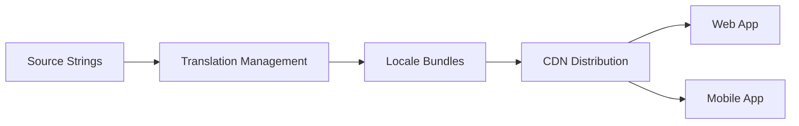

# 🌍 Internationalization and Localization

  

---

## 🎯 1. Overview

Internationalization (i18n) is the engineering work that makes software adaptable to different languages and regions. Localization (l10n) is the process of adapting it for a specific locale. At {Company}, i18n must be built into every user-facing application from day one - retrofitting is orders of magnitude more expensive.

> **Rule:** No user-visible string may be hardcoded. All text must go through the i18n framework, even if only one locale is supported today.

---

## 📐 2. Architecture

**Visual overview:**



| Component | Technology | Purpose |
|-----------|-----------|---------|
| **String extraction** | `react-intl`, `android-i18n`, `NSLocalizedString` | Extract translatable strings from code |
| **Translation management** | Crowdin, Lokalise, or Phrase | Manage translation workflows |
| **Bundle format** | ICU MessageFormat (JSON) | Standardized message syntax with plurals and variables |
| **Delivery** | CDN-hosted JSON bundles | Runtime locale loading without app release |
| **Fallback** | English (en-US) | Default when a translation is missing |

---

## 📋 3. String Management

### 3.1 Message Format

Use ICU MessageFormat for all translatable strings:

```json
{
  "greeting": "Hello, {name}!",
  "items_count": "{count, plural, one {# item} other {# items}}",
  "order_status": "Your order was placed on {date, date, medium}."
}
```

### 3.2 String Key Conventions

| Convention | Example |
|-----------|---------|
| Dot-separated namespace | `checkout.payment.card_number` |
| Component-scoped | `profile.settings.language_label` |
| Descriptive, not positional | `error.network_timeout` not `error_1` |

### 3.3 Rules for Translatable Strings

| Rule | Rationale |
|------|-----------|
| Never concatenate strings | Word order varies across languages |
| Use ICU plurals, not `if count == 1` | Many languages have complex plural rules |
| Include translator context | Comments explaining where the string appears |
| Avoid text in images | Images cannot be translated by the i18n framework |
| Use locale-aware formatting for dates, numbers, currencies | `Intl.DateTimeFormat`, `Intl.NumberFormat` |

---

## 🌐 4. Locale Support

### 4.1 Locale Identifier Format

Use BCP 47 tags: `{language}-{region}` (e.g., `en-US`, `ar-SA`, `fr-FR`).

### 4.2 RTL Support

| Requirement | Implementation |
|-------------|----------------|
| **Layout mirroring** | CSS `direction: rtl` and logical properties (`margin-inline-start`) |
| **Icon mirroring** | Mirror directional icons (arrows, progress bars) |
| **Text alignment** | Use `text-align: start` not `text-align: left` |
| **Number handling** | Arabic-Indic numerals in Arabic locales (configurable) |

### 4.3 Locale-Specific Formatting

Use `Intl.DateTimeFormat` and `Intl.NumberFormat` (or JVM equivalents) for dates, numbers, and currency - never manual formatting. Store phone numbers in E.164 format, display via `libphonenumber`. Use locale-specific address field ordering.

---

## 🔄 5. Translation Workflow

| Step | Owner | Tool |
|------|-------|------|
| Engineer adds string with key and English value | Developer | Code + i18n framework |
| CI extracts new strings and pushes to TMS | CI pipeline | Extraction script |
| Translators translate strings in TMS | Localization team | Crowdin / Lokalise |
| CI pulls translated bundles and creates PR | CI pipeline | TMS integration |
| Bundles deployed to CDN | CD pipeline | S3 + CloudFront |
| App loads bundles at runtime based on user locale | Application | i18n library |

---

## 🧪 6. Testing

| Test Type | What It Validates |
|-----------|-------------------|
| **Pseudo-localization** | UI handles longer strings (30 - 40% expansion), special characters |
| **RTL snapshot tests** | Layout correctness for RTL locales |
| **Missing key detection** | CI fails if any string key has no English value |
| **Locale smoke tests** | App renders correctly in all supported locales |
| **Date/number formatting** | Correct formatting for edge-case locales |

---

## ⚠️ 7. Anti-Patterns

| Anti-Pattern | Problem | Fix |
|-------------|---------|-----|
| Hardcoded strings | Cannot translate without code changes | Extract all strings through i18n framework |
| String concatenation | Breaks in languages with different word order | Use ICU MessageFormat with placeholders |
| Hardcoded date formats | `MM/DD/YYYY` is wrong for most of the world | Use `Intl.DateTimeFormat` |
| App release for translation updates | Slow turnaround for translation fixes | Load bundles from CDN at runtime |
| English-only testing | RTL and long-string issues go undetected | Run pseudo-localization in CI |

---
<div align="center">

⬅️ [Back to section](./README.md) · 🏠 [Back to root](../README.md)

</div>
