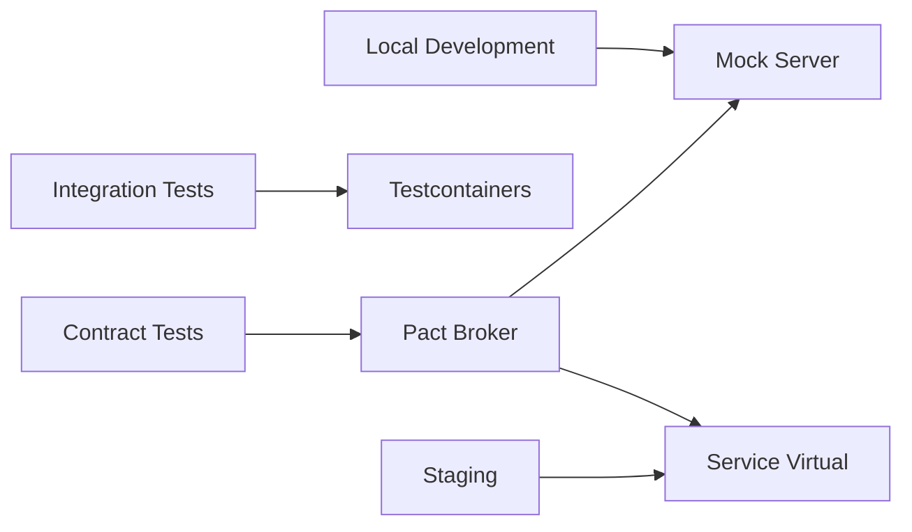

# 🎭 API Mocking and Service Virtualization

  

---

## 🎯 1. Overview

Service dependencies should never block development or testing. When a downstream service is unavailable, under development, or too expensive to call in tests, teams must use API mocking or service virtualization. This guide defines when and how to mock, the tooling standards, and the boundary between useful mocks and dangerous fakes.

> **Rule:** Every service must be able to run its integration test suite without calling any external dependency. Contract tests validate that mocks stay in sync with real services.

---

## 📐 2. Mocking Strategy

**Visual overview:**

| Strategy | Use Case | Tool |
|----------|----------|------|
| **In-process mock** | Unit tests, single-class isolation | Mockito, Jest mocks |
| **Local mock server** | Local development against unavailable dependencies | WireMock, MSW, Prism |
| **Testcontainers** | Integration tests against real infrastructure (DB, Kafka, Redis) | Testcontainers |
| **Contract mock** | Consumer-driven contract testing | Pact, Spring Cloud Contract |
| **Service virtualization** | Staging environments, complex multi-service flows | WireMock Cloud, Mountebank |

---

## 📋 3. When to Mock vs When Not To

| Scenario | Mock? | Rationale |
|----------|-------|-----------|
| Unit testing a single class | Yes - in-process mock | Isolate the unit under test |
| Testing database queries | No - use Testcontainers | Real database behavior differs from mocks |
| Testing Kafka consumers | No - use Testcontainers | Real broker behavior matters |
| Downstream API unavailable during dev | Yes - WireMock or MSW | Unblock development |
| Downstream API too slow for CI | Yes - contract mock | Keep CI fast while validating contracts |
| E2E testing | No - use real services | Mocks hide integration issues |
| Load testing | Depends - mock non-SUT dependencies | Isolate the system under test |

---

## 🔧 4. Tooling Standards

### 4.1 WireMock (Backend)

WireMock is the standard for backend HTTP mocking:

| Feature | Configuration |
|---------|---------------|
| **Stub storage** | JSON stubs in `src/test/resources/wiremock/` |
| **Request matching** | URL, method, headers, body patterns |
| **Response templating** | Dynamic responses using Handlebars |
| **Record and playback** | Capture real responses for replay |
| **Fault injection** | Simulate timeouts, connection resets, slow responses |

### 4.2 MSW (Frontend)

Mock Service Worker is the standard for frontend API mocking. Handlers live in `src/mocks/handlers.ts`, typed against the OpenAPI spec, and work in both browser (service worker) and Node (SSR/test) modes.

### 4.3 Prism (Spec-Based)

Use Prism to generate mock servers directly from OpenAPI specs. Run `prism mock openapi.yaml` for a zero-config server that validates requests against the spec and generates responses from schema examples.

---

## 🔄 5. Contract Testing

Mocks without contract tests will drift from reality. Contract tests ensure mocks remain accurate.

| Concept | Definition |
|---------|------------|
| **Consumer** | The service that calls the API |
| **Provider** | The service that serves the API |
| **Contract** | A pact describing expected interactions |
| **Broker** | Central registry for contracts (Pact Broker) |

### 5.1 Contract Test Workflow

| Step | Owner | Action |
|------|-------|--------|
| Consumer writes contract test | Consumer team | Define expected request/response pairs |
| Contract published to broker | Consumer CI | `pact-broker publish` |
| Provider verifies contract | Provider CI | Replay interactions against real provider |
| Verification result published | Provider CI | `pact-broker can-i-deploy` |
| Deployment gated on verification | Both | Deploy only if all contracts verified |

---

## 🧪 6. Testing Pyramid Integration

| Test Level | Mock Strategy | Real Dependencies |
|-----------|---------------|-------------------|
| **Unit** | In-process mocks (Mockito, Jest) | None |
| **Integration** | Testcontainers for infra, WireMock for HTTP | Database, Kafka, Redis via containers |
| **Contract** | Pact consumer tests generate mocks | Provider verifies independently |
| **E2E** | No mocks | All services real |

---

## ⚠️ 8. Anti-Patterns

| Anti-Pattern | Problem | Fix |
|-------------|---------|-----|
| Mocking the database | Tests pass but queries fail in production | Use Testcontainers for database tests |
| Mocks without contracts | Mocks drift from real API; tests pass but integration fails | Add Pact or Spring Cloud Contract |
| Over-mocking in integration tests | Tests verify mocks, not real behavior | Mock only external dependencies |
| Hardcoded mock responses | Fragile tests that break on any API evolution | Use spec-driven mocks (Prism) |
| No error scenario mocks | Happy path works, error handling untested | Include 4xx and 5xx response stubs |

---

⬅️ [Back to section](./README.md) · 🏠 [Back to root](../README.md)

