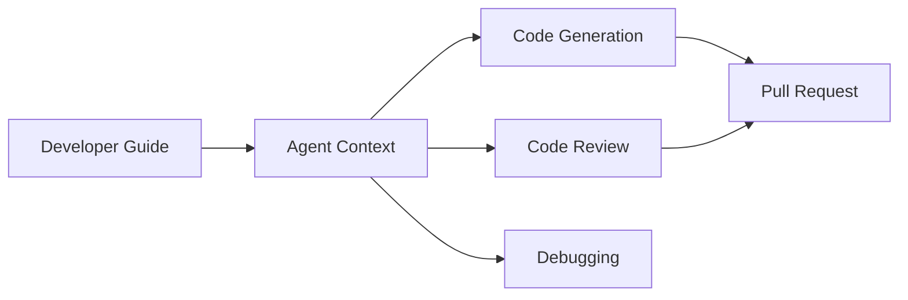

# 🤖 Agentic Developer Guides

  

---

## 🎯 1. Overview

AI coding agents are increasingly part of the {Company} engineering workflow. Developer guides must be written so that both human engineers and AI agents can consume, interpret, and act on them. This document reframes how we write, structure, and maintain developer guides for an agentic world.

> **Rule:** Every developer guide must be structured for machine readability - consistent headings, explicit rules, decision tables, and concrete examples. Ambiguous prose that requires human intuition to interpret is a defect.

---

## 📐 2. Agent-Native Documentation Principles

| Principle | What It Means | Why It Matters |
|-----------|--------------|----------------|
| **Explicit over implicit** | State rules directly: "All services must..." not "It is generally recommended..." | Agents cannot infer nuance |
| **Tables over prose** | Use decision matrices and structured tables | Agents parse tables more reliably than paragraphs |
| **Examples over descriptions** | Show a correct config, not just describe it | Agents learn from patterns |
| **One rule per statement** | Avoid compound sentences with multiple requirements | Agents extract rules individually |
| **Machine-readable identifiers** | Use consistent naming for tools, patterns, and standards | Agents match identifiers across documents |

---

## 🏗️ 3. Guide Structure for Agents

Every developer guide should follow this structure:

| Section | Purpose | Agent Use |
|---------|---------|-----------|
| **Overview** | What this guide covers and who it is for | Relevance filtering |
| **Rules** (bolded, numbered) | Mandatory requirements | Direct enforcement |
| **Decision matrix** (table) | When to use which option | Automated decision-making |
| **Configuration examples** | Copy-pasteable config snippets | Code generation |
| **Anti-patterns** (table) | What not to do and why | Violation detection |
| **Cross-references** | Links to related guides | Context expansion |

### 3.1 Rule Formatting

Format rules so agents can extract them unambiguously:

```markdown
> **Rule:** All REST APIs must use OpenAPI 3.1 specs validated in CI.
```

Agents index bolded rule blocks and apply them during code generation and review.

---

## 🔄 4. Agent Workflow Integration

**Visual overview:**



| Workflow | How Agents Use Guides |
|----------|----------------------|
| **Code generation** | Agent reads guide rules and examples, generates compliant code |
| **Code review** | Agent checks PR against anti-patterns and mandatory rules |
| **Debugging** | Agent references troubleshooting tables and runbooks |
| **Onboarding** | Agent answers "how do I..." questions using guide content |
| **Dependency updates** | Agent reads versioning rules and compatibility matrices |

---

## 📋 5. Content Standards for Agent Consumption

### 5.1 Structured Content Formats

| Format | Use Case | Example |
|--------|----------|---------|
| **Decision table** | Choosing between options | Condition / Choice / Rationale columns |
| **Configuration block** | Showing correct setup | Complete, runnable YAML or JSON (not fragments) |
| **Error resolution table** | Troubleshooting | Error / Cause / Fix columns |

Every guide that involves configuration must include a complete, valid, copy-pasteable example - not a fragment.

---

## 🔒 6. Agent Safety Guardrails

Guides must include explicit boundaries for agent behavior:

| Guardrail | Implementation |
|-----------|----------------|
| **Scope limits** | State what the agent should NOT modify (e.g., "Do not change database schemas without human approval") |
| **Approval gates** | Mark actions requiring human review: "Requires Staff+ approval" |
| **Rollback instructions** | Include rollback steps for every destructive action |
| **Secrets handling** | "Never log, commit, or expose secrets - even in examples" |
| **Blast radius warnings** | "This change affects all consumers - coordinate before applying" |

---

## 📊 7. Measuring Guide Effectiveness

| Metric | Target | Measurement |
|--------|--------|-------------|
| Agent compliance rate | > 90% of generated code follows guide rules | Automated lint + contract test results |
| Guide coverage | 100% of platform patterns have an agent-readable guide | Audit against service catalog |
| Stale guide detection | 0 guides unchanged for > 6 months | Automated freshness check |
| Agent query success rate | > 85% of agent questions answered by guides | Agent feedback logs |

---

## ⚠️ 8. Anti-Patterns

| Anti-Pattern | Problem | Fix |
|-------------|---------|-----|
| Ambiguous language | "You should probably consider..." - agent cannot act on this | Use "must", "must not", "may" consistently |
| Prose-only decisions | Agent cannot parse multi-paragraph reasoning | Use decision tables |
| Incomplete examples | Config fragment missing required fields | Provide complete, runnable examples |
| No anti-pattern section | Agent cannot detect violations | Add explicit anti-pattern table to every guide |
| Guide not indexed | Agent cannot discover the guide | Publish all guides to Backstage TechDocs |

---
<div align="center">

⬅️ [Back to section](./README.md) · 🏠 [Back to root](../README.md)

</div>
