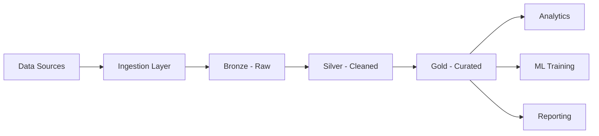

# 🏠 Data Lakehouse and ETL vs ELT

  

---

## 🎯 1. Overview

{Company}'s data architecture follows a lakehouse pattern - combining the flexibility of data lakes with the reliability and performance of data warehouses. This document defines the lakehouse architecture, data ingestion patterns (ETL vs ELT), and standards for teams producing or consuming data.

> **Rule:** All analytical and ML workloads must consume data from the lakehouse, not from production databases directly. No analytical queries against production OLTP databases.

**Visual overview:**

---

## 🏗️ 2. Lakehouse Architecture

| Layer | Purpose | Format | Quality |
|-------|---------|--------|---------|
| **Bronze** | Raw ingestion, append-only, full fidelity | Parquet / Delta Lake | No transformations, exact copy of source |
| **Silver** | Cleaned, deduplicated, schema-enforced | Delta Lake | Null handling, type casting, deduplication applied |
| **Gold** | Business-ready aggregations and models | Delta Lake | Joins resolved, business logic applied, SLA-governed |

### Storage Standards

| Standard | Value |
|----------|-------|
| File format | Parquet with Snappy compression (default), Delta Lake for mutable tables |
| Partitioning | By date for time-series data, by tenant for multi-tenant data |
| Retention | Bronze: 90 days, Silver: 1 year, Gold: indefinite |
| Cataloging | All tables registered in the data catalog with schema, owner, and SLA |
| Access control | Column-level and row-level security via catalog policies |

---

## 🔄 3. ETL vs ELT

| Approach | Description | When to Use |
|----------|-------------|-------------|
| **ETL** | Transform before loading into the lakehouse | Legacy sources, complex transformations, data quality critical before load |
| **ELT** | Load raw data first, transform in the lakehouse | Modern sources, schema-on-read flexibility, iterative transformation development |

> **Rule:** ELT is the default pattern at {Company}. ETL is permitted only when data must be transformed before it leaves the source system (e.g., PII stripping at source).

### ELT Pipeline Standards

| Stage | Tool | Standard |
|-------|------|----------|
| **Extract** | Debezium (CDC), Kafka Connect, Fivetran | Incremental extraction preferred over full-load |
| **Load** | Spark, managed ingestion service | Land in Bronze layer within SLA |
| **Transform** | Spark, dbt | Transformations versioned in Git, tested in CI |

---

## 📊 4. Data Quality

| Check | Layer | Tool | Action on Failure |
|-------|-------|------|-------------------|
| Schema validation | Bronze to Silver | Great Expectations | Block promotion, alert data owner |
| Null/completeness checks | Silver | Great Expectations | Block promotion, alert data owner |
| Freshness check | All layers | Custom monitoring | P2 alert if data is stale beyond SLA |
| Row count anomaly | Bronze | Custom monitoring | Alert if row count deviates > 20% from expected |
| Business rule validation | Gold | dbt tests | Block promotion, alert data owner |

---

## 📋 5. Data Governance

| Requirement | Standard |
|-------------|----------|
| **Ownership** | Every table has a named team owner in the data catalog |
| **Schema evolution** | Additive changes only (new columns); breaking changes require consumer migration |
| **PII handling** | PII columns tagged in catalog, masked by default, unmasked access requires approval |
| **Lineage** | End-to-end lineage tracked from source to Gold tables |
| **SLA** | Gold tables have published freshness SLAs (e.g., "updated within 1 hour of source") |

---

## 🚫 6. Anti-Patterns

| Anti-Pattern | Risk | Mitigation |
|-------------|------|------------|
| **Querying production DBs** | Performance impact, lock contention | All analytics via lakehouse |
| **Unregistered tables** | Undiscoverable, ungoverned data | All tables must be registered in data catalog |
| **Copy-paste pipelines** | Duplicated logic, inconsistent results | Shared transformation libraries in version control |
| **No data quality checks** | Bad data propagates to consumers | Quality gates at each layer boundary |
| **Schema-on-read everywhere** | Consumer confusion about data meaning | Silver and Gold layers enforce schemas |

---

## 🔗 7. Cross-References

- [Data Platform](./05-data-platform.md) - Data platform architecture and tooling
- [Data Governance](./09-data-governance.md) - Data classification, privacy, and governance policies

---

⬅️ [Back to section](./README.md) · 🏠 [Back to root](../README.md)

