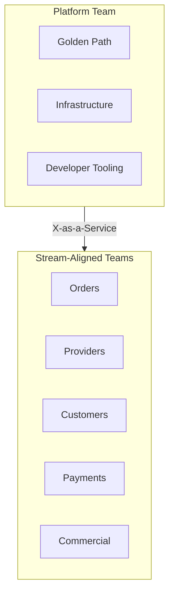

# 🏘️ Team Topology & Ways of Working

  

---

## 🏘️ 1. Team Structure

We follow the **Team Topologies** model. There are two primary team types:

### 1.1 Stream-Aligned Teams

Product engineering teams aligned to a domain or user journey. They own services end-to-end — development, deployment, and operation.

| Team | Domain | Services |
|------|--------|---------|
| **Orders** | Order lifecycle | Orders Service, Fulfillment Engine |
| **Providers** | Provider experience | Provider Profile, Provider App BFF |
| **Customers** | Customer experience | Customer Profile, Customer App BFF |
| **Payments** | Payments & settlements | Payment Service, Payout Service |
| **Commercial** | Pricing & demand | Pricing Service, Dynamic Pricing, Promotions |
| **Trust & Safety** | Trust & fraud | Fraud Engine, Safety Service |

### 1.2 Platform Team (Enabling Team)

The Platform Engineering team exists to **reduce cognitive load on stream-aligned teams** — not to be a bottleneck. Their job is to build and maintain the golden path so teams can move fast safely.

Platform team responsibilities:
- EKS cluster management and upgrades
- CI/CD pipeline templates and tooling
- Shared Helm charts and Terraform modules
- Backstage, ArgoCD, Grafana, and observability stack
- Platform BOM and security toolchain
- Developer experience and onboarding

**Platform team is not** a gatekeeper for deployments. Teams deploy themselves.

Platform team on-call is separate from stream-aligned team on-call. Platform PagerDuty escalation policy is distinct — platform incidents escalate within the platform team, not to product engineering managers.

**Visual overview:**



---

## 🏘️ 2. Ownership Model

### 2.1 Service Ownership

Every service has:
- **One owning team** — accountable for reliability, security, and evolution
- **One Tech Lead** — accountable for technical decisions in the service
- **On-call rotation** — the owning team is on-call for their services

Ownership is declared in `catalog-info.yaml` and cannot be "shared" — shared ownership means no ownership.

### 2.2 CODEOWNERS

Every repository has a `.github/CODEOWNERS` file:
```
# Default: orders team owns everything
*                   @{company}/team-orders

# Platform team owns CI/CD config
.github/            @{company}/team-platform
terraform/          @{company}/team-platform
```

---

## 🛤️ 3. Ways of Working

### 3.1 Sprint Cadence

- **2-week sprints** with sprint planning, review, and retrospective
- Backlog refinement mid-sprint
- **No sprint gates on deployments** — merge to main deploys to production continuously

### 3.2 Architecture Decision Records (ADRs)

Any significant technical decision must be captured as an ADR in `docs/adr/`:

- New technology introduced to a service
- Deviation from platform standards (requires Platform team review)
- Significant architectural change within a domain
- Decision to accept a known risk

ADR format (stored as `docs/adr/NNN-short-title.md`):

```markdown
# ADR-NNN: Title

**Date:** YYYY-MM-DD
**Status:** Proposed | Accepted | Deprecated | Superseded by ADR-NNN
**Deciders:** [names and roles]

## Context
What problem or situation drove this decision?

## Decision
What was decided?

## Consequences
Positive and negative consequences of this decision.

## Alternatives Considered
What was evaluated and why it was not chosen.
```

### 3.3 Technical Debt

Technical debt is visible and tracked:
- All tech debt is tagged `tech-debt` in Jira
- Each team allocates **20% of sprint capacity** to tech debt reduction — non-negotiable
- Tech debt items blocking security or reliability are treated as P2 bugs
- Quarterly tech debt review with all Tech Leads

### 3.4 On-Call

- All stream-aligned teams run their own on-call rotation
- Minimum rotation size: 4 engineers
- On-call engineers are expected to have runbooks for all P1/P2 alert scenarios
- Post-incident reviews (PIRs) are mandatory for all P1 incidents within 5 business days

---

## 🤝 4. Inner Source

Shared libraries and platform components follow an **inner source model**:
- Any engineer can raise a PR against any repository
- The owning team reviews and merges
- Platform libraries welcome contributions — the Platform team does not have to build everything

---

## 📋 5. Worked Example ADR

This is what a real, well-written ADR looks like:

```markdown
# ADR-007: Use Outbox Pattern for Kafka Event Publishing in Orders Service

**Date:** 2024-11-10
**Status:** Accepted
**Deciders:** Jane Doe (Tech Lead, Orders), John Smith (Platform Engineering)

## Context

The Orders Service must publish an `orders.order.completed` Kafka event every time an order 
is completed. The naive implementation — save the order to the database, then publish 
to Kafka — has a critical flaw: if the service crashes between the DB save and the 
Kafka publish, the order is saved but the event is never published.

This means downstream services (Payments, Notifications) never receive the completion 
signal, resulting in unpaid orders and customers receiving no receipt.

## Decision

We will implement the Transactional Outbox pattern:

1. When an order is completed, write the domain event to an `outbox_events` table in 
   the same database transaction as the order update.
2. A separate outbox publisher reads unpublished events from the table and publishes 
   them to Kafka, then marks them as published.

This guarantees that if the order is saved, the event will eventually be published — 
even if the service crashes mid-operation.

## Consequences

**Positive:**
- Event publishing is reliable — no lost events due to crashes
- The outbox provides a natural audit trail of all published events
- At-least-once delivery is maintained (Kafka consumers must still be idempotent)

**Negative:**
- Adds complexity: an outbox table + a publisher scheduler
- Slight latency increase: events published within ~1s of the DB write (not inline)
- The outbox table must be monitored for unpublished events (a stuck outbox is an incident)

## Alternatives Considered

**Kafka Transactions (exactly-once):** Kafka supports transactions that coordinate 
with the DB commit. Rejected because it requires a compatible JPA transaction manager 
and significantly increases operational complexity. The Outbox pattern achieves the 
same reliability guarantee with less complexity.

**Accept the risk (fire-and-forget):** Rejected. Unpaid orders are a direct financial 
loss. The risk is not acceptable.

**Separate CDC via Debezium:** Would achieve the same result by capturing the DB change 
as a Kafka event. Rejected for this service because it introduces an external Debezium 
connector dependency for a single service's events. Debezium is used for the analytics 
pipeline where it makes more sense at scale.
```

---

## 📏 6. Inner Source Standards

Any engineer may open a PR to any service they don't own. The following standards govern how inner source contributions are handled.

### Maintainer SLA

| Action | SLA |
|--------|-----|
| Acknowledge PR (comment or review) | Within 48 hours |
| Final decision (approve or reject with rationale) | Within 5 business days |

### Accept/Reject Criteria

A contributed PR must:
- Pass CI (all checks green)
- Follow the service's coding standards and style guide
- Include tests covering the change
- Not introduce breaking changes to the service's API

### Breaking Changes to Shared Libraries

Breaking changes to shared libraries require:
1. An **RFC** documenting the change and its impact
2. A **4-week communication window** to all consumers before merge
3. A **migration guide** included in the PR

### On-Call Responsibility

The **owning team** remains on-call for inner source contributions. Contributors are **NOT** responsible for production issues arising from their merged PRs. The owning team accepts operational responsibility at merge time.

### Recognition

Inner source contributions count toward **engineering ladder progression** — specifically the "collaboration" and "impact beyond team" dimensions. Contributions are tracked via GitHub PR metadata.

---

## 📊 7. Technical Debt Registry

### Registry Location

Technical debt is tracked on a dedicated Jira board with a `tech-debt` issue type.

### Required Fields

| Field | Description | Example Values |
|-------|-------------|----------------|
| Title | Short description of the debt item | "Orders Service still uses deprecated Kafka client" |
| Owning Team | Team responsible for resolution | Fulfillment, Payments, Platform |
| Blast Radius | Scope of impact | Single service / Cross-service / Platform |
| Customer Impact | Effect if debt is not addressed | None / Degraded experience / Risk of outage |
| Estimated Effort | T-shirt size | S / M / L / XL |
| Age | When the debt was first identified | Auto-tracked from creation date |

### Priority Scoring

```
Priority Score = (blast_radius × 3) + (customer_impact × 3) + (age_months × 1) + (effort_inverse × 1)
```

Higher score = higher priority. Scoring values:

| Factor | Values |
|--------|--------|
| Blast radius | Single service = 1, Cross-service = 2, Platform = 3 |
| Customer impact | None = 0, Degraded experience = 2, Risk of outage = 3 |
| Age (months) | Actual months since creation (capped at 12) |
| Effort inverse | XL = 1, L = 2, M = 3, S = 4 (smaller items are easier to close) |

### Sequencing

- **Monthly:** Top 5 items by score reviewed in engineering leadership sync
- **Quarterly:** Each team must include the top item from their backlog in their sprint
- **20% capacity:** Each team allocates 20% of sprint capacity to tech debt reduction — this is non-negotiable (see Section 3.3)

### Executive Escalation

If a team's tech debt capacity (< 20%) is consistently redirected to product work for **more than 2 consecutive quarters**, VP Engineering intervenes to rebalance priorities.

### Reporting

Quarterly tech debt report to the CTO covering:
- Total items (open, by blast radius and customer impact)
- Items closed since last report
- Top risks (highest-scoring unresolved items)
- Trending (is debt growing or shrinking?)

---
<div align="center">

⬅️ [Back to section](./README.md) · 🏠 [Back to root](../README.md)

</div>
