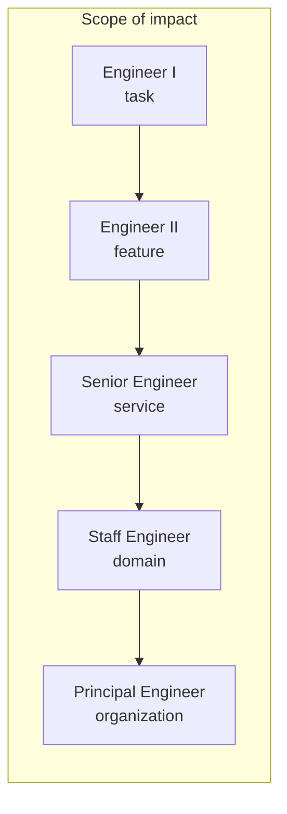
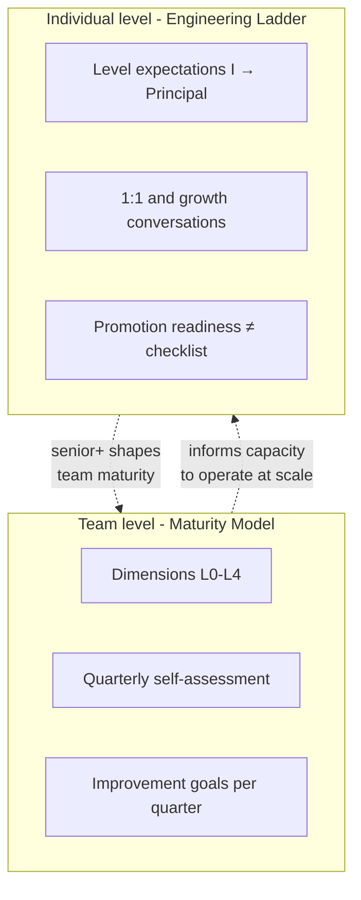
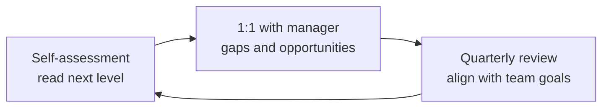

# 🪜 Engineering Ladder

  

---

## 🎯 1. Purpose

This ladder **maps individual engineering growth** to the standards defined in the {Company} Platform Manifesto - from the golden path and hexagonal architecture to observability, resilience, and platform governance.

It is **not** a performance review tool or a promotion checklist. It is a **growth guide**: a shared vocabulary for engineers and managers about what "great" looks like at each scope, and how that connects to how we build, ship, and operate software at {Company}.

---

## 🪜 2. Levels overview

Progression is defined by **expanding scope of impact**: from well-scoped tasks to organization-wide technical direction.

**Visual overview:**

| Level | Typical scope | Manifesto anchor |
|-------|---------------|------------------|
| **Engineer I** | Task / story | Golden path, coding standards, tests, reviews |
| **Engineer II** | Feature / slice | Integration testing, resilience, ADRs, runbooks |
| **Senior Engineer** | Service / team outcomes | SLOs, maturity, on-call, incidents, mentoring |
| **Staff Engineer** | Domain / cross-team | Cross-service architecture, platform BOM, chaos |
| **Principal Engineer** | Organization / industry | Direction, build-vs-buy, manifesto governance |

---

## 🪜 3. Engineer I expectations

- Follows the **golden path** for new work (scaffolding, CI, deployment patterns documented in the manifesto).
- Writes **unit tests** that meet the platform target of **≥ 80% coverage** on meaningful code paths.
- Follows **coding standards** and repository conventions (branching, commits, PR hygiene).
- Raises **PRs under ~400 lines** where practical; splits work when larger changes are needed.
- Understands **hexagonal architecture** - ports, adapters, and keeping domain logic free of infrastructure details.
- **Participates in code review** as author and reviewer, using the code review guide as the baseline.

---

## 🪜 4. Engineer II expectations

- Contributes **integration tests** using **Testcontainers** (or equivalent manifesto-approved patterns) so tests exercise real dependencies, not only mocks.
- Implements **resilience patterns** where appropriate: circuit breaker, retry with backoff, timeouts - aligned with operational excellence standards.
- Writes **ADRs for service-level** technical decisions (new dependency, non-trivial API or data shape, operational trade-offs).
- **Debugs production issues** using **runbooks**, logs, metrics, and traces; escalates with clear hypotheses and evidence.

---

## 🪜 5. Senior Engineer expectations

- **Contributes to manifesto standards** - proposes improvements, pilots changes, or helps document patterns from production experience.
- **Mentors** others on code review quality, design, and operational thinking.
- **Owns service reliability** for their area: **SLOs**, error budgets, and actionable alerting.
- **Drives maturity model improvements** for their team (testing, CI/CD, observability, security dimensions as applicable).
- **Participates in on-call rotation** and **leads incident response** when their services or domain are involved - communication, mitigation, and post-incident follow-up.

---

## 🪜 6. Staff Engineer expectations

- **Shapes cross-service architecture** - aligns boundaries, contracts, and evolution paths across teams.
- **Authors ADRs for domain-level** decisions that affect multiple services or teams.
- **Contributes to the platform BOM and golden path** - templates, shared libraries, and paved-road tooling.
- **Drives or sustains the chaos engineering program** - game days, experiments, and learning loops tied to resilience goals.
- **Reviews critical PRs across teams** where blast radius or architectural consistency is high.

---

## 🪜 7. Principal Engineer expectations

- **Sets technical direction** across the platform in partnership with CTO and domain leaders.
- **Makes build-vs-buy decisions** with clear criteria: cost, risk, time-to-value, and operational fit for {Company}'s scale.
- **Owns manifesto governance** - review cadence, approval bar for material changes, and coherence across sections.
- **Drives the migration roadmap** and major technical programs so execution matches strategy.
- **Represents engineering externally** - conferences, partners, or critical technical discussions - with a consistent story about how we build.

---

## 🧭 7.1 Competency Matrix

The following matrix details expected competencies across five pillars for each level. Use this for structured growth conversations and promotion readiness assessments.

### Technical Execution

| Competency | Engineer I | Engineer II | Senior | Staff | Principal |
|-----------|-----------|-------------|--------|-------|-----------|
| **Code quality** | Writes clean, tested code following standards | Writes idiomatic, well-structured code; catches issues in review | Sets quality bar for team; authors patterns others follow | Establishes cross-team code standards | Defines org-wide quality strategy |
| **System design** | Understands existing designs | Designs within a service boundary | Designs services end-to-end (API, data, deployment) | Designs cross-service systems and integration patterns | Defines architecture principles for the organization |
| **Testing** | Unit tests at ≥ 80% coverage | Integration tests with Testcontainers; contract tests | Test strategy for team; owns flaky-test discipline | Cross-service test architecture | Portfolio-wide quality and risk posture |
| **Debugging** | Debugs with IDE and logs | Uses traces, metrics, and runbooks; forms clear hypotheses | Leads production debugging for complex, multi-service issues | Debugs systemic problems across domains | Diagnoses organization-wide reliability patterns |

### Operational Excellence

| Competency | Engineer I | Engineer II | Senior | Staff | Principal |
|-----------|-----------|-------------|--------|-------|-----------|
| **Reliability** | Follows SLO and alerting standards | Configures alerts; participates in on-call | Owns SLOs and error budgets for services | Designs reliability architecture across domain | Sets org reliability strategy and investment |
| **Incident response** | Follows incident process | Responds to incidents; writes PIRs | Leads incident response; drives follow-up actions | Leads cross-team incident coordination | Shapes incident culture and process improvements |
| **Observability** | Uses structured logging and dashboards | Adds custom metrics and traces | Designs observability for new services; maintains runbooks | Cross-cutting observability architecture | Vendor and architecture choices (e.g. OTel-first) |
| **Security** | Follows secure coding defaults | Scans dependencies; manages secrets properly | Leads threat modeling for services | Security architecture across domain | Org security engineering partnership |

### Delivery and Impact

| Competency | Engineer I | Engineer II | Senior | Staff | Principal |
|-----------|-----------|-------------|--------|-------|-----------|
| **Scope of impact** | Task or story | Feature or vertical slice | Service or team outcomes | Domain or cross-team | Organization or industry |
| **Autonomy** | Works with guidance on defined tasks | Independently delivers features with clear requirements | Identifies and solves ambiguous problems | Defines the problem space; aligns teams on approach | Sets multi-year technical direction |
| **Decision-making** | Follows established patterns | Makes service-level technical decisions (ADRs) | Makes team-level decisions; knows when to escalate | Makes domain-level decisions; influences org direction | Makes org-level decisions; advises executive leadership |
| **Velocity** | Delivers tasks within sprint estimates | Delivers features predictably; unblocks self | Removes blockers for the team; accelerates delivery | Accelerates delivery across teams | Optimizes org-wide engineering velocity |

### Communication and Leadership

| Competency | Engineer I | Engineer II | Senior | Staff | Principal |
|-----------|-----------|-------------|--------|-------|-----------|
| **Written communication** | Clear PR descriptions and commit messages | Writes ADRs and technical documentation | Writes RFCs; contributes to manifesto standards | Authors cross-team proposals and architecture docs | Publishes engineering strategy and vision documents |
| **Mentoring** | Asks good questions; learns actively | Helps onboard new team members | Mentors engineers I-II; improves team practices | Mentors seniors; grows future staff engineers | Mentors staff engineers; shapes engineering culture |
| **Collaboration** | Works well within team | Collaborates across team for feature delivery | Collaborates across teams for service integration | Drives alignment across domain teams | Aligns engineering direction with business strategy |
| **Knowledge sharing** | Participates in team discussions | Presents in team demos and knowledge sessions | Leads team tech talks; documents patterns | Runs cross-team architecture sessions | Represents {Company} engineering externally |

### Platform and Tooling

| Competency | Engineer I | Engineer II | Senior | Staff | Principal |
|-----------|-----------|-------------|--------|-------|-----------|
| **Golden path** | Uses golden path templates and scaffolding | Extends golden path for team-specific needs | Improves golden path based on production experience | Contributes templates and shared libraries to platform | Defines golden path strategy and platform investment |
| **CI/CD** | Uses shared pipelines correctly | Extends or fixes pipeline for team needs | Owns deployment strategy for services (flags, rollback) | Template and platform CI improvements | Build platform and supply-chain direction |
| **Developer experience** | Onboards via golden path | Improves local dev setup and docs for team | Champions DX improvements; reduces team friction | Backstage, templates, and BOM contributions | DX and platform product strategy |
| **AI and agents** | Uses AI coding assistants effectively | Configures agents with project context and rules | Evaluates agent patterns for team adoption | Shapes agent integration standards across teams | Defines org-wide agent strategy and governance |

---

## 📊 8. Maturity model alignment

The [Engineering Maturity Model](../08-program/01-maturity-model.md) describes **team capabilities** across dimensions (source control, testing, CI/CD, observability, security, developer experience, etc.). This ladder describes **individual** expectations at each level. Together they answer: *what should the team be capable of?* and *what should a person at this level be able to lead or exemplify?*

### 8.1 Dimension → level expectations

| Maturity dimension | Engineer I-II | Senior | Staff | Principal |
|--------------------|---------------|--------|-------|-----------|
| Source control & branching | Follows trunk-based rules; small PRs | Enforces conventions; improves team habits | Cross-repo patterns; CODEOWNERS / governance input | Org-wide branching and release strategy |
| Testing | Unit + starts on integration (II) | Owns test strategy for services; flaky-test discipline | Contract / cross-service test strategy | Portfolio-wide quality and risk posture |
| CI / build | Uses shared pipelines | Extends or fixes pipeline for team | Template and platform CI improvements | Build platform and supply-chain direction |
| Continuous delivery | Ships via golden path | Feature flags, rollout, rollback ownership | Progressive delivery across services | CD strategy and platform investment |
| Observability | Uses structured logs, metrics, traces | SLOs, runbooks, alert hygiene | Cross-cutting observability design | Vendor and architecture choices (e.g. OTel-first) |
| Security | Secrets, scanning, secure defaults | Threat modeling for services; remediation leadership | Security architecture across domain | Org security engineering partnership |
| Developer experience | Onboards via golden path | Improves local dev and docs for team | Backstage / templates / BOM contributions | DX and platform product strategy |

### 8.2 Team maturity vs individual ladder

**Visual overview:**

---

## 🪜 9. Growth framework

**Visual overview:**

### How to use this ladder

1. **Self-assessment** - Periodically read the level above yours. Note gaps that are **skills**, **scope**, or **visibility** (not all gaps require a level change to address).
2. **1:1 conversations with your manager** - Use the ladder as shared language: which expectations are already met, which are stretch goals, and what opportunities (projects, reviews, incidents) will accelerate growth.
3. **Quarterly review** - Align individual growth goals with team objectives and maturity improvements so development work and platform health move together.

Promotion and compensation decisions remain **manager and HR processes**; this document informs **expectations and development**, not titles alone.

---

## 👥 10. Relationship to Performance Reviews

The engineering ladder informs performance reviews but does not replace them. For the performance review process, calibration cadence, and review templates, see [09-engineering-management.md](./09-engineering-management.md).

---

⬅️ [Back to section](./README.md) · 🏠 [Back to root](../README.md)

