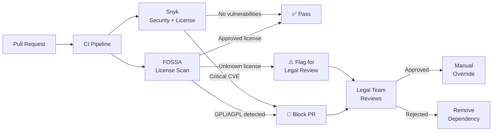
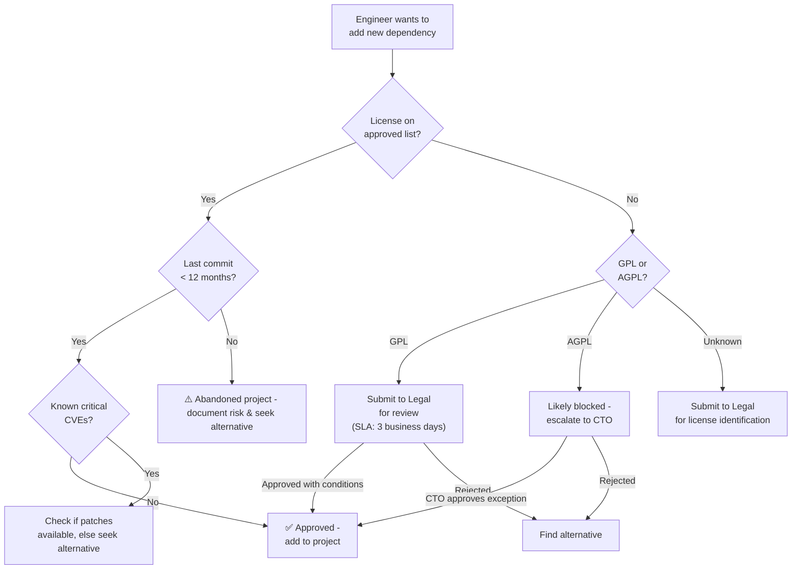
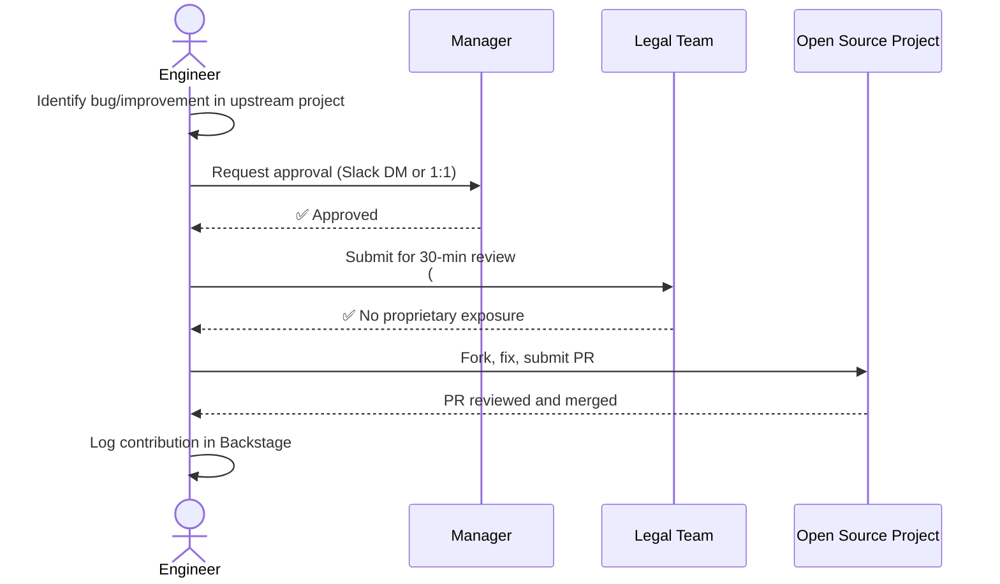
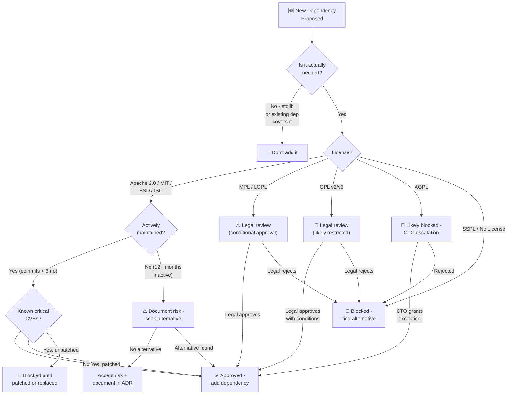

# 📖 Open Source Policy

  

---

## 🎯 1. Philosophy

{Company} is built on open source. Our entire stack - Kubernetes, Kafka, PostgreSQL, Spring Boot, Terraform, ArgoCD, Grafana - exists because communities invested in building shared infrastructure.

**We respect this.** We consume responsibly, contribute where we can, and ensure license compliance is not an afterthought but a CI gate.

| Principle | What It Means |
|-----------|--------------|
| **Consume responsibly** | Every dependency is a liability - vet before adopting |
| **Respect licenses** | Comply with the letter and spirit of every license we use |
| **Contribute back** | Engineers are encouraged to fix bugs upstream, not fork and patch |
| **Protect our IP** | Never expose proprietary logic, internal URLs, or secrets |

---

## 📖 2. Consumption Governance

### 2.1 Approved Licenses

| License | Status | Notes |
|---------|--------|-------|
| **Apache 2.0** | ✅ Approved | Preferred license for {Company} projects |
| **MIT** | ✅ Approved | Permissive, widely used |
| **BSD (2-clause, 3-clause)** | ✅ Approved | Permissive |
| **ISC** | ✅ Approved | Functionally equivalent to MIT |
| **MPL 2.0** | ⚠️ Conditional | File-level copyleft - approved for runtime dependencies, not for modification |
| **LGPL** | ⚠️ Conditional | Dynamic linking only - requires legal review |
| **GPL v2/v3** | 🔴 Legal review required | Copyleft - may impose obligations on {Company}'s proprietary code |
| **AGPL** | 🔴 Likely blocked | Network copyleft - using AGPL software in a SaaS product triggers copyleft obligations |
| **SSPL** | 🛑 Blocked | Not OSI-approved; restrictive terms |
| **Unlicensed / No License** | 🛑 Blocked | No license = no permission to use |

### 2.2 License Scanning in CI

Every build runs **FOSSA** license scanning. Snyk is used as a secondary check for security + license combined analysis.

---

## 📋 3. New Dependency Review

Before adding any new dependency, engineers must evaluate:

| Criterion | Check | Red Flag |
|-----------|-------|----------|
| **License** | Is it on the approved list? | GPL/AGPL/SSPL/Unlicensed |
| **Maintenance** | Last commit < 6 months ago? | No commits in 12+ months |
| **Security** | Known CVEs? Snyk/FOSSA report? | Unpatched critical CVEs |
| **Community** | Active contributors? Responsive to issues? | Single maintainer, no activity |
| **Alternatives** | Is there a better-maintained alternative? | Using a niche lib when a standard exists |
| **Transitive dependencies** | What does it pull in? | Pulls in GPL-licensed transitive deps |

### 3.1 Dependency Review Process

---

## ❌ 4. Abandoned Project Risk

A dependency is flagged as **at risk** when:

| Signal | Threshold | Action |
|--------|-----------|--------|
| No commits | > 12 months | Flag in quarterly dependency review |
| No releases | > 18 months | Actively seek replacement |
| Maintainer unresponsive | > 3 months on critical issues | Evaluate fork viability |
| CVE unpatched | > 30 days after disclosure | Escalate to security team |

### 4.1 Quarterly Dependency Audit

Platform Engineering runs a quarterly scan of all production dependencies:
1. Flag any dependency with no commits in 12+ months
2. Cross-reference with Snyk vulnerability database
3. Produce a risk report for engineering leadership
4. High-risk dependencies are added to the migration backlog

---

## 🤝 5. Contribution Guidelines

Engineers are encouraged to contribute to open source projects that {Company} depends on. Contributing upstream fixes is better than maintaining internal forks.

### 5.1 Rules

| Rule | Detail |
|------|--------|
| **What you can contribute** | Bug fixes, documentation, tests, small features in projects {Company} uses |
| **What you cannot contribute** | Anything that exposes {Company} proprietary logic, algorithms, or infrastructure details |
| **Approval** | Manager approval + 30-minute legal review (async via Slack `#legal-reviews`) |
| **Time allocation** | Up to **4 hours/month** on company time per engineer |
| **CLA/DCO** | If the project requires a CLA, legal must review before signing |
| **Attribution** | Use your `@{company}.com` email; {Company} is proud of contributions |

### 5.2 Contribution Workflow

---

## 📖 6. Publishing {Company} Open Source

If {Company} wants to release an internal tool or library as open source:

### 6.1 Requirements

| Requirement | Detail |
|-------------|--------|
| **CTO approval** | Written approval from CTO |
| **License** | Apache 2.0 (our default for published projects) |
| **No internal references** | No internal URLs, hostnames, secrets, or proprietary config |
| **Security review** | Security team sign-off - no leaked credentials, tokens, or PII |
| **Documentation** | README, CONTRIBUTING.md, LICENSE file, getting started guide |
| **Maintenance commitment** | Team commits to **12 months minimum** of maintenance (issue triage, security patches, dependency updates) |
| **CI/CD** | Public CI pipeline (GitHub Actions) with tests, lint, security scan |

### 6.2 Pre-Publication Checklist

- [ ] CTO approval obtained
- [ ] All internal URLs, secrets, and config removed
- [ ] Git history reviewed - no secrets in commit history (use `git filter-repo` if needed)
- [ ] Apache 2.0 LICENSE file added
- [ ] CONTRIBUTING.md with DCO requirement
- [ ] README with installation, usage, and contact info
- [ ] Security team sign-off
- [ ] 12-month maintenance owner assigned
- [ ] Public CI pipeline green

---

## 🔐 7. License Compliance Enforcement

### 7.1 CI Enforcement

| Gate | Tool | Behavior |
|------|------|----------|
| License scan | FOSSA | Runs on every PR; blocks merge if GPL/AGPL detected in new dependencies |
| Vulnerability scan | Snyk | Runs on every PR; blocks merge on critical/high CVEs |
| License report | FOSSA | Weekly report emailed to legal + CTO |
| Dependency freshness | Renovate | Automated PRs for dependency updates; dashboard in Backstage |

### 7.2 Exception Process

If a team genuinely needs a GPL-licensed dependency:

1. Tech Lead documents the business justification
2. Legal reviews the specific GPL obligations
3. CTO approves or rejects
4. If approved, the exception is recorded in a `LICENSE_EXCEPTIONS.md` file in the repository root
5. Exception is reviewed annually - if the dependency can be replaced, it should be

---

## 🎯 8. Decision Flowchart - Adding a New Dependency

Use this flowchart every time you consider adding a new third-party library.

---

⬅️ [Back to section](./README.md) · 🏠 [Back to root](../README.md)

