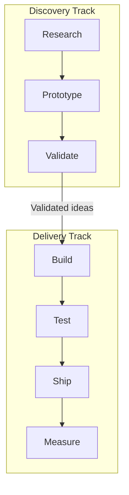

# 🤝 Product-Engineering Collaboration

  

---

## 🎯 1. Philosophy

Great products emerge from tight collaboration between product managers and engineers. Product teams are not a "requirements factory" that throws work over a wall - they are a single unit where PM, engineering, and design work together to discover, decide, and deliver.

This document defines how product management and engineering collaborate at {Company}. It exists because the default without structure is chaos: unclear priorities, last-minute scope changes, and engineers building things nobody asked for.

---

## 🤝 2. The Product-Engineering Contract

### 2.1 What Product Owns

| Responsibility | Description |
|---------------|-------------|
| **Problem definition** | Articulate the customer problem worth solving, backed by data and user research |
| **Prioritization** | Decide *what* to build next, using input from engineering on cost and feasibility |
| **Success metrics** | Define measurable outcomes (OKRs, KPIs) for every initiative |
| **Stakeholder communication** | Keep leadership, sales, and support informed of roadmap changes |
| **Go-to-market** | Coordinate launches with marketing, support, and ops |

### 2.2 What Engineering Owns

| Responsibility | Description |
|---------------|-------------|
| **Technical solution** | Decide *how* to build it - architecture, tech choices, trade-offs |
| **Feasibility and estimates** | Provide honest effort estimates with uncertainty ranges |
| **Quality** | Ensure code quality, test coverage, observability, and operational readiness |
| **Technical debt** | Identify, communicate, and advocate for paying down debt |
| **Production operation** | Own the service in production - monitoring, incidents, on-call |

### 2.3 What They Own Together

| Responsibility | Description |
|---------------|-------------|
| **Scope** | Negotiate scope to fit timelines - not the other way around |
| **Trade-offs** | Jointly decide when to cut scope, accept tech debt, or delay |
| **Discovery** | Collaborate on user research, prototyping, and validation |
| **Release strategy** | Feature flags, gradual rollout, A/B testing, rollback criteria |

---

## 🛤️ 3. Discovery Process

### 3.1 Dual-Track Development

We run discovery and delivery in parallel. Discovery is not a phase that precedes delivery - it runs continuously.

```
┌──────────────────────────────────┐
│        Discovery Track           │
│   Research → Prototype → Test    │
│   (PM + Design + Eng Lead)       │
└───────────────┬──────────────────┘
                │ Validated ideas
                ▼
┌──────────────────────────────────┐
│        Delivery Track            │
│   Build → Test → Ship → Measure  │
│   (Full engineering team)        │
└──────────────────────────────────┘
```

**Visual overview:**



### 3.2 Product Requirements Documents (PRDs)

Every significant initiative (> 1 sprint of work) must have a PRD before engineering work begins. The PRD template:

| Section | Content |
|---------|---------|
| **Problem** | What customer problem are we solving? Evidence? |
| **Hypothesis** | What do we believe the solution is? How will we validate? |
| **Success metrics** | What numbers move if this works? |
| **Scope** | What's in? What's explicitly out? |
| **Risks** | What could go wrong? Dependencies? |
| **Open questions** | What do we still need to learn? |

The PRD is not a specification - it describes the *problem* and *desired outcome*, not the technical implementation. Engineering writes the technical design in an ADR or design doc.

### 3.3 Technical Feasibility Review

Before committing to a PRD, engineering provides a **feasibility assessment**:

- **T-shirt size estimate** (S/M/L/XL) with assumptions
- **Technical risks** (new infrastructure, third-party dependencies, performance concerns)
- **Proposed approach** (high-level - not a full design doc)
- **Dependencies** on other teams or platform capabilities

---

## 🤝 4. Rituals

### 4.1 Cadence

| Ritual | Frequency | Participants | Purpose |
|--------|-----------|-------------|---------|
| **Sprint planning** | Bi-weekly | PM, Eng Lead, Design, Engineers | Agree on sprint scope and priorities |
| **Backlog refinement** | Weekly | PM, Eng Lead | Groom backlog, clarify requirements, estimate |
| **Standup** | Daily | Full team | Surface blockers, coordinate |
| **Sprint review** | Bi-weekly | Full team + stakeholders | Demo working software, gather feedback |
| **Retrospective** | Bi-weekly | Full team | Improve the process itself |
| **Product sync** | Monthly | All PMs + Engineering leadership | Cross-team alignment, dependency management |
| **Quarterly planning** | Quarterly | PM, Eng Lead, Design, Leadership | Set OKRs, allocate capacity |

### 4.2 Capacity Allocation

Engineering capacity is allocated as follows:

| Category | Target Allocation | Description |
|----------|------------------|-------------|
| **Product work** | 60-70% | New features and enhancements driven by product roadmap |
| **Tech debt / platform** | 15-20% | Refactoring, upgrades, tooling improvements |
| **Bugs / maintenance** | 10-15% | Bug fixes, operational improvements, support escalations |
| **Innovation / spikes** | 5% | Exploration, learning, prototyping |

These are guidelines, not mandates. The PM and engineering lead negotiate allocation quarterly based on the team's context.

---

## 📋 5. Prioritization Framework

### 5.1 RICE Scoring

We use **RICE** (Reach, Impact, Confidence, Effort) as a starting point for prioritization:

```
RICE Score = (Reach × Impact × Confidence) / Effort
```

| Factor | Scale | Definition |
|--------|-------|------------|
| **Reach** | Number of users/quarter | How many customers does this affect? |
| **Impact** | 0.25 / 0.5 / 1 / 2 / 3 | How much does it move the metric per user? |
| **Confidence** | 50% / 80% / 100% | How sure are we about reach and impact? |
| **Effort** | Person-sprints | How much engineering time does this take? |

### 5.2 Non-Negotiable Priorities

Regardless of RICE score, some work always takes priority:

1. **Security vulnerabilities** - P0 incidents, critical CVEs
2. **Production outages** - anything affecting customers right now
3. **Regulatory compliance** - legal deadlines, data protection requirements
4. **SLO breaches** - services falling below their error budget

---

## 📏 6. Communication Standards

### 6.1 Decision Records

All significant product decisions must be recorded:

- **Product decisions** → PRD (in the product team's shared space)
- **Technical decisions** → ADR (in the service's `docs/adr/` folder)
- **Cross-team decisions** → RFC (shared engineering space)

### 6.2 Status Communication

| Audience | Channel | Frequency |
|----------|---------|-----------|
| Team | Standup + sprint board | Daily |
| Stakeholders | Sprint review demo | Bi-weekly |
| Leadership | OKR progress update | Monthly |
| Company | Product changelog | Per release |

### 6.3 Escalation Path

When PM and engineering disagree on scope, priority, or approach:

1. **PM + Eng Lead** try to resolve directly (< 1 day)
2. **Engineering Manager + PM Manager** arbitrate (< 2 days)
3. **VP Engineering + VP Product** decide (< 1 week)

Disagreements that reach step 3 must be documented with both perspectives for organizational learning.

---

## ❌ 7. Anti-Patterns

| Anti-Pattern | Why It's Harmful | What to Do Instead |
|-------------|-----------------|-------------------|
| PM writes detailed technical specs | Undermines engineering ownership; specs are often wrong | PM defines the problem; engineering designs the solution |
| Engineering builds without a PRD | No shared understanding of what success looks like | Require a lightweight PRD for any work > 1 sprint |
| "Just add a field" mindset | Ignores schema evolution, API compatibility, downstream impact | Every change goes through normal refinement and estimation |
| Scope creep mid-sprint | Destroys team velocity and morale | New requests go to backlog; PM reprioritizes for next sprint |
| Engineering gold-plating | Over-engineering delays delivery with no user value | Define MVP scope clearly; iterate based on data |
| PM bypasses team and talks to individual engineers | Creates confusion, conflicting priorities | All work requests go through the shared backlog |

---

## 📏 8. User Story Standards

### 8.1 Format

All user stories follow the standard format:

> **As a** [persona], **I want** [action], **so that** [outcome]

The persona must be a specific, named persona from the team's user research (e.g., "customer placing a first order", "operations manager monitoring SLAs") - not a generic "user."

### 8.2 Acceptance Criteria

Acceptance criteria are written in **Given/When/Then** format:

```
Given [precondition]
When [action]
Then [expected result]
```

Example:

```
Given a customer has items in their cart
When they tap "Place order"
Then an order is created with status "requested"
And the customer sees an order confirmation screen
And an orders.order.requested event is published
```

Every user story must have at least one acceptance criterion. Stories without acceptance criteria are not accepted into sprint planning.

### 8.3 Definition of Done

A user story is **done** when all of the following are satisfied:

| Criterion | Applies To |
|-----------|-----------|
| Code reviewed and approved | All stories |
| All tests passing (unit, integration, contract) | All stories |
| Relevant documentation updated | All stories |
| Feature flag configured (if applicable) | New features behind flags |
| Monitoring confirmed (dashboards, alerts) | All stories touching production services |
| Accessibility verified | All UI changes |
| Acceptance criteria verified by PM or QA | All stories |

Stories that do not meet the Definition of Done are returned to "In Progress" and are not counted toward sprint velocity.

---
<div align="center">

⬅️ [Back to section](./README.md) · 🏠 [Back to root](../README.md)

</div>
