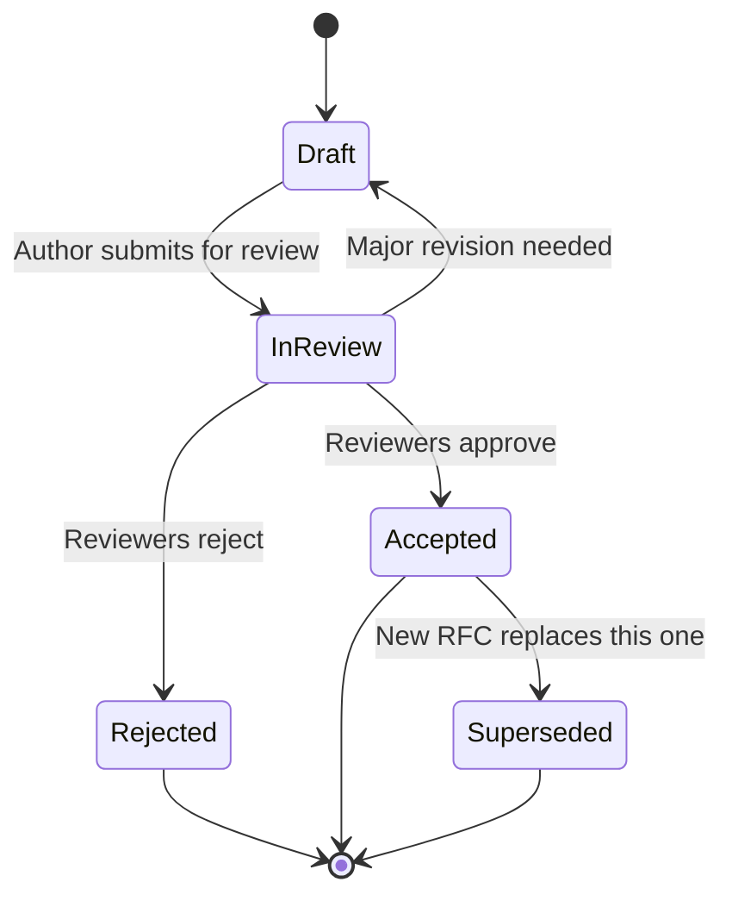

# 📋 RFC Process

  

---

## 🎯 1. Purpose

An RFC (Request for Comments) is a lightweight decision document used when a technical decision affects multiple teams or the wider organization. It provides structured context, invites feedback from stakeholders, and produces a durable record of why a decision was made.

This document defines when to write an RFC, how to structure it, who reviews it, and how decisions are finalized.

---

## 📋 2. RFC vs ADR - When to Use Which

| Dimension | ADR (Architecture Decision Record) | RFC (Request for Comments) |
|-----------|-----------------------------------|-----------------------------|
| **Scope** | Single service or team | Cross-team, cross-domain, or org-wide |
| **Audience** | Team members, future maintainers | Affected teams, Staff+, leadership |
| **Location** | Service repository (`docs/adr/`) | Shared engineering space (Backstage TechDocs) |
| **Review** | Team-level PR review | Formal review period with named reviewers |
| **Examples** | "Use Redis for session cache in checkout" | "Adopt gRPC as the default for internal service-to-service communication" |
| **Lifecycle** | Immutable once accepted; superseded by new ADR | Immutable once decided; linked to follow-up ADRs for implementation |

**Rule of thumb:** If the decision affects only your service and your team can reverse it without impacting others, write an ADR. If other teams must change their behavior or the decision sets an org-wide precedent, write an RFC.

---

## 📋 3. RFC Numbering

RFCs follow the format:

```
RFC-YYYY-NNN
```

- `YYYY` - year the RFC was created
- `NNN` - sequential number within the year, zero-padded to three digits

Examples: `RFC-2026-001`, `RFC-2026-042`.

The RFC index in Backstage auto-assigns the next available number when a draft is registered.

---

## 📋 4. RFC Template

Every RFC must include the following sections:

| Section | Content |
|---------|---------|
| **Title** | Short, descriptive name (e.g., "Adopt OpenTelemetry for all new services") |
| **RFC Number** | Assigned from the index (`RFC-YYYY-NNN`) |
| **Author(s)** | Names and teams |
| **Status** | Draft / In Review / Accepted / Rejected / Superseded |
| **Date** | Date the RFC entered the current status |
| **Context** | Background - what is the current state and why is this decision needed now? |
| **Problem** | What specific problem does this RFC address? Who is affected? |
| **Proposal** | The recommended approach, with enough detail for reviewers to evaluate trade-offs |
| **Alternatives considered** | At least two alternatives with pros/cons for each |
| **Decision** | The final decision (filled in after review closes) |
| **Consequences** | What changes as a result - new standards, migration work, deprecated patterns |

### 4.1 Template (Markdown)

```markdown
# RFC-YYYY-NNN: <Title>

| Field      | Value                  |
|------------|------------------------|
| Author(s)  | <name, team>           |
| Status     | Draft                  |
| Created    | YYYY-MM-DD             |
| Reviewers  | <assigned reviewers>   |
| Decision   | <pending>              |

## Context
<!-- Current state and why this decision is needed now -->

## Problem
<!-- Specific problem, who is affected, what happens if we do nothing -->

## Proposal
<!-- Recommended approach with trade-off analysis -->

## Alternatives Considered

### Alternative A: <Name>
- **Pros:** ...
- **Cons:** ...

### Alternative B: <Name>
- **Pros:** ...
- **Cons:** ...

## Decision
<!-- Filled in after review closes -->

## Consequences
<!-- What changes: new standards, migrations, deprecated patterns -->
```

---

## 📋 5. RFC Stages



| Stage | Duration | What Happens |
|-------|----------|-------------|
| **Draft** | No limit | Author writes the RFC, gathers informal feedback, iterates |
| **In Review** | 7 business days | Formal review period begins; reviewers must provide written feedback |
| **Decision** | End of review period | Required reviewers meet (sync or async) to accept or reject |
| **Accepted** | Permanent | Decision is recorded; implementation begins |
| **Rejected** | Permanent | Decision is recorded with rationale; author may submit a revised RFC |

---

## 📋 6. Required Reviewers by Scope

| Scope | Required Reviewers | Quorum |
|-------|--------------------|--------|
| **Single-team** (affects one team's public API or contract) | Team's Tech Lead | Tech Lead approval |
| **Cross-team** (affects 2+ teams) | Affected teams' Tech Leads + one Staff Engineer | All Tech Leads + Staff approval |
| **Org-wide** (sets a platform-wide standard or policy) | Principal Engineer + VP Engineering | Principal + VP approval |

Authors may add additional reviewers at their discretion. Reviewers who are added are expected to respond within the review window.

---

## 📋 7. Timeout and Escalation Rules

| Condition | Action |
|-----------|--------|
| **No reviewer feedback after 7 business days** | Author pings reviewers directly; review window extends by 3 business days |
| **No decision after 14 business days** | RFC auto-escalates to the next level in the reviewer chain |
| **Escalated RFC not decided within 7 business days** | VP Engineering makes the final call |

Timeouts exist to prevent decision paralysis. Silence is not consent - if reviewers do not respond, the escalation path ensures a decision is made.

---

## 📋 8. Decision Outcomes

| Outcome | What It Means |
|---------|---------------|
| **Accepted** | The proposal becomes the agreed approach. Teams are expected to follow it. Implementation ADRs reference the RFC. |
| **Accepted with conditions** | Approved, but with specific constraints or a required follow-up (e.g., "Accepted, but revisit after 6 months of production data"). |
| **Rejected** | The proposal is not adopted. The rejection rationale is documented. The author may submit a new RFC with a different approach. |
| **Deferred** | The decision is postponed. The RFC returns to Draft with a re-review date. |

---

## 📋 9. RFC Index and Registry

All RFCs are indexed in **Backstage TechDocs** under the `Engineering RFCs` namespace.

| Field | Description |
|-------|-------------|
| **RFC Number** | `RFC-YYYY-NNN` |
| **Title** | Short description |
| **Status** | Draft / In Review / Accepted / Rejected / Superseded |
| **Author** | Name and team |
| **Created** | Date |
| **Decision Date** | Date the decision was finalized (blank if pending) |
| **Link** | URL to the full RFC document |

The index is the single source of truth for all RFC statuses. Teams should check the index before starting work that might overlap with an in-progress RFC.

---

## 📏 10. Best Practices

| Practice | Why |
|----------|-----|
| **Keep RFCs focused** | One decision per RFC; don't bundle unrelated proposals |
| **Write for the skeptic** | Assume the reader disagrees; address objections in the proposal |
| **Include concrete examples** | Code snippets, API shapes, or architecture diagrams make proposals tangible |
| **Link to data** | Benchmarks, incident reports, or usage metrics strengthen the case |
| **Timebox drafting** | If an RFC takes more than 2 weeks to draft, the scope may be too broad |
| **Reference prior art** | Link to ADRs, other RFCs, or external resources that inform the proposal |

---

## 📋 11. Scope Beyond Technical Decisions

RFCs are not limited to technical decisions. Process changes, organizational restructuring, and cross-team workflow proposals should also use the RFC process when they affect more than one team. Examples include changes to the on-call rotation model, sprint cadence adjustments across teams, or new cross-team review processes. The same template, review process, and decision framework apply.

---

## 📐 12. Technical Design Documents

### 12.1 When to Write a TDD

A Technical Design Document (TDD) is required for any feature or change estimated at **>1 week of engineering effort**. If the work is smaller than a week, a well-written Jira ticket description or a brief ADR is sufficient.

### 12.2 TDD vs RFC

| Dimension | Technical Design Document (TDD) | RFC |
|-----------|--------------------------------|-----|
| **Scope** | Team-scoped - within one service or domain | Cross-team or org-wide |
| **Audience** | Team members, tech lead | Affected teams, Staff+, leadership |
| **Approval** | Tech lead reviews and approves | Formal review period with named reviewers (see RFC process above) |
| **Location** | `docs/design/` in the service repository | Backstage TechDocs |
| **Examples** | "Add retry logic to payment capture flow" | "Adopt gRPC as default for internal communication" |

### 12.3 Template

Every TDD must include the following sections:

| Section | Content |
|---------|---------|
| **Problem statement** | What problem are we solving? Why now? |
| **Proposed solution** | Detailed approach with architecture diagrams where applicable |
| **Alternatives considered** | At least two alternatives with trade-off analysis |
| **Data model changes** | New tables, columns, indexes, or schema migrations |
| **API changes** | New or modified endpoints, request/response shapes, breaking changes |
| **Migration plan** | How to move from current state to proposed state without downtime |
| **Rollback plan** | How to revert if the change causes issues in production |
| **Open questions** | Unresolved decisions that need input during review |

### 12.4 Where It Lives

TDDs live in `docs/design/` in the service repository, named with the Jira ticket number:

```
docs/design/PROJ-1234-payment-retry-logic.md
```

The Jira ticket links to the TDD. The TDD links back to the Jira ticket.

### 12.5 Review and Approval

- The team's **tech lead reviews and approves** the TDD before implementation begins
- For TDDs that touch shared infrastructure or cross-domain contracts, the tech lead may escalate to Staff Engineering review
- Review happens via a PR against the service repository - the same code review tooling and process applies

### 12.6 Lifecycle

| Phase | TDD State |
|-------|-----------|
| **Before implementation** | Draft → reviewed → approved |
| **During implementation** | Living document - updated as decisions evolve or scope changes |
| **After completion** | Archived (not deleted) - remains in `docs/design/` as historical context |

### 12.7 Relationship to ADR

If the TDD results in a significant architectural decision (e.g., choosing a particular data store, adopting a new pattern, or making a trade-off that future engineers will question), **extract an ADR** from it. The ADR captures the decision and rationale in the standard `docs/adr/` format; the TDD retains the full design context.

---
<div align="center">

⬅️ [Back to section](./README.md) · 🏠 [Back to root](../README.md)

</div>
