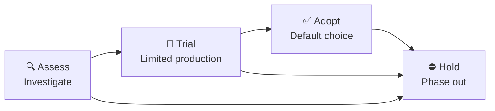
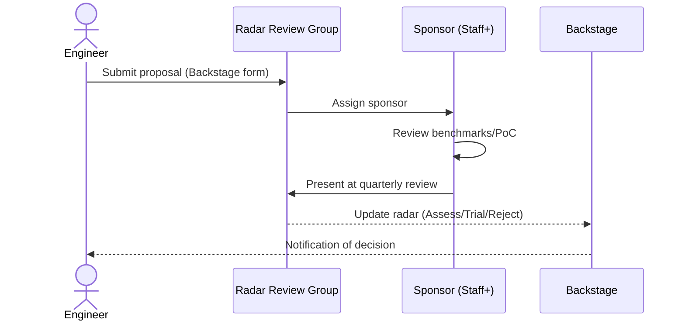

# 🔭 Technology Radar

  

---

## 🎯 1. Purpose

The {Company} Technology Radar is a curated, opinionated guide to the technologies, tools, frameworks, and techniques we use - or deliberately avoid. It helps teams make consistent technology choices without requiring a heavyweight approval process for every decision.

The radar answers two questions:
1. **"Can I use X?"** - check the quadrant.
2. **"Should I consider Y?"** - see what's in Trial or Assess.

---

## 🔭 2. Quadrant Definitions

| Quadrant | Definition | What It Means for Teams |
|----------|-----------|------------------------|
| **Adopt** | Proven at {Company}. Default choice for new projects. | Use freely. No justification needed. Aligns with approved tech stack in [01-tech-stack.md](../01-platform-standards/01-tech-stack.md). |
| **Trial** | Promising. Being evaluated in production by 1–2 teams. | Use with Tech Lead approval. Share results with the radar review group. |
| **Assess** | Interesting. Worth investigating but not yet trialed. | Explore in spikes or PoCs. Do not use in production without a Trial promotion. |
| **Hold** | Not recommended for new work. Existing usage may continue. | Do not start new projects with Hold technologies. Plan migration for critical paths. |

---

## 🔭 3. Relationship to Approved Tech Stack

The radar and the [approved tech stack](../01-platform-standards/01-tech-stack.md) are complementary:

| Tech Stack Document | Technology Radar |
|---------------------|-----------------|
| Lists the **current approved defaults** | Shows the **full landscape** including emerging and deprecated options |
| Binary: approved or not | Graduated: Adopt / Trial / Assess / Hold |
| Updated when standards change | Updated quarterly |

**Mapping:** Technologies in the **Adopt** quadrant correspond to the approved tech stack. Technologies in **Hold** are explicitly not approved for new work.

---

## 📋 4. Quarterly Review Cadence

The radar is reviewed and updated every quarter.

| Activity | Timing | Participants |
|----------|--------|-------------|
| **Nomination window** | Weeks 1–2 of the quarter | Any engineer can nominate a technology |
| **Review meeting** | Week 3 | Staff Engineers, Principal Engineers, VP Engineering |
| **Publication** | Week 4 | Updated radar published to Backstage |
| **Announcement** | Week 4 | Summary of changes shared in `#engineering` Slack channel |

### 4.1 Review Meeting Agenda

1. Review new nominations (10 min per nomination)
2. Re-evaluate existing Trial items - promote to Adopt or move to Hold (5 min each)
3. Re-evaluate Hold items - any that should be removed from radar entirely (5 min)
4. Update the published radar and notify teams

---

## 🔭 5. Proposing New Technology

Any engineer can propose adding a technology to the radar. Proposals follow a lightweight RFC format.

### 5.1 Proposal Template

| Section | Content |
|---------|---------|
| **Technology** | Name, category (language, framework, infrastructure, tool, technique) |
| **Proposed quadrant** | Assess or Trial |
| **Problem it solves** | What gap does this fill? What are we using today? |
| **Benchmarks / PoC** | Performance data, developer experience feedback, or prototype results |
| **Comparison** | How does it compare to the current Adopt-level option? |
| **Risks** | Maturity, community size, licensing, vendor lock-in |
| **Sponsor** | Staff+ engineer willing to shepherd evaluation |

### 5.2 Proposal Workflow

### 5.3 Promotion Criteria

| Transition | Criteria |
|------------|----------|
| **Assess → Trial** | Sponsor identified, PoC demonstrates value, no blocking risks, review group approval |
| **Trial → Adopt** | Minimum 1 quarter in production, positive results from trialing teams, no unresolved operational issues, documentation exists |
| **Any → Hold** | Better alternative adopted, security/licensing concern, community decline, or persistent operational issues |

---

## 🔭 6. Current Radar Snapshot

> *This is a living document. The canonical version is published in Backstage.*  
> *Last updated: Q1 2026*

> This snapshot reflects the reference implementation. Organizations adopting this manifesto should populate their own radar based on their technology landscape.

### 6.1 Languages & Runtimes

| Technology | Ring | Moved | Notes |
|------------|------|-------|-------|
| Kotlin (JVM) | Adopt | - | Primary backend language |
| TypeScript | Adopt | - | Frontend and BFF |
| Python | Trial | - | ML pipelines and data |
| Go | Assess | - | CLI tooling exploration |

### 6.2 Frameworks & Libraries

| Technology | Ring | Moved | Notes |
|------------|------|-------|-------|
| Spring Boot 3.x | Adopt | - | Backend services |
| React / Next.js | Adopt | - | Web frontend |
| React Native | Adopt | - | Mobile |
| Resilience4j | Adopt | - | Circuit breaker / retry |

### 6.3 Infrastructure & Platforms

| Technology | Ring | Moved | Notes |
|------------|------|-------|-------|
| Amazon EKS | Adopt | - | Container orchestration |
| Amazon Aurora PostgreSQL | Adopt | - | Primary relational store |
| Amazon MSK (Kafka) | Adopt | - | Event streaming |
| ArgoCD | Adopt | - | GitOps deployment |

### 6.4 Tools

| Technology | Ring | Moved | Notes |
|------------|------|-------|-------|
| GitHub Actions | Adopt | - | CI/CD |
| Backstage | Adopt | - | Developer portal |
| OpenTelemetry | Adopt | - | Observability |
| Terraform | Adopt | - | IaC |

### 6.5 Techniques

| Technology | Ring | Moved | Notes |
|------------|------|-------|-------|
| Trunk-based development | Adopt | - | Git workflow |
| Feature flags | Adopt | - | Progressive rollout |
| Chaos engineering | Trial | - | Resilience validation |
| AI-assisted development | Trial | - | SDLC acceleration |

---

## 📋 7. Versioning and History

Each quarterly update is versioned as `YYYY-QN` (e.g., `2026-Q1`). Previous versions are retained in Backstage for historical reference.

| Version | Date | Key Changes |
|---------|------|------------|
| 2026-Q1 | Q1 2026 | Initial snapshot aligned with tech stack |

The full change history is available in the Backstage TechDocs version archive.

---

## ❌ 8. Anti-Patterns

| Anti-Pattern | Why It's Harmful | What to Do Instead |
|-------------|-----------------|-------------------|
| Adopting technology without checking the radar | Fragmented tech stack, duplicated effort, inconsistent operations | Check the radar first; propose via the standard process if missing |
| Using Hold technology for new projects | Increases migration burden and tech debt | Choose an Adopt-level alternative or submit a proposal to re-evaluate |
| Skipping the Trial phase | Insufficient production evidence; risk of org-wide adoption of a poor fit | Run a time-boxed trial with clear success criteria |
| Keeping Trial items indefinitely | Signals indecision; teams don't know if they can rely on it | Promote to Adopt or move to Hold within 2 quarters |

---

⬅️ [Back to section](./README.md) · 🏠 [Back to root](../README.md)

