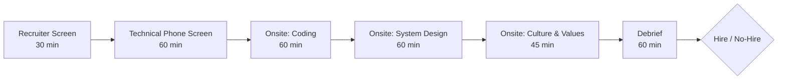
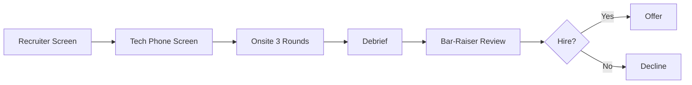

# 🎯 Hiring & Interview Standards

  

---

## 🎯 1. Philosophy

Hiring is the highest-leverage activity in engineering. A great hire compounds for years; a bad hire drains the team. {Company} optimizes for **signal over speed** - we invest in structured, evidence-based interviews that predict on-the-job success and minimize bias.

Every candidate, regardless of outcome, should leave the process thinking: "That was fair, well-organized, and respectful of my time."

---

## 🎯 2. Interview Loop Structure

**Visual overview:**

| Stage | Duration | Interviewer | Focus |
|-------|----------|-------------|-------|
| **Recruiter screen** | 30 min | Recruiter | Role fit, expectations, logistics, compensation range |
| **Technical phone screen** | 60 min | Engineer (IC3+) | Core technical competency, communication, problem-solving approach |
| **Onsite - Coding** | 60 min | 2 Engineers | Code quality, testing instincts, pragmatism, collaboration |
| **Onsite - System Design** | 60 min | Staff+ Engineer | Architecture thinking, trade-off analysis, scaled to candidate level |
| **Onsite - Culture & Values** | 45 min | Engineering Manager + cross-functional partner | Collaboration, ownership, growth mindset, culture add |
| **Debrief** | 60 min | All interviewers + hiring manager | Structured scoring review, level calibration, hire/no-hire decision |

---

## 📏 3. Technical Rubrics by Level

Rubrics are aligned to the [engineering ladder](./02-engineering-ladder.md). Each round uses the same scoring dimensions, with expectations scaled to the target level.

### 3.1 Coding Round

| Dimension | Engineer I (IC1) | Engineer II (IC2) | Senior (IC3) | Staff (IC4) | Principal (IC5+) |
|-----------|-----------------|-------------------|--------------|-------------|------------------|
| **Problem decomposition** | Breaks problem into steps with guidance | Independently decomposes; identifies edge cases | Recognizes patterns; selects optimal approach | Reframes problem for clarity; challenges constraints | Identifies the real problem behind the stated one |
| **Code quality** | Readable, compiles, basic correctness | Clean structure, meaningful names, handles errors | Production-quality, testable, idiomatic | Designs for extensibility, considers operational concerns | Writes code others learn from; exemplary craft |
| **Testing** | Writes basic tests when prompted | Tests happy path and key edge cases | Tests drive design (TDD comfort); considers failure modes | Designs testing strategy; knows when not to test | Sets testing culture; defines testing philosophy |
| **Communication** | Explains approach when asked | Thinks aloud; explains trade-offs | Drives the conversation; seeks feedback | Teaches while solving; makes interviewer smarter | |

### 3.2 System Design Round

Design scope scales to the candidate level:

| Level | Design Scope | Example Prompt |
|-------|-------------|----------------|
| **IC2** | Component or module design | "Design a rate limiter for an API endpoint" |
| **IC3** | Single service or bounded context | "Design a notification service handling email, SMS, and push" |
| **IC4** | Multi-service system with cross-cutting concerns | "Design an order fulfillment system with real-time tracking" |
| **IC5+** | Platform or org-wide architecture | "Design {Company}'s event-driven architecture for 50 services" |

| Dimension | What We Evaluate |
|-----------|-----------------|
| **Requirements gathering** | Asks clarifying questions; identifies functional and non-functional requirements |
| **High-level design** | Identifies components, data flow, and integration points |
| **Trade-off analysis** | Articulates pros/cons of alternatives; makes reasoned choices |
| **Depth** | Dives into one or two areas with technical rigor (storage, caching, consistency) |
| **Operational awareness** | Considers observability, failure modes, scalability, deployment |

---

## 🎯 4. Coding Round Format

### 4.1 Live Coding (Default)

Live coding is the default format. Candidates use their own IDE or a shared online editor.

| Guideline | Detail |
|-----------|--------|
| **Language** | Candidate's choice from our supported languages |
| **Problem type** | Real-world problems (API design, data transformation, concurrency) - not puzzle/trick questions |
| **Internet access** | Allowed - we hire engineers who know how to use documentation |
| **AI tooling** | Not permitted during the interview |
| **Evaluation** | Process over perfection - how candidates think, communicate, and iterate matters more than a complete solution |

### 4.2 Take-Home (By Request Only)

Take-home assignments are offered only if the candidate requests an alternative to live coding.

| Guideline | Detail |
|-----------|--------|
| **Time limit** | Maximum 2 hours |
| **Compensation** | Paid at a flat rate |
| **Scope** | Well-defined problem with clear acceptance criteria |
| **Submission** | Code + brief README explaining decisions |
| **Follow-up** | 30-minute review session to discuss the submission |
| **Evaluation** | Same rubric as live coding, applied to the submitted work |

---

## 🎯 5. Bar-Raiser

Every onsite loop includes one **bar-raiser** - an interviewer from outside the hiring team.

| Aspect | Detail |
|--------|--------|
| **Purpose** | Prevent localized hiring bias; maintain company-wide quality bar |
| **Selection** | Trained senior engineer (IC3+) from a different team |
| **Authority** | Has veto power - a bar-raiser "no-hire" requires hiring manager + VP to override |
| **Focus** | Evaluates against the {Company}-wide rubric, not team-specific needs |
| **Training** | Bar-raisers complete a 4-hour calibration workshop before joining the rotation |

**Visual overview:**

---

## 🎯 6. Bias Mitigation

| Practice | How We Implement It |
|----------|-------------------|
| **Structured scoring** | Every dimension scored 1-4 independently before debrief discussion |
| **Diverse panels** | Minimum 2 different backgrounds across the interview panel (gender, ethnicity, tenure, team) |
| **No "culture fit"** | Replaced with **"culture add"** - what unique perspective does this candidate bring? |
| **Blind resume screen** | Recruiter removes name, photo, school name before presenting to hiring manager |
| **Standardized questions** | All candidates for the same role/level receive equivalent questions (not identical, but calibrated) |
| **Written feedback first** | Each interviewer submits written scores before the debrief begins - no anchoring |
| **Debrief protocol** | Discuss scores dimension by dimension, not interviewer by interviewer |

### 6.1 Scoring Scale

| Score | Label | Definition |
|-------|-------|-----------|
| **1** | Does not meet expectations | Significant gaps relative to the target level |
| **2** | Partially meets expectations | Some signals present, but concerns in key areas |
| **3** | Meets expectations | Solid performance at the target level |
| **4** | Exceeds expectations | Performance above the target level |

A candidate needs an average score of **≥ 2.5** across all dimensions with **no dimension below 2** to receive a hire recommendation.

---

## 📏 7. Calibration Sessions

| Aspect | Detail |
|--------|--------|
| **Cadence** | Weekly hiring committee meeting |
| **Attendees** | Hiring managers with active roles, VP Engineering (or delegate), People partner |
| **Purpose** | Ensure leveling consistency across teams; review borderline decisions |
| **Input** | Debrief scorecards, interviewer comments, bar-raiser assessment |
| **Output** | Confirmed level, approved offer, or decision to pass |

### 7.1 Leveling Calibration

The committee compares candidates against:
- The [engineering ladder](./02-engineering-ladder.md) expectations for the proposed level
- Recent hires at the same level (anonymized)
- The team's current composition and needs

---

## 📋 8. Offer Approval Chain

| Candidate Level | Approvers |
|----------------|-----------|
| **Engineer I - II** | Hiring Manager + Recruiter |
| **Senior Engineer (IC3)** | Hiring Manager + Engineering Director |
| **Staff Engineer (IC4)** | Engineering Director + VP Engineering |
| **Principal Engineer (IC5+)** | VP Engineering + CTO |

Offers above band or with non-standard terms (sign-on bonus, accelerated vesting) require one additional approval level.

---

## 📏 9. Candidate Experience Standards

| Standard | Target |
|----------|--------|
| **Time from application to recruiter screen** | ≤ 5 business days |
| **Time from phone screen to onsite** | ≤ 10 business days |
| **Time from onsite to decision** | ≤ 3 business days |
| **Time from decision to offer** | ≤ 2 business days |
| **Rejection communication** | Personalized email within 2 business days of decision |
| **Candidate NPS** | Tracked quarterly; target ≥ 60 |

---

## ❌ 10. Anti-Patterns

| Anti-Pattern | Why It's Harmful | What to Do Instead |
|-------------|-----------------|-------------------|
| Whiteboard algorithm puzzles | Tests memorization, not engineering ability | Use real-world problems relevant to the role |
| "I'll know it when I see it" | Unstructured assessment leads to bias | Use the rubric; score every dimension |
| Unprepared interviewers | Wastes candidate time; signals disorganization | Interviewers review candidate profile and prepare questions 24 hours before |
| Ghost candidates | Destroys employer brand | Every candidate gets a decision, communicated respectfully |
| Hiring for "brilliance" over collaboration | Toxic contributors destroy teams | Culture & values round explicitly evaluates collaboration and empathy |

---

⬅️ [Back to section](./README.md) · 🏠 [Back to root](../README.md)

