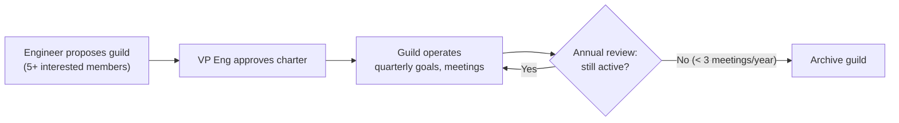
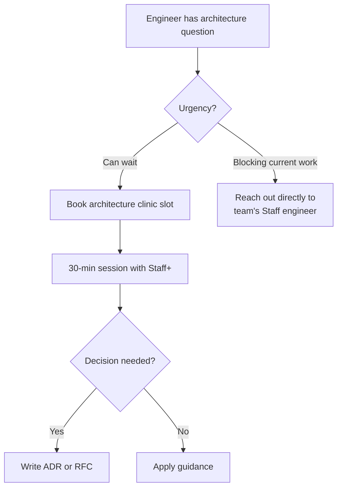

# 🧠 Knowledge Sharing

  

---

## 🎯 1. Philosophy

Code is written once and read many times. Decisions are made once and questioned forever - unless the context is captured. Knowledge sharing is not a nice-to-have side activity; it is core infrastructure for an engineering organization that scales.

{Company} invests in multiple knowledge-sharing channels because people learn differently: some prefer reading, some prefer watching, some prefer conversation. We meet engineers where they are.

---

## 🧠 2. Guilds / Communities of Practice

Guilds are cross-team groups organized around a technical discipline. They provide a space for engineers working on similar problems across different product teams to align, share patterns, and raise standards together.

### 2.1 Active Guilds

| Guild | Scope | Slack Channel | Meeting Cadence |
|-------|-------|--------------|-----------------|
| **Backend** | Service design, APIs, data access patterns | `#guild-backend` | Monthly |
| **Frontend** | Web and mobile UI, design systems, performance | `#guild-frontend` | Monthly |
| **Data** | Data pipelines, analytics, data quality | `#guild-data` | Monthly |
| **SRE** | Reliability, observability, incident response | `#guild-sre` | Monthly |
| **Security** | Application security, threat modeling, compliance | `#guild-security` | Monthly |
| **AI Champions** | Context engineering, AI-assisted workflows, prompt patterns | `#guild-ai` | Monthly |

### 2.2 Guild Charter Template

Every guild maintains a charter document in Backstage:

| Section | Content |
|---------|---------|
| **Mission** | One-sentence purpose of the guild |
| **Scope** | What topics the guild covers (and explicitly does not) |
| **Lead** | Rotating lead (Staff+ engineer), 6-month term |
| **Members** | Open to all engineers; no approval required to join |
| **Quarterly goals** | 2–3 concrete goals per quarter (e.g., "Publish caching best practices guide") |
| **Meeting cadence** | Monthly, 60 min, recorded |
| **Slack channel** | Primary async communication channel |
| **Decision authority** | Guilds advise; they do not mandate. Mandates come through RFCs. |

### 2.3 Guild Lifecycle

---

## 🧠 3. Tech Talks

Bi-weekly, 30-minute presentations open to all of engineering. Any engineer can present - there is no seniority requirement.

### 3.1 Format

| Aspect | Detail |
|--------|--------|
| **Cadence** | Bi-weekly (alternating weeks with sprint reviews) |
| **Duration** | 30 min (20 min presentation + 10 min Q&A) |
| **Audience** | All of engineering (optional attendance, strongly encouraged) |
| **Recording** | All talks recorded and published to the internal video library |
| **Slides / materials** | Uploaded to Backstage TechDocs under `Tech Talks` |
| **Scheduling** | Managed via a shared signup sheet; first-come, first-served |

### 3.2 Topic Guidelines

| Good Topics | Less Useful Topics |
|------------|-------------------|
| Post-incident deep dive and lessons learned | Product demos (use sprint reviews) |
| How we solved a hard technical problem | Vendor sales pitches |
| Introduction to a technology we're trialing | Status updates |
| Cross-team architecture walkthrough | Topics covered in onboarding |
| Techniques that improved developer experience | |

### 3.3 Topic Index

All past and upcoming talks are indexed in Backstage with:
- Title, speaker, date
- Recording link
- Slide deck / materials link
- Tags (e.g., `backend`, `observability`, `incident`, `architecture`)

---

## 🧠 4. Architecture Clinics

Monthly, drop-in sessions where Staff+ engineers make themselves available for 1:1 architecture review conversations.

| Aspect | Detail |
|--------|--------|
| **Cadence** | Monthly, 2-hour window |
| **Format** | 30-minute slots, bookable in advance or walk-in |
| **Facilitators** | Staff Engineers, Principal Engineers |
| **Scope** | Any architecture question: service design, data modeling, API contracts, scalability concerns, ADR reviews |
| **Output** | No formal output required; the engineer takes away guidance. If a decision emerges, it should be captured as an ADR. |
| **Scheduling** | Calendar invite with booking link shared in `#engineering` |

---

## 🧠 5. Written Knowledge Artifacts

Written documentation is the most scalable form of knowledge sharing. {Company} maintains several types of written artifacts:

| Artifact | Location | Purpose | Author |
|----------|----------|---------|--------|
| **ADRs** | Service repo (`docs/adr/`) | Record single-service technical decisions | Team engineers |
| **RFCs** | Backstage TechDocs | Record cross-team or org-wide decisions | Any engineer (see [RFC Process](./05-rfc-process.md)) |
| **TechDocs** | Backstage | Service documentation, runbooks, API guides | Service-owning team |
| **Post-incident reviews (PIRs)** | Backstage + incident tracker | Blameless analysis of production incidents | Incident commander + responders |
| **Platform Manifesto** | This repository | Org-wide engineering standards and practices | Engineering Leadership |

### 5.1 Documentation Standards

| Standard | Expectation |
|----------|-------------|
| **Every service** has a TechDocs page in Backstage | Enforced via Backstage scorecard |
| **Every significant decision** has an ADR or RFC | Reviewed in quarterly architecture reviews |
| **Every P1/P2 incident** has a PIR | Published within 5 business days of resolution |
| **Documentation is code-reviewed** | Docs live alongside code and are reviewed in PRs |

---

## 🧠 6. Onboarding Reading List

New engineers receive a curated "start here" reading list that goes beyond the manifesto. The list is maintained by Engineering Leadership and reviewed quarterly.

### 6.1 Core Reading List

| Category | Items | Purpose |
|----------|-------|---------|
| **Manifesto essentials** | This manifesto (sections 01–07) | Understand {Company}'s engineering standards |
| **Top 10 ADRs** | Curated list of the most impactful architecture decisions | Understand why the system is shaped the way it is |
| **Key RFCs** | 5 most recent accepted RFCs | Understand current direction and decision-making style |
| **Recent PIRs** | 3 most recent post-incident reviews | Understand failure modes and how the team responds |
| **Team-specific docs** | Service TechDocs for the new engineer's team | Understand the specific services they'll work on |

### 6.2 30-60-90 Day Expectations

| Timeframe | Knowledge Expectations |
|-----------|----------------------|
| **Week 1** | Read manifesto essentials, complete environment setup, ship a small PR |
| **Day 30** | Understand team's services and their architecture; read all team ADRs |
| **Day 60** | Participate in on-call rotation; present at a team standup or retro |
| **Day 90** | Contribute to a guild meeting or give a tech talk; independently own a feature |

---

## 🧠 7. Brown Bags

Informal, team-initiated lunch sessions. No formal approval or scheduling process.

| Aspect | Detail |
|--------|--------|
| **Format** | Casual, conversational, 30–45 min over lunch |
| **Initiation** | Any team can organize; post in `#engineering` or team channel |
| **Topics** | Anything the team finds interesting - new tool, conference takeaway, side project, book review |
| **Recording** | Optional; most are not recorded to encourage open discussion |
| **Approval** | None required |

---

## 📋 8. Knowledge Sharing Calendar

| Activity | Frequency | Owner | Channel |
|----------|-----------|-------|---------|
| **Tech talks** | Bi-weekly | Rotating presenter | All-engineering meeting |
| **Guild meetings** | Monthly | Guild lead | Guild Slack + calendar |
| **Architecture clinics** | Monthly | Staff+ engineers | Bookable slots |
| **Brown bags** | Ad hoc | Any team | Team-initiated |
| **Onboarding reading list review** | Quarterly | Engineering Leadership | Backstage |
| **PIR review sessions** | After every P1/P2 | Incident commander | All-engineering (optional) |

---

## 📊 9. Measuring Effectiveness

| Metric | How We Measure | Target |
|--------|---------------|--------|
| **Tech talk attendance** | Average attendees per session | > 30% of engineering |
| **Guild participation** | Active members per guild (attended ≥ 1 meeting/quarter) | > 10 per guild |
| **Documentation coverage** | % of services with up-to-date TechDocs | 100% |
| **Onboarding time-to-productivity** | Days until first meaningful PR | ≤ 14 days |
| **PIR publication rate** | % of P1/P2 incidents with PIR published within 5 days | 100% |

---

## 📚 10. Recommended External Resources

A curated list of foundational reading for engineers at {Company}. These resources shaped the principles, patterns, and practices codified in this manifesto.

| Resource | Topic | Why It Matters |
|----------|-------|----------------|
| **The Twelve-Factor App** ([12factor.net](https://12factor.net)) | Service design | Foundation for cloud-native service architecture - config, dependencies, statelessness, and disposability |
| **Designing Data-Intensive Applications** (Kleppmann) | Data & distributed systems | Required reading for anyone building event-driven systems, working with replication, or designing for consistency |
| **Building Microservices** (Newman) | Service decomposition | Aligns with our architecture philosophy - bounded contexts, independent deployability, and evolutionary design |
| **Site Reliability Engineering** (Google) | Operations | Foundation for our SRE and observability practices - SLOs, error budgets, toil reduction, and incident response |
| **Accelerate** (Forsgren, Humble, Kim) | Engineering metrics | The research behind our DORA metrics adoption - deployment frequency, lead time, MTTR, and change failure rate |
| **Release It!** (Nygard) | Resilience | Patterns behind our circuit breaker and stability patterns - bulkheads, timeouts, and designing for production |
| **Team Topologies** (Skelton, Pais) | Organization | The model behind our team structure - stream-aligned teams, platform teams, and interaction modes |
| **Clean Architecture** (Martin) | Hexagonal architecture | Principles behind our ports & adapters approach - dependency inversion, separation of concerns, and testability |

> This is not a mandatory reading list. Start with what's relevant to your current work. Ask in `#book-club` for recommendations.

---

⬅️ [Back to section](./README.md) · 🏠 [Back to root](../README.md)

