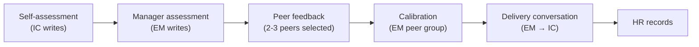
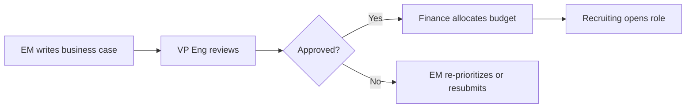
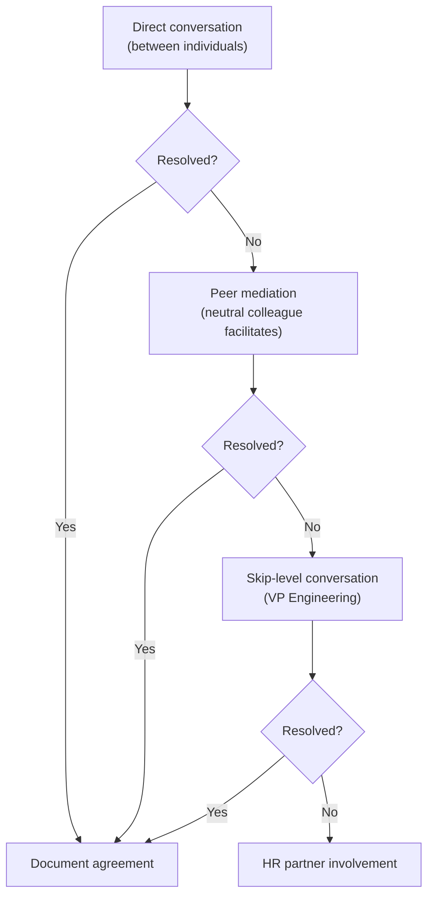

# Engineering Management Guide

> **Status:** Guidance  
> **Owner:** VP Engineering  
> **Last Updated:** 2026

---

## Table of Contents

1. [Performance Reviews](#1-performance-reviews)
2. [One-on-Ones](#2-one-on-ones)
3. [Team Health](#3-team-health)
4. [Headcount Planning](#4-headcount-planning)
5. [Delivery Tracking](#5-delivery-tracking)
6. [Conflict Resolution](#6-conflict-resolution)
7. [Remote & Hybrid Work](#7-remote--hybrid-work)
8. [Career Development](#8-career-development)
9. [Recognition](#9-recognition)
10. [New EM Onboarding](#10-new-em-onboarding)
11. [Budget & Tooling](#11-budget--tooling)
12. [Attrition Management](#12-attrition-management)
13. [Cross-Functional RACI](#13-cross-functional-raci)
14. [Team Composition](#14-team-composition)
15. [Decision RACI Matrix](#15-decision-raci-matrix)

---

## 1. Performance Reviews

### 1.1 Cadence

{Company} runs a bi-annual performance review cycle:

| Review | Timing | Purpose |
|--------|--------|---------|
| **Mid-year check-in** | July | Calibrate progress, adjust goals, identify development areas |
| **Year-end review** | January | Full performance assessment, compensation decisions |

### 1.2 Process



### 1.3 Calibration

Calibration sessions ensure consistency across teams:

- EMs within the same VP org calibrate together.
- Each EM presents their ratings with supporting evidence.
- The VP facilitates and resolves disagreements.
- Outcomes: ratings are adjusted to reflect consistent standards across teams.

### 1.4 Ladder as Input, Not the Review

The [Engineering Ladder](./02-engineering-ladder.md) describes level expectations. It is an input to the review conversation — not a checklist. Managers assess impact, growth trajectory, and behaviors holistically, referencing the ladder for calibration.

---

## 2. One-on-Ones

### 2.1 Standards

| Aspect | Requirement |
|--------|------------|
| **Frequency** | Weekly, minimum 30 minutes |
| **Ownership** | The report owns the agenda; the manager ensures it happens |
| **Shared doc** | Google Doc or Notion page, shared between EM and report |
| **Action items** | Tracked in the shared doc with due dates |

### 2.2 Suggested Agenda Template

```markdown
## 1:1 — [Name] & [Manager] — [Date]

### How are you doing? (5 min)
- Energy level / blockers / personal check-in

### Progress & Priorities (10 min)
- What went well this week?
- What's blocked?
- Top priorities for next week

### Growth & Development (10 min)
- Career conversation follow-up
- Skill-building opportunities
- Feedback (both directions)

### Action Items
- [ ] [Owner] — [Action] — [Due date]
```

### 2.3 Anti-Patterns

| Anti-Pattern | Why It's Harmful | Fix |
|-------------|-----------------|-----|
| Cancelling 1:1s regularly | Signals the report is not a priority | Reschedule, never skip |
| Using 1:1s only for status updates | Misses coaching and growth opportunity | Status goes in standups; 1:1 is for the person |
| Manager dominates the conversation | Report disengages | Manager speaks < 30% of the time |
| No follow-through on action items | Erodes trust | Review action items at the start of each 1:1 |

---

## 3. Team Health

### 3.1 Quarterly Health Check

{Company} uses a modified Spotify Health Check model. Each team rates themselves on key dimensions:

| Dimension | Green | Yellow | Red |
|-----------|-------|--------|-----|
| **Delivering value** | Shipping features users love | Shipping, but unclear impact | Stuck, not delivering |
| **Speed** | Fast feedback loops, short cycle times | Some bottlenecks | Slow, long lead times |
| **Code quality** | Proud of our code, low tech debt | Some tech debt accumulating | Afraid to change the code |
| **Learning** | Actively learning and sharing | Learning individually, not sharing | No time to learn |
| **Fun** | Enjoy coming to work | It's fine | Dreading it |
| **Teamwork** | Strong collaboration, trust | Some silos | Conflict, low trust |
| **Support** | Great tools, processes support us | Some friction | Tools and processes hinder us |
| **Mission** | Clear purpose, aligned with company | Somewhat clear | Unclear why our work matters |

### 3.2 Retro Action SLA

| Action Priority | SLA | Owner |
|----------------|-----|-------|
| **High** (blocking team health) | Resolved within current sprint | EM |
| **Medium** (quality-of-life improvement) | Resolved within 2 sprints | EM or team lead |
| **Low** (nice-to-have) | Groomed and scheduled | Team |

### 3.3 Escalation

If a dimension is Red for two consecutive quarters:

1. EM escalates to VP Engineering with a remediation plan.
2. VP reviews and may assign cross-team support.
3. Progress is tracked monthly until the dimension returns to Yellow or Green.

---

## 4. Headcount Planning

### 4.1 Triggers for New Headcount

| Trigger | Threshold | Data Source |
|---------|-----------|-------------|
| **Utilization** | > 85% sustained for 2+ sprints | Sprint reports |
| **Attrition risk** | > 20% of team flagged in retention risk assessment | 1:1s, stay interviews |
| **New initiative** | Strategic initiative requiring dedicated team | Product roadmap |
| **On-call burden** | < 2 engineers per rotation (minimum for sustainable on-call) | PagerDuty schedule |

### 4.2 Business Case Template

```markdown
## Headcount Request: [Team Name]

### Trigger
(Which trigger from §4.1 applies?)

### Current State
- Team size: X
- Utilization: X%
- Attrition risk: X/X flagged
- On-call rotation: X engineers

### Proposed
- Additional headcount: X
- Level(s): [Senior / Mid / Junior]
- Start date needed: [Quarter]

### Impact if Not Approved
(What slips, degrades, or is at risk?)

### Cost
- Salary range: $X–$Y
- Equipment + onboarding: $X
```

### 4.3 Approval Flow



---

## 5. Delivery Tracking

### 5.1 OKR Progress

EMs track team OKRs using the following cadence:

| Activity | Frequency | Forum |
|----------|-----------|-------|
| OKR score update | Bi-weekly | Team standup |
| OKR progress review | Monthly | EM → VP 1:1 |
| OKR final scoring | End of quarter | All-hands |

### 5.2 Sprint Forecast Accuracy

{Company} tracks **forecast accuracy**, not velocity. Velocity is a planning tool for the team, not a management metric.

| Metric | Formula | Target |
|--------|---------|--------|
| **Forecast accuracy** | (Completed story points / Committed story points) × 100 | 80–100% |
| **Carry-over rate** | (Unfinished stories / Total committed stories) × 100 | < 20% |

### 5.3 Dependency Board

Cross-team dependencies are tracked on a shared dependency board (Jira filter) reviewed weekly by EMs:

| Field | Description |
|-------|-------------|
| **Dependent team** | Team that needs the work done |
| **Providing team** | Team that owns the dependency |
| **Need-by date** | Sprint in which the dependent team is blocked |
| **Status** | On track / At risk / Blocked |
| **Escalation** | None / EM-level / VP-level |

---

## 6. Conflict Resolution

### 6.1 Escalation Path



### 6.2 Guidelines

| Principle | Practice |
|-----------|---------|
| **Assume positive intent** | Start from the assumption that the other person has good intentions |
| **Focus on behavior, not character** | "In the last code review, the feedback felt dismissive" vs "You're always rude" |
| **Seek to understand first** | Ask questions before stating your position |
| **Resolve promptly** | Address within 1 week — conflicts worsen with time |
| **Document outcomes** | Agreements are written down and shared with both parties |

---

## 7. Remote & Hybrid Work

### 7.1 Core Principles

| Principle | Implementation |
|-----------|---------------|
| **4-hour core overlap** | All team members are available during the 4-hour core window (typically 10 AM – 2 PM in the team's primary timezone) |
| **Async-first** | Decisions are documented in writing (Slack threads, Confluence, PRs). Meetings are for discussion, not decisions. |
| **Camera-optional** | Video is encouraged but never required. No policies mandating cameras on. |
| **Documented decisions** | Every decision made in a meeting is captured in the meeting notes and shared in the team channel |

### 7.2 Meeting Hygiene

| Rule | Rationale |
|------|-----------|
| No meetings before 10 AM or after 4 PM (team timezone) | Respect for personal time |
| 25-minute meetings (instead of 30), 50-minute (instead of 60) | Buffer between meetings |
| Agendas shared 24h in advance | Productive meetings; allows async input |
| "No agenda, no meeting" | Prevents aimless meetings |
| Record all-hands and cross-team meetings | Async catch-up for different timezones |

---

## 8. Career Development

### 8.1 Quarterly Career Conversations

Career conversations happen quarterly, separate from performance reviews. They are future-focused: "Where do you want to go?" vs. "How did you perform?"

| Quarter | Focus |
|---------|-------|
| Q1 | Set annual career goals, update IDP |
| Q2 | Mid-year progress check, adjust goals |
| Q3 | Identify stretch opportunities for H2 |
| Q4 | Reflect on the year, plan next year's IDP |

### 8.2 Individual Development Plan (IDP) Template

```markdown
## IDP — [Name] — [Year]

### Career Aspiration (1–3 years)
(Where do you want to be? IC track? Management? Specialization?)

### Current Strengths
- ...

### Development Areas
| Area | Goal | Action | Timeline | Support Needed |
|------|------|--------|----------|---------------|
| System design | Lead a design review independently | Shadow 3 design reviews, then lead 1 | Q2 | Mentor: [Name] |
| Public speaking | Present at team all-hands | Attend presentation skills workshop, practice at team demo | Q3 | Manager books workshop |

### Stretch Opportunities
(Projects, rotations, or responsibilities that support development)
```

### 8.3 Internal Mobility

Engineers are encouraged to explore roles across teams after 18 months in their current role:

| Step | Action |
|------|--------|
| 1 | Engineer expresses interest to current EM |
| 2 | EM facilitates introduction to the hiring EM |
| 3 | Engineer shadows the target team for 1 sprint (optional) |
| 4 | Formal transfer request (EM-to-EM, VP approval) |
| 5 | 30-day transition period (knowledge transfer) |

---

## 9. Recognition

### 9.1 Channels

| Channel | Cadence | Scope | Reward |
|---------|---------|-------|--------|
| **#kudos** (Slack) | Anytime | Peer-to-peer, public | Social recognition |
| **Team shout-outs** | Weekly standup | Team-level | Social recognition |
| **Quarterly awards** | End of quarter | Org-wide | Certificate + $250 gift card |
| **Spot bonuses** | As deserved (EM discretion) | Individual | $500–$2,000 (VP approval) |
| **Annual engineering awards** | Year-end all-hands | Company-wide | Trophy + $5,000 bonus |

### 9.2 Nomination Process (Quarterly Awards)

1. Any team member can nominate a peer via the #kudos-nominations form.
2. EMs review nominations and select finalists.
3. VP Engineering selects winners (2–3 per quarter).
4. Winners are announced at the quarterly all-hands.

---

## 10. New EM Onboarding

### 10.1 30/60/90 Day Plan

| Milestone | Activities |
|-----------|-----------|
| **Day 1–30** | Meet every team member 1:1. Attend all team ceremonies. Read team's OKRs, last 3 retros, and health check. Shadow on-call for 1 rotation. |
| **Day 31–60** | Run your first retro. Deliver first performance feedback. Identify one process improvement. Build relationships with peer EMs and PM. |
| **Day 61–90** | Own sprint planning and delivery tracking. Have first career conversation with each report. Present team update to VP Engineering. |

### 10.2 EM Peer Buddy

Every new EM is paired with an experienced EM buddy for 90 days:

| Activity | Cadence |
|----------|---------|
| Weekly 30-min 1:1 | Weeks 1–12 |
| Buddy reviews first performance assessment | Before delivery |
| Buddy attends new EM's first retro (observer role) | Once |
| Async Slack support | Anytime |

### 10.3 Skip-Level with VP Engineering

New EMs have a skip-level 1:1 with the VP Engineering in Week 2 to:

- Clarify expectations and success criteria.
- Discuss management philosophy and alignment.
- Identify early wins and potential landmines.

---

## 11. Budget & Tooling

### 11.1 Training Budget

| Category | Budget | Approval |
|----------|--------|----------|
| **Per-person training** | $2,000 / person / year | EM approves |
| **Conference attendance** | Included in training budget | EM approves; VP if > $1,500 |
| **Books and subscriptions** | Included in training budget | Self-service (expense report) |
| **Certifications** | Included in training budget + exam fee reimbursement | EM approves |

### 11.2 Tooling Requests

| Cost | Process |
|------|---------|
| < $500 / year | EM approves, expense report |
| $500 – $5,000 / year | EM + VP approval |
| > $5,000 / year | RFC required (evaluated by Platform Engineering + Finance) |

### 11.3 RFC for Tooling

Tooling RFCs follow the standard [RFC Process](./05-rfc-process.md) with additional sections:

- **Cost analysis** — annual cost, per-seat vs. flat pricing
- **Security review** — data handling, SOC 2 compliance, SSO support
- **Overlap assessment** — does this duplicate an existing tool?
- **Migration plan** — if replacing an existing tool, timeline and effort

---

## 12. Attrition Management

### 12.1 Stay Interviews

Stay interviews are conducted at the 12-month mark and annually thereafter:

| Question | Purpose |
|----------|---------|
| "What do you look forward to each day?" | Identify engagement drivers |
| "What would tempt you to leave?" | Surface retention risks early |
| "If you could change one thing about your team, what would it be?" | Identify fixable friction |
| "Do you feel your career is progressing?" | Ladder and growth alignment |
| "Is there anything I can do better as your manager?" | Manager development |

### 12.2 Exit Interviews

| Aspect | Standard |
|--------|---------|
| **Mandatory** | Yes — for all voluntary departures |
| **Conducted by** | HR partner (not the direct manager) |
| **Timing** | Last week of employment |
| **Data aggregation** | Themes reported quarterly to VP Engineering |
| **Confidentiality** | Individual responses are confidential; only aggregated themes are shared |

### 12.3 Quarterly Attrition Tracking

| Metric | Formula | Target |
|--------|---------|--------|
| **Voluntary attrition rate** | (Voluntary departures / Average headcount) × 100 | < 10% annually |
| **Regretted attrition rate** | (Regretted departures / Total departures) × 100 | < 50% of departures |
| **Time-to-backfill** | Days from departure to new hire start date | < 90 days |

---

## 13. Cross-Functional RACI

| Activity | EM | PM | Tech Lead | Designer | QA |
|----------|----|----|-----------|----------|-----|
| Sprint planning | A | C | R | C | C |
| Roadmap prioritization | C | R | C | C | I |
| Technical design | C | I | R | I | I |
| Hiring decisions | R | C | C | I | I |
| Incident response | A | I | R | I | I |
| Performance reviews | R | I | C | I | I |
| Retrospectives | A | C | C | C | C |
| OKR setting | A | R | C | C | C |
| On-call scheduling | R | I | C | I | I |
| Architecture decisions | C | I | R | I | I |

**Legend:** R = Responsible, A = Accountable, C = Consulted, I = Informed

---

## 14. Team Composition

### 14.1 Ideal Team Size

| Metric | Target | Rationale |
|--------|--------|-----------|
| **Team size** | 5–8 engineers | Small enough for trust, large enough for resilience |
| **Minimum seniors** | 2 per team | Mentorship, code review depth, technical leadership |
| **Generalist bias** | Prefer generalists over specialists | Reduces bus factor, enables flexible sprint planning |
| **Tenure mix** | At least 1 engineer with > 1 year on the team | Institutional knowledge preservation |

### 14.2 Splitting and Merging Teams

| Signal | Action |
|--------|--------|
| Team > 8 for 2+ quarters | Plan to split (requires distinct mission for each new team) |
| Team < 4 for 2+ quarters | Merge with a related team or recruit |
| Two teams with > 50% shared codebase | Consider merging |
| Team owns > 3 unrelated services | Consider splitting along domain boundaries |

---

## 15. Decision RACI Matrix

| Decision | EM | VP Eng | Tech Lead | PM | HR |
|----------|----|---------|-----------|----|-----|
| **Hire (open role)** | R | A | C | C | C |
| **Hire (select candidate)** | R | I | R | C | C |
| **Fire / PIP** | R | A | I | I | R |
| **Architecture (team scope)** | I | I | R | I | I |
| **Architecture (cross-team)** | C | A | R | I | I |
| **Tooling (< $5K)** | R | I | C | I | I |
| **Tooling (> $5K)** | C | A | R | I | I |
| **Process change (team)** | R | I | C | C | I |
| **Process change (org-wide)** | C | A | C | C | C |
| **Promotion** | R | A | C | I | C |
| **Salary adjustment** | R | A | I | I | R |
| **On-call rotation** | R | I | C | I | I |
| **Sprint scope** | A | I | R | R | I |
| **OKRs** | A | C | C | R | I |

**Legend:** R = Responsible, A = Accountable, C = Consulted, I = Informed

---

← [Back to section](./README.md) · [Back to root](../README.md)
