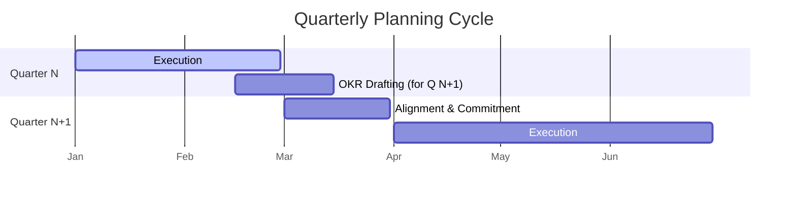
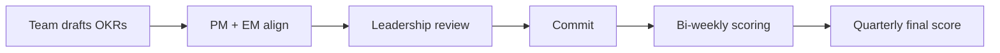
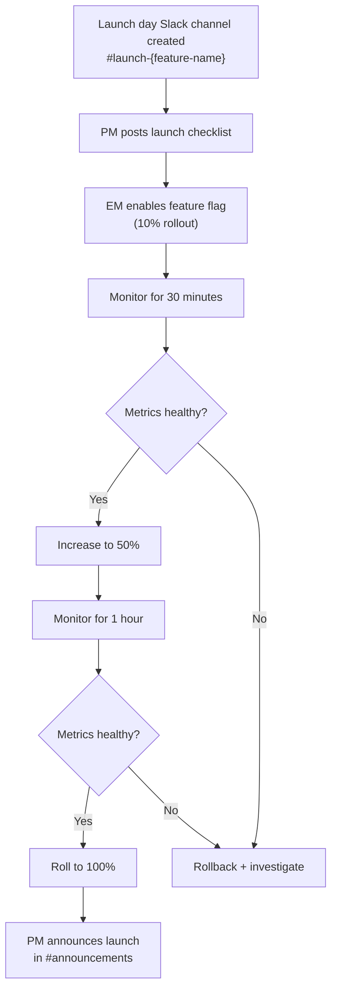
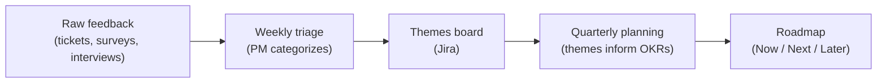
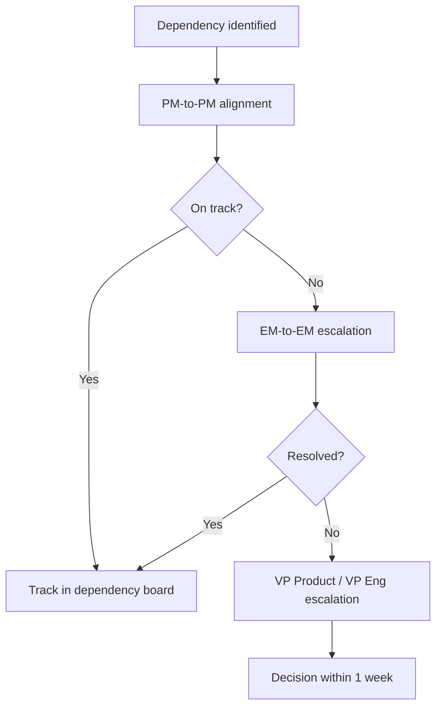

# 📈 Product Operations

  

---

## 📋 Table of Contents

1. [Roadmap Process](#1-roadmap-process)
2. [OKR Process](#2-okr-process)
3. [User Stories & Acceptance Criteria](#3-user-stories--acceptance-criteria)
4. [Stakeholder Communication](#4-stakeholder-communication)
5. [Launch Management](#5-launch-management)
6. [Customer Feedback](#6-customer-feedback)
7. [Competitive Analysis](#7-competitive-analysis)
8. [PM Analytics & Self-Serve Data](#8-pm-analytics--self-serve-data)
9. [Dependency Management](#9-dependency-management)

---

## 📈 1. Roadmap Process

### 1.1 Quarterly Cycle

{Company} follows a quarterly planning cadence with a rolling roadmap:



| Phase | Timing | Activities |
|-------|--------|-----------|
| **Execution** | Months 1-2 of current quarter | Teams execute against committed OKRs |
| **OKR Drafting** | Month 3 of current quarter | PMs draft next quarter's OKRs based on roadmap, customer feedback, and strategic priorities |
| **Alignment** | Month 1 of next quarter | PM + EM align on scope, engineering reviews feasibility, leadership reviews and commits |

### 1.2 Now / Next / Later Template

{Company} uses the Now / Next / Later framework for roadmap communication:

| Horizon | Time Frame | Confidence | Detail Level |
|---------|-----------|-----------|--------------|
| **Now** | Current quarter | High (committed) | Epics with acceptance criteria, assigned teams |
| **Next** | Next quarter | Medium (planned) | Themes with rough scope, tentative team assignment |
| **Later** | 2+ quarters out | Low (directional) | Strategic themes only, no team assignment |

### 1.3 Roadmap Artifact

The roadmap lives in **Jira Advanced Roadmap** (or Productboard) and is the single source of truth. PMs update it bi-weekly.

| Field | Required? | Description |
|-------|-----------|-------------|
| **Initiative** | Yes | High-level outcome (e.g., "Reduce checkout abandonment by 15%") |
| **Epics** | Yes (Now/Next) | Discrete deliverables within the initiative |
| **Team** | Yes (Now), optional (Next/Later) | Assigned team |
| **Quarter** | Yes | Target delivery quarter |
| **Status** | Yes | On Track / At Risk / Blocked / Done |
| **OKR link** | Yes | Which OKR this supports |

---

## 📈 2. OKR Process

### 2.1 OKR Lifecycle



### 2.2 OKR Scoring

| Score | Interpretation | Action |
|-------|---------------|--------|
| **0.0 - 0.3** | Failed to make meaningful progress | Post-mortem: why did we miss? |
| **0.4 - 0.6** | Meaningful progress but short of target | Acceptable if stretch goal; investigate if committed |
| **0.7** | Target achieved | This is the sweet spot - "0.7 = good" |
| **0.8 - 1.0** | Exceeded expectations | Was the target too conservative? Celebrate, then calibrate. |

### 2.3 OKR Template

```markdown
## Objective: [Outcome-oriented statement]
Owner: [PM / EM]
Quarter: Q2 2026

### Key Results

| # | Key Result | Baseline | Target | Current | Score |
|---|-----------|----------|--------|---------|-------|
| 1 | Reduce checkout abandonment rate | 35% | 20% | - | - |
| 2 | Increase average order value | $42 | $50 | - | - |
| 3 | Achieve 4.5★ app store rating | 4.1★ | 4.5★ | - | - |

### Initiatives
- [Epic 1: Streamlined checkout flow]
- [Epic 2: Upsell recommendations at cart]
- [Epic 3: Post-purchase feedback prompt]
```

### 2.4 Common OKR Pitfalls

| Pitfall | Example | Fix |
|---------|---------|-----|
| Output, not outcome | "Launch feature X" | "Reduce time-to-checkout by 30%" |
| Not measurable | "Improve user experience" | "Increase NPS from 32 to 45" |
| Too many KRs | 7 key results per objective | Maximum 3-5 KRs per objective |
| Sandbagging | Target that's already achieved | Baseline must be current state |
| Binary KRs | "Ship the thing" (0 or 1) | Reframe as a continuous metric |

---

## 📏 3. User Stories & Acceptance Criteria

User story format and Definition of Done are defined in the product-engineering collaboration guide (see [`04-product-engineering.md`](./04-product-engineering.md) section 8). All stories and acceptance criteria follow that standard.

---

## 📈 4. Stakeholder Communication

### 4.1 Weekly Status Email Template

```markdown
Subject: [Team Name] Weekly Update - Week of [Date]

## Highlights
- ✅ [Shipped: feature X to 100% of users]
- ✅ [Completed: API integration with partner Y]

## In Progress
- 🔄 [Feature Z - 70% complete, on track for [date]]
- 🔄 [Performance optimization - load testing this week]

## Risks & Blockers
- ⚠️ [Dependency on Team A for API change - at risk, need by [date]]
- 🛑 [Blocked: awaiting legal review on data processing agreement]

## Metrics
| Metric | Last Week | This Week | Trend |
|--------|-----------|-----------|-------|
| Checkout conversion | 65% | 67% | ↑ |
| P95 latency | 320ms | 290ms | ↑ |
| Error rate | 0.3% | 0.2% | ↑ |

## Next Week
- [ ] Ship feature Z to 10% (feature flag)
- [ ] Begin spike on [upcoming initiative]
```

### 4.2 Monthly Executive Summary

| Section | Content |
|---------|---------|
| **OKR progress** | Score each KR with a trend arrow |
| **Shipped features** | Bullet list with customer impact |
| **Key metrics** | 3-5 product metrics with month-over-month trend |
| **Risks** | Top 3 risks with mitigation status |
| **Team health** | Summary of latest health check |
| **Upcoming milestones** | Next month's planned deliverables |

### 4.3 Quarterly Business Review (QBR) Deck

| Slide | Content |
|-------|---------|
| 1 | Quarter summary - key accomplishments |
| 2 | OKR scorecard - final scores |
| 3 | Product metrics - quarter-over-quarter trends |
| 4 | Customer highlights - feedback themes, NPS |
| 5 | Technical health - uptime, latency, incidents |
| 6 | Team - hires, departures, health check summary |
| 7 | Next quarter - committed OKRs and roadmap |
| 8 | Risks and asks - resource needs, strategic decisions |

---

## 📈 5. Launch Management

### 5.1 Launch Readiness Checklist

| Category | Criterion | Owner | Required? |
|----------|-----------|-------|-----------|
| **Feature** | All acceptance criteria pass in staging | PM + QA | Yes |
| **Feature** | Feature flag configured with rollout plan | EM | Yes |
| **QA** | Regression test suite passes | QA | Yes |
| **QA** | Exploratory testing complete | QA | Yes |
| **Docs** | User-facing documentation updated | PM + Tech Writer | Yes |
| **Docs** | Internal runbook created/updated | EM | Yes |
| **Support** | Support team briefed on new feature | PM | Yes |
| **Support** | FAQ / canned responses updated | PM + Support Lead | Yes |
| **Monitoring** | Dashboard created for key feature metrics | EM | Yes |
| **Monitoring** | Alerts configured for error rate threshold | EM | Yes |
| **Rollback** | Rollback plan documented and tested | EM | Yes |
| **Comms** | Changelog / release notes drafted | PM | Yes |
| **Legal** | Privacy review complete (if PII involved) | PM + Legal | Conditional |

### 5.2 Launch Day Process



### 5.3 Post-Launch Review (+7 Days)

Seven days after launch, the team conducts a post-launch review:

| Topic | Questions |
|-------|-----------|
| **Metrics** | Did we hit our success criteria? What do the numbers show? |
| **Incidents** | Any incidents during or after launch? |
| **Customer feedback** | What are users saying? Support ticket volume? |
| **Technical debt** | Any shortcuts taken that need cleanup? |
| **Process** | What went well? What should we improve for next launch? |

---

## 📈 6. Customer Feedback

### 6.1 Feedback Channels

| Channel | Collection Method | Cadence | Owner |
|---------|------------------|---------|-------|
| **In-app surveys** | NPS + contextual micro-surveys | Continuous (sampled) | PM + Design |
| **Support tickets** | Zendesk tags + categorization | Continuous | Support Lead |
| **NPS** | Quarterly NPS survey (email) | Quarterly | PM |
| **User interviews** | Scheduled via research panel | Monthly (2-4 interviews) | Design + PM |
| **App store reviews** | Automated scraping + alerts | Daily | PM |

### 6.2 PM Triage

PMs triage feedback weekly:

| Step | Action |
|------|--------|
| 1 | Review all tagged support tickets from the past week |
| 2 | Categorize by theme (UX, bug, feature request, pricing) |
| 3 | Cross-reference with in-app survey data and NPS comments |
| 4 | Update the feedback themes board in Jira |
| 5 | Bring top themes to quarterly planning |

### 6.3 Feedback → Roadmap Pipeline



---

## 📈 7. Competitive Analysis

### 7.1 Quarterly Competitive Brief

The PM team produces a quarterly competitive brief covering:

| Section | Content |
|---------|---------|
| **Market landscape** | Key competitors and their positioning |
| **Feature comparison** | Updated feature matrix (shared Google Sheet) |
| **Pricing changes** | Any pricing moves by competitors |
| **Product launches** | Notable features shipped by competitors |
| **Win/loss analysis** | Sales win/loss data by competitor |
| **Strategic implications** | "So what?" - what should we do differently? |

### 7.2 Competitive Feature Matrix

| Feature | {Company} | Competitor A | Competitor B | Competitor C |
|---------|-----------|-------------|-------------|-------------|
| Real-time order tracking | ✅ | ✅ | ❌ | ✅ |
| Multi-currency support | ✅ | ✅ | ✅ | ❌ |
| Mobile app (iOS + Android) | ✅ | ✅ (iOS only) | ✅ | ✅ |
| API for integrations | ✅ | ❌ | ✅ | ✅ |
| White-label option | 🔄 Planned | ❌ | ✅ | ❌ |

### 7.3 Trigger Events

The PM team monitors competitor trigger events that should prompt immediate analysis:

| Trigger | Response |
|---------|----------|
| Competitor raises a funding round | PM writes brief within 1 week |
| Competitor launches major feature | PM evaluates and updates feature matrix within 2 weeks |
| Competitor changes pricing | PM evaluates impact on {Company} positioning within 1 week |
| New entrant in market | PM adds to competitive landscape within 2 weeks |
| Key competitor acquisition | PM assesses strategic impact within 1 week |

---

## 📊 8. PM Analytics & Self-Serve Data

### 8.1 Self-Serve Analytics Stack

| Component | Tool | Access |
|-----------|------|--------|
| **Data warehouse** | Amazon Redshift | All PMs (read-only) |
| **BI / Dashboards** | Amazon QuickSight | All PMs (create dashboards) |
| **SQL editor** | QuickSight SQL or DataGrip | PMs comfortable with SQL |
| **Event tracking** | Segment → Redshift | Instrumented by engineering |
| **Product analytics** | Amplitude (or equivalent) | All PMs |

### 8.2 Product Metric Catalog

Every product metric has a definition, owner, and source to prevent "two people, two numbers" scenarios:

| Metric | Definition | Owner | Source | Dashboard |
|--------|-----------|-------|--------|-----------|
| **DAU** | Distinct users with ≥ 1 session per day | Growth PM | Segment events → Redshift | "Daily Active Users" |
| **Checkout conversion** | Orders completed / Checkout initiated | Commerce PM | Backend events | "Checkout Funnel" |
| **Average order value** | Total revenue / Total orders (excluding refunds) | Commerce PM | Order service DB | "Revenue Dashboard" |
| **P95 API latency** | 95th percentile of API response time | Platform EM | Prometheus | "API Performance" |
| **NPS** | Net Promoter Score from quarterly survey | PM Lead | Survey tool | "Customer Health" |
| **Time to first order** | Days from signup to first completed order | Growth PM | Segment events → Redshift | "Activation Funnel" |
| **Support ticket volume** | Tickets created per week by category | Support Lead | Zendesk | "Support Dashboard" |
| **Feature adoption** | % of MAU using a specific feature within 30 days of launch | Feature PM | LaunchDarkly + Segment | "Feature Adoption" |

### 8.3 Per-Area Dashboards

Each product area maintains a QuickSight dashboard with its key metrics:

| Dashboard | Owner | Key Metrics |
|-----------|-------|------------|
| **Growth** | Growth PM | DAU, WAU, MAU, signup conversion, activation rate |
| **Commerce** | Commerce PM | Checkout conversion, AOV, cart abandonment, revenue |
| **Engagement** | Engagement PM | Session duration, feature adoption, retention (D1/D7/D30) |
| **Platform Health** | Platform EM | Uptime, P50/P95 latency, error rate, deploy frequency |
| **Support** | Support Lead | Ticket volume, CSAT, first response time, resolution time |

---

## 📈 9. Dependency Management

### 9.1 Jira Dependency Links

All cross-team dependencies are tracked as Jira issue links:

| Link Type | From | To | Example |
|-----------|------|----|---------|
| **is blocked by** | Dependent story | Blocking story | "Checkout flow" is blocked by "Payment API v2" |
| **relates to** | Related stories across teams | Related stories across teams | Design system update relates to checkout redesign |

### 9.2 Monthly Product Sync

PMs across all product areas meet monthly to review dependencies:

| Agenda Item | Time | Output |
|-------------|------|--------|
| Review new dependencies since last sync | 15 min | Updated dependency board |
| Status check on existing dependencies | 15 min | Updated risk levels |
| Escalate at-risk dependencies | 10 min | Escalation owner assigned |
| Upcoming dependencies for next quarter | 10 min | Early awareness |
| Open discussion | 10 min | Ad-hoc alignment |

### 9.3 Escalation Path



### 9.4 Dependency Risk Assessment

| Risk Level | Definition | Action |
|-----------|-----------|--------|
| **Green** | Dependency on track, no concerns | Track in board, no action |
| **Yellow** | Dependency at risk - timeline may slip by 1-2 weeks | PM-to-PM discussion, contingency plan |
| **Red** | Dependency blocked or slipping > 2 weeks | EM escalation, scope discussion, potential de-scoping |

---
<div align="center">

⬅️ [Back to section](./README.md) · 🏠 [Back to root](../README.md)

</div>
