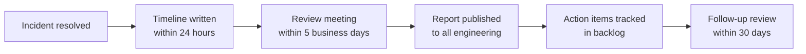

# 🌱 Engineering Culture and Values

  

---

## 🎯 1. Overview

Engineering culture is not a poster on the wall. It is the collection of behaviors, expectations, and norms that determine how engineers make decisions when nobody is watching. At {Company}, culture is a first-class engineering concern - as deliberate and maintained as any production system.

This document defines the cultural values that underpin everything we build, how those values show up in daily work, and the anti-patterns we actively guard against. Culture does not happen by accident. It is designed, reinforced, and evolved through intentional practice.

---

## 🏛️ 2. Core Cultural Values

### 2.1 Ownership

You own what you build - from first commit to production incident. Ownership means you do not throw code over a wall and walk away. You monitor it, you respond when it breaks, and you improve it over time.

| Principle | What it looks like in practice |
|-----------|-------------------------------|
| **You build it, you run it** | Teams own their services end-to-end, including on-call |
| **Fix what you find** | If you see a bug, a flaky test, or unclear documentation, fix it. Do not file a ticket and forget |
| **No orphan services** | Every service has an owning team in the service catalog. Unowned services are escalated quarterly |
| **Proactive communication** | When your change affects other teams, you reach out before merging - not after an outage |

### 2.2 Transparency

Default to open. Decisions made in private channels create information silos and erode trust. We work in the open so that context is shared and decisions can be challenged constructively.

| Principle | What it looks like in practice |
|-----------|-------------------------------|
| **Public channels first** | Technical discussions happen in public Slack channels, not DMs |
| **ADRs over hallway decisions** | Significant technical choices are recorded in Architecture Decision Records |
| **Open roadmaps** | Engineering roadmaps are visible to the entire organization |
| **Metrics are public** | DORA metrics, SLO dashboards, and error budgets are visible to all teams |

### 2.3 Psychological Safety

People take risks, ask questions, and admit mistakes only when they feel safe doing so. Psychological safety is not about being nice - it is about being honest. We optimize for candor over comfort.

| Principle | What it looks like in practice |
|-----------|-------------------------------|
| **No stupid questions** | Questions in public channels are answered with respect, regardless of seniority |
| **Mistakes are data** | When something goes wrong, we ask "what happened?" not "who did this?" |
| **Disagreement is welcome** | Challenging a Staff Engineer's design is expected and encouraged |
| **Feedback is specific** | "This approach has a race condition" is useful. "This is bad" is not |

### 2.4 Continuous Learning

Technology changes faster than any individual can track. We invest in learning as an organizational capability, not an individual hobby. Engineers who stop learning build systems that stop evolving.

| Principle | What it looks like in practice |
|-----------|-------------------------------|
| **Dedicated learning time** | Engineers have allocated time for courses, reading, and experimentation |
| **Cross-team rotation** | Engineers can rotate to other teams for 3-6 month periods to broaden skills |
| **Conference budget** | Every engineer has an annual conference and training budget |
| **Internal teaching** | Senior engineers are expected to teach, not just build. Knowledge hoarding is an anti-pattern |

---

## 🔄 3. Culture in Daily Engineering Work

Values only matter when they are visible in everyday actions. This section maps cultural values to the rituals and interactions that make up an engineer's typical week.

### 3.1 Code Review

Code review is a cultural act, not just a quality gate. It is where transparency, psychological safety, and continuous learning intersect.

| Cultural value | How it shows up in code review |
|---------------|-------------------------------|
| **Transparency** | Review comments explain the *why*, not just the *what*. "This will cause N+1 queries because..." teaches the author |
| **Psychological safety** | Comments address the code, never the person. "This function could be simplified" not "You wrote this wrong" |
| **Ownership** | Reviewers take responsibility for the code they approve. Rubber-stamping is a cultural violation |
| **Continuous learning** | Reviews are a teaching opportunity. Link to relevant manifesto docs, blog posts, or prior incidents |

### 3.2 Stand-ups and Rituals

| Ritual | Cultural purpose |
|--------|-----------------|
| **Daily stand-up** | Surface blockers early (transparency), offer help across boundaries (ownership) |
| **Sprint retrospective** | Safe space to raise process issues (psychological safety), identify improvement actions (continuous learning) |
| **Architecture clinic** | Cross-team design review (transparency), learn from other teams' approaches (continuous learning) |
| **Demo day** | Celebrate shipped work (ownership), share knowledge broadly (transparency) |

### 3.3 On-Call and Incident Response

On-call is where culture is tested under pressure. When systems break at 3 AM, the instinct to blame is strongest - and the need for psychological safety is highest.

- **Respond, do not blame.** The on-call engineer's job is to restore service, not to find fault.
- **Escalate without shame.** Calling for help is a sign of good judgment, not weakness.
- **Document while it's fresh.** Write the timeline in the incident channel as events unfold.
- **Follow up with a blameless review.** Every SEV-1 and SEV-2 gets a post-incident review (see Section 4).

---

## 🔍 4. Blameless Postmortems and Learning Culture

Blameless postmortems are the single most important cultural practice in a high-performing engineering organization. They transform incidents from moments of stress into opportunities for systemic improvement.

### 4.1 Core Principles

| Principle | Description |
|-----------|-------------|
| **No blame, no shame** | People are never the root cause. Systems, processes, and incentives are |
| **Assume good intent** | Every engineer involved was doing their best with the information they had |
| **Focus on systems** | "Why did the system allow this?" not "Why did this person do this?" |
| **Action items, not apologies** | Every postmortem produces concrete, tracked action items with owners and due dates |
| **Wide readership** | Postmortem reports are published to all of engineering. Learning is organizational, not team-scoped |

### 4.2 Postmortem Process

**Visual overview:**

### 4.3 What Makes a Good Postmortem

| Element | Good example | Bad example |
|---------|-------------|-------------|
| **Root cause** | "The deploy pipeline did not run integration tests for config changes" | "Someone pushed a bad config" |
| **Action item** | "Add config validation step to CI pipeline (owner: @platform, due: Feb 15)" | "Be more careful with configs" |
| **Contributing factor** | "Alert thresholds were set too high to catch gradual degradation" | "We should have noticed sooner" |
| **Learning** | "Config changes need the same rigor as code changes" | "Do not make mistakes" |

### 4.4 Learning from Near-Misses

Not every learning opportunity comes from an outage. We also run postmortems for near-misses - events that *could* have caused an incident but did not due to luck or quick intervention. Near-miss reviews use the same format as incident postmortems.

---

## 💡 5. Innovation Time and Experimentation

Innovation does not happen in a vacuum. It requires dedicated time, psychological safety to fail, and a structured path from experiment to production.

### 5.1 Innovation Budget

| Mechanism | Details |
|-----------|---------|
| **20% time** | Engineers may spend up to one day per week on self-directed technical work. This is not a suggestion - managers must protect this time |
| **Hack weeks** | Quarterly company-wide hack weeks. Teams form around ideas, build prototypes, and present to leadership |
| **Innovation proposals** | Any engineer can submit a one-page proposal for a larger experiment. Approved proposals get dedicated sprint capacity |
| **Tech debt Fridays** | One Friday per sprint is reserved for tech debt, tooling improvements, and quality-of-life fixes |

### 5.2 Experimentation Framework

Not every experiment needs to become a product feature. We use a lightweight framework to manage the lifecycle of experiments:

| Stage | Description | Exit criteria |
|-------|-------------|---------------|
| **Explore** | Time-boxed spike (1-2 days). Validate feasibility | Written summary of findings shared in team channel |
| **Prototype** | Build a working proof of concept (1-2 weeks) | Demo to team, rough cost/benefit analysis |
| **Pilot** | Run with a small user segment or internal team (2-4 weeks) | Measurable results, defined success metrics |
| **Adopt** | Productionize via normal RFC/PR process | Meets all manifesto standards for production services |
| **Archive** | Document what was learned, even if the experiment is not adopted | Findings published to the experiment archive |

### 5.3 Celebrating Failure

Failed experiments are celebrated alongside successful ones. At the end of each hack week, teams present what they tried and what they learned - whether the experiment worked or not. The goal is to reward curiosity and rigorous thinking, not just successful outcomes.

---

## 📖 6. Knowledge Sharing Expectations

Knowledge sharing is an engineering responsibility, not an optional extracurricular. See [Knowledge Sharing](./08-knowledge-sharing.md) for the full operational details. This section defines the cultural expectations.

### 6.1 Expectations by Level

| Level | Knowledge sharing expectation |
|-------|------------------------------|
| **Engineer I-II** | Document your own work. Ask questions in public channels. Participate in guild meetings |
| **Senior Engineer** | Write internal blog posts or tech talks at least twice per year. Mentor junior engineers |
| **Staff Engineer** | Lead architecture clinics. Publish cross-team guides. Review and improve manifesto content |
| **Principal Engineer** | Shape organizational knowledge strategy. Speak at external conferences. Drive cross-org learning initiatives |

### 6.2 Knowledge Sharing as a Performance Signal

Knowledge sharing is explicitly part of the engineering ladder (see [Engineering Ladder](./02-engineering-ladder.md)). Engineers who consistently hoard knowledge - even if they are individually productive - are not meeting expectations for senior roles.

| Signal | Healthy | Unhealthy |
|--------|---------|-----------|
| **Documentation** | Team wiki is current and useful | "It's all in my head, just ask me" |
| **Code review** | Comments explain reasoning and link to resources | Approvals without comments |
| **Incident response** | Detailed postmortem shared broadly | "I fixed it" with no explanation |
| **Onboarding** | New team members are productive within 2 weeks | New members struggle for months |

---

## 🤖 7. Culture in Agent-Native Organizations

As AI agents take on more engineering tasks - writing code, reviewing PRs, running deployments, responding to alerts - engineering culture must evolve to include agents as team participants while preserving human accountability.

### 7.1 Agents as Team Members

| Principle | Description |
|-----------|-------------|
| **Agents follow the same standards** | Agent-generated code, PRs, and deployments are held to the same quality bar as human work. The manifesto is the shared contract |
| **Agents inherit team culture** | Agents operating within a team's codebase follow the team's conventions, documented in AGENTS.md and cursor rules |
| **Agent output is reviewable** | All agent actions produce artifacts (PRs, logs, reports) that humans can review. No "black box" automation |
| **Agents participate in knowledge sharing** | Agent-generated postmortems, documentation, and code comments contribute to the team's knowledge base |

### 7.2 Human Accountability

Agents do not replace human judgment for decisions that carry organizational risk. The following decisions require human approval, regardless of agent capability:

| Decision type | Human role |
|---------------|-----------|
| **Architecture changes** | Staff+ engineer must approve any RFC or ADR, even if agent-drafted |
| **Security trade-offs** | Security team must review agent-proposed changes to auth, encryption, or access control |
| **Production incidents** | A human incident commander owns every SEV-1 and SEV-2, even if agents handle initial triage |
| **Hiring and performance** | People decisions are always human-led |
| **Ethical considerations** | Bias, fairness, and privacy decisions require human review and sign-off |

### 7.3 Evolving Culture with Agents

As agent capabilities grow, the cultural norms evolve:

- **Trust is earned, not assumed.** New agent capabilities start with tight human oversight. Autonomy increases as reliability is demonstrated through metrics and track record.
- **Transparency still applies.** Agent actions must be logged, auditable, and explainable. "The agent did it" is never a sufficient explanation for a production change.
- **Learning applies to agents too.** Agent configurations, prompts, and rules are reviewed and improved based on outcomes - the same continuous improvement loop we apply to human processes.
- **Psychological safety extends to agent interactions.** Engineers must feel safe questioning, overriding, or disabling agent behavior without fear of being seen as "anti-AI" or obstructionist.

---

## 🚫 8. Anti-Patterns to Watch For

Culture erodes gradually. These anti-patterns are warning signs that values are slipping. If you see them, raise them in a retrospective or in `#engineering-discussions`.

### 8.1 Ownership Anti-Patterns

| Anti-pattern | Symptom | Remedy |
|-------------|---------|--------|
| **Not my problem** | Engineers avoid fixing issues outside their team's scope | Celebrate cross-team contributions. Include "good citizenship" in performance reviews |
| **Hero culture** | One person always saves the day; knowledge concentrates | Rotate on-call, enforce pair programming on critical systems, document tribal knowledge |
| **Ticket-driven development** | Nothing happens unless there is a Jira ticket | Empower engineers to fix small issues directly. Not everything needs a ticket |
| **Ownership theater** | Team "owns" a service but never looks at its dashboards | Service ownership audits in quarterly reviews |

### 8.2 Transparency Anti-Patterns

| Anti-pattern | Symptom | Remedy |
|-------------|---------|--------|
| **Shadow decisions** | Technical choices made in DMs or hallway conversations | Require ADRs for decisions that affect more than one team |
| **Information silos** | Teams cannot explain how other teams' services work | Cross-team architecture clinics, rotation programs |
| **Metrics hiding** | Teams avoid publishing dashboards that show problems | Make metrics publishing mandatory, celebrate teams that surface and fix issues |

### 8.3 Psychological Safety Anti-Patterns

| Anti-pattern | Symptom | Remedy |
|-------------|---------|--------|
| **Blame culture** | Postmortems focus on who, not what | Enforce blameless postmortem template. Train facilitators |
| **Silent disagreement** | Engineers agree in meetings but complain in private | Explicitly ask for dissent in design reviews. "Who sees a risk we have not discussed?" |
| **Seniority bias** | Junior engineers do not challenge senior engineers' designs | Senior engineers model vulnerability by publicly admitting mistakes and asking for feedback |

### 8.4 Learning Anti-Patterns

| Anti-pattern | Symptom | Remedy |
|-------------|---------|--------|
| **Knowledge hoarding** | Critical knowledge lives in one person's head | Bus factor audits. Pair programming. Mandatory documentation for critical paths |
| **Innovation theater** | Hack week projects never make it to production | Track experiment-to-production pipeline. Remove friction for productionizing prototypes |
| **Resume-driven development** | Engineers push for new tech to build their resume, not to solve real problems | Technology Radar process. Require evidence-based proposals for new technology |
| **Learning as a luxury** | Learning time is the first thing cut when deadlines approach | Protect innovation time in sprint planning. Track learning hours as a team metric |

---

## 📊 9. Measuring Culture

Culture is hard to measure, but not impossible. We track leading indicators that correlate with healthy engineering culture.

| Indicator | Measurement | Target | Frequency |
|-----------|------------|--------|-----------|
| **Psychological safety score** | Anonymous team health survey (1-5 scale) | >= 4.0 | Quarterly |
| **Postmortem completion rate** | Percentage of SEV-1/2 incidents with published postmortems | 100% | Monthly |
| **Knowledge sharing activity** | Tech talks, blog posts, and guild contributions per quarter | >= 2 per senior+ engineer | Quarterly |
| **Cross-team contributions** | PRs merged to repos outside the engineer's primary team | Trending upward | Quarterly |
| **Innovation pipeline** | Hack week projects that reach pilot or production | >= 20% of projects | Bi-annually |
| **Onboarding velocity** | Time for new engineers to merge their first production PR | <= 5 business days | Per cohort |
| **Retention of senior engineers** | Annual retention rate for Staff+ engineers | >= 90% | Annually |

---

## 📋 10. Quick Reference

| Value | One-line summary | Key ritual |
|-------|-----------------|------------|
| **Ownership** | You build it, you run it, you improve it | On-call rotation, service catalog audits |
| **Transparency** | Default to open, decide in public | ADRs, public Slack channels, open dashboards |
| **Psychological safety** | Blame systems, not people | Blameless postmortems, inclusive code review |
| **Continuous learning** | Learning is infrastructure, not a hobby | Tech talks, guilds, innovation time |
| **Agent-native culture** | Same standards, human accountability | AGENTS.md, human-in-the-loop gates |

---

⬅️ [Back to section](./README.md) · 🏠 [Back to root](../README.md)

