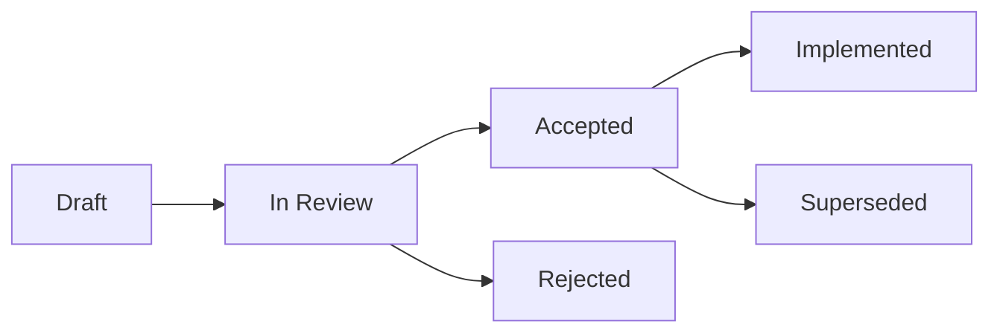

# 📝 Document Templates

  

---

## 🎯 1. Overview

Standardized document templates reduce friction when teams need to propose, decide, or learn from engineering work. Every template in this guide has a clear purpose, a mandatory structure, and a storage location. Teams must use these templates for the corresponding decision type - ad-hoc formats are not accepted.

---

## 📐 2. Template Catalog

| Template | Purpose | When to Use | Storage |
|----------|---------|-------------|---------|
| **ADR** | Record a single architectural decision and its rationale | Any non-trivial technical choice within a service or domain | `docs/adr/` in the owning repo |
| **RFC** | Propose a cross-cutting change that needs multi-team input | Changes affecting more than one service, team, or platform boundary | Backstage RFC plugin |
| **PIR** | Document post-incident findings and follow-up actions | After every SEV-1 or SEV-2 incident; optionally for SEV-3 | Incident management tool |
| **PRD** | Define product requirements for engineering delivery | New feature epics or significant product changes | Product wiki or Backstage |
| **Design Doc** | Describe a system design before implementation begins | New services, major refactors, or complex integrations | `docs/design/` in the owning repo |

---

## 📋 3. ADR Template

| Section | Content |
|---------|---------|
| **Header** | `ADR-{NNN}: {Title}`, Status, Date, Author(s), Deciders |
| **Context** | Problem or situation requiring a decision |
| **Decision** | What was decided and why |
| **Alternatives** | Options evaluated with pros and cons (table format) |
| **Consequences** | Positive, negative, and neutral outcomes |

ADRs are immutable once accepted. To reverse a decision, create a new ADR that supersedes the original.

---

## 📋 4. RFC Template

| Section | Content |
|---------|---------|
| **Header** | Title, Author(s), Status, Review deadline (min 5 business days), Stakeholders |
| **Problem Statement** | What problem are we solving and why now? |
| **Proposed Solution** | Detailed technical proposal |
| **Alternatives Considered** | Other approaches and why they were rejected |
| **Migration / Rollout Plan** | How to adopt the change safely |
| **Open Questions** | Unresolved items requiring input |

RFCs require at least two approvals from affected teams. See [05-rfc-process.md](./05-rfc-process.md) for the full workflow.

---

## 📋 5. PIR Template

| Section | Content |
|---------|---------|
| **Header** | Incident title, Severity, Duration, Impact, Author |
| **Timeline** | Chronological events in UTC |
| **Root Cause** | Technical root cause analysis |
| **Contributing Factors** | Systemic issues that enabled the incident |
| **What Went Well / Needs Improvement** | Honest retrospective |
| **Action Items** | Each with owner and due date |

PIRs must be blameless. Focus on systems and processes, not individuals.

---

## 📋 6. Design Doc Template

| Section | Content |
|---------|---------|
| **Header** | Title, Author(s), Status, Reviewers |
| **Goals and Non-Goals** | Scope boundaries |
| **High-Level Design** | Architecture diagram and key decisions |
| **Detailed Design** | Data model, API changes, security, observability |
| **Rollout Plan** | Migration steps and rollback strategy |
| **Open Questions** | Items requiring further discussion |

Design docs expire after 6 months if not implemented. Archive or refresh them during quarterly backlog reviews.

---

## 🔄 7. Document Lifecycle

**Visual overview:**

| State | Meaning |
|-------|---------|
| **Draft** | Author is still writing; not ready for feedback |
| **In Review** | Open for comments and approvals |
| **Accepted** | Approved by required stakeholders |
| **Implemented** | Work described in the document is complete |
| **Superseded** | Replaced by a newer document |

---

## ⚠️ 8. Anti-Patterns

| Anti-Pattern | Problem | Fix |
|-------------|---------|-----|
| Skipping the ADR | Decisions are invisible and unrepeatable | Write a lightweight ADR - even two paragraphs count |
| RFC as rubber stamp | Review period too short or stakeholders not notified | Enforce minimum 5-day review; notify affected teams |
| Blameful PIR | Engineers fear reporting incidents honestly | Remove names from fault analysis; focus on systems |
| Stale design docs | Docs diverge from implementation | Archive or update during quarterly reviews |

---

⬅️ [Back to section](./README.md) · 🏠 [Back to root](../README.md)

