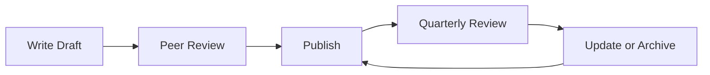

# ✍️ Technical Writing Guide

  

---

## 🎯 1. Overview

Good technical writing is a force multiplier. A well-written runbook prevents a 3 AM escalation. A clear ADR saves weeks of re-litigation. A concise README lets a new hire contribute on day one. At {Company}, technical writing is an engineering skill - not a nice-to-have.

> **Rule:** Every document must have a clear audience, a single purpose, and be maintainable by the owning team. If nobody owns it, delete it.

---

## 📐 2. Writing Principles

| Principle | Description |
|-----------|-------------|
| **Audience first** | State who the document is for in the first paragraph |
| **One purpose per doc** | A runbook is not an architecture doc is not a tutorial |
| **Scannable** | Use headings, tables, and lists - not walls of text |
| **Opinionated** | State what to do, not "you could do X or Y" |
| **Maintainable** | Every doc has an owner and a review cadence |
| **Testable** | Code examples and commands must be copy-pasteable and correct |

---

## 📋 3. Document Types

| Type | Purpose | Audience | Lifespan |
|------|---------|----------|----------|
| **README** | Quick orientation for a repo or service | New contributors | Permanent - updated quarterly |
| **ADR** | Record a decision and its rationale | Future engineers asking "why?" | Permanent - immutable once accepted |
| **RFC** | Propose a cross-cutting change | Stakeholders and reviewers | Active during review, then archived |
| **Runbook** | Step-by-step guide for operational tasks | On-call engineers | Permanent - updated on every operational change |
| **Tutorial** | Teach a concept through guided steps | Engineers learning a new tool or pattern | Updated when the tool changes |
| **Reference** | Exhaustive specification of an API or config | Engineers using the API | Updated on every API change |

---

## ✏️ 4. Style Standards

### 4.1 Language

| Rule | Example |
|------|---------|
| Use second person ("you") or first person plural ("we") | "You must configure TLS" not "One must configure TLS" |
| Use active voice | "The service retries the request" not "The request is retried" |
| Use present tense | "This endpoint returns a list" not "This endpoint will return a list" |
| Be direct | "All services must use structured logging" not "It is recommended that services ideally use structured logging" |
| Avoid jargon without definition | Define acronyms on first use |

### 4.2 Formatting

| Element | Standard |
|---------|----------|
| **Headings** | Sentence case ("Getting started" not "Getting Started") except proper nouns |
| **Code** | Inline backticks for short references, fenced blocks for multi-line |
| **Lists** | Numbered for ordered steps, bulleted for unordered items |
| **Tables** | Use for structured comparisons; avoid for prose |
| **Links** | Descriptive text, not "click here" |
| **Line length** | No hard wrap - let the renderer handle it |

### 4.3 Punctuation

Use plain hyphens (`-`), never em-dashes or en-dashes. Use straight quotes, never curly or smart quotes. Always use the Oxford comma: "logs, metrics, and traces."

---

## 🔄 5. Documentation Lifecycle

**Visual overview:**

| Activity | Frequency | Owner |
|----------|-----------|-------|
| **Initial writing** | When the artifact is created | Author |
| **Peer review** | Before publication | At least one reviewer from the target audience |
| **Quarterly freshness check** | Every quarter | Document owner |
| **Archive stale docs** | When content is no longer relevant | Document owner |
| **Deprecation notice** | When a newer doc supersedes this one | Document owner |

---

## 📍 6. Where to Publish

| Content Type | Location | Reason |
|-------------|----------|--------|
| **Service docs** | Backstage TechDocs (Markdown in repo) | Lives with the code, versioned together |
| **ADRs** | `docs/adr/` in the service repo | Discoverable by future maintainers |
| **RFCs** | Backstage RFC plugin | Centralized review and discovery |
| **Runbooks** | Backstage TechDocs | Accessible during incidents |
| **Onboarding** | Team README + Backstage | First thing a new hire finds |

---

## 🤖 7. Writing for Agents

AI coding agents consume documentation as context. Write docs that work for both humans and machines:

| Practice | Rationale |
|----------|-----------|
| Use consistent heading structure | Agents parse headings for navigation |
| Put the most important information first | Context windows are limited |
| Use tables for structured data | Easier to parse than prose |
| Include concrete examples | Agents learn patterns from examples |
| Avoid ambiguity | "Must" and "must not" are clearer than "should consider" |

---

## ⚠️ 8. Anti-Patterns

| Anti-Pattern | Problem | Fix |
|-------------|---------|-----|
| No owner | Doc rots because nobody maintains it | Every doc has an owner in metadata |
| Wiki sprawl | Dozens of overlapping, outdated wiki pages | Consolidate in Backstage TechDocs; delete duplicates |
| Tribal knowledge | Critical info exists only in people's heads | Write it down - if you explained it twice, document it |
| Screenshot-heavy docs | Screenshots break on UI changes and are not searchable | Use text, code blocks, and diagrams |

---

⬅️ [Back to section](./README.md) · 🏠 [Back to root](../README.md)

