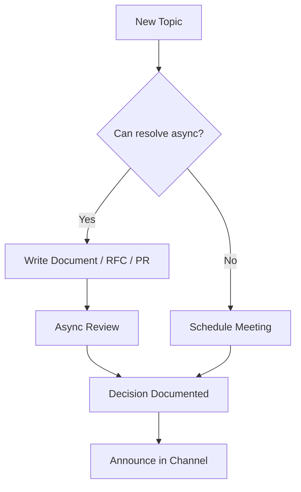

# 📨 Async-First Engineering Culture

  

---

## 🎯 1. Overview

{Company} operates as an async-first engineering organization. Async-first does not mean "no meetings" - it means that synchronous communication (meetings, live calls) is reserved for decisions that genuinely require real-time discussion, and all other collaboration defaults to written, asynchronous formats.

> **Rule:** If a topic can be resolved in a document, RFC, PR comment, or Slack thread, it must not become a meeting.

---

## 📐 2. Communication Hierarchy

Default to the highest-leverage async format. Escalate to sync only when async stalls.

| Priority | Channel | Use For | Response SLA |
|----------|---------|---------|-------------|
| **1 (default)** | Written document (RFC, ADR, design doc) | Decisions, proposals, architecture | 2 business days |
| **2** | PR / code review comments | Code feedback, implementation decisions | 1 business day |
| **3** | Slack thread (public channel) | Questions, quick alignment, status updates | 4 business hours |
| **4** | Scheduled meeting | Decisions that stalled async, brainstorming, retrospectives | N/A |
| **5** | Ad hoc call | Urgent incidents, blocked work requiring real-time discussion | N/A |

> **Rule:** Every meeting must have a written agenda shared at least 4 hours before the meeting. Meetings without agendas are cancelled.

---

## 📝 3. Writing Standards for Async Work

| Practice | Standard |
|----------|----------|
| **Start with context** | Every async message includes enough background for a reader with no prior context |
| **State the ask** | Lead with what you need - decision, feedback, FYI - not a narrative |
| **Use structured formats** | Bullet points, tables, headers. Not walls of text |
| **Include a deadline** | "I need input by Friday" is better than "thoughts?" |
| **Link, do not paste** | Reference documents by link, not inline copy |
| **Thread replies** | Reply in threads, not in the main channel |

---

## 📅 4. Meeting Hygiene

| Rule | Rationale |
|------|-----------|
| Default meeting length is 25 or 50 minutes | Buffer between meetings prevents back-to-back fatigue |
| No-meeting blocks: Tuesday and Thursday mornings | Protected deep work time for engineering |
| Record and summarize decisions | Async participants can catch up without attending |
| Maximum 6 participants for decision meetings | Larger groups reduce decision quality |
| Decline meetings without agendas | Agenda-free meetings waste everyone's time |
| Retrospectives are the one mandatory meeting | Continuous improvement requires synchronous reflection |

---

## 🤖 5. Async Practices for Agentic Teams

As AI agents become engineering participants, async-first practices extend naturally to human-agent collaboration.

| Practice | Description |
|----------|-------------|
| **Agents work async by default** | Agents process tasks from queues, not live conversations |
| **Written context is agent context** | Well-written documents, RFCs, and tickets are directly consumable by agents |
| **Agent status updates** | Agents post progress to Slack threads or PR comments, not live channels |
| **Review queues** | Human review of agent output is async - agents do not block waiting for approval |

---

## 📊 6. Metrics

| Metric | Target | Measurement |
|--------|--------|-------------|
| Meeting hours per engineer per week | < 8 hours | Calendar analytics |
| Decisions made async vs sync | > 70% async | Decision log tracking |
| PR review turnaround (median) | < 4 hours | GitHub analytics |
| RFC review turnaround | < 2 business days | RFC tracker |
| Slack response time (public channels) | < 4 business hours | Slack analytics |

**Visual overview:**

---

## 🔗 7. Cross-References

- [RFC Process](./05-rfc-process.md) - Structured async decision-making for technical proposals
- [Knowledge Sharing](./08-knowledge-sharing.md) - Patterns for distributing knowledge asynchronously

---

⬅️ [Back to section](./README.md) · 🏠 [Back to root](../README.md)

