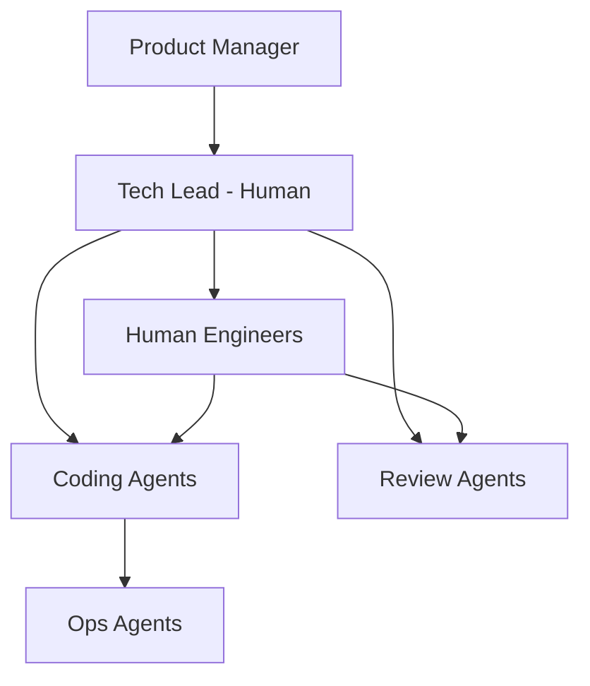

# 🤖 Agentic Ways of Working

  

---

## 🎯 1. Overview

As AI agents become engineering participants - writing code, reviewing PRs, running tests, and managing deployments - the way teams organize and work must evolve. This document defines how {Company}'s ways of working adapt for an agentic organization where humans and agents collaborate as a unified engineering team.

> **Rule:** Agents are team members, not tools. They appear in team capacity planning, have defined responsibilities, and are held to the same standards as human engineers.

---

## 🏗️ 2. Team Structure in Agentic Orgs

| Role | Responsibility | Human/Agent |
|------|---------------|-------------|
| **Tech lead** | Architecture decisions, quality standards, team health | Human (always) |
| **Product manager** | Requirements, prioritization, customer empathy | Human (always) |
| **Human engineers** | Complex problems, mentoring, architecture, code review | Human |
| **Coding agents** | Implementation, bug fixes, refactoring, test writing | Agent |
| **Review agents** | Automated code review, standards compliance | Agent |
| **Ops agents** | Monitoring, runbook execution, incident triage | Agent |

**Visual overview:**

---

## 📐 3. Capacity Planning with Agents

| Practice | Description |
|----------|-------------|
| **Agent capacity tracking** | Count agent throughput in sprint planning (e.g., "agent can handle 5 small tickets/sprint") |
| **Human-agent ratio** | Start with 1 agent per 3 - 5 human engineers, adjust based on maturity |
| **Agent-eligible work** | Tag tickets as "agent-eligible" during backlog refinement |
| **Escalation budget** | Plan for 10 - 20% of agent work requiring human takeover |
| **Ramp-up period** | New agent capabilities start at Tier 1 and earn autonomy over 30+ days |

> **Rule:** Agent capacity is additive, not a replacement for human headcount. Agents handle toil and routine work so humans focus on high-judgment tasks.

---

## 🔄 4. Workflows

### Code Development Workflow

| Step | Actor | Description |
|------|-------|-------------|
| 1 | Human | Creates ticket with requirements and acceptance criteria |
| 2 | Agent | Picks up agent-eligible ticket, writes implementation |
| 3 | Agent | Runs tests, linters, opens PR |
| 4 | Review agent | Performs automated review for standards compliance |
| 5 | Human | Reviews PR for design, correctness, domain fit |
| 6 | Human | Approves or requests changes |
| 7 | Agent | Addresses feedback, updates PR |
| 8 | Human | Final approval and merge |

### Incident Response Workflow

| Step | Actor | Description |
|------|-------|-------------|
| 1 | Agent | Detects anomaly, correlates alerts, pages on-call |
| 2 | Human | Acknowledges, assesses severity |
| 3 | Agent | Surfaces relevant runbooks, recent deployments, similar incidents |
| 4 | Human | Decides response strategy |
| 5 | Agent | Executes runbook steps under human supervision |
| 6 | Human | Validates resolution, closes incident |

---

## 📏 5. Meeting and Communication Norms

| Norm | Description |
|------|-------------|
| **Agent status in standups** | Team reviews agent work queue alongside human updates |
| **Agent retrospective items** | Include agent performance, failures, and improvement areas in retros |
| **Written over verbal** | Agents cannot attend meetings - all decisions must be written down |
| **Ticket-driven work** | Agents work from tickets, not verbal instructions |
| **Transparent attribution** | PRs and commits clearly indicate agent authorship |

---

## 📊 6. Metrics for Agentic Teams

| Metric | Target | Measurement |
|--------|--------|-------------|
| Agent task completion rate | > 85% | Tasks completed without human takeover |
| Human review turnaround for agent PRs | < 4 hours | Time from PR open to first human review |
| Agent-driven throughput | Trending upward | Tickets completed by agents per sprint |
| Human escalation rate | < 15% | Agent tasks requiring human intervention |
| Quality of agent output | Same as human baseline | Defect rate in agent-authored code |
| Team satisfaction with agents | > 3.5 / 5.0 | Quarterly survey |

---

## 🚫 7. Anti-Patterns

| Anti-Pattern | Risk | Mitigation |
|-------------|------|------------|
| **Agent replaces headcount** | Reduced human judgment in the system | Agent capacity is additive |
| **Blind trust** | Accepting agent output without review | Human review gates are mandatory |
| **Agent silos** | Agents work in isolation without team context | Agents share the same repo context and standards |
| **No retrospective** | Agent failures not analyzed | Include agent performance in team retros |

---

⬅️ [Back to section](./README.md) · 🏠 [Back to root](../README.md)

