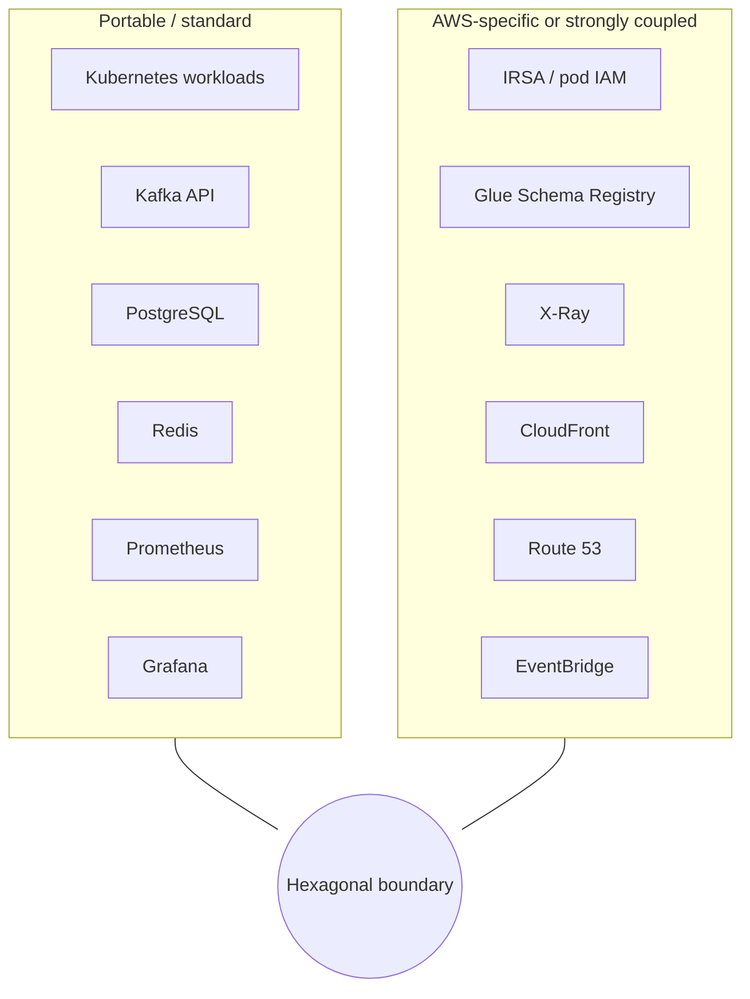
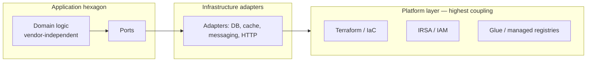
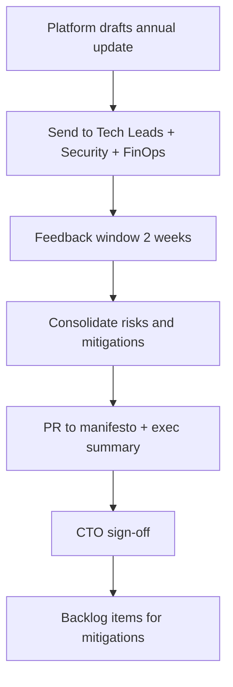

# 🔍 Vendor Assessment

> *{Company} Platform Engineering Manifesto — knowing our dependencies so we can leverage AWS effectively without blind spots.*

  

---

## 🎯 1. Purpose

This document helps us **understand dependency on AWS and other vendors** across the {Company} platform.

**Multi-cloud is not the goal.** Running the same stack in three clouds “just in case” is usually expensive and slow. Our goal is **awareness and contingency planning**: we know what would hurt to change, what is standard and portable, and where we deliberately accept coupling for speed or capability.

---

## ☁️ 2. AWS dependency inventory

| AWS service | What it does for {Company} | Portability | Exit effort |
|-------------|------------------------|-------------|-------------|
| **EKS** | Managed Kubernetes for workloads | Kubernetes-standard (APIs, workloads) | Low — any conformant K8s |
| **Aurora** | Primary relational data (PostgreSQL-compatible) | Hybrid — Postgres wire protocol; some Aurora-only features | Medium — standard Postgres elsewhere |
| **MSK** | Managed Kafka for events | Hybrid — Apache Kafka API | Medium — self-managed Kafka or vendor Kafka |
| **ElastiCache** | Redis for cache, sessions, locks | Redis protocol | Low–medium — Redis elsewhere or on K8s |
| **IRSA** | Pod identity → IAM without long-lived keys | AWS-specific | High — identity model must be redesigned per environment |
| **Glue Schema Registry** | Schema governance for streaming / data | AWS-specific API and integration | Medium–high — Confluent / other registry + migration |
| **X-Ray** | Distributed tracing (legacy / parallel paths) | AWS-specific (prefer OpenTelemetry per manifesto) | Medium — replace with OTel backends |
| **Secrets Manager** | Central secret storage; ESO integration | Hybrid — swappable with Vault / other stores | Medium |
| **S3** | Object storage (artifacts, exports, static assets) | S3 API de facto standard; many alternatives | Low–medium |
| **CloudFront** | CDN for edge delivery | AWS-specific distribution model | Medium — other CDNs |
| **Route 53** | DNS and health checks | AWS-specific control plane | Medium — DNS is portable; migration is operational |
| **API Gateway** | Edge API management + WAF integration | AWS-specific | Medium–high |
| **WAF** | Web application firewall at edge | AWS-specific rules / integration | Medium |
| **EventBridge** | Event routing and SaaS integrations | AWS-specific | Medium–high |
| **CloudWatch** | Logs, metrics, alarms (often alongside Prometheus/Grafana) | AWS-specific | Medium |

---

## 🔄 3. Portability analysis

Application **domain logic** stays inside the hexagon; **adapters** talk to vendors. The **platform layer** (cluster provisioning, IAM linking, registry glue) is where cloud coupling concentrates.

---

## 💰 4. Exit cost estimation

| Component | Alternative | Migration effort | Risk |
|-----------|-------------|------------------|------|
| EKS | Any conformant Kubernetes (GKE, AKS, on-prem) | Medium — cluster rebuild, networking, addons | Medium — ops skill and blast radius |
| Aurora | RDS Postgres / Cloud SQL / self-managed Postgres | Medium — failover, cutover, feature audit | Medium — data migration and performance tuning |
| MSK | Confluent Cloud / self-managed Kafka | Medium — cluster ops, topic migration, clients | Medium–high — ordering and consumer coordination |
| ElastiCache | Redis on K8s / Memorystore / other Redis | Low–medium — connection strings, HA | Low–medium |
| IRSA | Workload identity per cloud / SPIFFE / vault-based | High — redesign per environment | High if rushed |
| Glue Schema Registry | Confluent Schema Registry / Apicurio | Medium — registration and compatibility policies | Medium |
| X-Ray | OpenTelemetry → Grafana Tempo / Jaeger / vendor APM | Medium — instrumentation alignment | Low if OTel already primary |
| Secrets Manager | HashiCorp Vault / cloud-native secret stores | Medium — operators and rotation | Medium |
| CloudFront | Fastly / Cloudflare / Akamai | Medium — DNS, certs, behaviors | Low–medium |
| Route 53 | Any DNS provider | Low–medium — cutover planning | Medium during transition |
| API Gateway + WAF | Kong / Envoy Gateway + WAF vendor | High — paths, auth, rate limits | High |

---

## 🏗️ 5. Abstraction assessment

**What hexagonal architecture protects**

- **Domain logic** is **vendor-independent** — business rules for orders, fulfillment, pricing, and customers/providers do not depend on AWS SDKs inside the core.
- **Infrastructure adapters** can be **swapped** when interfaces are stable: a new Redis, a different object store implementing the same port, or a messaging adapter behind a domain port.

**Where coupling remains**

- **Platform layer**: Terraform modules, **IRSA** wiring, **Glue Schema Registry** integration, and other “how the cluster and AWS account work together” concerns.
- **Edge and control planes**: API Gateway, CloudFront, Route 53, and WAF are not inside the service hexagon; they are **environment topology** decisions with real switching costs.

---

## 🛡️ 6. Risk mitigation

- **Avoid AWS-only APIs** where **Kubernetes-standard** or **open-protocol** alternatives exist (CSI drivers, standard Ingress, CNCF tooling).
- **Prefer OpenTelemetry** over **X-Ray**-centric instrumentation for new work; export to the backend we standardize on.
- **Prefer standard PostgreSQL features** over **Aurora-specific** capabilities unless the benefit is clearly worth the portability tax; document exceptions in ADRs.
- **Annual vendor review** (see below) to refresh this inventory, exit costs, and mitigation backlog.

---

## 📋 7. Third-party vendor inventory

| Vendor / category | Role at {Company} | Lock-in assessment | Alternatives / notes |
|-------------------|---------------|--------------------|----------------------|
| **LaunchDarkly** | Feature flags, experiments | Medium — flag definitions and SDK usage | Split, Unleash, open-source flags (trade-offs on UX and scale) |
| **PagerDuty** (or similar) | Incident paging and workflows | Medium — schedules, integrations | Opsgenie, in-house runbook + SMS (usually worse UX) |
| **SonarCloud** | Static analysis, quality gates | Low–medium — rules and history | GitHub Advanced Security, self-hosted SonarQube |
| **Snyk** | Dependency / container scanning | Low–medium — policies in vendor UI | Mend, GitHub Dependabot, other SCA |
| **Stripe / Adyen** | Payments | High — contracts, PCI scope, reconciliation | Other PSPs; migration is business and compliance heavy |
| **Google Maps / HERE** | Maps, routing, geocoding | High — API shapes, pricing, coverage | Other map providers; product impact |
| **Twilio** | SMS / voice | Medium — numbers, sender IDs, compliance | MessageBird, Vonage, regional SMS gateways |
| **SendGrid** (or similar) | Transactional email | Low–medium — templates and domains | SES, Postmark, Mailgun |
| **Auth0 / Cognito** | Identity for apps / APIs | High — user migration, OIDC/OAuth config | Cross-vendor IdP migration is always costly |

---

## 📅 8. Annual review process

### What to review

- AWS and third-party **inventory** (this document + live architecture diagrams).
- **New services** adopted in the year and their portability / exit notes.
- **Incidents** or near-misses tied to vendor behavior or coupling.
- **Abstraction health** — are we leaking vendor SDKs into domain code?
- **Alternatives** landscape for the top 3 coupling risks.

### Who reviews it

- **Owner:** CTO + **Platform Engineering** (draft update).
- **Input:** Security, FinOps, and domain Tech Leads for services with heavy vendor use (payments, maps, identity).

### Output format

- Updated **tables** and **Mermaid diagrams** in this file (via PR).
- Short **executive summary** (1 page): top risks, agreed mitigations, and any ADRs spawned.
- **Tracking:** Jira epic or platform backlog items for mitigations with owners and quarters.

---

⬅️ [Back to section](./README.md) · 🏠 [Back to root](../README.md)

