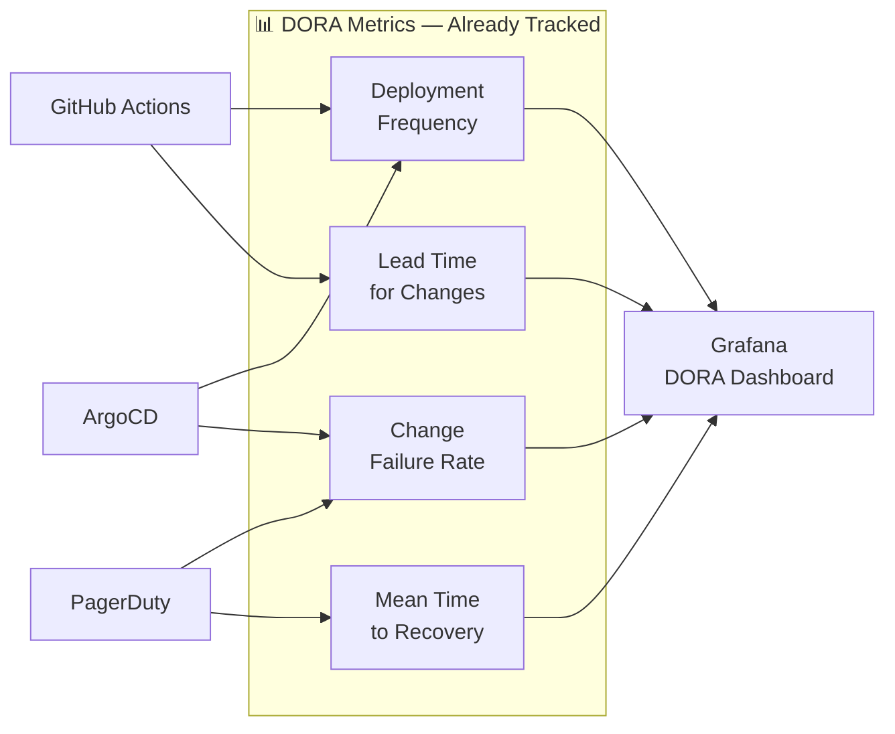
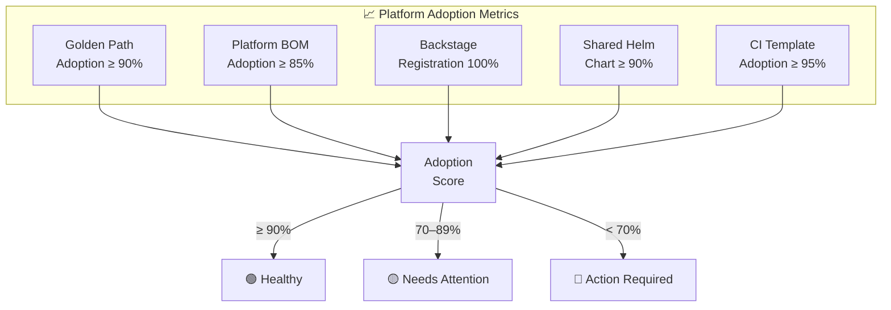
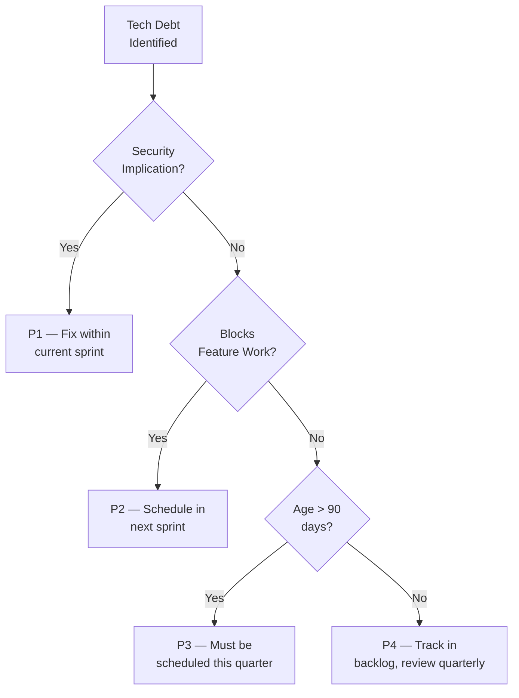
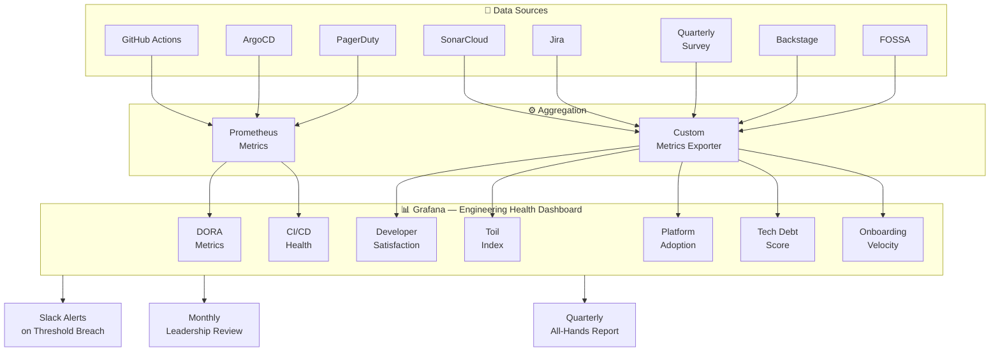

# Engineering Health Metrics

> **Status:** Reference  
> **Owner:** CTO + Platform Engineering  
> **Last Updated:** 2025

---

## 1. Beyond DORA

DORA metrics are **necessary but not sufficient**. They tell you how fast you ship and how stable your releases are — but they say nothing about developer happiness, platform adoption, technical debt accumulation, or onboarding friction.

{Company} tracks DORA as the **baseline floor**. This document defines the full set of engineering health metrics that together give leadership a complete picture of engineering effectiveness.

| Layer | What It Measures | DORA Covers? |
|-------|------------------|:------------:|
| **Delivery velocity** | How fast we ship | ✅ |
| **Delivery stability** | How safe our releases are | ✅ |
| **Developer experience** | How productive & happy engineers feel | ❌ |
| **Platform adoption** | How consistently teams use the golden path | ❌ |
| **Technical debt** | How much drag we carry | ❌ |
| **Operational toil** | How much time goes to repetitive ops work | ❌ |
| **Onboarding velocity** | How fast new hires become productive | ❌ |

---

## 2. DORA Metrics Recap

These are already tracked via the CI/CD pipeline and Grafana. Included here for completeness.

| Metric | Definition | Target | Current Tracking |
|--------|-----------|--------|------------------|
| **Deployment Frequency** | How often code reaches production per service | ≥ 1/day per active service | ArgoCD + GitHub Actions |
| **Lead Time for Changes** | Commit to production | < 1 hour | GitHub Actions timestamps |
| **Change Failure Rate** | % of deployments causing incidents | < 5% | PagerDuty + ArgoCD correlation |
| **Mean Time to Recovery (MTTR)** | Time from incident detection to resolution | < 30 min (P1), < 2h (P2) | PagerDuty |

**These metrics are the starting point, not the finish line.**

---

## 3. Developer Satisfaction Survey

Run **quarterly** via a short, anonymous survey. NPS-style scoring (1–10) with free-text follow-ups.

### 3.1 The 10 Questions

| # | Question | Category |
|---|----------|----------|
| 1 | How productive do you feel in your day-to-day work? | General |
| 2 | How satisfied are you with the CI/CD pipeline speed? | Tooling |
| 3 | How easy is it to find documentation for platform services? | Documentation |
| 4 | How well does the platform team support your needs? | Platform support |
| 5 | How manageable is your on-call burden? | On-call |
| 6 | How confident are you in deploying to production? | Delivery |
| 7 | How effective are your team's code review practices? | Practices |
| 8 | How well do your development tools work together? | Tooling |
| 9 | How reasonable is the amount of operational toil you handle? | Toil |
| 10 | Would you recommend {Company} engineering as a place to work? (NPS) | Engagement |

### 3.2 Scoring

| Score Range | Label | Action |
|-------------|-------|--------|
| 9–10 | Promoter | Celebrate and learn from these areas |
| 7–8 | Passive | Monitor — no immediate action |
| 1–6 | Detractor | Requires investigation and action plan |

**Target:** Engineering NPS ≥ 40 (measured as % Promoters − % Detractors).

Results are published to all-hands within 2 weeks of survey close. Action items are tracked in Jira and reviewed monthly.

---

## 4. Toil Measurement

**Toil** = repetitive, manual, automatable work that scales linearly with service count. It produces no lasting value.

### 4.1 What Counts as Toil

| Toil | Not Toil |
|------|----------|
| Manually restarting pods after known OOM | Investigating a novel incident |
| Copying config between environments | Designing a new feature |
| Manually rotating secrets | Writing automation to rotate secrets |
| Re-running flaky CI pipelines | Fixing the flaky test |
| Manual data migrations | Designing a migration framework |

### 4.2 Measurement

Teams log toil hours weekly in a shared spreadsheet (lightweight — 2 min/week). Platform Engineering aggregates and reports monthly.

| Metric | Target | Red Line |
|--------|--------|----------|
| % engineering time spent on toil | < 20% | > 35% |
| Top 3 toil categories | Identified each quarter | Same category appears 3 quarters in a row |
| Toil reduction trend | Decreasing quarter-over-quarter | Flat or increasing |

When a toil category exceeds 5% of total engineering time, it is escalated to the platform roadmap as an automation candidate.

---

## 5. Platform Adoption Metrics

These metrics tell us whether teams are actually using the platform — or working around it.

| Metric | Definition | Target | Measurement |
|--------|-----------|--------|-------------|
| **Golden path adoption** | % of services using the standard service template | ≥ 90% | Backstage catalog scan |
| **Platform BOM adoption** | % of services using the platform Bill of Materials for dependencies | ≥ 85% | Gradle/Maven dependency analysis |
| **Backstage registration** | % of production services registered in Backstage with complete metadata | 100% | Backstage API |
| **Shared Helm chart usage** | % of services using the platform Helm chart vs. custom | ≥ 90% | ArgoCD manifest analysis |
| **CI template adoption** | % of repos using the shared GitHub Actions workflow | ≥ 95% | GitHub API scan |

Non-adoption is not punished — it is investigated. If teams are working around the platform, the platform team needs to understand why and fix the gap.

---

## 6. Technical Debt Quantification

### 6.1 Metrics

| Metric | Source | Target |
|--------|--------|--------|
| **SonarCloud debt ratio** | SonarCloud quality gate | < 5% per service |
| **Age of oldest open debt ticket** | Jira `tech-debt` label | < 90 days |
| **Sprint capacity on debt** | Jira sprint reports | 15–20% of sprint capacity |
| **Dependency currency** | Dependabot / Renovate | No dependency > 2 major versions behind |
| **Deprecated API usage** | Custom lint rules | Zero deprecated internal API calls |

### 6.2 Debt Triage

### 6.3 Debt Budgets

Each team is expected to spend **15–20% of sprint capacity** on technical debt reduction. This is tracked as a first-class metric — not a nice-to-have.

If a team consistently spends < 10% on debt, leadership will review whether feature pressure is unsustainable.

---

## 7. Onboarding Velocity

**Metric:** Time from a new hire's first day to their first production deployment.

| Milestone | Target | Measured By |
|-----------|--------|-------------|
| Dev environment set up | < 4 hours | Self-reported |
| First passing CI build | < 1 day | GitHub Actions |
| First PR merged | < 3 days | GitHub |
| First production deploy | < 2 weeks | ArgoCD |
| Comfortable with on-call | < 6 weeks | Manager assessment |

### 7.1 Onboarding Checklist

Every new hire follows the onboarding golden path in Backstage:
1. Clone the service template
2. Run the local dev environment (`make dev`)
3. Make a small change (e.g., update a health check message)
4. Push, watch CI, get a review, merge, deploy
5. Observe the deployment in Grafana

If onboarding takes longer than 2 weeks to first deploy, the platform team investigates — the problem is the platform, not the person.

---

## 8. CI/CD Health

| Metric | Definition | Target | Red Line |
|--------|-----------|--------|----------|
| **Pipeline success rate** | % of CI runs that pass on first attempt | ≥ 95% | < 85% |
| **Pipeline duration (P50)** | Median time from push to green | < 8 min | > 15 min |
| **Pipeline duration (P95)** | 95th percentile | < 15 min | > 25 min |
| **Flaky test count** | Tests that pass/fail non-deterministically | < 5 across all repos | > 20 |
| **Queue wait time** | Time a job waits for a runner | < 30 sec | > 2 min |

### 8.1 Flaky Test Policy

- Flaky tests are **quarantined within 24 hours** of detection
- Quarantined tests are tracked in a dedicated Jira board
- A flaky test that is not fixed within 2 weeks is **deleted** (if low value) or rewritten
- Flaky test count is a team health metric reviewed weekly

---

## 9. Engineering Health Dashboard

All metrics feed into a single Grafana dashboard accessible to every engineer and visible on engineering area TVs.

### 9.1 Dashboard Sections

| Section | Refresh Rate | Alert Threshold |
|---------|-------------|-----------------|
| DORA Metrics | Real-time | CFR > 10% or MTTR > 1h |
| CI/CD Health | Real-time | Success rate < 90% or P95 > 20 min |
| Platform Adoption | Daily | Any metric < 80% |
| Tech Debt | Weekly | Debt ratio > 8% or oldest ticket > 120 days |
| Developer Satisfaction | Quarterly | NPS < 30 |
| Toil Index | Monthly | Toil > 30% |
| Onboarding Velocity | Per event | Time to first deploy > 3 weeks |

---

## 10. Review Cadence

| Review | Frequency | Audience | Format |
|--------|-----------|----------|--------|
| **CI/CD Health Review** | Weekly | Platform Engineering | Async dashboard review |
| **Engineering Metrics Review** | Monthly | Engineering Leadership (CTO, VPE, Tech Leads) | 30-min meeting with dashboard walkthrough |
| **Engineering Health All-Hands** | Quarterly | All engineers | 45-min presentation with trends, wins, and action items |
| **Developer Satisfaction Deep-Dive** | Quarterly (post-survey) | CTO + Platform Engineering | 60-min session reviewing survey results and planning actions |

### 10.1 Monthly Leadership Review Agenda

1. DORA trends (5 min)
2. CI/CD health and flaky test status (5 min)
3. Platform adoption changes (5 min)
4. Tech debt trajectory (5 min)
5. Toil report and automation candidates (5 min)
6. Action items from previous month (5 min)

### 10.2 Quarterly All-Hands

1. Dashboard walkthrough with quarter-over-quarter trends
2. Top 3 wins (what improved)
3. Top 3 concerns (what needs attention)
4. Developer satisfaction survey results
5. Open Q&A

---

← [Back to section](./README.md) · [Back to root](../README.md)
