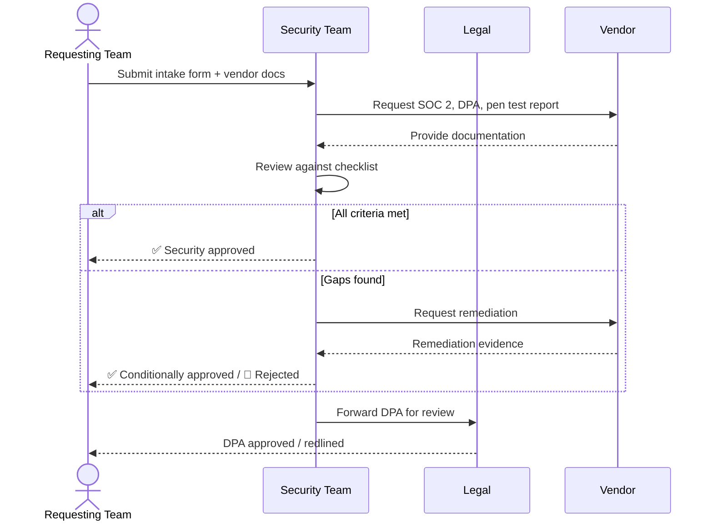
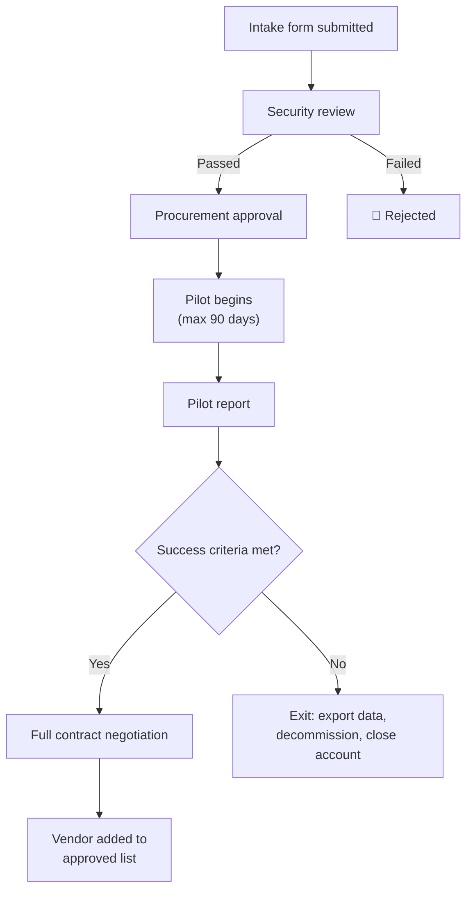

# 📝 Vendor & SaaS Intake Process

  

---

## 🎯 1. Purpose

This document defines the process for evaluating, approving, and onboarding new third-party SaaS products, managed services, or paid tools at {Company}. It exists to ensure that every vendor relationship is evaluated for security, cost, and strategic fit before production data or significant spend is committed.

**This process applies to any new vendor not already on the approved list.** For analysis of existing vendor dependencies and lock-in risks, see [03-vendor-assessment.md](./03-vendor-assessment.md).

---

## ✅ 2. When This Process Applies

| Scenario | This Process? | Notes |
|----------|:------------:|-------|
| New SaaS product (e.g., observability tool, CI add-on) | **Yes** | Full intake required |
| New managed cloud service not in current stack | **Yes** | Full intake required |
| Paid CLI tool or developer utility with per-seat licensing | **Yes** | Lightweight intake if < $10K/yr |
| Free / open-source tool with no data flow to vendor | **No** | Follow [Open Source Policy](../07-ways-of-working/03-open-source-policy.md) |
| Upgrading tier of an already-approved vendor | **No** | Procurement approval only (skip security review if no new data flows) |
| Renewing an existing approved vendor | **No** | Annual renewal review (see section 8) |

---

## 📋 3. Intake Form

Before any evaluation begins, the requesting team submits an intake form.

| Field | Description |
|-------|-------------|
| **Requester** | Name, team, and role |
| **Vendor name** | Product or service being evaluated |
| **Business need** | What problem does this solve? Why can't an approved tool cover it? |
| **Alternatives evaluated** | At least 2 alternatives considered, with brief pros/cons |
| **Data classification** | What {Company} data flows to the vendor? (None / Internal / Confidential / PII / Financial) |
| **Data residency** | Where will data be stored? Required region? |
| **Estimated annual cost** | Total cost including all seats, tiers, and overages |
| **Contract term** | Month-to-month, annual, multi-year |
| **Integration points** | What systems will this vendor connect to? APIs, SSO, data pipelines? |
| **Sponsor** | Engineering manager or director sponsoring the request |

---

## 🔐 4. Security Review Checklist

Every new vendor must pass the security review before production data is shared or the tool is integrated into production systems.

| Requirement | Criteria | Blocking? |
|-------------|----------|:---------:|
| **SOC 2 Type II** | Current report (within 12 months) provided and reviewed by Security | **Yes** |
| **Data Processing Agreement (DPA)** | Signed DPA covering GDPR, CCPA, and applicable regulations | **Yes** |
| **Data residency** | Data stored in approved regions (EU or US, per {Company} policy) | **Yes** |
| **SSO / SAML** | Required for any tool with > 5 users | **Yes** |
| **Encryption at rest** | AES-256 or equivalent | **Yes** |
| **Encryption in transit** | TLS 1.2+ for all data in transit | **Yes** |
| **Access controls** | Role-based access, audit logging, admin controls | **Yes** |
| **Penetration testing** | Recent (within 12 months) third-party pen test report available | Recommended |
| **Incident response** | Documented incident notification SLA (≤ 72 hours) | **Yes** |
| **Subprocessor disclosure** | List of subprocessors provided and reviewed | **Yes** |

### 4.1 Security Review Workflow

---

## 💳 5. Procurement Approval Chain

| Estimated Annual Cost | Required Approvers |
|----------------------|-------------------|
| **< $10K/yr** | Team Lead + Security review |
| **$10K - $50K/yr** | Engineering Manager + Finance partner + Security review |
| **> $50K/yr** | VP Engineering + Legal + Finance + Security review |

All approvals are recorded in the vendor registry. Contracts > $50K/yr require Legal review of terms and conditions.

---

## 🧪 6. Pilot Criteria

Before committing to a full contract, teams may run a time-boxed pilot.

| Criterion | Requirement |
|-----------|-------------|
| **Maximum duration** | 90 days |
| **Success metrics** | Defined upfront in the intake form - measurable and objective |
| **Data restrictions** | No production data without completed security review |
| **Exit plan** | Documented before pilot begins: data export mechanism, migration path, account deletion |
| **Pilot scope** | Limited to the requesting team; no org-wide rollout during pilot |
| **Pilot report** | Written summary at pilot end: metrics achieved, issues found, go/no-go recommendation |

### 6.1 Pilot Decision Flow

---

## 📦 7. Vendor Registry

All approved vendors are tracked in Backstage under the `Vendor Registry` namespace.

| Field | Description |
|-------|-------------|
| **Vendor name** | Product or service name |
| **Category** | Observability, CI/CD, Security, Productivity, etc. |
| **Status** | Pilot / Approved / Under Review / Deprecated |
| **Data classification** | Highest data classification flowing to vendor |
| **Annual cost** | Current contract value |
| **Contract expiry** | Date of next renewal |
| **Owner** | Team or individual responsible for the vendor relationship |
| **Security review date** | Date of last completed security review |
| **DPA status** | Signed / Pending / Not Required |

---

## 🔄 8. Ongoing Review

Approved vendors are not approved forever. {Company} conducts ongoing reviews to ensure continued compliance and value.

| Review Type | Cadence | Scope |
|------------|---------|-------|
| **Annual renewal review** | Before each contract renewal | Cost justification, usage audit, alternative assessment |
| **Security re-assessment** | Annual (or after vendor incident) | Updated SOC 2, DPA compliance, subprocessor changes |
| **Usage audit** | Quarterly | Active users vs. licensed seats, feature utilization |
| **Vendor risk re-assessment** | Annual | Financial stability, acquisition risk, service reliability |

### 8.1 Renewal Decision Matrix

| Signal | Action |
|--------|--------|
| Usage < 50% of licensed seats for 2+ quarters | Downsize or evaluate alternatives |
| Vendor fails to provide updated SOC 2 | Escalate to Security; consider replacement |
| Better alternative enters Adopt on the [Technology Radar](../07-ways-of-working/06-technology-radar.md) | Evaluate migration within next quarter |
| Vendor acquired or changes pricing significantly | Trigger ad-hoc review; update exit plan |
| No production usage in 6+ months | Decommission and remove from approved list |

---

## 🔗 9. Relationship to Other Documents

| Document | Relationship |
|----------|-------------|
| [03-vendor-assessment.md](./03-vendor-assessment.md) | Existing vendor lock-in analysis and exit cost estimation |
| [03-open-source-policy.md](../07-ways-of-working/03-open-source-policy.md) | Governs open-source dependencies (free/OSS tools without vendor data flow) |
| [06-technology-radar.md](../07-ways-of-working/06-technology-radar.md) | Adopt-level tools are on the approved list; Hold tools should not be newly adopted |
| [03-security.md](../04-infrastructure-and-cloud/03-security.md) | Security standards that vendors must meet |
| [05-finops.md](../04-infrastructure-and-cloud/05-finops.md) | Cost management and optimization for vendor spend |

---

## ⚠️ 10. Anti-Patterns

| Anti-Pattern | Why It's Harmful | What to Do Instead |
|-------------|-----------------|-------------------|
| Free-tier creep into production | No security review, no DPA, no exit plan | Treat any vendor with data flow as requiring full intake |
| Skipping the pilot | Locks {Company} into a multi-year contract without evidence | Always pilot first for new categories |
| Shadow IT | Teams adopt tools without intake; creates security blind spots and duplicated spend | All tools with data flow or cost go through intake |
| "It's only $5K" | Small spend across many teams adds up; creates tool sprawl | All paid tools go through intake regardless of cost |
| No exit plan | Vendor lock-in discovered only when switching is urgent | Document exit plan before pilot begins |

---

⬅️ [Back to section](./README.md) · 🏠 [Back to root](../README.md)

