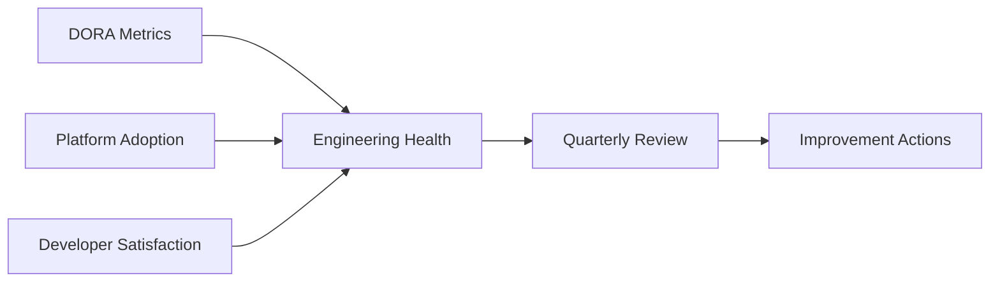

# 📊 Engineering KPIs and DORA Metrics

  

---

## 📋 Table of Contents

1. [Overview](#-1-overview)
2. [DORA Metrics](#-2-dora-metrics)
3. [Platform Adoption Metrics](#-3-platform-adoption-metrics)
4. [Developer Satisfaction](#-4-developer-satisfaction)
5. [Measurement Cadence](#-5-measurement-cadence)
6. [Reporting and Action](#-6-reporting-and-action)

---

## 🎯 1. Overview

{Company} tracks engineering effectiveness through a balanced set of KPIs covering delivery velocity, operational reliability, platform adoption, and developer experience. Metrics exist to drive improvement, not to rank teams or individuals.

> **Rule:** Engineering KPIs are team-level measures. They must never be used to evaluate individual performance or as the basis for compensation decisions.

**Visual overview:**

Cross-references: [Engineering Metrics](./04-engineering-metrics.md) for detailed definitions, [Maturity Model](./01-maturity-model.md) for organizational assessment.

---

## 🚀 2. DORA Metrics

Every team must track and report these monthly. Data collection is fully automated.

| Metric | Definition | Elite | Acceptable |
|:-------|:-----------|:------|:-----------|
| **Deployment Frequency** | How often code deploys to production | Multiple per day | Weekly to daily |
| **Lead Time for Changes** | Commit to production deploy | < 1 hour | < 1 week |
| **Change Failure Rate** | % of deployments causing failure | < 5% | < 15% |
| **Mean Time to Recover** | Failure detection to resolution | < 1 hour | < 24 hours |

| Metric | Source | Collection |
|:-------|:------|:-----------|
| Deployment Frequency | ArgoCD events | CI/CD webhook |
| Lead Time | Git + ArgoCD timestamps | Calculated |
| Change Failure Rate | Incident records linked to deploys | Incident system |
| MTTR | Incident open-to-resolved | PagerDuty |

> **Rule:** DORA metrics must be collected automatically. Manual self-reporting introduces bias and is not permitted.

---

## 📦 3. Platform Adoption Metrics

| Metric | Target | Measurement |
|:-------|:-------|:------------|
| **Golden path usage** | > 90% of new services | Template vs. total new services |
| **CI pipeline compliance** | 100% of repos | Automated scan for required stages |
| **Observability coverage** | 100% of production services | SLOs + dashboards + structured logging |
| **Dependency currency** | < 30 days behind latest patch | Automated version scan |
| **Container image freshness** | < 14 days behind base image | Deployed image scan |
| **Security scan pass rate** | > 95% first-pass | Builds passing SAST/SCA without override |

---

## 😊 4. Developer Satisfaction

Measured through quarterly surveys and continuous signals. Target DevEx score: 4.0 / 5.0.

| Survey Dimension | Target |
|:-----------------|:-------|
| "Our CI/CD pipeline is fast and reliable" | >= 4.0 |
| "I can find the information I need" | >= 4.0 |
| "My local dev environment is productive" | >= 4.0 |
| "On-call is manageable and well-supported" | >= 3.5 |
| "Platform team responds to my needs promptly" | >= 4.0 |

| Continuous Signal | Threshold |
|:-----------------|:----------|
| CI build wait time (p95) | < 10 minutes |
| PR review turnaround (median) | < 4 hours |
| Environment spin-up time | < 15 minutes |
| #platform-support response time | < 4 business hours |

---

## 📅 5. Measurement Cadence

| Activity | Cadence | Owner |
|:---------|:--------|:------|
| DORA metric collection | Continuous (automated) | Platform Engineering |
| DORA metric review | Monthly | Engineering leads |
| Platform adoption scan | Weekly (automated) | Platform team |
| Developer satisfaction survey | Quarterly | Engineering Operations |
| Annual benchmark | Yearly | CTO |

---

## 📈 6. Reporting and Action

All KPIs are visible at `https://grafana.internal.{company}.com/d/eng-kpis` with current values, targets, and 90-day trends.

| Signal | Action |
|:-------|:-------|
| DORA metric below "Acceptable" for 2 months | Engineering lead creates improvement plan |
| Platform adoption below target | Platform team investigates blockers |
| DevEx score below 3.5 in any dimension | CTO review with corrective actions in 30 days |
| Improvement plan not completed on time | Escalation to VP Engineering |

> **Rule:** Every metric below target must have a named owner and improvement plan within two weeks of detection.

---

⬅️ [Back to section](./README.md) · 🏠 [Back to root](../README.md)

