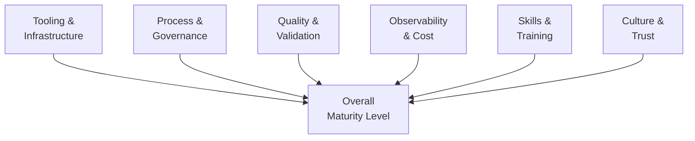

# 🤖 Agentic Maturity Model

  

---

## 🎯 1. Purpose

Adopting AI agents across an engineering organization is not a binary switch - it is a progression. This model defines five maturity levels that help {Company} assess where each team stands, identify gaps, and plan a deliberate path toward effective agent adoption.

The maturity model is descriptive, not prescriptive. Not every team needs to reach Level 5. The target level depends on the team's domain, risk profile, and the value agents can deliver in their context.

---

## 📊 2. Maturity Levels

| Level | Name | Description |
|-------|------|-------------|
| **L1** | **Aware** | Team understands what AI agents are and has experimented informally. No standard tooling or processes. |
| **L2** | **Assisted** | Agents are used for individual productivity (code completion, documentation, test generation). Usage is ad-hoc and varies by individual. |
| **L3** | **Integrated** | Agents are embedded in team workflows with defined guardrails. Review engineering processes are in place. Agent output goes through standard CI/CD and review. |
| **L4** | **Orchestrated** | Agents operate as first-class participants in the SDLC. Multi-step agent workflows are automated. Observability, cost tracking, and quality scoring are active. |
| **L5** | **Autonomous** | Agents handle end-to-end workflows with human oversight at defined checkpoints. The team focuses on reviewing outcomes rather than directing steps. |

---

## 📐 3. Maturity Dimensions

Each maturity level is assessed across six dimensions. A team's overall level is the **lowest** score across all dimensions - one weak area holds the entire level back.

**Visual overview:**

| Dimension | L1 - Aware | L3 - Integrated | L5 - Autonomous |
|-----------|-----------|----------------|----------------|
| **Tooling** | No standard tools | Approved agent tools deployed | Agent orchestration platform operational |
| **Process** | No agent-specific processes | Review engineering for agent output | Agents trigger and manage workflows autonomously |
| **Quality** | No validation | Automated quality gates on agent PRs | Continuous quality scoring with feedback loops |
| **Observability** | No tracking | LLM call tracing and token monitoring | Full cost attribution and quality dashboards |
| **Skills** | General awareness | Team trained on prompt engineering and review | Team designs and maintains agent workflows |
| **Culture** | Curiosity | Trust with verification | Agents are trusted team members with oversight |

---

## 📋 4. Progression Criteria

To advance from one level to the next, a team must demonstrate all criteria for the target level.

### L1 to L2 - Aware to Assisted

| Criterion | Evidence |
|-----------|---------|
| At least 50% of team members have used an approved AI coding assistant | Usage logs from approved tooling |
| Team has completed the agent awareness training module | Training records |
| Team can articulate risks of agent-generated code | Discussion in team retro or documented in team wiki |

### L2 to L3 - Assisted to Integrated

| Criterion | Evidence |
|-----------|---------|
| Agent-authored PRs are labelled and go through standard review | GitHub PR history with `agent-authored` labels |
| Automated quality gates are active for agent output | CI pipeline configuration |
| Team has documented which tasks agents handle and which they do not | Team runbook or wiki page |
| At least one team member has completed prompt engineering training | Training records |

### L3 to L4 - Integrated to Orchestrated

| Criterion | Evidence |
|-----------|---------|
| LLM call tracing and token usage monitoring are active | Observability dashboard |
| Cost attribution per agent workflow is tracked | FinOps reporting |
| Multi-step agent workflows are defined and automated | Workflow definitions in version control |
| Quality scoring is active with trend tracking | Quality metrics dashboard |

### L4 to L5 - Orchestrated to Autonomous

| Criterion | Evidence |
|-----------|---------|
| Agents manage end-to-end workflows with human checkpoints | Workflow audit logs |
| Agent output quality meets or exceeds human baseline | Quality metrics comparison |
| Automated rollback and safety mechanisms are verified | Chaos testing results for agent workflows |
| Team reviews outcomes, not individual agent steps | Team process documentation |

---

## 📊 5. Measurement Framework

| Metric | Purpose | Source |
|--------|---------|--------|
| **Team maturity level** | Track progression per team | Quarterly self-assessment + peer validation |
| **Dimension scores** | Identify weakest areas per team | Dimension-level assessment |
| **Organization average** | Track overall adoption trajectory | Aggregated team scores |
| **Time at current level** | Identify stalled teams needing support | Assessment history |
| **Agent adoption rate** | Percentage of eligible workflows using agents | Workflow instrumentation |

Assessments run quarterly (team self-assessment + peer validation by a rotating tech lead). The CTO office publishes an organization-level report each quarter and reviews target levels annually.

---

## 🚫 6. Anti-Patterns

| Anti-Pattern | Why It Is Harmful | Correct Approach |
|-------------|-------------------|------------------|
| Skipping levels | Missing foundational processes leads to quality and safety gaps | Progress sequentially; strengthen weak dimensions first |
| Forcing L5 everywhere | Not all workflows benefit from full autonomy; some domains require tight human control | Set target levels per team based on domain risk |
| Measuring only tooling | Deploying tools without process, training, and culture change produces shallow adoption | Assess all six dimensions equally |
| Treating maturity as a competition | Teams have different contexts; comparing levels across teams creates wrong incentives | Compare teams to their own trajectory, not to each other |

---

⬅️ [Back to section](./README.md) · 🏠 [Back to root](../README.md)

