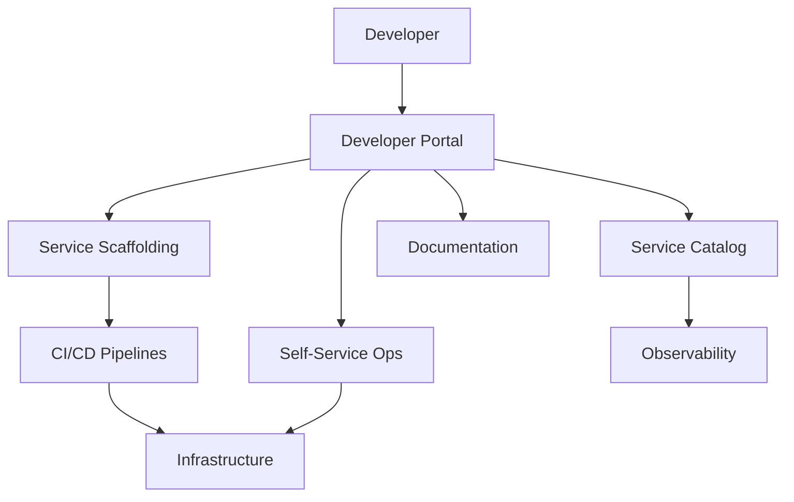

# 🏗️ Internal Developer Platform Architecture

  

---

## 🎯 1. Overview

{Company}'s Internal Developer Platform (IDP) is the integrated set of tools, services, and self-service workflows that enable engineering teams to build, deploy, and operate software without filing tickets or waiting on platform teams. The IDP reduces cognitive load by providing golden paths - opinionated, supported defaults for common engineering tasks.

> **Rule:** The IDP must enable a new engineer to deploy a production-ready service within their first day. Any workflow that requires a support ticket to a platform team is a gap in the IDP.

**Visual overview:**

---

## 🧩 2. Platform Layers

| Layer | Responsibility | Key Components |
|-------|---------------|----------------|
| **Developer portal** | Single entry point for all platform capabilities | Backstage (or equivalent), service catalog, docs |
| **Service scaffolding** | Generate new services from approved templates | Golden path templates, cookiecutters |
| **CI/CD** | Build, test, and deploy automation | GitHub Actions, ArgoCD, image registry |
| **Infrastructure** | Provisioning and management of cloud resources | Terraform modules, Kubernetes operators |
| **Observability** | Metrics, logs, traces, and alerting | Prometheus, Grafana, OpenTelemetry, PagerDuty |
| **Security** | Scanning, secrets, identity, and compliance | SAST/SCA, Vault, IAM, policy-as-code |

---

## 📐 3. Developer Portal Standards

The developer portal is the front door to the IDP. Every platform capability must be discoverable through the portal.

| Requirement | Standard |
|-------------|----------|
| **Service catalog** | Every production service registered with owner, tier, dependencies, and SLOs |
| **Template catalog** | All golden path templates browsable and launchable from the portal |
| **API catalog** | All APIs registered with OpenAPI specs, ownership, and status |
| **Documentation** | TechDocs published alongside the components they document |
| **Scorecards** | Service health scorecards covering CI, security, observability compliance |
| **Search** | Full-text search across all catalog entities and documentation |

> **Rule:** Services not registered in the developer portal are not considered production services. Registration is mandatory.

---

## 🛤️ 4. Golden Path Requirements

| Requirement | Standard |
|-------------|----------|
| **Language coverage** | Templates for every approved language in the tech stack |
| **CI/CD included** | Every template ships with a working CI/CD pipeline |
| **Observability baked in** | Metrics, structured logging, and health endpoints from day one |
| **Security defaults** | SAST/SCA scanning, secrets management, and dependency checking |
| **Documentation** | README, ADR template, and runbook template included |
| **Time to deploy** | New service deployable to staging in under 30 minutes |

---

## 📊 5. Platform Metrics

| Metric | Target | Measurement |
|--------|--------|-------------|
| Golden path adoption | > 90% of new services | Template usage vs total new services |
| Time to first deploy | < 4 hours for new services | Scaffolding to first staging deploy |
| Developer satisfaction | > 4.0 / 5.0 | Quarterly developer survey |
| Self-service completion rate | > 80% | Workflows completed without platform team help |
| Portal monthly active users | > 80% of engineers | Portal analytics |
| Catalog completeness | 100% of production services registered | Automated scan |

---

## 🔄 6. Platform Team Model

| Principle | Description |
|-----------|-------------|
| **Product mindset** | The platform is a product; engineers are the customers |
| **Paved roads, not gates** | Make the right thing easy, not the wrong thing impossible |
| **Measure adoption** | Track usage, not just availability |
| **Feedback loops** | Quarterly roadmap driven by developer survey results |
| **On-call for platform** | Platform team has its own on-call rotation for platform outages |

---

## 🔗 7. Cross-References

- [Maturity Model](./01-maturity-model.md) - Organizational maturity assessment including platform capabilities
- [Engineering KPIs](./07-engineering-kpis.md) - Platform adoption and developer satisfaction metrics

---

⬅️ [Back to section](./README.md) · 🏠 [Back to root](../README.md)

