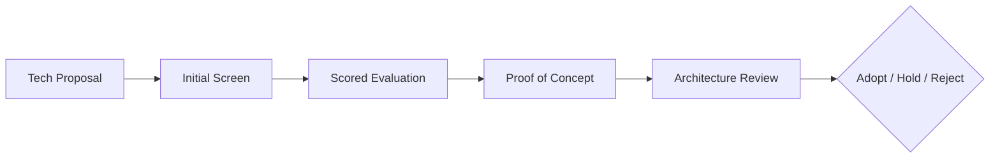

# 🔬 Technology Evaluation Framework

  

---

## 🎯 1. Overview

Every technology adoption decision at {Company} must follow a structured evaluation process. This framework prevents decision-by-hype and ensures that new technologies are assessed against consistent criteria - technical fit, total cost of ownership, team capability, and strategic alignment.

> **Rule:** No technology may enter the "Adopt" ring of the technology radar without completing a scored evaluation using this framework.

**Visual overview:**

---

## 📋 2. Evaluation Criteria

| Criterion | Weight | Description |
|-----------|--------|-------------|
| **Technical fit** | 25% | Does it solve the problem better than alternatives? |
| **Maturity** | 15% | Community size, release cadence, production adoption in industry |
| **Total cost of ownership** | 20% | Licensing, infrastructure, training, maintenance over 3 years |
| **Team capability** | 15% | Can the team adopt this within 90 days? Training needed? |
| **Security posture** | 10% | Vulnerability history, compliance certifications, data handling |
| **Vendor risk** | 10% | Single vendor lock-in, exit strategy, open-source alternative |
| **Strategic alignment** | 5% | Does it align with {Company}'s technology strategy and roadmap? |

---

## 📊 3. Scoring Model

Each criterion is scored on a 1 - 5 scale.

| Score | Meaning |
|-------|---------|
| **5** | Excellent - clearly superior to alternatives |
| **4** | Good - strong fit with minor gaps |
| **3** | Adequate - meets minimum requirements |
| **2** | Weak - significant gaps or risks |
| **1** | Poor - does not meet requirements |

**Weighted total score thresholds:**

| Score Range | Outcome |
|-------------|---------|
| 4.0 - 5.0 | Recommend adoption - proceed to PoC |
| 3.0 - 3.9 | Conditional - address gaps before PoC |
| Below 3.0 | Reject - document rationale for future reference |

---

## 🧪 4. Proof of Concept Requirements

Every technology that passes scoring must complete a time-boxed PoC before production adoption.

| Requirement | Standard |
|-------------|----------|
| **Duration** | Maximum 4 weeks |
| **Scope** | One real use case, not a synthetic benchmark |
| **Success criteria** | Defined before PoC starts, measurable outcomes |
| **Team** | 1 - 2 engineers, not the entire team |
| **Documentation** | PoC results documented in an ADR |
| **Exit plan** | Clear plan for reverting if PoC fails |

> **Rule:** PoC results must be presented to the architecture review board before technology enters production.

---

## 🚫 5. Evaluation Anti-Patterns

| Anti-Pattern | Risk | Mitigation |
|-------------|------|------------|
| **Resume-driven development** | Teams adopt tech for career reasons | Require business justification tied to a real problem |
| **Vendor demo bias** | Vendor demos do not reflect production reality | PoC must use {Company}'s data and infrastructure |
| **Majority-of-one** | Single advocate pushes adoption | Require at least 2 independent evaluators |
| **Sunk cost** | PoC investment pressures production adoption | PoC failure is a valid and expected outcome |
| **Skipping evaluation** | "Everyone uses it" bypasses rigor | No exceptions to the evaluation process |

---

## 📅 6. Process Cadence

| Activity | Cadence | Owner |
|----------|---------|-------|
| New technology proposals | Anytime via RFC | Any engineer |
| Evaluation scoring | Within 2 weeks of proposal | CTO Office + proposing team |
| PoC execution | Time-boxed to 4 weeks | Proposing team |
| Architecture review | Monthly ARB meeting | Architecture Review Board |
| Technology radar update | Quarterly | CTO Office |

---

## 🔗 7. Cross-References

- [Vendor Assessment](./03-vendor-assessment.md) - Vendor evaluation criteria and process
- [Vendor Intake](./05-vendor-intake.md) - Vendor onboarding and procurement workflow
- [Engineering KPIs](./07-engineering-kpis.md) - Platform adoption metrics

---

⬅️ [Back to section](./README.md) · 🏠 [Back to root](../README.md)

