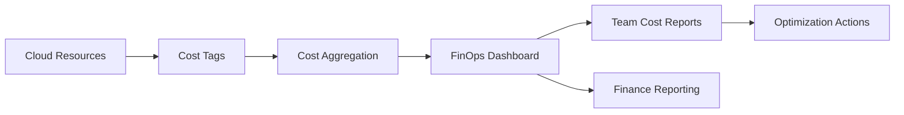

# 💳 Cost Allocation and Chargeback Model

  

---

## 🎯 1. Overview

{Company} allocates cloud and infrastructure costs to the teams that consume them. Cost allocation creates accountability, enables informed architectural decisions, and prevents the tragedy of the commons where shared infrastructure costs grow without ownership.

> **Rule:** 100% of cloud spend must be attributable to a team and cost center. Untagged resources are escalated to the owning VP within 7 days.

**Visual overview:**

---

## 🏷️ 2. Tagging Standards

Every cloud resource must carry these mandatory tags.

| Tag Key | Description | Example |
|---------|-------------|---------|
| `team` | Owning engineering team | `payments-team` |
| `service` | Service or application name | `payment-gateway` |
| `environment` | Deployment environment | `production`, `staging`, `dev` |
| `cost_center` | Finance cost center code | `eng-payments` |
| `tier` | Service criticality tier | `tier-1`, `tier-2`, `tier-3` |

Optional but recommended:

| Tag Key | Description | Example |
|---------|-------------|---------|
| `project` | Business initiative or project code | `checkout-redesign` |
| `managed_by` | IaC tool managing the resource | `terraform`, `pulumi` |

> **Rule:** CI/CD pipelines must validate that all mandatory tags are present before provisioning resources. Untagged resource creation is blocked.

---

## 📊 3. Allocation Model

| Cost Category | Allocation Method |
|--------------|-------------------|
| **Direct compute** (containers, VMs) | Attributed to owning team via `team` tag |
| **Managed databases** | Attributed to owning team via `service` tag |
| **Shared platform** (CI/CD, observability, IDP) | Allocated proportionally by team headcount |
| **Networking** (load balancers, NAT, egress) | Allocated proportionally by traffic volume |
| **AI/ML workloads** | Attributed to owning team via LLM gateway and training job tags |
| **Licensing** (SaaS tools, vendor contracts) | Attributed to teams with active seats or usage |

---

## 📈 4. Reporting Cadence

| Report | Cadence | Audience | Content |
|--------|---------|----------|---------|
| Team cost summary | Weekly (automated) | Team leads | Spend vs budget, top cost drivers, trend |
| Service-level breakdown | Monthly | Engineering managers | Per-service cost, unit economics |
| Organization rollup | Monthly | VP Engineering, CTO | Total spend, budget variance, forecasts |
| Anomaly alerts | Real-time | Team leads + FinOps | Spend spikes > 20% above trailing average |

---

## 💡 5. Chargeback vs Showback

| Model | Description | When to Use |
|-------|-------------|-------------|
| **Showback** | Teams see their costs but are not financially charged | Default for most teams - drives awareness |
| **Chargeback** | Costs deducted from team's engineering budget | Teams exceeding budget or shared platform consumers |

> **Rule:** {Company} defaults to showback. Chargeback is activated only for teams that exceed their budget for two consecutive months without an approved optimization plan.

---

## 🚫 6. Anti-Patterns

| Anti-Pattern | Risk | Mitigation |
|-------------|------|------------|
| **Untagged resources** | Costs are unattributable, nobody optimizes | Block untagged resource creation in CI/CD |
| **Shared account sprawl** | Costs lumped into catch-all accounts | Enforce per-team account or namespace isolation |
| **Ignoring dev/staging** | Non-production costs grow unchecked | Apply same tagging and budgets to all environments |
| **Annual budgeting only** | No mid-year correction possible | Monthly budget reviews with quarterly reforecasting |
| **Cost hoarding** | Teams over-provision to protect budget | Right-sizing recommendations with automated alerts |

---

## 🔗 7. Cross-References

- [FinOps](../04-infrastructure-and-cloud/05-finops.md) - Cloud cost management and optimization practices
- [Engineering KPIs](./07-engineering-kpis.md) - Cost-related engineering metrics

---

⬅️ [Back to section](./README.md) · 🏠 [Back to root](../README.md)

