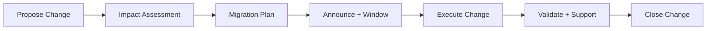

# 🔄 Change Management for Platform Changes

  

---

## 🎯 1. Overview

Platform-wide changes - shared library upgrades, infrastructure migrations, API deprecations, and tooling replacements - affect every engineering team. Without structured change management, these changes cause unplanned work, broken builds, and eroded trust in the platform. This document defines how {Company} plans, communicates, and executes platform changes.

> **Rule:** Every platform change that affects more than one team must follow this change management process. No exceptions for "small" changes.

**Visual overview:**

---

## 📋 2. Change Classification

| Class | Scope | Lead Time | Approval |
|-------|-------|-----------|----------|
| **Standard** | Routine, pre-approved changes (dependency patches, config updates) | 1 business day | Automated |
| **Normal** | Changes affecting 2 - 5 teams (library upgrades, API changes) | 2 weeks | Platform lead |
| **Major** | Changes affecting all teams (framework migration, infra platform swap) | 6 weeks | VP Engineering |
| **Emergency** | Urgent security patches or outage-driven changes | Immediate | Incident commander |

---

## 📐 3. Change Process

### Impact Assessment

| Dimension | Questions to Answer |
|-----------|-------------------|
| **Blast radius** | How many teams, services, and pipelines are affected? |
| **Breaking changes** | Does this change break existing interfaces, APIs, or workflows? |
| **Migration effort** | How much work does each consuming team need to do? |
| **Rollback plan** | Can the change be reversed if problems are discovered? |
| **Timeline** | How long do teams have to adopt the change? |

### Migration Plan Requirements

| Element | Description |
|---------|-------------|
| **Coexistence period** | Old and new must coexist for a defined window |
| **Migration guide** | Step-by-step instructions for consuming teams |
| **Automated migration** | Provide codemods, scripts, or PRs where possible |
| **Support channel** | Dedicated Slack channel for migration questions |
| **Progress tracking** | Dashboard showing migration status per team |

> **Rule:** For major changes, the platform team must provide automated migration tooling. Asking 50 teams to manually update is not acceptable.

---

## 📢 4. Communication Standards

| When | Channel | Content |
|------|---------|---------|
| **Announcement** | Engineering-wide Slack + email | What is changing, why, timeline, and impact |
| **Weekly updates** | Migration Slack channel | Progress, blockers, deadline reminders |
| **Breaking change warnings** | CI/CD pipeline warnings | Deprecation notices in build output |
| **Completion** | Engineering-wide Slack | Migration complete, old path removed, thanks |

---

## 📊 5. Metrics

| Metric | Target | Measurement |
|--------|--------|-------------|
| Migration completion rate | 100% by deadline | Dashboard tracking per-team status |
| Average migration time per team | < 2 days for normal changes | Time from announcement to team completion |
| Rollback rate | < 5% of changes | Changes requiring rollback after execution |
| Support ticket volume | Trending downward | Questions in migration support channel |
| Breaking build rate | 0% | CI failures caused by platform changes |

---

## 🚫 6. Anti-Patterns

| Anti-Pattern | Risk | Mitigation |
|-------------|------|------------|
| **Big bang migration** | All teams forced to migrate simultaneously | Coexistence window with gradual adoption |
| **Silent deprecation** | Removing capabilities without notice | Minimum 30-day deprecation notice |
| **Manual migration** | Inconsistent adoption, wasted team time | Provide automated tooling and codemods |
| **No rollback plan** | Unable to revert if change causes issues | Every change must have a documented rollback |
| **Ignoring stragglers** | Teams that miss the deadline cause long-tail support burden | Escalation path for teams past deadline |

---

## 🔗 7. Cross-References

- [Migration Roadmap](./02-migration-roadmap.md) - Long-term platform migration planning
- [Adoption Guide](./06-adoption-guide.md) - Patterns for driving platform adoption

---

⬅️ [Back to section](./README.md) · 🏠 [Back to root](../README.md)

