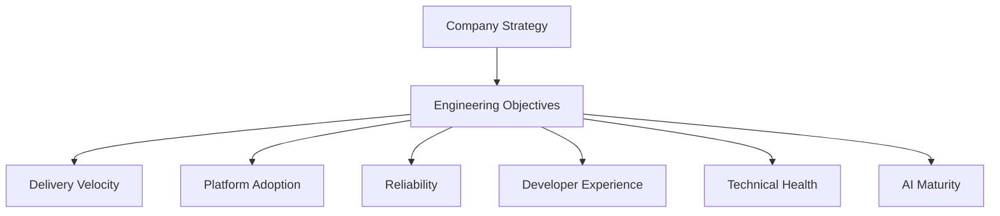

# 🎯 Engineering OKR Framework

  

---

## 🎯 1. Overview

Objectives and Key Results (OKRs) align engineering work with {Company}'s strategic goals. This framework defines how engineering teams set, track, and evaluate OKRs. OKRs are not a performance management tool - they are an alignment and focus mechanism.

> **Rule:** OKRs measure outcomes, not output. "Deploy 5 microservices" is output. "Reduce order processing latency by 30%" is an outcome.

---

## 📐 2. OKR Structure

| Component | Definition | Example |
|-----------|-----------|---------|
| **Objective** | Qualitative goal describing what you want to achieve | Deliver a world-class developer experience |
| **Key Result** | Quantitative measure of progress toward the objective | Developer satisfaction score increases from 3.5 to 4.2 |

### Rules for Good OKRs

| Rule | Description |
|------|-------------|
| **3 - 5 objectives per team** | More than 5 means no focus |
| **2 - 4 key results per objective** | Enough to validate progress, not so many that tracking is burdensome |
| **Measurable key results** | Every key result has a number: percentage, count, score, or time |
| **Ambitious but achievable** | Target 70% achievement - 100% means the target was too easy |
| **Time-bound** | Quarterly by default, annual for strategic objectives |

---

## 📅 3. OKR Cadence

| Activity | Timing | Participants |
|----------|--------|-------------|
| **Annual objectives** | December (for next year) | CTO + VP Engineering + Engineering Directors |
| **Quarterly OKR setting** | First 2 weeks of quarter | Engineering managers + team leads |
| **Mid-quarter check-in** | Week 6 of quarter | Team leads + engineering managers |
| **End-of-quarter scoring** | Last week of quarter | Teams self-score, managers review |
| **Retrospective** | First week of next quarter | Teams reflect on what worked and what to adjust |

---

## 📊 4. Scoring Model

Key results are scored on a 0.0 - 1.0 scale at the end of each quarter.

| Score | Meaning |
|-------|---------|
| **0.0 - 0.3** | No meaningful progress - KR was too ambitious or deprioritized |
| **0.4 - 0.6** | Significant progress but did not hit the target |
| **0.7 - 0.8** | Target range - strong delivery with appropriate stretch |
| **0.9 - 1.0** | Exceeded expectations - consider whether the target was ambitious enough |

> **Rule:** OKR scores are never used in performance reviews or compensation decisions. They measure team alignment, not individual performance.

---

## 🏗️ 5. Engineering OKR Categories

| Category | Focus Area | Example Key Results |
|----------|-----------|-------------------|
| **Delivery velocity** | Speed and reliability of software delivery | Deployment frequency increases to 5x/day per team |
| **Platform adoption** | Usage of platform capabilities | Golden path adoption reaches 95% of new services |
| **Reliability** | System uptime and incident response | P1 MTTR decreases from 2 hours to 45 minutes |
| **Developer experience** | Engineering productivity and satisfaction | CI build time (p95) decreases from 12 to 6 minutes |
| **Technical health** | Debt reduction and modernization | Critical tech debt items reduced from 45 to 15 |
| **AI maturity** | AI integration across engineering | 80% of teams at AI-native SDLC maturity L2+ |

**Visual overview:**

---

## 🚫 6. Anti-Patterns

| Anti-Pattern | Risk | Mitigation |
|-------------|------|------------|
| **Output OKRs** | Measuring activity instead of impact | Every KR must describe a measurable outcome |
| **Too many OKRs** | Loss of focus, tracking becomes a burden | Maximum 5 objectives per team |
| **Set and forget** | OKRs written in January, ignored until March | Mid-quarter check-ins are mandatory |
| **Sandbagging** | Setting easy targets to guarantee 1.0 scores | Target 0.7 achievement - stretch is expected |
| **Cascading mandates** | Top-down OKRs with no team input | Teams co-create OKRs aligned to org objectives |

---

## 🔗 7. Cross-References

- [Engineering KPIs](./07-engineering-kpis.md) - DORA metrics and platform adoption KPIs
- [Engineering Metrics](./04-engineering-metrics.md) - Detailed metric definitions and collection methods

---

⬅️ [Back to section](./README.md) · 🏠 [Back to root](../README.md)

