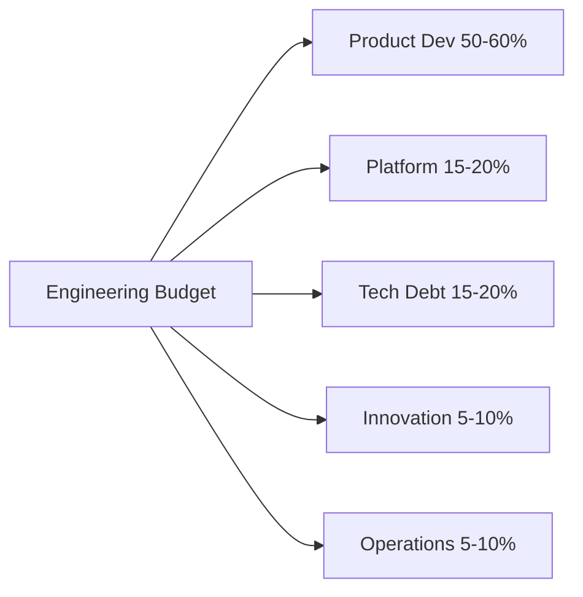

# 💰 Engineering Budget and Capacity Planning

  

---

## 🎯 1. Overview

Engineering budget and capacity planning ensures that {Company} invests engineering resources where they create the most value. This document defines how engineering budgets are structured, how capacity is allocated across work types, and how spending is tracked and adjusted throughout the year.

> **Rule:** Every engineering investment must be traceable to a business objective, platform improvement, or risk reduction. Unattributable spend is not acceptable.

---

## 📊 2. Budget Categories

| Category | Description | Typical Allocation |
|----------|-------------|-------------------|
| **Product development** | Features and capabilities for customers | 50 - 60% |
| **Platform and infrastructure** | Internal tools, IDP, shared services | 15 - 20% |
| **Technical debt** | Remediation, modernization, migrations | 15 - 20% |
| **Innovation and exploration** | Prototypes, PoCs, hack weeks | 5 - 10% |
| **Operational overhead** | On-call, support, compliance | 5 - 10% |

**Visual overview:**

---

## 📐 3. Capacity Planning Process

| Phase | Timing | Activities |
|-------|--------|-----------|
| **Annual planning** | November - December | Set annual budget, define strategic themes, allocate headcount |
| **Quarterly refinement** | First 2 weeks of each quarter | Adjust allocations based on actuals and changing priorities |
| **Sprint-level allocation** | Every sprint | Team leads ensure sprint mix matches quarterly targets |
| **Monthly review** | Monthly | Engineering managers review burn rate vs plan |

---

## 📋 4. Headcount and Vendor Budget

### Headcount Planning

| Input | Description |
|-------|-------------|
| **Current team size** | Existing headcount by team |
| **Attrition forecast** | Expected turnover based on historical rates |
| **Growth targets** | New headcount aligned to strategic priorities |
| **Contractor vs FTE** | Maximum 20% contractor ratio per team |

### Vendor and Tooling Budget

| Category | Approval |
|----------|----------|
| < $5,000/year | Team lead |
| $5,000 - $50,000/year | Engineering manager |
| $50,000 - $250,000/year | VP Engineering |
| > $250,000/year | CTO + Finance |

> **Rule:** All vendor contracts above $50,000/year must go through the vendor assessment process. See [Vendor Assessment](./03-vendor-assessment.md).

---

## 📈 5. Tracking and Reporting

| Report | Cadence | Audience |
|--------|---------|----------|
| Cloud spend vs budget | Weekly (automated) | Team leads, FinOps |
| Engineering capacity utilization | Biweekly | Engineering managers |
| Budget variance analysis | Monthly | VP Engineering, Finance |
| Quarterly business review | Quarterly | CTO, CFO, CEO |

### Key Metrics

| Metric | Target |
|--------|--------|
| Budget variance | Within +/- 10% of plan |
| Product vs platform ratio | Aligned to quarterly targets |
| Tech debt allocation | >= 20% of capacity |
| Innovation allocation | >= 5% of capacity |
| Unplanned work ratio | < 15% of total capacity |

---

## 🚫 6. Anti-Patterns

| Anti-Pattern | Risk | Mitigation |
|-------------|------|------------|
| **All product, no platform** | Platform decays, velocity drops | Enforce minimum platform and debt allocations |
| **Use it or lose it** | Wasteful end-of-quarter spending | Budget rolls forward within fiscal year |
| **Hero budgeting** | One leader controls all investment | Budget decisions made collaboratively with transparent criteria |
| **No mid-year adjustment** | Budget disconnected from reality | Quarterly refinement with reforecasting |
| **Invisible contractor spend** | Contractor costs not tracked against budget | Contractors tagged to teams and cost centers |

---

## 🔗 7. Cross-References

- [Vendor Assessment](./03-vendor-assessment.md) - Vendor evaluation criteria and procurement process
- [Engineering KPIs](./07-engineering-kpis.md) - Engineering effectiveness metrics
- [Maturity Model](./01-maturity-model.md) - Organizational maturity assessment

---

⬅️ [Back to section](./README.md) · 🏠 [Back to root](../README.md)

