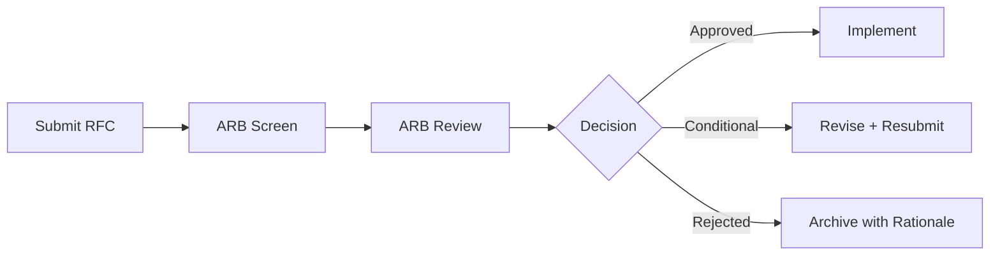

# 🏛️ Architecture Governance

  

---

## 🎯 1. Overview

Architecture governance at {Company} ensures that technical decisions are consistent, aligned with organizational strategy, and made with appropriate rigor. The Architecture Review Board (ARB) is the governing body for cross-cutting architectural decisions. It is not a gate that slows teams - it is a forum that prevents costly mistakes and promotes knowledge sharing.

> **Rule:** Any technical decision with cross-team impact, new technology adoption, or significant infrastructure cost must be reviewed by the ARB before implementation.

---

## 🏗️ 2. Architecture Review Board

### Composition

| Role | Responsibility |
|------|---------------|
| **Chair** | CTO or VP Engineering - sets agenda, facilitates decisions |
| **Standing members** | Principal engineers, staff engineers, platform leads (5 - 7 people) |
| **Rotating members** | One representative from each product domain (quarterly rotation) |
| **Invited experts** | Subject matter experts relevant to the topic under review |

### Meeting Cadence

| Meeting | Frequency | Purpose |
|---------|-----------|---------|
| **ARB review** | Biweekly | Review submitted RFCs and architectural proposals |
| **Architecture sync** | Monthly | Cross-team alignment, pattern sharing, debt review |
| **Strategy review** | Quarterly | Technology strategy alignment with business goals |

---

## 📐 3. What Requires ARB Review

| Trigger | Examples |
|---------|---------|
| **New technology adoption** | New database, framework, or cloud service |
| **Cross-service API changes** | New shared contracts, breaking changes |
| **Data architecture changes** | New data stores, schema migrations affecting multiple services |
| **Infrastructure changes** | New cloud regions, platform component replacements |
| **Security architecture** | New auth patterns, encryption changes, network topology |
| **Cost above threshold** | Any change adding > $10,000/month in recurring cost |

### What Does NOT Require ARB Review

| Category | Examples |
|----------|---------|
| Team-internal implementation | Refactoring within a single service |
| Approved technology usage | Using a technology already on the "Adopt" ring |
| Bug fixes and patches | Non-architectural code changes |
| Configuration changes | Feature flags, environment variables |

---

## 📋 4. Review Process

**Visual overview:**

| Step | Timeline | Owner |
|------|----------|-------|
| Submit RFC to ARB backlog | Anytime | Proposing engineer |
| ARB screens for scope and completeness | Within 3 business days | ARB chair |
| Full review at next ARB meeting | Within 2 weeks of submission | ARB |
| Decision communicated | Same day as review | ARB chair |
| ADR published | Within 1 week of approval | Proposing engineer |

---

## 📊 5. Decision Outcomes

| Outcome | Meaning |
|---------|---------|
| **Approved** | Proceed with implementation as proposed |
| **Approved with conditions** | Proceed after addressing specific feedback |
| **Deferred** | Needs more information or broader consultation |
| **Rejected** | Not aligned with strategy or standards - rationale documented |

> **Rule:** Every ARB decision must be documented as an Architecture Decision Record (ADR). The ADR captures context, options considered, decision, and consequences.

---

## 🚫 6. Anti-Patterns

| Anti-Pattern | Risk | Mitigation |
|-------------|------|------------|
| **Ivory tower ARB** | Disconnected from team reality | Rotating members from product teams |
| **Rubber stamping** | Reviews lack rigor | Structured review criteria and scoring |
| **ARB as bottleneck** | Teams wait weeks for decisions | 2-week maximum turnaround, async pre-review |
| **Decision without enforcement** | Approved patterns ignored | Automated compliance checks where possible |
| **Skipping the ARB** | Inconsistent architecture decisions | CI guardrails for technology detection |

---

## 🔗 7. Cross-References

- [Maturity Model](./01-maturity-model.md) - Architecture maturity dimensions
- [Engineering Metrics](./04-engineering-metrics.md) - Architecture compliance metrics

---

⬅️ [Back to section](./README.md) · 🏠 [Back to root](../README.md)

