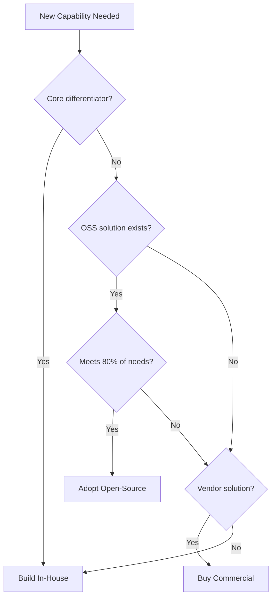

# ⚖️ Build vs Buy vs Open-Source Framework

  

---

## 🎯 1. Overview

Every significant engineering investment requires a deliberate choice between building in-house, buying a commercial product, or adopting an open-source solution. At {Company}, the default is **buy or adopt** unless the capability is a core differentiator. This framework structures the decision to prevent over-building commodity capabilities and under-investing in strategic ones.

> **Rule:** Build only what differentiates. Buy or adopt everything else. If you are building a logging pipeline, an auth system, or a CI server, you are likely building the wrong thing.

---

## 📐 2. Decision Framework

**Visual overview:**

### Decision Criteria

| Question | Build Signal | Buy/Adopt Signal |
|----------|-------------|-----------------|
| Is this a core differentiator? | Yes - this is why customers choose us | No - commodity capability |
| Does a mature solution exist? | No - novel problem space | Yes - well-established market |
| Do we have the expertise? | Yes - deep domain knowledge in-house | No - would need to hire or learn |
| What is the maintenance burden? | Acceptable - we can sustain it | High - better outsourced |
| What is the time to value? | We can ship faster ourselves | Vendor delivers value in weeks |
| What is the total cost (3 years)? | Build is cheaper including maintenance | Buy is cheaper including licensing |

---

## 🗂️ 3. Evaluation Scoring

| Criterion | Weight | Build Score (1-5) | Buy Score (1-5) | OSS Score (1-5) |
|-----------|--------|-------------------|-----------------|-----------------|
| Strategic alignment | 25% | Rate | Rate | Rate |
| Time to value | 20% | Rate | Rate | Rate |
| Total cost (3 years) | 20% | Rate | Rate | Rate |
| Maintenance burden | 15% | Rate | Rate | Rate |
| Vendor/community risk | 10% | Rate | Rate | Rate |
| Integration complexity | 10% | Rate | Rate | Rate |

Weighted total determines the recommended path. Scores must be documented in an ADR.

---

## 💡 4. Guidelines by Category

| Category | Default | Rationale |
|----------|---------|-----------|
| **CI/CD** | Buy/Adopt | GitHub Actions, ArgoCD - commodity |
| **Observability** | Buy/Adopt | Prometheus, Grafana, Datadog - mature ecosystem |
| **Authentication** | Buy | Auth0, Okta - security-critical, commodity |
| **Feature flags** | Buy | LaunchDarkly - commodity with strong tooling |
| **Search** | Buy/Adopt | OpenSearch, Algolia - commodity |
| **Core business logic** | Build | This is your differentiator |
| **Data pipelines** | Adopt + Build | Adopt frameworks (Spark, Flink), build domain logic |
| **AI/ML platform** | Hybrid | Adopt infrastructure (SageMaker, MLflow), build domain models |

---

## ⚠️ 5. Open-Source Adoption Rules

| Rule | Rationale |
|------|-----------|
| License must be permissive (Apache 2.0, MIT, BSD) or evaluated by legal for copyleft | Avoid license compliance surprises |
| Project must have active maintenance (commits in last 90 days) | Abandoned projects become maintenance liabilities |
| Must have at least 2 viable alternatives | Prevents single-project dependency |
| Security vulnerability response time < 30 days historically | Critical for production dependencies |
| Internal owner must be assigned | Someone owns upgrades, patches, and compatibility |

---

## 🚫 6. Anti-Patterns

| Anti-Pattern | Risk | Mitigation |
|-------------|------|------------|
| **NIH syndrome** | Building commodity capabilities in-house | Default to buy; require justification to build |
| **Vendor captivity** | Deep integration with no exit plan | Every vendor contract must include an exit strategy |
| **Fork and forget** | Forking OSS and never upstreaming | Prefer contribution over forking; track forks in asset registry |
| **Build for one team** | Custom solution that only one team needs | Evaluate shared applicability before building |
| **Ignoring maintenance** | Comparing build cost to buy cost without maintenance | Always include 3-year maintenance cost |

---

## 🔗 7. Cross-References

- [Vendor Assessment](./03-vendor-assessment.md) - Vendor evaluation criteria for buy decisions
- [Vendor Intake](./05-vendor-intake.md) - Vendor onboarding and procurement process

---

⬅️ [Back to section](./README.md) · 🏠 [Back to root](../README.md)

