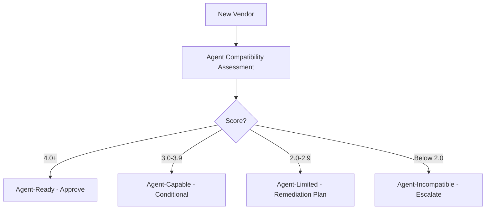

# 🔌 Vendor MCP and Agent Compatibility

  

---

## 🎯 1. Overview

As {Company} moves toward an agent-native engineering organization, every vendor tool and platform must be assessable for AI agent compatibility. Vendors that expose MCP servers, structured APIs, and machine-readable interfaces enable agent automation. Vendors that rely solely on human UIs create automation gaps and manual toil.

> **Rule:** Starting in 2026, every new vendor assessment must include an agent compatibility evaluation. Vendors without API access or agent integration capability require VP Engineering exception.

---

## 📐 2. Agent Compatibility Criteria

| Criterion | Weight | Description |
|-----------|--------|-------------|
| **API availability** | 25% | Does the vendor provide a comprehensive REST/GraphQL API? |
| **MCP server support** | 20% | Does the vendor offer an MCP server or support building one? |
| **Structured output** | 15% | Do APIs and CLIs return JSON or structured data (not just HTML/PDF)? |
| **Webhook/event support** | 15% | Can the vendor push events to {Company}'s systems? |
| **Authentication standards** | 10% | OAuth2, API keys with rotation, SAML - standard auth mechanisms |
| **Rate limiting transparency** | 10% | Published rate limits with predictable behavior |
| **Audit trail** | 5% | API calls logged and auditable by {Company} |

---

## 📊 3. Compatibility Scoring

| Score | Rating | Meaning |
|-------|--------|---------|
| 4.0 - 5.0 | **Agent-ready** | Full API coverage, MCP support, structured output |
| 3.0 - 3.9 | **Agent-capable** | Good API coverage, no MCP but buildable, minor gaps |
| 2.0 - 2.9 | **Agent-limited** | Partial API, significant functionality only in UI |
| Below 2.0 | **Agent-incompatible** | No meaningful API, UI-only workflow |

**Visual overview:**

---

## 📋 4. Assessment Process

| Step | Owner | Timeline |
|------|-------|----------|
| Include agent compatibility in vendor RFP | Procurement + AI Platform | At RFP creation |
| Vendor completes self-assessment questionnaire | Vendor | 2 weeks |
| AI Platform validates claims with technical PoC | AI Platform engineer | 1 - 2 weeks |
| Score and document in vendor assessment record | AI Platform | Within 1 week of PoC |
| Present findings to architecture review | AI Platform | Next ARB meeting |

---

## 🔍 5. Vendor Self-Assessment Questions

| Question | Expected Answer |
|----------|----------------|
| What percentage of product functionality is accessible via API? | > 90% for agent-ready |
| Do you offer an MCP server or plan to within 12 months? | Yes / roadmap required |
| Can all admin and configuration tasks be done via API? | Yes |
| What is your API rate limit and can it be increased? | Published limits, enterprise tier available |
| Do you support OAuth2 or API key authentication with rotation? | Yes |
| Can we receive webhook events for state changes? | Yes |
| Is your API versioned with a deprecation policy? | Yes, minimum 12-month deprecation notice |
| Can we access audit logs programmatically? | Yes |

---

## 🔒 6. Contractual Requirements

| Requirement | Rationale |
|-------------|-----------|
| API access included in license at no additional cost | Prevents API access being a premium upsell |
| Minimum 12-month API deprecation notice | Prevents breaking agent integrations without notice |
| SLA for API availability (99.9%+) | Agent workflows depend on vendor API uptime |
| Data export capability via API | Prevents vendor lock-in |
| No prohibition on automated/agent access | Some vendors prohibit "bot" access in ToS |

> **Rule:** Vendor contracts must explicitly permit agent-driven API access. Terms of service that prohibit automated access are a deal-breaker.

---

## 🔗 7. Cross-References

- [Vendor Assessment](./03-vendor-assessment.md) - General vendor evaluation criteria and scoring
- [Vendor Intake](./05-vendor-intake.md) - Vendor onboarding and procurement workflow

---

⬅️ [Back to section](./README.md) · 🏠 [Back to root](../README.md)

