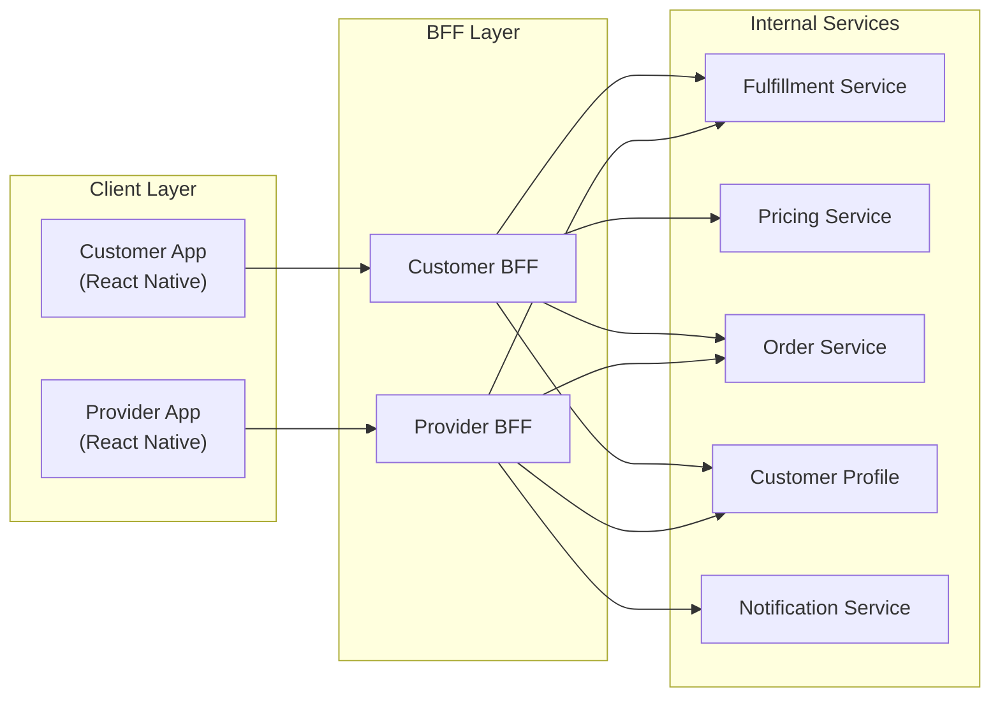
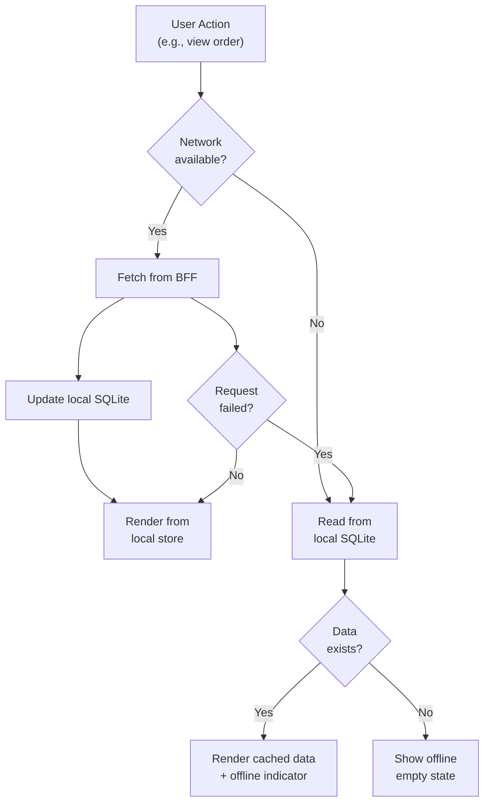
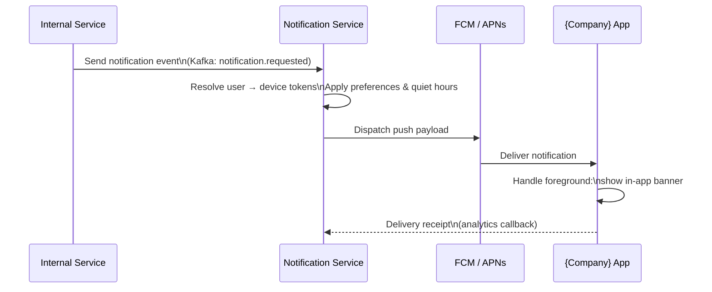
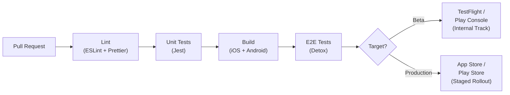
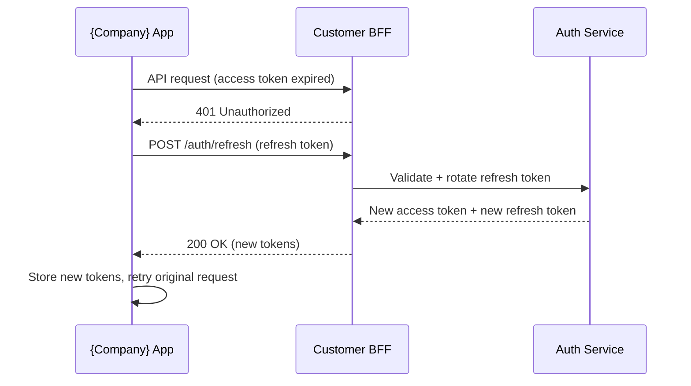

# 📱 Mobile Standards

  

---

## 📑 Table of Contents

1. [Philosophy](#1-philosophy)
2. [Mobile Tech Stack](#2-mobile-tech-stack)
3. [BFF Pattern for Mobile](#3-bff-pattern-for-mobile)
4. [API Contract Patterns](#4-api-contract-patterns)
5. [Offline-First Design](#5-offline-first-design)
6. [Push Notification Standards](#6-push-notification-standards)
7. [Performance Budgets](#7-performance-budgets)
8. [App Versioning](#8-app-versioning)
9. [Deep Linking](#9-deep-linking)
10. [Accessibility](#10-accessibility)
11. [Mobile CI/CD](#11-mobile-cicd)
12. [Error Handling UX](#12-error-handling-ux)
13. [App Store Compliance](#13-app-store-compliance)
14. [Authentication Lifecycle](#14-authentication-lifecycle)
15. [Certificate Pinning](#15-certificate-pinning)
16. [Android-Specific Monitoring](#16-android-specific-monitoring)
17. [Native Binary Size](#17-native-binary-size)
18. [Feature Parity](#18-feature-parity)

---

## 💡 1. Philosophy

Mobile apps **are** the product for {Company} customers and providers. Every interaction - placing an order, tracking a delivery, completing a transaction - happens on a phone in variable network conditions, in bright sunlight, on the move. There is no second chance to make a good impression.

**Guiding principles:**

- **Performance is a feature.** A laggy app is a broken app. Every millisecond matters when a customer is waiting or a provider is fulfilling an order.
- **Reliability is non-negotiable.** The app must work on slow 3G connections, in underground parking, and during network transitions. Offline-first is the default posture.
- **Accessibility is mandatory.** {Company} serves diverse populations. RTL, screen readers, and WCAG compliance are first-class concerns.
- **Battery and data are sacred resources.** Background work, polling, and large payloads directly impact our users' daily lives.

---

## 🛠️ 2. Mobile Tech Stack

| Layer | Technology | Rationale |
|-------|-----------|-----------|
| **Framework** | React Native | Cross-platform delivery with native escape hatches |
| **Language** | TypeScript (strict mode) | Type safety across the entire client codebase |
| **State Management** | Zustand | Lightweight, predictable, minimal boilerplate |
| **Navigation** | React Navigation | De facto standard, deep linking support |
| **Networking** | Axios + TanStack Query | Caching, retries, and background refetch |
| **Local Storage** | SQLite (via `react-native-quick-sqlite`) | Offline data persistence |
| **Maps** | Mapbox GL | Custom styling, regional coverage, offline tiles |
| **Unit Testing** | Jest | Fast, well-integrated with React Native |
| **E2E Testing** | Detox | Grey-box testing on real simulators/emulators |
| **Crash Reporting** | Firebase Crashlytics | Real-time crash analytics |

**Native modules** are permitted when React Native bridges are insufficient (e.g., background location tracking, Bluetooth beacons). All native modules must be wrapped in a TypeScript interface so they can be mocked in tests.

---

## 🔗 3. BFF Pattern for Mobile

Each mobile client has a dedicated **Backend-for-Frontend (BFF)** that acts as its API gateway. The BFF is owned by the mobile team and exists to serve the mobile client's exact needs. BFFs use the primary backend framework per the approved tech stack (see [`01-platform-standards/01-tech-stack.md`](../01-platform-standards/01-tech-stack.md)).

### Architecture



### BFF Responsibilities

| Responsibility | Example |
|---------------|---------|
| **Response shaping** | Combine order + provider + vehicle into a single `OrderDetailView` payload |
| **Aggregation** | Fetch price estimate + dynamic pricing + ETA in a single request |
| **Caching** | Cache service-type lists (TTL 5 min) so the app doesn't re-fetch on every launch |
| **Authentication** | Validate JWT, attach user context to downstream calls |
| **Platform adaptation** | Return different image resolutions for iOS vs Android |

### BFF Anti-Patterns

- **Business logic in the BFF.** The BFF shapes data; it does not compute prices, match customers, or manage orders.
- **Shared BFF across clients.** Customer and Provider have different needs. A shared BFF becomes a monolith.
- **Direct database access.** BFFs call services, never databases.
- **Excessive orchestration.** If a BFF call fans out to more than 4 internal services, the downstream services may need to provide a composite API.

### Splitting an Overgrown BFF

When a BFF exceeds ~50 endpoints or is maintained by more than two teams, split by domain:

| Before | After |
|--------|-------|
| Customer BFF (monolith) | Customer Order BFF, Customer Payment BFF, Customer Profile BFF |

Each sub-BFF owns a URL prefix (`/orders/*`, `/payments/*`, `/profile/*`) and is independently deployable. An API gateway (Kong) routes traffic to the correct sub-BFF.

---

## 📄 4. API Contract Patterns

### Sparse Fieldsets

Mobile screens rarely need every field. BFF endpoints support a `fields` query parameter:

```
GET /v1/orders/current?fields=id,status,provider.name,provider.vehicle,eta
```

The BFF only fetches and returns the requested fields, reducing payload size and downstream load.

### Response Compression

All BFF responses use **gzip** compression (`Content-Encoding: gzip`). Typical payload reduction: 60–80%.

### Minimal Payloads

- Timestamps: ISO 8601 strings, not epoch + timezone objects.
- Coordinates: `[lng, lat]` arrays, not `{ longitude, latitude }` objects.
- Enums: Short string codes (`"ECO"`, `"CMF"`, `"PRM"`), not full words.
- Images: Return CDN URLs with width/height hints; never inline base64.

### Cursor-Based Pagination

All list endpoints use cursor-based pagination - never offset-based:

```json
{
  "data": [ ... ],
  "cursor": {
    "next": "eyJpZCI6MTAwfQ==",
    "hasMore": true
  }
}
```

Cursors are opaque, base64-encoded tokens. The client passes `?cursor=<token>` to fetch the next page. This ensures stable pagination even when new data is inserted.

### Cache-Control Headers

| Resource | Cache-Control | Rationale |
|----------|--------------|-----------|
| Service types | `max-age=300` | Rarely changes |
| Order history | `max-age=60` | Recent orders may update |
| Current order | `no-cache` | Always fresh |
| User profile | `max-age=120, stale-while-revalidate=60` | Moderate staleness OK |
| Price estimate | `no-store` | Time-sensitive, never cache |

---

## 📴 5. Offline-First Design

{Company} apps must remain functional when the network drops. Customers should see their current order, and providers should see their active tasks, even in tunnels or dead zones.

### Online/Offline Logic Flow



### Optimistic Updates

For write operations (e.g., rating an order, updating profile), the app applies changes locally **before** the server confirms:

1. Apply change to local state and render immediately.
2. Send request to BFF in the background.
3. If successful: no further action (local state is already correct).
4. If failed: roll back local state, show inline error, offer retry.

### Local Storage (SQLite)

| Table | Purpose | Retention |
|-------|---------|-----------|
| `orders` | Active and recent orders | 30 days |
| `provider_profile` | Cached provider info for current order | Session |
| `price_estimates` | Last price estimate per route | 10 minutes |
| `notifications` | Push notification history | 90 days |
| `user_preferences` | Saved addresses, payment defaults | Permanent |

### Conflict Resolution

{Company} uses **last-write-wins (LWW)** with server timestamps:

- Every mutable record includes an `updatedAt` (server-generated UTC timestamp).
- On sync, the client sends its local version; the server compares `updatedAt`.
- If the server version is newer, the server version wins. The client is updated.
- If the client version is newer (server was behind), the client version is accepted.
- For critical data (payments, order state), the **server is always authoritative** - no client-side conflict resolution.

### Sync on Reconnect

When network connectivity is restored:

1. The app detects reconnection via `NetInfo` listener.
2. A sync queue of pending mutations is replayed in order (FIFO).
3. Each mutation is retried with exponential backoff (max 3 attempts).
4. Stale cached data is re-fetched for the active screen.
5. A "Back online" toast confirms reconnection to the user.

---

## 🔔 6. Push Notification Standards

### Notification Flow



### FCM / APNs Integration

| Platform | Provider | Configuration |
|----------|----------|--------------|
| Android | Firebase Cloud Messaging (FCM) | Server key stored in AWS Secrets Manager |
| iOS | Apple Push Notification service (APNs) | `.p8` auth key, rotated annually |

Both providers are abstracted behind the **Notification Service**. Mobile teams never call FCM/APNs directly.

### Notification Channels

| Channel | Priority | Examples |
|---------|----------|----------|
| **Order Updates** | High | Provider assigned, provider arriving, order started, order completed |
| **Account** | Default | Payment method expiring, profile verification required |
| **Promotions** | Low | Discount codes, referral bonuses, new features |
| **Safety** | Critical | SOS confirmation, safety check-in reminder |

Android notification channels are registered at app startup and map directly to these categories, allowing users to control each independently.

### Silent Push for Data Sync

Silent pushes (content-available on iOS, data-only on Android) trigger background data sync without user-visible notifications. Use cases:

- Refresh order state when a status change occurs.
- Update price rules or service type configuration.
- Invalidate cached data on the device.

Silent pushes must not be sent more than **3 times per hour** to avoid OS throttling.

### Token Lifecycle Management

| Event | Action |
|-------|--------|
| App install / first launch | Register device token with Notification Service |
| Token refresh (FCM callback) | Update token via `PUT /v1/devices/{deviceId}` |
| User logout | Disassociate token from user (keep token for re-login) |
| App uninstall detected | Mark token as inactive after delivery failures |
| Token inactive > 30 days | Purge from token store |

---

## ⚡ 7. Performance Budgets

| Metric | Target | Measurement |
|--------|--------|-------------|
| **Cold app startup** | < 3 seconds | Time from tap to interactive home screen |
| **API response (p95)** | < 2 seconds | BFF round-trip measured at client |
| **Time to Interactive (TTI)** | < 5 seconds | First screen fully interactive after cold start |
| **JS bundle size** | < 5 MB (compressed) | Hermes bytecode bundle |
| **Scrolling frame rate** | 60 fps | No dropped frames on order list, map |
| **Memory usage** | < 300 MB | Sustained usage during active order |
| **Battery drain** | < 5% / hour active use | Measured on reference devices |

### Monitoring

- **React Native Performance** (`react-native-performance`) tracks TTI, component render times, and JS thread usage.
- **React Native DevTools** for development-time profiling (network, layout, databases).
- Custom **Datadog RUM** integration reports real-user metrics segmented by device tier, OS version, and city.
- **Performance regression CI gate:** startup time and bundle size are measured on every PR. Regressions beyond 10% block the merge.

### Reference Devices

Performance budgets are validated against these baseline devices:

| Tier | Device | OS |
|------|--------|----|
| Low-end | Samsung Galaxy A13 | Android 12 |
| Mid-range | Samsung Galaxy A54 | Android 14 |
| High-end | iPhone 13 | iOS 17 |

If a feature does not meet budgets on the low-end device, it does not ship.

---

## 🏷️ 8. App Versioning

### Minimum Supported Version

The {Company} backend enforces a **minimum supported app version**. On every API call, the BFF checks the `X-App-Version` header:

| Response | Meaning | Client Behavior |
|----------|---------|-----------------|
| `200 OK` | Version is supported | Continue normally |
| `426 Upgrade Required` | Version is deprecated | Show soft upgrade prompt |
| `403 Forbidden` (+ `FORCE_UPGRADE` code) | Version is blocked | Show blocking upgrade screen |

### Force Upgrade Flow

1. Backend returns `403` with `errorCode: "FORCE_UPGRADE"` and `storeUrl`.
2. App shows a full-screen modal: "A new version of {Company} is available. Please update to continue."
3. The CTA opens the App Store / Play Store listing.
4. The modal cannot be dismissed.

### Gradual Rollout

- **Play Console staged rollout:** 1% → 5% → 20% → 50% → 100%, with 24-hour soak at each stage.
- **TestFlight / App Store phased release:** 7-day automatic rollout (1%/day ramp for the first week).
- Rollout is paused automatically if crash rate exceeds 2x the baseline.

### Feature Flags for Mobile

Mobile features are gated by **LaunchDarkly** flags, not app versions:

```typescript
if (await ldClient.boolVariation('enable-scheduled-orders', false)) {
  showScheduledOrderUI();
}
```

This decouples feature delivery from app releases. A feature can be shipped in a binary and enabled remotely when ready.

### Over-the-Air Updates (CodePush)

| Policy | Rule |
|--------|------|
| **Allowed** | Bug fixes, copy changes, layout adjustments |
| **Not allowed** | New native modules, permission changes, navigation structure changes |
| **Rollout** | Staged: 10% → 50% → 100%, with 4-hour soak |
| **Rollback** | Automatic if crash rate > 1% on the updated cohort |
| **Mandatory vs Optional** | Critical fixes are mandatory; non-critical are optional (user can defer) |

---

## 🔗 9. Deep Linking

### URL Scheme

Internal deep links use the `{company}://` custom scheme:

| Link | Target |
|------|--------|
| `{company}://order/{orderId}` | Order detail screen |
| `{company}://request?dispatch={lat,lng}&delivery={lat,lng}` | Pre-filled order request |
| `{company}://profile` | User profile screen |
| `{company}://promo/{code}` | Apply promo code |
| `{company}://support/ticket/{ticketId}` | Support ticket detail |

### Universal Links (Sharing)

User-facing sharing uses HTTPS universal links routed through `link.{company}.app`:

| Link | Use Case |
|------|----------|
| `https://link.{company}.app/order/{orderId}/share` | Share order with a contact (live tracking) |
| `https://link.{company}.app/eta/{etaToken}` | Share ETA ("Estimated delivery in 7 minutes") |
| `https://link.{company}.app/invite/{referralCode}` | Referral invite link |

If the app is installed, the link opens in-app. If not, it opens a web fallback page with app store download links.

### Deferred Deep Linking

For install-then-navigate flows (e.g., a referral link clicked by someone without the app):

1. User clicks `https://link.{company}.app/invite/FRIEND25`.
2. User does not have the app → redirected to app store.
3. User installs and opens the app.
4. The deferred deep link payload is retrieved (via a deferred deep linking service such as Branch or AppsFlyer).
5. The app navigates to the referral redemption screen and auto-applies `FRIEND25`.

---

## ♿ 10. Accessibility

### Compliance Target

{Company} targets **WCAG 2.1 Level AA** compliance across both Customer and Provider apps.

### Screen Reader Support

- All interactive elements have `accessibilityLabel` and `accessibilityHint`.
- Dynamic content updates announce via `AccessibilityInfo.announceForAccessibility()`.
- Map pins include descriptive labels: "Dispatch location: Main Street."
- Order status changes are announced: "Your provider has arrived."

### Touch Targets

- Minimum touch target size: **48 × 48 dp** (density-independent pixels).
- Interactive elements spaced at least **8 dp** apart.
- Primary CTAs (Place Order, Start Fulfillment) are at least **56 × 56 dp**.

### Color Contrast

- Text on backgrounds: minimum **4.5:1** contrast ratio (AA).
- Large text (18sp+): minimum **3:1** contrast ratio.
- Interactive elements: do not rely on color alone - pair with icons or labels.
- The {Company} brand primary color is validated against both light and dark backgrounds.

### RTL Support (Arabic)

- Layout mirroring is enabled globally via `I18nManager.forceRTL()`.
- Icons with directional meaning (arrows, chevrons) are mirrored.
- Text alignment follows the locale.
- All RTL layouts are tested on CI with `layoutDirection: "rtl"` on every PR.
- Map controls remain LTR (geographic convention).

---

## 🔄 11. Mobile CI/CD

### Pipeline



### Build Automation (Fastlane)

| Lane | Purpose |
|------|---------|
| `fastlane ios beta` | Build, sign, upload to TestFlight |
| `fastlane android beta` | Build AAB, upload to Play Console internal track |
| `fastlane ios release` | Build, sign, submit for App Store review |
| `fastlane android release` | Build AAB, upload to Play Console production |
| `fastlane match` | Sync iOS signing certificates from encrypted git repo |

### CI Environment

- **Runner:** macOS (GitHub Actions self-hosted) for iOS builds; Linux for Android.
- **Simulators/Emulators:** Detox E2E tests run on iPhone 15 simulator (iOS 17) and Pixel 7 emulator (API 34).
- **Build caching:** Gradle and CocoaPods caches are shared across runs (30–40% build time reduction).
- **Secrets:** Signing keys and API tokens stored in GitHub Actions secrets, injected at build time.

---

## ⚠️ 12. Error Handling UX

### Network Timeout Patterns

| State | UX Treatment |
|-------|-------------|
| **Slow network** (> 5s response) | Show skeleton screens with shimmer animation |
| **Request failed** (retryable) | Inline retry banner: "Something went wrong. Tap to retry." |
| **Offline** | Persistent bottom bar: "You're offline. Some features may be limited." |
| **Back online** | Toast: "You're back online." (auto-dismiss after 3s) |

### Graceful Error Screens

Error screens follow a consistent structure:

1. **Illustration** - a branded, friendly illustration (not a raw error code).
2. **Title** - human-readable ("We couldn't load your orders").
3. **Description** - actionable ("Check your internet connection and try again.").
4. **Primary action** - "Try Again" button that retries the failed request.
5. **Secondary action** - "Go Home" or "Contact Support" where relevant.

**Never show** raw HTTP status codes, stack traces, or internal error IDs to users. Log them to Crashlytics instead.

### Crash Reporting (Firebase Crashlytics)

| Configuration | Value |
|--------------|-------|
| **Crash-free target** | ≥ 99.5% of sessions |
| **Non-fatal logging** | All caught exceptions + network errors logged as non-fatals |
| **User ID** | Attach anonymized user ID for crash correlation |
| **Breadcrumbs** | Log navigation events and key user actions (last 50) |
| **Alerting** | PagerDuty alert if crash-free rate drops below 99% in a 1-hour window |

---

## 🏪 13. App Store Compliance

### 13.1 Apple privacy manifest

A **privacy manifest** (`PrivacyInfo.xcprivacy`) is maintained in the Xcode project. It declares all API usage reasons and data collection categories. The manifest is updated with every dependency change - new third-party SDKs must declare their privacy API usage before integration.

### 13.2 Privacy labels

| Store | Artifact | Review Cadence |
|-------|----------|---------------|
| App Store | Nutrition labels (App Privacy section) | Updated before each release |
| Play Store | Data safety declaration | Updated alongside Android build |

Privacy labels are reviewed by the security team before submission. CI validates that the Play Store data safety declaration matches the app's actual data collection behavior.

### 13.3 App Tracking Transparency (ATT)

- The ATT prompt is displayed **before** any tracking occurs (iOS 14.5+).
- If the user declines, **no tracking is performed** - analytics fall back to aggregated, non-identifiable metrics.
- The ATT prompt is shown at a contextually appropriate moment (not on first launch), with a pre-prompt screen explaining the value exchange.

### 13.4 Account deletion

An in-app **account deletion flow** is required (Apple mandate, effective for all apps):

1. User navigates to Settings → Account → Delete Account.
2. App displays a confirmation screen explaining data that will be deleted.
3. On confirmation, the app calls the BFF account deletion endpoint.
4. The BFF triggers the **GDPR erasure pipeline**, which handles data deletion across all backend services.
5. The user is logged out and all local data is cleared.

### 13.5 Review preparation checklist

Before every App Store / Play Store submission:

- [ ] Changelog written in user-facing language (not developer jargon)
- [ ] Screenshots updated if UI has changed
- [ ] Privacy labels / data safety declaration reviewed
- [ ] Privacy manifest updated for any new SDK integrations
- [ ] Metadata (description, keywords, categories) reviewed for accuracy
- [ ] All required Apple/Google questionnaires answered

---

## 🔐 14. Authentication Lifecycle

### 14.1 Token storage

| Token | Storage Location | Rationale |
|-------|-----------------|-----------|
| Access token | **Memory only** | Short-lived; no persistence needed; reduces attack surface |
| Refresh token (iOS) | **Keychain** with `kSecAttrAccessibleAfterFirstUnlockThisDeviceOnly` | Survives app restart; device-bound; encrypted at rest |
| Refresh token (Android) | **EncryptedSharedPreferences** backed by Android Keystore | Hardware-backed encryption; device-bound |

Tokens are **never** stored in `AsyncStorage`, `UserDefaults`, plain `SharedPreferences`, or any unencrypted storage.

### 14.2 Refresh flow



- Access token expires in **15 minutes**.
- The SDK auto-refreshes using the refresh token transparently - the user never sees an auth prompt during active use.
- If the refresh fails (token revoked, expired, or network error after retries), the user is redirected to the login screen.

### 14.3 Token rotation

Refresh tokens are **single-use**. Each refresh request returns a new refresh token, and the previous one is invalidated. This limits the window of abuse if a refresh token is compromised.

### 14.4 Logout

1. Clear all local tokens (memory + secure storage).
2. Call `POST /auth/logout` to invalidate the server-side session and refresh token.
3. Clear any cached user data from SQLite and in-memory stores.
4. Navigate to the login screen.

### 14.5 Invalidate all sessions

Users can trigger "Sign out of all devices" from Settings → Security:

- The app calls `POST /auth/sessions/invalidate-all`.
- The server invalidates **all** refresh tokens associated with the account.
- All other devices are forced to re-authenticate on their next token refresh.

### 14.6 Clock skew

Token expiry validation includes a **30-second clock skew tolerance** to account for minor time drift between the device and server. Tokens are considered valid if they expire within 30 seconds of the current device time.

### 14.7 Biometric authentication

| Aspect | Policy |
|--------|--------|
| Purpose | Optional app unlock (convenience); **not** used for initial login |
| iOS | FaceID / TouchID via `LocalAuthentication` framework |
| Android | `BiometricPrompt` API (fingerprint, face, iris) |
| Fallback | Device PIN / passcode if biometric fails or is unavailable |
| Enrollment | User opts in from Settings → Security → Biometric Unlock |
| Token access | Biometric success unlocks the refresh token from secure storage for silent re-authentication |

---

## 📌 15. Certificate Pinning

### 15.1 Scope

Certificate pinning is enabled for all API endpoints:

- **BFF endpoints** (`api.{company}.com`)
- **Auth endpoints** (`auth.{company}.com`)

### 15.2 Implementation

Pin the **intermediate CA certificate** (not the leaf certificate) to allow server certificate rotation without requiring an app update:

```typescript
const pinningConfig = {
  'api.{company}.com': {
    includeSubdomains: true,
    pins: [
      { hash: '<primary-ca-sha256-hash>' },
      { hash: '<backup-ca-sha256-hash>' },
    ],
  },
  'auth.{company}.com': {
    includeSubdomains: true,
    pins: [
      { hash: '<primary-ca-sha256-hash>' },
      { hash: '<backup-ca-sha256-hash>' },
    ],
  },
};
```

### 15.3 Pin set

| Pin | Purpose |
|-----|---------|
| Primary | Current intermediate CA certificate |
| Backup | A **different CA's** intermediate certificate, pre-configured as a fallback |

The backup pin ensures continuity if the primary CA is compromised or revoked.

### 15.4 Failure mode

If pin validation fails:

1. **Block the request** - do not fall back to unpinned TLS.
2. Log the failure locally and send a diagnostic report to the analytics endpoint (via a separate, unpinned reporting channel if necessary).
3. Alert the security team via the backend reporting pipeline.
4. Show the user a network error screen (not a security-specific message that could aid attackers).

### 15.5 Rotation

When a CA certificate is approaching expiry:

1. Push the **new pin set** via remote config (LaunchDarkly or Firebase Remote Config) **before** rotating the server certificate.
2. Wait for the new pin set to propagate to >95% of active clients (measured via analytics).
3. Rotate the server certificate.
4. Remove the old pin from the remote config in the next app release.

### 15.6 Debug builds

Certificate pinning is **disabled** in debug builds to allow proxy-based debugging tools (Charles Proxy, mitmproxy) during development. This is controlled by a build-time flag - never by a runtime toggle.

---

## 🤖 16. Android-Specific Monitoring

### 16.1 ANR targets

| Metric | Target | Source |
|--------|--------|--------|
| ANR rate | **<0.5%** | Play vitals threshold for "bad behavior" designation |
| Crash-free rate | **>99.5%** | Play vitals + Firebase Crashlytics |
| Cold start time | **<3 seconds** | Firebase Performance Monitoring |

### 16.2 ANR monitoring

- **Firebase Performance Monitoring** captures ANR events with stack traces.
- **Play vitals dashboard** provides aggregate ANR data segmented by device, OS version, and app version.
- ANR rate is reviewed weekly as part of the release health check.

### 16.3 Main-thread watchdog

- **StrictMode** is enabled in debug builds to detect accidental main-thread violations:

```kotlin
if (BuildConfig.DEBUG) {
    StrictMode.setThreadPolicy(
        StrictMode.ThreadPolicy.Builder()
            .detectNetwork()
            .detectDiskReads()
            .detectDiskWrites()
            .penaltyLog()
            .penaltyDeath()
            .build()
    )
}
```

- **All network and database calls** must execute on background threads - enforced by StrictMode in debug and by code review in CI.

### 16.4 Play vitals integration

The release dashboard tracks key Play vitals metrics:

| Metric | Threshold | Action if Breached |
|--------|-----------|--------------------|
| Crash-free rate | >99.5% | Halt staged rollout, investigate |
| ANR rate | <0.5% | Halt staged rollout, investigate |
| Startup time (cold) | <3s | File performance regression ticket |
| Permission denials | Monitor | Review UX flow for permission requests |

---

## 📦 17. Native Binary Size

### 17.1 Size budgets

| Artifact | Budget | Guideline |
|----------|--------|-----------|
| AAB (Android App Bundle) | **<30 MB** download size | Per Google Play guidelines for optimal install conversion |
| IPA (iOS) | **<200 MB** OTA download | Apple cellular download threshold - larger apps require Wi-Fi |

### 17.2 ABI coverage (Android)

Ensure all required ABIs are included in the AAB:

| ABI | Target |
|-----|--------|
| `arm64-v8a` | Modern ARM devices (majority of market) |
| `armeabi-v7a` | Older 32-bit ARM devices |
| `x86_64` | Emulator support for development and CI |

### 17.3 CI enforcement

Binary size is tracked in CI on every PR:

- The build step records the compressed download size.
- If the size increases by **>5%** compared to the `main` branch baseline, the PR is blocked.
- To unblock, the engineer must provide a written justification in the PR description and get approval from the mobile tech lead.

### 17.4 Optimization techniques

| Platform | Technique | Impact |
|----------|-----------|--------|
| Android | **ProGuard / R8** code shrinking and obfuscation | Reduces DEX size by 20–40% |
| Android | **Resource shrinking** (`shrinkResources true`) | Removes unused drawables, layouts |
| React Native | **Hermes bytecode compilation** | Reduces JS bundle size, improves startup |
| Both | **Asset optimization** - compress PNGs, use WebP, vector drawables where possible | Reduces asset payload |
| Both | **Dependency audit** - review new dependencies for size impact before adding | Prevents bloat |

---

## ⚖️ 18. Feature Parity

### 18.1 Default: simultaneous delivery

Features ship on **both iOS and Android simultaneously** unless an explicit exception is approved.

### 18.2 Exceptions

Platform-specific UX features that have no equivalent on the other platform are permitted as single-platform deliveries:

| Feature Type | Example | Requirement |
|-------------|---------|-------------|
| iOS-only | App Clips, Shortcuts, Live Activities | ADR documenting why single-platform is appropriate |
| Android-only | Widgets, App Actions, Instant Apps | ADR documenting why single-platform is appropriate |

The ADR must explain why the feature is platform-specific and confirm that core functionality remains available on both platforms.

### 18.3 Parity tracking

- A **feature matrix** is maintained in Backstage, listing all user-facing features and their availability per platform.
- The matrix is reviewed **monthly** during the mobile engineering sync.
- Each feature entry includes: feature name, iOS status, Android status, owning team, and target parity date (if applicable).

### 18.4 Escalation

If one platform falls behind by **more than 2 features** (features shipped on one platform but not yet available on the other):

1. The gap is flagged in the monthly parity review.
2. The engineering manager is notified and must provide a remediation plan within one sprint.
3. Parity work is prioritized in the next sprint planning cycle.
4. Persistent parity gaps (>2 months) are escalated to the VP of Engineering.

---

## 🔁 19. Network Retry Classification

Not all failed requests should be retried. Retrying non-idempotent or client-error requests wastes resources, duplicates side effects, and degrades user experience. The following classification governs retry behavior in the mobile networking layer.

| Response | Retry Strategy | Rationale |
|----------|---------------|-----------|
| `429 Too Many Requests` | Retry with exponential backoff (honor `Retry-After` header) | Server is rate-limiting; backing off allows recovery |
| `503 Service Unavailable` | Retry with exponential backoff (max 3 attempts) | Transient server overload; likely recovers quickly |
| Network timeout | Retry with exponential backoff (max 3 attempts) | Transient network condition; worth retrying |
| `4xx` (except 429) | Do **not** retry | Client error - retrying will produce the same result |
| Payment-adjacent requests | Require idempotency key; retry only with key attached | Prevents duplicate charges or refunds |

### Captive Portal Detection

Before retrying any failed request, the networking layer performs a **connectivity check** to detect captive portals (hotel Wi-Fi, airport Wi-Fi login pages). The check sends a lightweight request to a known endpoint and validates the response. If a captive portal is detected, retries are suspended and the user is shown a "Connect to Wi-Fi" prompt instead of cycling through failed retries.

### Implementation

```typescript
const retryConfig = {
  retryableStatusCodes: [429, 503],
  maxRetries: 3,
  baseDelay: 1000,
  maxDelay: 30000,
  backoffMultiplier: 2,
  requireIdempotencyKey: ['/v1/payments', '/v1/refunds', '/v1/payouts'],
  captivePortalCheckUrl: 'https://connectivity.{company}.com/check',
};
```

---

## 🌐 20. WebSocket on Mobile

Real-time features (live order tracking, provider location updates, chat) use WebSocket connections managed by the `@{company}/ws-client` wrapper library.

Web and mobile clients share the same `@{company}/ws-client` package and the same `useWebSocket` hook API (options may include mobile-specific fields such as topics and polling fallback URLs).

### `@{company}/ws-client`

The wrapper provides a unified API for WebSocket connections across iOS and Android, handling the complexities of mobile lifecycle and network conditions.

| Feature | Behavior |
|---------|----------|
| **Connection management** | Auto-connect on app foreground, disconnect on app background |
| **Reconnection** | Exponential backoff reconnection with jitter on unexpected disconnects |
| **App state awareness** | Listens to `AppState` changes; closes socket when backgrounded to conserve battery |
| **Heartbeat** | Client sends ping every 30 seconds; server responds with pong; missed pongs trigger reconnection |
| **Message queuing** | Messages sent while disconnected are queued and delivered on reconnect (max 50 messages) |
| **Authentication** | Attaches access token on connect; re-authenticates on token refresh |

### Battery-Aware Polling Fallback

When WebSocket connections are unreliable (poor network, frequent disconnects), the client automatically falls back to **polling** with a battery-aware interval:

| Battery Level | Network Quality | Polling Interval |
|---------------|----------------|-----------------|
| > 50% | Any | 5 seconds |
| 20–50% | Good | 10 seconds |
| 20–50% | Poor | 30 seconds |
| < 20% | Any | 60 seconds |

The fallback is transparent to the consuming code - components subscribe to the same event stream regardless of the underlying transport.

### Usage

```typescript
import { useWebSocket } from '@{company}/ws-client';

const ws = useWebSocket({
  url: 'wss://ws.{company}.com/v1/orders/stream',
  topics: ['order.status', 'provider.location'],
  onMessage: (event) => handleRealtimeEvent(event),
  fallbackPollingUrl: '/v1/orders/{orderId}/status',
});
```

---

<div align="center">

⬅️ [Back to section](./README.md) · 🏠 [Back to root](../README.md)

</div>
