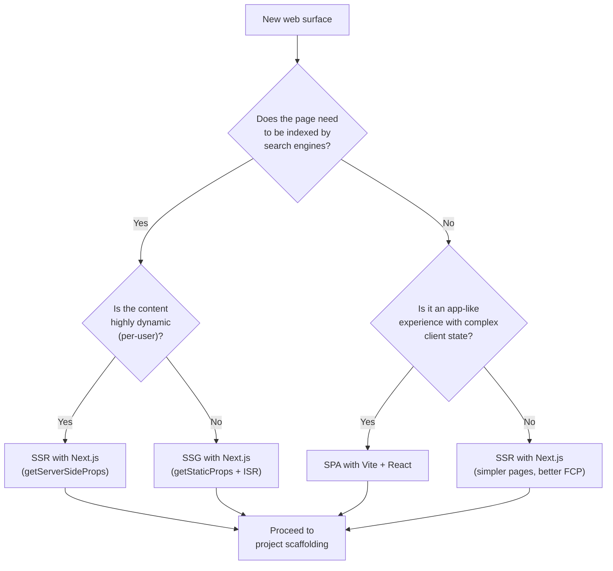
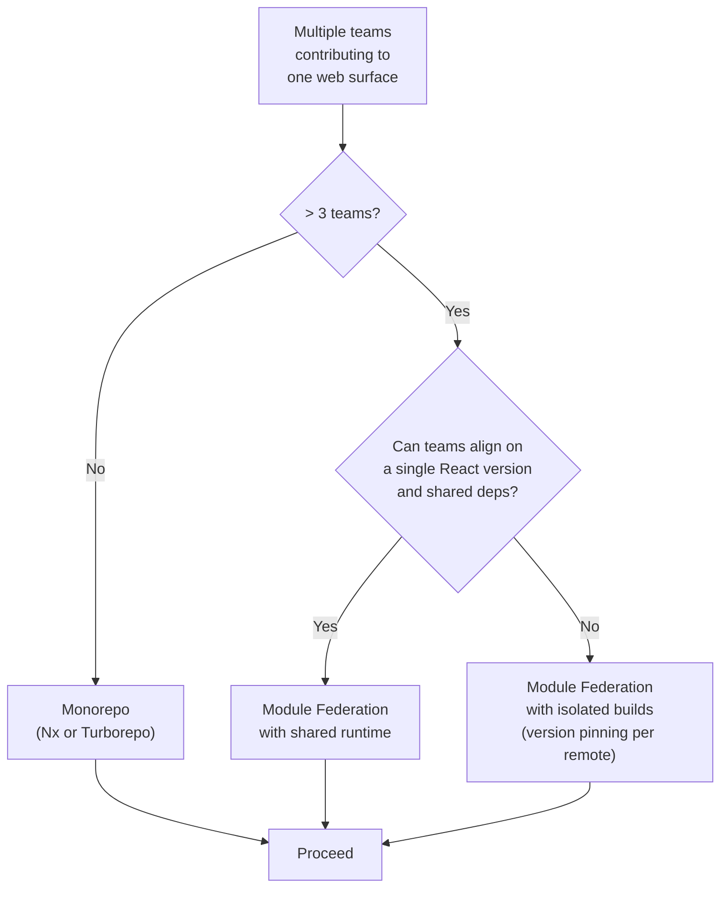
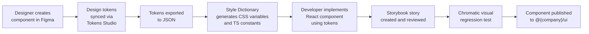
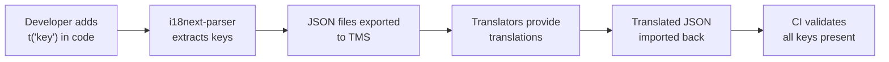

# 🌐 Web Frontend Standards

  

---

## 📑 Table of Contents

1. [SPA vs SSR Decision Guide](#1-spa-vs-ssr-decision-guide)
2. [Microfrontend Strategy](#2-microfrontend-strategy)
3. [Design System](#3-design-system)
4. [Core Web Vitals](#4-core-web-vitals)
5. [Accessibility](#5-accessibility)
6. [Browser Support](#6-browser-support)
7. [CSP & Frontend Security](#7-csp--frontend-security)
8. [Bundle Size Budget](#8-bundle-size-budget)
9. [State Management](#9-state-management)
10. [Testing Strategy](#10-testing-strategy)
11. [Error Tracking](#11-error-tracking)
12. [BFF Client Generation](#12-bff-client-generation)
13. [Web Authentication](#13-web-authentication)
14. [Routing Conventions](#14-routing-conventions)
15. [Form Error Mapping](#15-form-error-mapping)
16. [SEO](#16-seo)
17. [API Mocking (MSW)](#17-api-mocking-msw)
18. [LaunchDarkly for React](#18-launchdarkly-for-react)
19. [Web i18n](#19-web-i18n)
20. [WebSocket Client](#20-websocket-client)

---

## 🖥️ 1. SPA vs SSR Decision Guide

Not every web surface has the same requirements. The rendering strategy should be chosen based on the nature of the content, SEO needs, and interactivity model.

### 1.1 Decision Matrix

| Criterion | SPA (Vite + React) | SSR (Next.js) |
|-----------|-------------------|---------------|
| **Primary use case** | App-like experiences: dashboards, internal tools, ops consoles | Content-heavy pages: marketing site, help center, blog |
| **SEO requirement** | None or minimal - behind authentication | Critical - pages must be crawlable and indexable |
| **Interactivity** | High - complex state, real-time updates, drag-and-drop | Moderate - mostly read, occasional forms |
| **First Contentful Paint** | Acceptable delay (user is authenticated, expects app loading) | Must be fast - users arrive from search engines |
| **Data fetching** | Client-side via TanStack Query | Server-side via `getServerSideProps` / React Server Components |
| **Deployment** | Static assets to S3 + CloudFront | Containerized (ECS/EKS) or Vercel |

### 1.2 Decision Flowchart



### 1.3 Default

When in doubt, prefer **SPA** for authenticated internal surfaces and **Next.js SSR** for public-facing surfaces. Hybrid is permitted - a Next.js app can serve SSR marketing pages alongside client-rendered dashboard routes.

---

## 🧩 2. Microfrontend Strategy

### 2.1 When Microfrontends Are Justified

Microfrontends (via Module Federation) introduce build complexity, runtime overhead, and shared-dependency versioning challenges. They are only justified when the coordination cost of a monorepo exceeds the cost of the microfrontend infrastructure.

| Signal | Threshold | Action |
|--------|-----------|--------|
| Number of teams contributing to the same web surface | > 3 teams | Consider microfrontends |
| Deployment coupling | Teams cannot ship independently | Consider microfrontends |
| Conflicting framework versions | One team needs React 18, another needs React 19 | Module Federation |
| Shared surface, shared cadence | ≤ 3 teams, coordinated releases | **Monorepo** (default) |

### 2.2 Decision Tree



### 2.3 Monorepo Default

The **default** for all new web projects is a monorepo managed with **Nx** or **Turborepo**:

- Shared component library as an internal package
- Per-app build targets
- Affected-only CI (only build/test what changed)
- Single `package.json` lockfile for dependency consistency

### 2.4 Module Federation Rules (When Used)

| Rule | Detail |
|------|--------|
| Shell app | One shell app owns the layout, routing, and authentication |
| Remote contracts | Each remote exposes a typed interface; breaking changes follow the deprecation lifecycle |
| Shared dependencies | React, React DOM, and the design system are shared singletons - never bundled per remote |
| Versioning | Each remote is independently versioned and deployed |
| Fallback | If a remote fails to load, the shell renders a graceful fallback, not a white screen |

---

## 🎨 3. Design System

### 3.1 Shared Component Library

All {Company} web surfaces consume the **{Company} Design System** (`@{company}/ui`), a shared React component library. No team builds custom buttons, modals, or form inputs.

| Layer | Contents | Examples |
|-------|----------|----------|
| **Primitives** | Atomic UI elements | `Button`, `Input`, `Checkbox`, `Badge`, `Avatar` |
| **Composites** | Multi-element patterns | `DataTable`, `Modal`, `Sidebar`, `CommandPalette` |
| **Layout** | Page structure | `PageShell`, `ContentArea`, `SplitPane` |
| **Icons** | Unified icon set | SVG-based, tree-shakeable, accessible labels |

### 3.2 Design Tokens

Design tokens are the single source of truth for visual consistency. They are defined in JSON and consumed by both Figma and code.

```json
{
  "color": {
    "brand": {
      "primary": { "value": "#6C3FC5" },
      "secondary": { "value": "#06AC38" }
    },
    "semantic": {
      "error": { "value": "#E53935" },
      "warning": { "value": "#F9A825" },
      "success": { "value": "#06AC38" },
      "info": { "value": "#1E88E5" }
    }
  },
  "spacing": {
    "xs": { "value": "4px" },
    "sm": { "value": "8px" },
    "md": { "value": "16px" },
    "lg": { "value": "24px" },
    "xl": { "value": "32px" },
    "2xl": { "value": "48px" }
  },
  "typography": {
    "fontFamily": {
      "sans": { "value": "Inter, system-ui, sans-serif" },
      "mono": { "value": "JetBrains Mono, monospace" }
    },
    "fontSize": {
      "xs": { "value": "12px" },
      "sm": { "value": "14px" },
      "base": { "value": "16px" },
      "lg": { "value": "18px" },
      "xl": { "value": "20px" },
      "2xl": { "value": "24px" }
    }
  },
  "borderRadius": {
    "sm": { "value": "4px" },
    "md": { "value": "8px" },
    "lg": { "value": "12px" },
    "full": { "value": "9999px" }
  }
}
```

### 3.3 Storybook

**Storybook** is the component documentation and development environment. Every component in `@{company}/ui` has a corresponding story.

| Requirement | Detail |
|-------------|--------|
| Story coverage | 100% of exported components must have at least one story |
| Interaction tests | All interactive components (forms, modals, dropdowns) include Storybook interaction tests |
| Visual regression | Chromatic runs on every PR; visual diffs require approval |
| Accessibility addon | `@storybook/addon-a11y` enabled - violations fail the CI build |
| Hosted instance | Storybook is deployed to an internal URL, linked from Backstage |

### 3.4 Figma-to-Code Workflow



**Rules:**
- Designers use only design tokens defined in the shared Figma library - no one-off colors or spacing values.
- Developers reference CSS custom properties (`var(--color-brand-primary)`) or TypeScript token constants - never hardcoded hex values.
- New tokens require design system team approval.

---

## 📊 4. Core Web Vitals

### 4.1 Targets

| Metric | Target | What It Measures |
|--------|--------|-----------------|
| **Largest Contentful Paint (LCP)** | < 2.5 seconds | Loading performance - when the main content becomes visible |
| **First Input Delay (FID)** | < 100 ms | Interactivity - delay between user input and browser response |
| **Cumulative Layout Shift (CLS)** | < 0.1 | Visual stability - unexpected layout shifts during loading |
| **Interaction to Next Paint (INP)** | < 200 ms | Responsiveness - latency of all user interactions |

### 4.2 Monitoring

| Layer | Tool | Purpose |
|-------|------|---------|
| **CI** | Lighthouse CI | Automated audit on every PR; scores below threshold block merge |
| **Synthetic** | Lighthouse scheduled runs | Daily synthetic tests against staging and production |
| **Real User** | Datadog RUM | Field data segmented by device, connection speed, geography |

### 4.3 Lighthouse CI Configuration

```json
{
  "ci": {
    "collect": {
      "url": ["http://localhost:3000/", "http://localhost:3000/dashboard"],
      "numberOfRuns": 3
    },
    "assert": {
      "assertions": {
        "categories:performance": ["error", { "minScore": 0.9 }],
        "categories:accessibility": ["error", { "minScore": 0.95 }],
        "largest-contentful-paint": ["error", { "maxNumericValue": 2500 }],
        "first-input-delay": ["error", { "maxNumericValue": 100 }],
        "cumulative-layout-shift": ["error", { "maxNumericValue": 0.1 }]
      }
    }
  }
}
```

### 4.4 Performance Budget Enforcement

PRs that regress Lighthouse performance score below **0.9** or violate any Core Web Vital threshold are **automatically blocked**. The PR author must optimize before merging or request an exception from the frontend platform team with a documented justification.

---

## ♿ 5. Accessibility

### 5.1 Compliance Target

{Company} web surfaces target **WCAG 2.1 Level AA** compliance. This is mandatory for all customer-facing and internal surfaces.

### 5.2 Automated Enforcement

| Layer | Tool | Enforcement |
|-------|------|-------------|
| **Component development** | `@storybook/addon-a11y` (axe-core) | Violations visible during development |
| **CI - static** | `eslint-plugin-jsx-a11y` | Lint errors block PR merge |
| **CI - runtime** | axe-core via `@axe-core/playwright` | Automated axe scan in E2E test suite; violations fail the build |
| **E2E tests** | Playwright a11y assertions | `AxeBuilder({ page }).analyze()` + `expect(results.violations).toEqual([])` in critical user flows (see Section 5.4) |
| **Manual audit** | Third-party audit | Annual audit by certified accessibility consultants |

### 5.3 Requirements

| Area | Requirement |
|------|-------------|
| **Keyboard navigation** | All interactive elements reachable and operable via keyboard; visible focus indicators |
| **Screen reader** | All images have `alt` text; all form inputs have associated labels; ARIA roles used correctly |
| **Color contrast** | Minimum 4.5:1 for normal text, 3:1 for large text (18px+ bold or 24px+ regular) |
| **Motion** | Respect `prefers-reduced-motion`; no auto-playing animations without user control |
| **Focus management** | Focus trapped in modals; focus returned to trigger on close; skip-to-content link on every page |
| **Error identification** | Form errors identified by more than color alone; error messages associated with inputs via `aria-describedby` |

### 5.4 Playwright A11y Assertion Example

```typescript
import { test, expect } from '@playwright/test';
import AxeBuilder from '@axe-core/playwright';

test('dashboard has no accessibility violations', async ({ page }) => {
  await page.goto('/dashboard');

  const results = await new AxeBuilder({ page })
    .withTags(['wcag2a', 'wcag2aa'])
    .analyze();

  expect(results.violations).toEqual([]);
});
```

---

## 🌍 6. Browser Support

### 6.1 Support Matrix

| Browser | Supported Versions | Notes |
|---------|--------------------|-------|
| **Google Chrome** | Last 2 major versions | Primary development and testing browser |
| **Mozilla Firefox** | Last 2 major versions | Tested in CI via Playwright |
| **Apple Safari** | Last 2 major versions | Tested on macOS; iOS Safari tested via BrowserStack |
| **Microsoft Edge** | Last 2 major versions | Chromium-based; covered by Chrome testing in most cases |
| **Internet Explorer** | Not supported | No polyfills, no workarounds, no exceptions |

### 6.2 Browserslist Configuration

```
last 2 Chrome versions
last 2 Firefox versions
last 2 Safari versions
last 2 Edge versions
not dead
not ie 11
```

### 6.3 Polyfill Policy

- **No IE polyfills.** Period.
- Modern API polyfills (e.g., `ResizeObserver`, `IntersectionObserver`) are added only when required by a supported browser version and only via dynamic import to avoid bloating the main bundle.
- The `browserslist` configuration drives Babel/SWC transpilation targets. Do not override manually.

---

## 🔐 7. CSP & Frontend Security

### 7.1 Content Security Policy

All {Company} web applications enforce a **strict Content Security Policy** via HTTP headers.

| Directive | Value | Rationale |
|-----------|-------|-----------|
| `default-src` | `'self'` | Only load resources from the same origin by default |
| `script-src` | `'self'` (no `'unsafe-inline'`, no `'unsafe-eval'`) | Prevents inline script injection (XSS) |
| `style-src` | `'self'` | Tailwind CSS and CSS Modules are the approved styling approaches; both work with strict CSP without `unsafe-inline`. If SSR with CSS-in-JS is needed, use nonce-based CSP |
| `img-src` | `'self' data: https://cdn.{company}.app` | Allow images from CDN and data URIs |
| `font-src` | `'self' https://fonts.gstatic.com` | Google Fonts or self-hosted |
| `connect-src` | `'self' https://api.{company}.com wss://ws.{company}.app` | API and WebSocket endpoints |
| `frame-ancestors` | `'none'` | Prevent clickjacking - no embedding in iframes |
| `base-uri` | `'self'` | Prevent `<base>` tag injection |

### 7.2 Additional Security Headers

| Header | Value | Purpose |
|--------|-------|---------|
| `X-Content-Type-Options` | `nosniff` | Prevent MIME-type sniffing |
| `X-Frame-Options` | `DENY` | Legacy clickjacking protection |
| `Referrer-Policy` | `strict-origin-when-cross-origin` | Limit referrer information leakage |
| `Permissions-Policy` | `camera=(), microphone=(), geolocation=(self)` | Restrict browser API access |
| `Strict-Transport-Security` | `max-age=63072000; includeSubDomains; preload` | Enforce HTTPS |

### 7.3 Subresource Integrity (SRI)

All scripts and stylesheets loaded from CDNs must include SRI hashes:

```html
<script
  src="https://cdn.{company}.app/vendor/analytics.js"
  integrity="sha384-oqVuAfXRKap7fdgcCY5uykM6+R9GqQ8K/uxAh6VgnSY3lEp9cGvR2mBJC0SxFhD"
  crossorigin="anonymous"
></script>
```

SRI hashes are generated during the build pipeline and injected automatically. Manual hash management is not required.

### 7.4 XSS Prevention

| Control | Implementation |
|---------|---------------|
| No `dangerouslySetInnerHTML` | Lint rule blocks usage; exceptions require security team review |
| Input sanitization | All user input rendered via React's built-in escaping; DOMPurify for rich-text rendering |
| URL validation | `href` attributes validated against allowlist schemes (`https:`, `mailto:`) - no `javascript:` |
| CSP as safety net | Even if a bypass occurs, strict CSP blocks execution of injected scripts |

---

## 📦 8. Bundle Size Budget

### 8.1 Thresholds

| Metric | Limit | Enforcement |
|--------|-------|-------------|
| **Initial JS bundle (gzipped)** | < 200 KB | CI blocks PR if exceeded |
| **Per-route chunk (gzipped)** | < 80 KB | CI warning; blocking at 120 KB |
| **CSS (gzipped)** | < 50 KB | CI warning |
| **Total transfer size (initial load)** | < 500 KB | Lighthouse budget assertion |

### 8.2 CI Enforcement

Bundle size is measured on every PR using `size-limit`:

```json
[
  {
    "name": "Initial JS",
    "path": "dist/assets/index-*.js",
    "gzip": true,
    "limit": "200 KB"
  },
  {
    "name": "CSS",
    "path": "dist/assets/index-*.css",
    "gzip": true,
    "limit": "50 KB"
  }
]
```

If the bundle exceeds the limit, the PR is blocked with a clear message showing the current size, the limit, and the delta.

### 8.3 Optimization Techniques

| Technique | Detail |
|-----------|--------|
| **Code splitting** | React.lazy + Suspense for route-level splitting; dynamic imports for heavy components |
| **Tree shaking** | Only import what you use - `import { Button } from '@{company}/ui'`, not `import * as UI` |
| **Image optimization** | WebP/AVIF formats, responsive `srcset`, lazy loading via `loading="lazy"` |
| **Font subsetting** | Only include character ranges actually used; `font-display: swap` |
| **Dependency audit** | `bundlephobia` check before adding any new dependency; prefer smaller alternatives |

---

## 🗄️ 9. State Management

### 9.1 Standard Stack

| State Type | Tool | Use Case |
|------------|------|----------|
| **Server state** | TanStack Query | API data fetching, caching, background refetching, optimistic updates |
| **Client state** | Zustand | UI state, form state, local preferences, ephemeral state |
| **URL state** | React Router search params | Filters, pagination cursors, tab selection - anything linkable |
| **Form state** | React Hook Form + Zod | Complex forms with validation |

### 9.2 What Not to Use

| Tool | Status | Reason |
|------|--------|--------|
| **Redux** | Not permitted for new projects | Excessive boilerplate; TanStack Query + Zustand cover all use cases with less ceremony |
| **MobX** | Not permitted | Implicit reactivity model conflicts with React's explicit rendering |
| **Context API (for global state)** | Discouraged | Causes unnecessary re-renders; use Zustand instead |
| **Local component state** | Permitted | Fine for truly local, ephemeral state (open/closed toggles, hover state) |

### 9.3 TanStack Query Conventions

```typescript
const { data, isLoading, error } = useQuery({
  queryKey: ['orders', { status: 'active', page }],
  queryFn: () => ordersApi.listOrders({ status: 'active', page }),
  staleTime: 30_000,
  gcTime: 5 * 60_000,
});
```

| Convention | Rule |
|------------|------|
| Query keys | Structured arrays: `[resource, filters]` - never plain strings |
| Stale time | Set explicitly per query; default `0` is rarely appropriate |
| Error handling | Global error handler via `QueryClient` for 401/403; per-query for domain errors |
| Mutations | Use `useMutation` with `onSuccess` invalidation - never manually set query data after mutation |

---

## 🧪 10. Testing Strategy

### 10.1 Testing Layers

| Layer | Tool | What to Test | Coverage Target |
|-------|------|-------------|----------------|
| **Unit** | Jest + React Testing Library (RTL) | Component behavior, hooks, utility functions | > 80% of business logic |
| **Component** | Storybook Interaction Tests | Interactive component behavior (dropdowns, modals, forms) | 100% of `@{company}/ui` components |
| **Integration** | Playwright | Page-level flows with mocked API | Critical user journeys |
| **E2E** | Playwright | Full end-to-end flows against staging | Top 5 user journeys per surface |
| **Visual regression** | Chromatic | Unintended visual changes | All Storybook stories |

### 10.2 Testing Principles

- **Test behavior, not implementation.** Query by accessible roles and labels (`getByRole`, `getByLabelText`), not by CSS class or test ID.
- **No snapshot tests.** They are brittle and produce meaningless diffs. Use Chromatic for visual regression instead.
- **Mock at the network boundary.** Use MSW (Mock Service Worker) for API mocking in unit and integration tests - never mock internal modules.
- **Playwright for E2E.** Playwright runs in CI against staging. Tests cover the top 5 user journeys per web surface.

### 10.3 RTL Example

```typescript
import { render, screen } from '@testing-library/react';
import userEvent from '@testing-library/user-event';

test('submitting the form calls onSubmit with form data', async () => {
  const onSubmit = vi.fn();
  render(<OrderForm onSubmit={onSubmit} />);

  await userEvent.type(screen.getByLabelText('Shipping address'), '123 Main St');
  await userEvent.type(screen.getByLabelText('Billing address'), '456 Oak Ave');
  await userEvent.click(screen.getByRole('button', { name: 'Place order' }));

  expect(onSubmit).toHaveBeenCalledWith({
    shippingAddress: '123 Main St',
    billingAddress: '456 Oak Ave',
  });
});
```

---

## 🐛 11. Error Tracking

### 11.1 Sentry Integration

**Sentry** is the mandatory error tracking platform for all {Company} web frontends. Every web surface must integrate Sentry before production deployment.

| Configuration | Value |
|---------------|-------|
| **DSN** | Per-project, stored in environment variable (`VITE_SENTRY_DSN`) |
| **Environment** | `development`, `staging`, `production` |
| **Release** | Git commit SHA, set during CI build |
| **Sample rate** | `1.0` for errors, `0.1` for performance transactions |
| **Source maps** | Uploaded to Sentry during CI build; not served publicly |

### 11.2 Source Map Upload (CI)

```bash
npx @sentry/cli releases new "$GIT_SHA"
npx @sentry/cli releases files "$GIT_SHA" upload-sourcemaps ./dist --url-prefix "~/"
npx @sentry/cli releases finalize "$GIT_SHA"
```

Source maps are uploaded to Sentry and then **deleted from the deployment artifact**. They must never be served to end users.

### 11.3 Error Boundary

Every web surface wraps its root component in a Sentry error boundary:

```typescript
import * as Sentry from '@sentry/react';

function App() {
  return (
    <Sentry.ErrorBoundary
      fallback={<FullPageError />}
      showDialog={false}
    >
      <RouterProvider router={router} />
    </Sentry.ErrorBoundary>
  );
}
```

### 11.4 Alert Rules

| Rule | Condition | Action |
|------|-----------|--------|
| **New issue spike** | > 10 occurrences of a new error in 5 minutes | Slack alert to owning team channel |
| **Regression** | A previously resolved issue reoccurs | Slack alert + PagerDuty if P1 |
| **Error rate threshold** | > 1% of sessions have unhandled errors | PagerDuty alert |

---

## ⚙️ 12. BFF Client Generation

### 12.1 Standard

All BFF (Backend for Frontend) API clients are generated from the OpenAPI specification using **openapi-typescript-codegen**.

| Parameter | Value |
|-----------|-------|
| Generator | `openapi-typescript-codegen` |
| Input | BFF OpenAPI spec (`openapi.yaml`) |
| Output | `src/api/generated/` |
| Regeneration trigger | On any change to the BFF OpenAPI spec |
| Version control | Generated code is committed to the repository |

### 12.2 Usage

```bash
npx openapi-typescript-codegen \
  --input ../bff/openapi.yaml \
  --output src/api/generated \
  --client fetch \
  --useOptions
```

Generated clients are imported in application code and wrapped with TanStack Query hooks. Do not modify generated files - changes will be overwritten on regeneration.

---

## 🔑 13. Web Authentication

### 13.1 SPA Authentication (PKCE)

Single-page applications use **Authorization Code Flow with PKCE**:

| Parameter | Value |
|-----------|-------|
| Flow | Authorization Code + PKCE |
| Token storage | In-memory only (never `localStorage` or `sessionStorage`) |
| Token refresh | Silent refresh via hidden iframe or refresh token (if supported by IdP) |
| Library | `oidc-client-ts` or auth provider SDK |

### 13.2 SSR Authentication (BFF-Managed Cookie)

Server-rendered applications use BFF-managed sessions:

| Parameter | Value |
|-----------|-------|
| Session management | BFF issues `httpOnly`, `Secure`, `SameSite=Strict` cookie |
| Token storage | Server-side session store (Redis) |
| CSRF protection | CSRF token required for all state-changing requests (cookie-based auth) |

### 13.3 TanStack Query Global 401 Handler

```typescript
const queryClient = new QueryClient({
  defaultOptions: {
    queries: {
      retry: (failureCount, error) => {
        if (error instanceof ApiError && error.status === 401) {
          return false;
        }
        return failureCount < 3;
      },
    },
  },
});

queryClient.getQueryCache().subscribe((event) => {
  if (event?.query?.state?.error?.status === 401) {
    authService.silentRefresh().catch(() => authService.logout());
  }
});
```

---

## 🗺️ 14. Routing Conventions

### 14.1 Framework-Specific Patterns

| Framework | Routing Approach |
|-----------|-----------------|
| **Next.js** | File-based routing (App Router or Pages Router) |
| **React Router** | Route config object (`createBrowserRouter`) |

### 14.2 Protected Routes

All authenticated routes use a protected route wrapper:

```typescript
function ProtectedRoute({ children }: { children: React.ReactNode }) {
  const { isAuthenticated, isLoading } = useAuth();

  if (isLoading) return <LoadingSpinner />;
  if (!isAuthenticated) return <Navigate to="/login" replace />;

  return <>{children}</>;
}
```

### 14.3 Lazy Loading

Route-level code splitting uses `React.lazy` with `Suspense`:

```typescript
const Dashboard = React.lazy(() => import('./pages/Dashboard'));
const Orders = React.lazy(() => import('./pages/Orders'));

const router = createBrowserRouter([
  {
    path: '/',
    element: <ProtectedRoute><AppLayout /></ProtectedRoute>,
    children: [
      { path: 'dashboard', element: <Suspense fallback={<PageSkeleton />}><Dashboard /></Suspense> },
      { path: 'orders', element: <Suspense fallback={<PageSkeleton />}><Orders /></Suspense> },
    ],
  },
]);
```

---

## 📝 15. Form Error Mapping

### 15.1 Server Error Mapping

API error responses include a `details` array. Each entry maps to a field-level error:

```json
{
  "error": "validation_failed",
  "message": "Request validation failed",
  "details": [
    { "field": "shippingAddress", "message": "error.address.required" },
    { "field": "email", "message": "error.email.invalid" }
  ]
}
```

The frontend maps `details` entries to field-level errors by `field` name and displays them inline.

### 15.2 i18n Error Messages

Error message keys are resolved via `react-i18next`:

```typescript
const { t } = useTranslation();

{serverErrors.map((err) => (
  <FieldError key={err.field} message={t(err.message)} />
))}
```

Server validation errors are displayed inline next to the relevant form field, not as a summary banner at the top.

---

## 🔍 16. SEO

### 16.1 Metadata

| Framework | Approach |
|-----------|----------|
| **Next.js** | `metadata` API (App Router) or `next/head` (Pages Router) |
| **SPA (Vite + React)** | `react-helmet-async` |

Every public-facing page must define: `title`, `description`, `canonical URL`, and `og:` tags.

### 16.2 Structured Data

Public-facing pages include **JSON-LD** structured data where applicable:

```html
<script type="application/ld+json">
{
  "@context": "https://schema.org",
  "@type": "Organization",
  "name": "{Company}",
  "url": "https://www.{company}.app"
}
</script>
```

### 16.3 Sitemap

A `sitemap.xml` is generated for all public-facing pages and submitted to search engines. For Next.js, use the built-in sitemap generation. For SPAs, generate a static sitemap during the build step.

---

## 🎭 17. API Mocking (MSW)

### 17.1 Standard

**Mock Service Worker (MSW)** is the standard API mocking tool for all {Company} web frontends.

| Context | MSW Mode | Purpose |
|---------|----------|---------|
| Local development | Browser (`setupWorker`) | Intercepts fetch requests in the browser for offline-first development |
| Unit/integration tests | Node (`setupServer`) | Intercepts requests in the test process for deterministic test data |

### 17.2 Handler Generation

MSW handlers are generated from the BFF OpenAPI spec and shared across projects:

```
packages/
  mocks/
    handlers/
      orders.ts
      payments.ts
      users.ts
    browser.ts
    server.ts
```

### 17.3 Usage

```typescript
import { setupServer } from 'msw/node';
import { handlers } from '@{company}/mocks';

const server = setupServer(...handlers);

beforeAll(() => server.listen());
afterEach(() => server.resetHandlers());
afterAll(() => server.close());
```

---

## 🚩 18. LaunchDarkly for React

### 18.1 Setup

Use `launchdarkly-react-client-sdk` with the `LDProvider` wrapper:

```typescript
import { LDProvider } from 'launchdarkly-react-client-sdk';

function App() {
  return (
    <LDProvider
      clientSideID={import.meta.env.VITE_LD_CLIENT_ID}
      options={{ bootstrap: 'localStorage' }}
    >
      <RouterProvider router={router} />
    </LDProvider>
  );
}
```

### 18.2 Consuming Flags

```typescript
import { useFlags } from 'launchdarkly-react-client-sdk';

function OrderForm() {
  const { newCheckoutFlow } = useFlags();

  return newCheckoutFlow ? <NewCheckout /> : <LegacyCheckout />;
}
```

### 18.3 Anonymous to Identified User Transition

On app load before login, the SDK initialises with an anonymous context. On login, identify the user:

```typescript
import { useLDClient } from 'launchdarkly-react-client-sdk';

function useIdentifyUser() {
  const ldClient = useLDClient();

  const identify = useCallback((user: User) => {
    ldClient?.identify({
      kind: 'user',
      key: user.id,
      email: user.email,
      custom: { region: user.region },
    });
  }, [ldClient]);

  return identify;
}
```

### 18.4 Test Overrides

In tests, mock LaunchDarkly flags via `jest.mock`:

```typescript
jest.mock('launchdarkly-react-client-sdk', () => ({
  useFlags: () => ({ newCheckoutFlow: true }),
  useLDClient: () => ({ identify: jest.fn() }),
  LDProvider: ({ children }: any) => children,
}));
```

---

## 🌏 19. Web i18n

### 19.1 Standard

| Parameter | Value |
|-----------|-------|
| Library | `react-i18next` |
| Message format | ICU Message Format |
| Extraction | `i18next-parser` (extracts keys from source code) |
| Locale fallback chain | Specific locale → language → `en` (e.g., `fr-CA` → `fr` → `en`) |
| RTL support | Enabled via `dir="rtl"` on `<html>` for RTL locales |

### 19.2 Translation Workflow



### 19.3 Usage

```typescript
import { useTranslation } from 'react-i18next';

function OrderStatus({ count }: { count: number }) {
  const { t } = useTranslation();

  return <p>{t('orders.activeCount', { count })}</p>;
}
```

Translation file (`en.json`):

```json
{
  "orders": {
    "activeCount": "{count, plural, one {# active order} other {# active orders}}"
  }
}
```

---

## 🔌 20. WebSocket Client

### 20.1 Standard

All WebSocket connections use the `@{company}/ws-client` wrapper library, which standardises authentication, reconnection, and error handling.

| Parameter | Value |
|-----------|-------|
| Library | `@{company}/ws-client` |
| Auth | Auth token sent on initial connection (`Authorization` header or query param) |
| Reconnect | Exponential backoff (1s → 2s → 4s → 8s → max 30s) |
| Heartbeat | Client-side ping every 30 seconds; server pong expected within 5 seconds |

### 20.2 TanStack Query Integration

WebSocket events are integrated with TanStack Query to keep server state in sync:

```typescript
import { useQueryClient } from '@tanstack/react-query';
import { useWebSocket } from '@{company}/ws-client';

function useOrderUpdates(orderId: string) {
  const queryClient = useQueryClient();

  useWebSocket(`/orders/${orderId}`, {
    onMessage: (event) => {
      queryClient.setQueryData(['orders', orderId], event.data);
    },
    onReconnect: () => {
      queryClient.invalidateQueries({ queryKey: ['orders', orderId] });
    },
  });
}
```

On reconnection, the client invalidates relevant queries to ensure data consistency after any missed events.

---

<div align="center">

⬅️ [Back to section](./README.md) · 🏠 [Back to root](../README.md)

</div>
