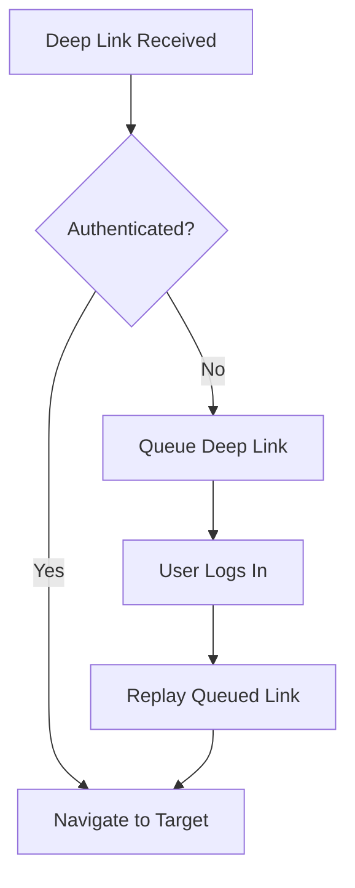
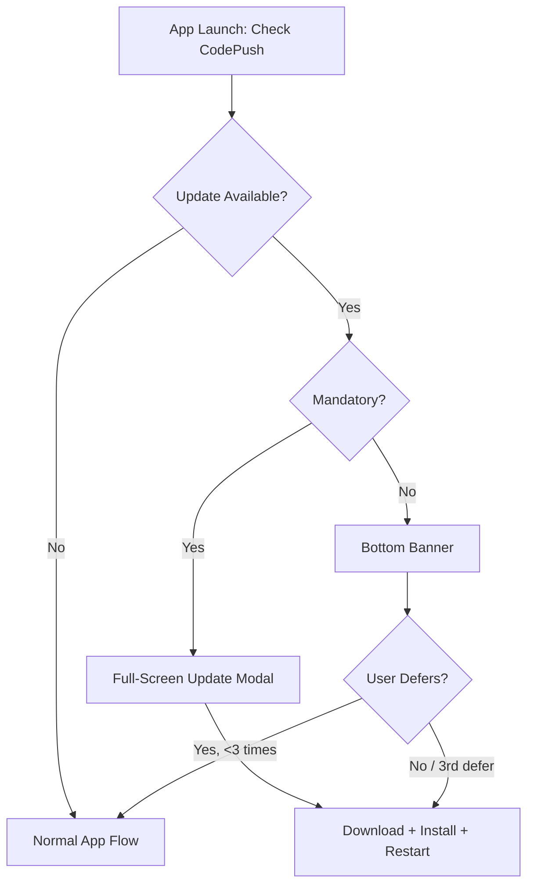

# ⚛️ React Native Engineering Guide

  

---

## 📑 Table of Contents

1. [Bridge vs Turbo Module Decision Guide](#1-bridge-vs-turbo-module-decision-guide)
2. [Navigation Architecture](#2-navigation-architecture)
3. [Debugging](#3-debugging)
4. [Hermes Tuning](#4-hermes-tuning)
5. [API Codegen](#5-api-codegen)
6. [Testing](#6-testing)
7. [App Versioning](#7-app-versioning)
8. [Repo Layout](#8-repo-layout)
9. [CodePush Operations](#9-codepush-operations)
10. [Accessibility - VoiceOver & TalkBack](#10-accessibility--voiceover--talkback)

---

## 🌉 1. Bridge vs Turbo Module Decision Guide

{Company} mandates the **New Architecture (Fabric + Turbo Modules)** for all new native modules. The legacy Bridge is permitted only for third-party libraries that have not yet migrated.

### 1.1 Decision Matrix

| Criterion | Legacy Bridge | Turbo Module |
|-----------|--------------|--------------|
| **New first-party module** | ❌ Not allowed | ✅ Required |
| **Third-party lib (no Fabric support)** | ✅ Temporary | Migrate when upstream ships |
| **Performance-critical path** (>16ms frame budget) | ❌ Async serialization overhead | ✅ JSI synchronous calls |
| **Shared C++ logic** | Not practical | ✅ C++ Turbo Modules |
| **Type safety** | Manual `NativeModules` typing | ✅ Codegen from spec |

### 1.2 Fabric Mandate

- All new screens using native views must use **Fabric renderers**.
- The `interop layer` may be used during migration, but every interop usage must have a linked Jira ticket with a removal date.
- CI enforces `RCT_NEW_ARCH_ENABLED=1` on all builds. A build that fails under New Architecture is a **blocking** failure.

### 1.3 Turbo Module Authoring

Every Turbo Module must:

1. Have a TypeScript spec file under `src/specs/Native<ModuleName>.ts`.
2. Pass codegen validation (`npx react-native codegen`).
3. Include a Jest mock in `__mocks__/` so JS-side consumers can unit-test without native builds.

```typescript
// src/specs/NativeLocationTracker.ts
import type { TurboModule } from 'react-native';
import { TurboModuleRegistry } from 'react-native';

export interface Spec extends TurboModule {
  startTracking(intervalMs: number): Promise<void>;
  stopTracking(): void;
  getLastKnownLocation(): Promise<{
    lat: number;
    lng: number;
    accuracy: number;
  }>;
}

export default TurboModuleRegistry.getEnforcing<Spec>('LocationTracker');
```

---

## 🧭 2. Navigation Architecture

### 2.1 Stack & Structure

{Company} uses **React Navigation v6+** with a standardized stack hierarchy:

```
RootNavigator (Stack)
├── AuthStack (Stack)
│   ├── LoginScreen
│   ├── OTPScreen
│   └── OnboardingScreen
├── MainTabs (Bottom Tabs)
│   ├── HomeStack
│   ├── OrdersStack
│   ├── WalletStack
│   └── ProfileStack
└── ModalStack (Group - presentation: modal)
    ├── SupportChat
    └── RatingFlow
```

### 2.2 Deep Linking Configuration

Every app must register a `linking` config that maps URL paths to screens:

```typescript
const linking: LinkingOptions<RootParamList> = {
  prefixes: [
    'https://app.{company}.com',
    '{company}://',
  ],
  config: {
    screens: {
      MainTabs: {
        screens: {
          OrdersStack: {
            screens: {
              OrderDetail: 'orders/:orderId',
            },
          },
        },
      },
      ModalStack: {
        screens: {
          SupportChat: 'support',
        },
      },
    },
  },
};
```

### 2.3 Auth-Gated Navigation

- The `RootNavigator` conditionally renders `AuthStack` or `MainTabs` based on the authentication state held in `useAuth()`.
- Deep links arriving while unauthenticated are **queued** in a `pendingDeepLink` ref and replayed after login completes.
- Token refresh failures trigger a `FORCE_LOGOUT` action that resets the navigation state to `AuthStack`.

**Visual overview:**



---

## 🐛 3. Debugging

### 3.1 Toolchain

| Tool | Purpose | When to Use |
|------|---------|-------------|
| **Flipper** | Network inspector, Layout inspector, shared preferences viewer, crash logs | First-line debugging on device/emulator |
| **React DevTools** | Component tree, props/state inspection, profiler | React rendering issues, unnecessary re-renders |
| **Metro** | JS bundler logs, module resolution errors | Build-time errors, slow bundling |
| **Native Debugger** (Xcode / Android Studio) | Breakpoints in native Turbo Modules, memory profiling | Native crash investigation |

### 3.2 Simultaneous Native + JS Debugging

When debugging a Turbo Module interaction:

1. Start Metro with `npx react-native start --experimental-debugger`.
2. Attach **Xcode** (iOS) or **Android Studio** (Android) to the running process for native breakpoints.
3. Open Chrome DevTools or the new React Native Debugger for JS breakpoints.
4. Use Flipper's **Network** plugin to correlate API calls with native module invocations.

### 3.3 CI Debug Artifacts

- All CI builds archive **Metro bundle source maps** as artifacts.
- Debug builds include Flipper automatically; release builds strip it via `react-native.config.js`:

```javascript
module.exports = {
  dependencies: {
    ...(process.env.NODE_ENV === 'production'
      ? { 'react-native-flipper': { platforms: { ios: null, android: null } } }
      : {}),
  },
};
```

---

## ⚡ 4. Hermes Tuning

Hermes is the **mandated JS engine** for all {Company} React Native apps. V8 is not permitted.

### 4.1 Inline Thresholds

Hermes inlines small functions by default. For hot paths (e.g., list item renderers), keep functions under **50 bytecode instructions** to stay within the inline threshold.

### 4.2 Heap Snapshots

- Use `HermesInternal.createHeapSnapshot()` during development to capture heap state.
- Analyse with Chrome DevTools → Memory tab by loading the `.heapsnapshot` file.
- CI runs a **memory regression test** on the order-tracking flow: if retained heap grows >10% between releases, the build warns.

### 4.3 Sampling Profiler

```bash
# Start profiler on device
adb shell setprop persist.com.facebook.hermes.sampling_profiler 1

# Pull profile after interaction
adb pull /data/data/com.{company}.app/files/sampling-profiler-trace.cpuprofile
```

Load the `.cpuprofile` in Chrome DevTools → Performance tab to identify hot functions.

### 4.4 CI Flags

| Flag | Value | Rationale |
|------|-------|-----------|
| `hermesFlags` | `"-O"` | Optimized bytecode for release builds |
| `enableHermes` | `true` | Mandatory - enforced by CI lint |
| `hermesFlagsDebug` | `""` | No optimisation in debug for accurate profiling |

---

## 🔧 5. API Codegen

### 5.1 OpenAPI-Generated TypeScript Client

All BFF APIs expose an **OpenAPI 3.1 spec**. The mobile client generates a typed API client from this spec:

```bash
npx openapi-typescript-codegen \
  --input https://bff.internal.{company}.com/openapi.json \
  --output src/api/generated \
  --client axios
```

### 5.2 Shared BFF Types

The BFF and the mobile client share types via the `@{company}/bff-types` package:

```
packages/
├── bff-types/          # Shared request/response types
│   ├── src/
│   │   ├── orders.ts
│   │   ├── payments.ts
│   │   └── index.ts
│   └── package.json
```

- The BFF **imports** these types to validate its responses.
- The mobile client **imports** these types for request/response typing.
- CI breaks if the BFF response shape diverges from the shared types (enforced by contract tests).

### 5.3 Codegen CI Rule

- Codegen output is committed to the repo (not `.gitignore`-d) so that PRs show type diffs.
- A CI step regenerates and runs `git diff --exit-code src/api/generated/` - if the output differs, the PR fails with a message directing the developer to re-run codegen.

---

## 🧪 6. Testing

### 6.1 Framework Decision Matrix

| Criterion | Detox | Appium |
|-----------|-------|--------|
| **Grey-box access** (sync with RN bridge) | ✅ Built-in | ❌ Black-box only |
| **Cross-platform script reuse** | ✅ Same JS test for iOS + Android | ✅ With abstraction layer |
| **Cloud device farm** | Limited | ✅ BrowserStack native support |
| **Use when** | In-house CI, fast feedback | BrowserStack device matrix, multi-app flows |

**Default:** Detox for in-house CI. Appium only when BrowserStack device coverage is required.

### 6.2 Component Testing

- **Jest + React Native Testing Library (RNTL)** for all React components.
- Tests must render components, simulate user interactions, and assert on screen output - not implementation details.
- Coverage gate: **80%** line coverage on `src/components/` and `src/screens/`.

```typescript
import { render, fireEvent, screen } from '@testing-library/react-native';
import { OrderCard } from '../OrderCard';

test('displays order total and navigates on press', () => {
  const onPress = jest.fn();
  render(<OrderCard orderId="123" total={42.5} onPress={onPress} />);

  expect(screen.getByText('$42.50')).toBeTruthy();
  fireEvent.press(screen.getByTestId('order-card-123'));
  expect(onPress).toHaveBeenCalledWith('123');
});
```

### 6.3 BrowserStack Device Farm

All release candidates run through BrowserStack before submission:

| Platform | OS Versions | Devices | Screen Sizes |
|----------|-------------|---------|-------------|
| **Android** | API 28 (9.0), API 33 (13), API 34 (14) | Pixel 6, Samsung Galaxy S23, Xiaomi Redmi Note 12 | Small (5.4"), Medium (6.1"), Large (6.7") |
| **iOS** | 16.x, 17.x | iPhone 14, iPhone 15 Pro, iPhone SE 3rd gen | Small (4.7"), Medium (6.1"), Large (6.7") |

### 6.4 Test Pyramid for Mobile

| Layer | Tool | Volume | CI Trigger |
|-------|------|--------|-----------|
| Unit (JS) | Jest + RNTL | ~60% | Every PR |
| Unit (Native) | XCTest / JUnit | ~15% | Every PR |
| Integration | Detox | ~20% | Every PR (smoke) + nightly (full) |
| E2E (Device Farm) | Appium + BrowserStack | ~5% | Pre-release RC |

---

## 🏷️ 7. App Versioning

### 7.1 Single Source of Truth

Version information lives in **one place** and is read by both platforms:

```json
// package.json (root)
{
  "version": "3.14.2",
  "{company}": {
    "buildNumber": 1042,
    "minSupportedVersion": "3.12.0"
  }
}
```

- `version` → maps to `CFBundleShortVersionString` (iOS) and `versionName` (Android).
- `buildNumber` → maps to `CFBundleVersion` (iOS) and `versionCode` (Android).

### 7.2 CI Bump Rules

| Trigger | Version Change | Build Number |
|---------|---------------|-------------|
| Feature branch merge to `main` | No change | No change |
| Release branch cut (`release/x.y.z`) | Patch bump if needed | Auto-increment |
| App Store / Play Store submission | Frozen | Frozen |
| Hotfix to release branch | Patch bump | Auto-increment |

### 7.3 CodePush Metadata Sync

- CodePush bundles embed the `version` from `package.json` as a label.
- The app checks `codePushVersion === nativeBinaryVersion` on startup; mismatch triggers a full binary update prompt.
- The `minSupportedVersion` field gates API access - the BFF returns `426 Upgrade Required` if the client version is below this threshold.

---

## 📁 8. Repo Layout

### 8.1 Monorepo Structure

{Company} mobile apps live in a Yarn Workspaces monorepo:

```
mobile/
├── apps/
│   ├── customer/           # Customer-facing RN app
│   │   ├── ios/
│   │   ├── android/
│   │   ├── src/
│   │   └── package.json
│   └── provider/           # Provider-facing RN app
│       ├── ios/
│       ├── android/
│       ├── src/
│       └── package.json
├── packages/
│   ├── @{company}/mobile-ui/       # Shared design system components
│   ├── @{company}/mobile-auth/     # Auth module (token management, biometrics)
│   ├── @{company}/mobile-network/  # Axios instance, interceptors, retry logic
│   ├── @{company}/mobile-analytics/# Event tracking abstraction
│   ├── @{company}/mobile-i18n/     # Localisation strings and hooks
│   └── @{company}/bff-types/       # Shared BFF request/response types
├── tools/
│   ├── codegen/            # OpenAPI client generation scripts
│   └── scripts/            # Release, version bump, CodePush scripts
├── package.json            # Root workspace config
├── yarn.lock
└── turbo.json              # Turborepo pipeline config
```

### 8.2 Workspace Rules

- Shared packages are published to the **internal npm registry** (`@{company}/mobile-*`).
- Apps import shared packages via workspace protocol: `"@{company}/mobile-ui": "workspace:*"`.
- Each package has its own `tsconfig.json` extending a root `tsconfig.base.json`.
- Native dependencies (pods, Gradle modules) are hoisted to the app level - shared packages must not contain native code directly.

---

## 🚀 9. CodePush Operations

### 9.1 Environment Keys

| Environment | Deployment Key | Target |
|-------------|---------------|--------|
| **Development** | `DEV_CODEPUSH_KEY` | Internal testers |
| **Staging** | `STAGING_CODEPUSH_KEY` | QA + beta users |
| **Production** | `PROD_CODEPUSH_KEY` | All users |

Keys are stored in **AWS Secrets Manager** and injected into CI at build time. They are never committed to the repo.

### 9.2 Mandatory Update UX

- **Mandatory updates** display a full-screen modal with a progress bar. The user cannot dismiss until the update installs and the app restarts.
- **Optional updates** show a non-intrusive banner at the bottom. Users can defer up to 3 times before the update becomes mandatory.

**Visual overview:**



### 9.3 Staging vs Production Rollout

1. All CodePush releases land in **Staging** first.
2. QA validates on Staging for a minimum of **4 hours**.
3. Promote to **Production** with a **25% rollout** for 1 hour, then 100%.
4. Monitor Crashlytics **cohort comparison** (CodePush users vs non-CodePush users) for crash rate delta.

### 9.4 Crashlytics Cohort Tracking

- Each CodePush release sets a custom Crashlytics key: `codepush_label = v42`.
- Dashboards filter crash-free rate by this key to isolate regressions introduced by OTA updates vs native builds.

### 9.5 Disaster Rollback Drill

**Quarterly**, the mobile team conducts a CodePush rollback drill:

1. Push a **no-op update** to Staging.
2. Simulate a crash spike (synthetic crash in debug flag).
3. Execute rollback: `appcenter codepush rollback -a {Company}/customer-ios Staging`.
4. Verify the previous bundle is restored within **5 minutes**.
5. Document results in the drill runbook. Any rollback exceeding 10 minutes triggers a post-mortem.

---

## ♿ 10. Accessibility - VoiceOver & TalkBack

### 10.1 Mandate

Every release must pass **screen reader tests** on both platforms. An accessibility regression is a **release blocker** at the same severity as a crash.

### 10.2 Per-Release Test Checklist

| Check | Tool | Pass Criteria |
|-------|------|--------------|
| All interactive elements have `accessibilityLabel` | ESLint plugin `eslint-plugin-react-native-a11y` | Zero warnings |
| Focus order matches visual reading order | Manual VoiceOver (iOS) + TalkBack (Android) | Logical top-to-bottom, left-to-right |
| Actions announced correctly (buttons say "double tap to activate") | Manual | Correct role announcements |
| Dynamic content updates announced via `accessibilityLiveRegion` | Manual | Status changes read aloud |
| Minimum touch target **44×44 pt** (iOS) / **48×48 dp** (Android) | Detox layout assertion | Zero violations |
| Screen titles announced on navigation | Automated (React Navigation `screenOptions.title`) | Every screen has a title |
| Images have `accessibilityLabel` or are marked decorative (`accessibilityElementsHidden`) | ESLint | Zero warnings |
| No information conveyed by colour alone | Stark plugin (Figma) + manual | Passes WCAG 1.4.1 |

### 10.3 CI Enforcement

- `eslint-plugin-react-native-a11y` runs on every PR. Warnings are errors in CI.
- Detox includes an accessibility test suite (`__tests__/a11y/`) that validates touch targets and labels on all Tier-1 screens.
- Quarterly audit: an external accessibility consultant reviews the top 10 user flows and files findings as Jira tickets with `a11y` label.

### 10.4 Developer Resources

- [React Native Accessibility docs](https://reactnative.dev/docs/accessibility)
- [Apple VoiceOver testing guide](https://developer.apple.com/accessibility/ios/)
- [Android TalkBack testing guide](https://developer.android.com/guide/topics/ui/accessibility/testing)

---

<div align="center">

⬅️ [Back to section](./README.md) · 🏠 [Back to root](../README.md)

</div>
