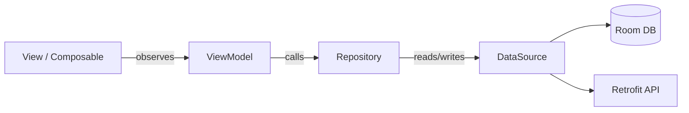
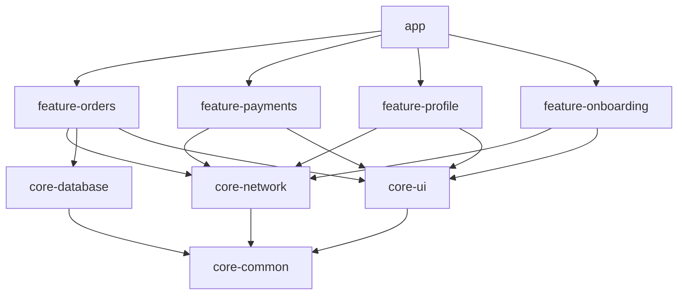
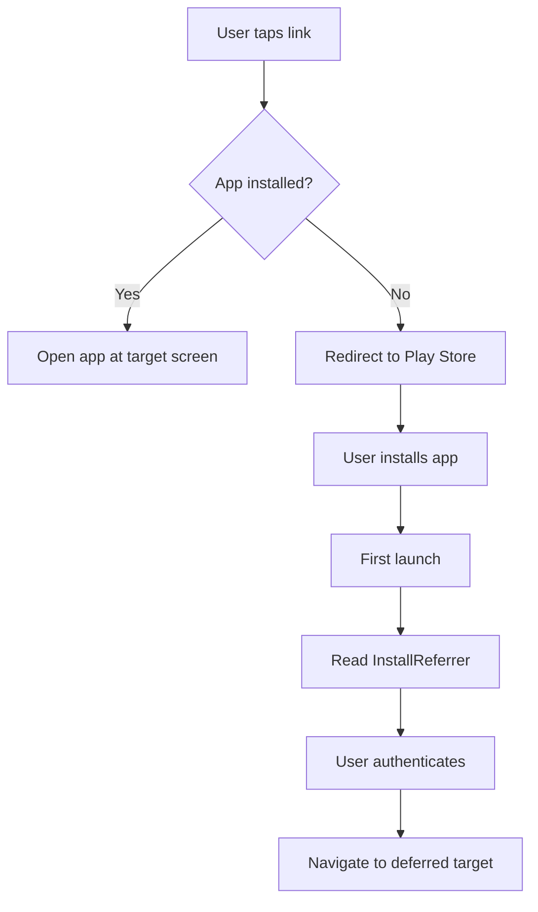

# 🤖 Android Platform Standards

  

---

## 📑 Table of Contents

1. [Gradle Configuration](#1-gradle-configuration)
2. [Build Variants](#2-build-variants)
3. [Architecture](#3-architecture)
4. [Jetpack Compose](#4-jetpack-compose)
5. [ProGuard / R8](#5-proguard--r8)
6. [Kotlin Standards](#6-kotlin-standards)
7. [Multi-Module Structure](#7-multi-module-structure)
8. [CI Pipeline](#8-ci-pipeline)
9. [Dependency Injection](#9-dependency-injection)
10. [WorkManager](#10-workmanager)
11. [Deep Linking](#11-deep-linking)

---

## ⚙️ 1. Gradle Configuration

### 1.1 Kotlin DSL

All `build.gradle` files must use **Kotlin DSL** (`build.gradle.kts`). Groovy DSL is not permitted for new modules. Existing Groovy files must be migrated when the module is next modified.

### 1.2 SDK Policy

| Property | Value | Review Cadence |
|----------|-------|---------------|
| `compileSdk` | Latest stable (currently 35) | Every Android release |
| `targetSdk` | Latest stable (currently 35) | Within 3 months of Google Play deadline |
| `minSdk` | 24 (Android 7.0) | Annual review based on analytics |

### 1.3 Signing Configs

```kotlin
// build.gradle.kts (app)
android {
    signingConfigs {
        create("release") {
            storeFile = file(System.getenv("KEYSTORE_PATH") ?: "debug.keystore")
            storePassword = System.getenv("KEYSTORE_PASSWORD") ?: ""
            keyAlias = System.getenv("KEY_ALIAS") ?: ""
            keyPassword = System.getenv("KEY_PASSWORD") ?: ""
        }
    }
}
```

- Keystore files are stored in **AWS Secrets Manager** and injected into CI.
- Debug builds use the default Android debug keystore.
- Release signing is performed **only in CI** - developers never possess production keystores.

### 1.4 Dependency BoM & Version Catalog

Dependencies are centralized via a **Gradle Version Catalog** (`gradle/libs.versions.toml`):

```toml
[versions]
kotlin = "2.0.21"
compose-bom = "2026.01.00"
coroutines = "1.9.0"
hilt = "2.52"
room = "2.7.0"

[libraries]
compose-bom = { module = "androidx.compose:compose-bom", version.ref = "compose-bom" }
compose-ui = { module = "androidx.compose.ui:ui" }
compose-material3 = { module = "androidx.compose.material3:material3" }
hilt-android = { module = "com.google.dagger:hilt-android", version.ref = "hilt" }
hilt-compiler = { module = "com.google.dagger:hilt-compiler", version.ref = "hilt" }
room-runtime = { module = "androidx.room:room-runtime", version.ref = "room" }
room-compiler = { module = "androidx.room:room-compiler", version.ref = "room" }
coroutines-core = { module = "org.jetbrains.kotlinx:kotlinx-coroutines-core", version.ref = "coroutines" }

[bundles]
compose = ["compose-ui", "compose-material3"]

[plugins]
kotlin-android = { id = "org.jetbrains.kotlin.android", version.ref = "kotlin" }
hilt = { id = "com.google.dagger.hilt.android", version.ref = "hilt" }
```

- All version declarations live in `libs.versions.toml` - hardcoded versions in `build.gradle.kts` are a CI lint failure.
- Renovate Bot auto-creates PRs for dependency updates weekly.

---

## 🔀 2. Build Variants

### 2.1 Standard Variants

| Variant | `debuggable` | API Base URL | Logging | ProGuard |
|---------|-------------|-------------|---------|----------|
| `debug` | `true` | `https://dev-api.{company}.com` | Verbose | Off |
| `staging` | `false` | `https://staging-api.{company}.com` | Info | On (no obfuscation) |
| `release` | `false` | `https://api.{company}.com` | Warn+ only | On (full) |

### 2.2 Product Flavors

```kotlin
android {
    flavorDimensions += "app"
    productFlavors {
        create("customer") {
            dimension = "app"
            applicationId = "com.{company}.customer"
        }
        create("provider") {
            dimension = "app"
            applicationId = "com.{company}.provider"
        }
    }
}
```

### 2.3 Per-Environment Configuration

Environment-specific values are injected via `BuildConfig` fields generated from build variants:

```kotlin
buildTypes {
    getByName("debug") {
        buildConfigField("String", "API_BASE_URL", "\"https://dev-api.{company}.com\"")
        buildConfigField("String", "CODEPUSH_KEY", "\"${System.getenv("DEV_CODEPUSH_KEY")}\"")
    }
    getByName("release") {
        buildConfigField("String", "API_BASE_URL", "\"https://api.{company}.com\"")
        buildConfigField("String", "CODEPUSH_KEY", "\"${System.getenv("PROD_CODEPUSH_KEY")}\"")
    }
}
```

### 2.4 Native-to-JS Configuration Bridge

React Native reads Android build config via a Turbo Module that exposes `BuildConfig` fields to JS:

```kotlin
class BuildConfigModule(reactContext: ReactApplicationContext) : NativeBuildConfigSpec(reactContext) {
    override fun getApiBaseUrl(): String = BuildConfig.API_BASE_URL
    override fun getCodePushKey(): String = BuildConfig.CODEPUSH_KEY
    override fun getVersionName(): String = BuildConfig.VERSION_NAME
    override fun getVersionCode(): Double = BuildConfig.VERSION_CODE.toDouble()
}
```

---

## 🏗️ 3. Architecture

### 3.1 MVVM for Native Modules

All native Android code (Turbo Modules, native screens) follows **MVVM**:



- **View:** Composable functions or Fragments. No business logic.
- **ViewModel:** Holds UI state as `StateFlow`. Calls repositories. Survives configuration changes.
- **Repository:** Single source of truth. Coordinates between local DB and remote API.
- **DataSource:** Thin wrappers around Room DAOs and Retrofit services.

### 3.2 Single-Activity + Fragments

The app uses a **single Activity** (`MainActivity`) that hosts:

1. The **React Native** `ReactRootView` (primary).
2. Native **Fragments** for screens that require native rendering (e.g., map overlays, camera capture).

Navigation between native fragments uses **Jetpack Navigation** with a `NavHostFragment`. Transitions between RN and native screens are coordinated through a shared `NavigationBridge` Turbo Module.

### 3.3 RN Host Relationship

```
MainActivity (AppCompatActivity)
├── ReactRootView (RN app - owns most screens)
└── NavHostFragment (native screens)
    ├── MapFragment
    └── CameraFragment
```

- The RN app sends navigation intents to native via `NavigationBridge.openNativeScreen("map", { orderId: "123" })`.
- Native screens return results via `NavigationBridge.onNativeResult({ screen: "map", data: {...} })`.

---

## 🎨 4. Jetpack Compose

### 4.1 Default for New Native UI

All new native UI must be written in **Jetpack Compose**. XML layouts are permitted only when modifying existing screens that have not yet been migrated.

### 4.2 XML Migration Strategy

| Priority | Screens | Target |
|----------|---------|--------|
| P0 | New screens | Compose from day one |
| P1 | Screens modified this quarter | Migrate during modification |
| P2 | Stable legacy screens | Migrate during scheduled tech-debt sprints |

### 4.3 Compose + React Native Interop

For screens that embed Compose inside a React Native view:

```kotlin
class ComposeViewManager : SimpleViewManager<ComposeView>() {
    override fun getName() = "ComposeNativeView"

    override fun createViewInstance(context: ThemedReactContext): ComposeView {
        return ComposeView(context).apply {
            setContent {
                {Company}Theme {
                    NativeMapView()
                }
            }
        }
    }
}
```

Register as a Fabric component via the `@ReactModule` annotation and a corresponding JS spec.

---

## 🛡️ 5. ProGuard / R8

### 5.1 Ownership

The `proguard-rules.pro` file at the app module root is owned by the **Mobile Platform team**. Changes require review from a platform engineer.

### 5.2 Keep Rules for React Native & SDKs

```proguard
# React Native - do not obfuscate bridge classes
-keep class com.facebook.react.** { *; }
-keep class com.facebook.hermes.** { *; }
-keep class com.facebook.jni.** { *; }

# Turbo Modules - codegen-generated classes
-keep class com.{company}.app.turbomodules.** { *; }

# Crashlytics - preserve stack traces
-keepattributes SourceFile,LineNumberTable
-keep public class * extends java.lang.Exception

# Retrofit - preserve generic signatures for Gson/Moshi
-keepattributes Signature
-keep class com.{company}.app.api.models.** { *; }
```

### 5.3 Consumer ProGuard

Shared Android libraries (`@{company}/mobile-*` AAR modules) include their own `consumer-rules.pro` so that consuming apps automatically inherit the necessary keep rules:

```proguard
# consumer-rules.pro in @{company}/mobile-auth
-keep class com.{company}.mobile.auth.models.** { *; }
-keep class com.{company}.mobile.auth.BiometricHelper { *; }
```

### 5.4 Validation

- CI builds the `release` variant and runs **R8 compatibility checks**.
- A `MissingClassesTest` in the instrumented test suite verifies that no `ClassNotFoundException` occurs on critical paths (login, order placement, payment).
- R8 mapping files (`mapping.txt`) are uploaded to Crashlytics in CI for every release build.

---

## 📝 6. Kotlin Standards

### 6.1 Coroutines as Default

**Coroutines** are the mandated concurrency model. RxJava is permitted only in existing code that has not yet been migrated.

| Pattern | Use |
|---------|-----|
| `suspend fun` | Single async operations |
| `Flow<T>` | Streams of data (replacing `Observable`) |
| `StateFlow<T>` | UI state in ViewModels |
| `SharedFlow<T>` | One-time events (navigation, snackbar) |

### 6.2 Structured Concurrency

- Every coroutine must be launched within a defined **scope** (`viewModelScope`, `lifecycleScope`, or a custom `SupervisorScope`).
- `GlobalScope` is **banned**. CI lint fails on its usage.
- Long-running background work uses `WorkManager`, not coroutines launched in `Application.onCreate()`.

```kotlin
class OrderViewModel @Inject constructor(
    private val orderRepository: OrderRepository,
) : ViewModel() {

    private val _uiState = MutableStateFlow<OrderUiState>(OrderUiState.Loading)
    val uiState: StateFlow<OrderUiState> = _uiState.asStateFlow()

    fun loadOrder(orderId: String) {
        viewModelScope.launch {
            _uiState.value = orderRepository.getOrder(orderId)
                .fold(
                    onSuccess = { OrderUiState.Loaded(it) },
                    onFailure = { OrderUiState.Error(it.message) },
                )
        }
    }
}
```

### 6.3 Null Safety

- **No `!!` (non-null assertion)** in production code. CI lint fails on `!!` usage.
- Prefer `?.let { }`, `?.run { }`, or explicit null checks with early return.
- API response models use nullable types where the backend may omit a field.

---

## 📦 7. Multi-Module Structure

### 7.1 Module Hierarchy

```
app/
├── app/                    # Application module - DI wiring, Application class
├── feature-orders/         # Feature module - order list, detail, tracking
├── feature-payments/       # Feature module - payment flow, wallet
├── feature-profile/        # Feature module - user profile, settings
├── feature-onboarding/     # Feature module - login, OTP, onboarding
├── core-network/           # Core module - Retrofit, interceptors
├── core-database/          # Core module - Room DB, DAOs, migrations
├── core-ui/                # Core module - Compose theme, shared components
├── core-common/            # Core module - extensions, utilities
└── core-testing/           # Core module - test fixtures, fakes
```

### 7.2 Dependency Rules



- `feature-*` modules depend on `core-*` modules. Feature modules **must not** depend on each other.
- `core-*` modules depend only on `core-common` or external libraries.
- Enforced by **ArchUnit** tests in CI.

---

## 🔄 8. CI Pipeline

### 8.1 Pipeline Stages

```mermaid
flowchart LR
    LINT[Android Lint\n+ Detekt] --> UNIT[Kotlin Unit Tests]
    UNIT --> INST[Instrumented Tests\n(API 28 + 34)]
    INST --> BUILD[Assemble Release]
    BUILD --> UPLOAD[Upload to\nPlay Console / Firebase]
```

### 8.2 Quality Gates

| Gate | Tool | Threshold | Blocking? |
|------|------|-----------|----------|
| Lint warnings | Android Lint | 0 new warnings | ✅ |
| Static analysis | Detekt | 0 issues at `error` severity | ✅ |
| Unit test pass rate | JUnit 5 | 100% | ✅ |
| Unit test coverage | JaCoCo | ≥ 80% | ✅ |
| Instrumented test pass rate | AndroidJUnitRunner | 100% | ✅ |
| APK size delta | Bundletool | < 500 KB increase | ⚠️ Warning |

### 8.3 API-Level Matrix

Instrumented tests run on emulators at the following API levels:

| API Level | Android Version | Purpose |
|-----------|----------------|---------|
| 24 | 7.0 (Nougat) | `minSdk` - ensures baseline compatibility |
| 28 | 9.0 (Pie) | Mid-range devices in production fleet |
| 34 | 14 | `targetSdk` - latest behaviour changes |

---

## 💉 9. Dependency Injection

### 9.1 Hilt as Default

**Hilt** is the mandated DI framework. Koin and manual DI are not permitted for new code.

### 9.2 Module Organisation

```kotlin
@Module
@InstallIn(SingletonComponent::class)
object NetworkModule {
    @Provides
    @Singleton
    fun provideRetrofit(
        okHttpClient: OkHttpClient,
        moshi: Moshi,
    ): Retrofit = Retrofit.Builder()
        .baseUrl(BuildConfig.API_BASE_URL)
        .client(okHttpClient)
        .addConverterFactory(MoshiConverterFactory.create(moshi))
        .build()
}

@Module
@InstallIn(ViewModelComponent::class)
object RepositoryModule {
    @Provides
    fun provideOrderRepository(
        api: OrderApi,
        dao: OrderDao,
    ): OrderRepository = OrderRepositoryImpl(api, dao)
}
```

### 9.3 Testing with Hilt

- Use `@HiltAndroidTest` and `@UninstallModules` to swap real implementations for fakes in instrumented tests.
- Unit tests use constructor injection directly - no Hilt test runner needed.

---

## ⏰ 10. WorkManager

### 10.1 Use Cases

| Use Case | Worker Type | Constraints |
|----------|------------|------------|
| **Periodic order sync** | `PeriodicWorkRequest` (15 min) | `NetworkType.CONNECTED` |
| **Upload crash logs** | `OneTimeWorkRequest` | `NetworkType.CONNECTED`, `BatteryNotLow` |
| **Pre-cache map tiles** | `OneTimeWorkRequest` | `NetworkType.UNMETERED`, `Charging` |
| **Time-sensitive delivery update** | Expedited `OneTimeWorkRequest` | None (must run immediately) |

### 10.2 Conventions

- All workers extend `CoroutineWorker` (not `Worker` or `ListenableWorker`).
- Input/output data is serialized via `workDataOf()` - avoid passing large payloads (>10 KB).
- Unique work names follow the pattern: `{company}_{feature}_{action}` (e.g., `{company}_orders_sync`).

### 10.3 Expedited Jobs

For time-critical tasks (e.g., reporting a delivery status change):

```kotlin
val expeditedWork = OneTimeWorkRequestBuilder<DeliveryStatusWorker>()
    .setExpedited(OutOfQuotaPolicy.RUN_AS_NON_EXPEDITED_WORK_REQUEST)
    .setInputData(workDataOf("orderId" to orderId))
    .build()

WorkManager.getInstance(context).enqueueUniqueWork(
    "{company}_delivery_status_$orderId",
    ExistingWorkPolicy.REPLACE,
    expeditedWork,
)
```

---

## 🔗 11. Deep Linking

### 11.1 App Links (Android)

{Company} uses verified **Android App Links** so that `https://app.{company}.com/*` URLs open directly in the app without a disambiguation dialog.

### 11.2 Digital Asset Links

Host `assetlinks.json` at `https://app.{company}.com/.well-known/assetlinks.json`:

```json
[
  {
    "relation": ["delegate_permission/common.handle_all_urls"],
    "target": {
      "namespace": "android_app",
      "package_name": "com.{company}.customer",
      "sha256_cert_fingerprints": ["${RELEASE_CERT_SHA256}"]
    }
  }
]
```

- CI verifies the `assetlinks.json` SHA256 fingerprint matches the release keystore after every signing config change.
- Staging and production use separate `assetlinks.json` files hosted on their respective domains.

### 11.3 Intent Filters

```xml
<activity android:name=".MainActivity"
    android:launchMode="singleTask">
    <intent-filter android:autoVerify="true">
        <action android:name="android.intent.action.VIEW" />
        <category android:name="android.intent.category.DEFAULT" />
        <category android:name="android.intent.category.BROWSABLE" />
        <data android:scheme="https"
              android:host="app.{company}.com"
              android:pathPrefix="/orders" />
        <data android:pathPrefix="/support" />
        <data android:pathPrefix="/wallet" />
    </intent-filter>
</activity>
```

### 11.4 Domain Verification

- `android:autoVerify="true"` triggers automatic domain verification at install time.
- CI runs `adb shell pm get-app-links com.{company}.customer` on the emulator and asserts that the domain status is `verified`.

### 11.5 Deferred Deep Linking

For users who don't have the app installed:

1. The web landing page stores the deep link path in a **first-party cookie** and redirects to the Play Store.
2. On first app launch, the onboarding flow checks for a deferred deep link via the `InstallReferrer` API.
3. After authentication completes, the app navigates to the stored deep link target.



---

<div align="center">

⬅️ [Back to section](./README.md) · 🏠 [Back to root](../README.md)

</div>
