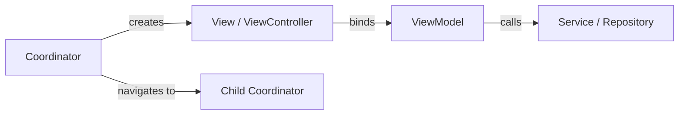

# 🍎 iOS Platform Standards

  

---

## 📑 Table of Contents

1. [Xcode & Dependency Management](#1-xcode--dependency-management)
2. [Architecture](#2-architecture)
3. [Swift Concurrency](#3-swift-concurrency)
4. [SwiftUI](#4-swiftui)
5. [Memory Management](#5-memory-management)
6. [CI Pipeline](#6-ci-pipeline)
7. [Privacy Manifest](#7-privacy-manifest)
8. [App Extensions](#8-app-extensions)
9. [Keychain](#9-keychain)
10. [Push Notifications](#10-push-notifications)
11. [dSYM Management](#11-dsym-management)

---

## 🛠️ 1. Xcode & Dependency Management

### 1.1 Workspace Structure

```
ios/
├── {Company}.xcworkspace         # Top-level workspace (always open this, never the .xcodeproj)
├── {Company}/                    # Main app target
│   ├── App/
│   │   ├── AppDelegate.swift
│   │   └── SceneDelegate.swift
│   ├── Sources/
│   ├── Resources/
│   └── Info.plist
├── {Company}Tests/               # Unit test target
├── {Company}UITests/             # UI test target
├── NotificationServiceExtension/ # Rich push extension
├── ShareExtension/               # Share extension
├── WidgetExtension/              # Home screen widget
└── Podfile                       # CocoaPods (legacy deps only)
```

### 1.2 Swift Package Manager (Default)

**SPM** is the default dependency manager for all new dependencies:

```swift
// Package.swift (for internal packages)
let package = Package(
    name: "{Company}MobileCore",
    platforms: [.iOS(.v16)],
    products: [
        .library(name: "{Company}MobileCore", targets: ["{Company}MobileCore"]),
    ],
    dependencies: [
        .package(url: "https://github.com/pointfreeco/swift-composable-architecture", from: "1.0.0"),
    ],
    targets: [
        .target(name: "{Company}MobileCore", dependencies: []),
        .testTarget(name: "{Company}MobileCoreTests", dependencies: ["{Company}MobileCore"]),
    ]
)
```

### 1.3 CocoaPods (Legacy)

CocoaPods is permitted only for dependencies that do not yet support SPM (e.g., some React Native pods). The `Podfile` is reviewed quarterly and pods are migrated to SPM as upstream support becomes available.

### 1.4 XCFramework

Internal native SDKs are distributed as **XCFrameworks** via the internal Swift Package Registry:

- Built in CI for `arm64` (device) + `x86_64` (simulator).
- Include both `Debug` and `Release` configurations.
- Versioned with semantic versioning and published to the `@{company}/ios-*` namespace.

---

## 🏗️ 2. Architecture

### 2.1 MVVM + Coordinator

All native iOS code follows **MVVM with Coordinators**:

**Visual overview:**



| Layer | Responsibility |
|-------|---------------|
| **Coordinator** | Navigation flow, screen creation, dependency wiring |
| **View** | UI rendering (SwiftUI or UIKit). No business logic. |
| **ViewModel** | UI state (`@Published` / `@Observable`), user action handling, service calls |
| **Service / Repository** | Data access, API calls, local persistence |

### 2.2 Hosting React Native

The main app flow is rendered by React Native. Native screens are presented via coordinators that are triggered from the RN bridge:

```swift
final class NativeScreenCoordinator {
    private let navigationController: UINavigationController

    func presentMapScreen(orderId: String) {
        let viewModel = MapViewModel(orderId: orderId)
        let mapView = MapView(viewModel: viewModel)
        let hostingController = UIHostingController(rootView: mapView)
        navigationController.present(hostingController, animated: true)
    }
}
```

- RN triggers native screens via a Turbo Module: `NativeNavigation.openScreen("map", { orderId: "123" })`.
- Native screens return results via a callback or `NotificationCenter` post that the Turbo Module forwards to JS.

---

## ⚡ 3. Swift Concurrency

### 3.1 async/await as Default

All new asynchronous code must use **Swift structured concurrency** (`async`/`await`). Completion handlers are not permitted in new code.

```swift
func fetchOrder(id: String) async throws -> Order {
    let (data, response) = try await URLSession.shared.data(
        for: OrderAPI.request(id: id)
    )
    guard let httpResponse = response as? HTTPURLResponse,
          httpResponse.statusCode == 200 else {
        throw OrderError.fetchFailed
    }
    return try JSONDecoder().decode(Order.self, from: data)
}
```

### 3.2 Structured Concurrency Rules

| Pattern | When to Use |
|---------|------------|
| `async let` | Parallel independent requests |
| `TaskGroup` | Dynamic number of parallel tasks |
| `Task { }` | Bridge from synchronous context (e.g., `viewDidLoad`) |
| `Task.detached` | **Banned** - use structured alternatives |

- Every `Task` must be stored and cancelled in `deinit` or `onDisappear`.
- `@MainActor` is required on all ViewModel classes and any property that drives UI.

### 3.3 Combine Policy

Combine is permitted **only** in existing code. New reactive streams must use `AsyncSequence` or `AsyncStream`. Migration from Combine to async/await is tracked in Jira under the `tech-debt` epic and scheduled during quarterly tech-debt sprints.

---

## 🎨 4. SwiftUI

### 4.1 Default for New Native UI

All new native screens and components must be written in **SwiftUI**. UIKit is permitted only when:

- Modifying an existing UIKit screen that is not yet scheduled for migration.
- Wrapping a UIKit-only SDK view (e.g., `MKMapView`) via `UIViewRepresentable`.

### 4.2 UIKit Interop

When SwiftUI views need to embed UIKit:

```swift
struct MapViewRepresentable: UIViewRepresentable {
    @Binding var region: MKCoordinateRegion

    func makeUIView(context: Context) -> MKMapView {
        let mapView = MKMapView()
        mapView.delegate = context.coordinator
        return mapView
    }

    func updateUIView(_ mapView: MKMapView, context: Context) {
        mapView.setRegion(region, animated: true)
    }

    func makeCoordinator() -> MapCoordinator {
        MapCoordinator(self)
    }
}
```

### 4.3 Migration Strategy

| Priority | Screens | Timeline |
|----------|---------|----------|
| P0 | New screens | SwiftUI from day one |
| P1 | Screens modified this quarter | Migrate during modification if scope allows |
| P2 | Stable legacy UIKit screens | Scheduled in quarterly tech-debt sprints |
| P3 | Complex UIKit-only views (e.g., custom collection layouts) | Evaluate per case |

---

## 🧠 5. Memory Management

### 5.1 weak / unowned Standards

| Keyword | When to Use | Risk |
|---------|------------|------|
| `weak` | Delegates, closures capturing `self` when `self` may be deallocated | Safe - becomes `nil` |
| `unowned` | Only when the referenced object is **guaranteed** to outlive the reference (e.g., parent → child) | Crash if violated |

**Default to `weak`** unless the lifetime guarantee is architecturally provable and documented.

### 5.2 Capture Lists

All closures that capture `self` must use explicit capture lists:

```swift
// Correct
viewModel.onComplete = { [weak self] result in
    guard let self else { return }
    self.updateUI(with: result)
}

// Forbidden - implicit strong capture
viewModel.onComplete = { result in
    self.updateUI(with: result) // retain cycle risk
}
```

### 5.3 Instruments Leak Detection in CI

- CI runs **Xcode Instruments Leaks** template on the top 5 user flows (login, order placement, order tracking, payment, profile) after every release branch build.
- A leak detected in these flows is a **release blocker**.
- Results are archived as `.trace` files attached to the CI artifact.

### 5.4 Memory Budget

| Metric | Threshold | Action |
|--------|-----------|--------|
| App launch memory | < 80 MB | Warning if exceeded |
| Steady-state memory (foreground) | < 200 MB | Warning > 200 MB, blocker > 300 MB |
| Background memory | < 50 MB | Hard limit - OS will terminate |

---

## 🔄 6. CI Pipeline

### 6.1 Toolchain

| Tool | Purpose |
|------|---------|
| **Fastlane** | Build automation, signing, TestFlight distribution |
| **macOS Runner** | GitHub Actions self-hosted macOS runners (Apple Silicon) |
| **match** | Code signing certificate and profile management |
| **xcpretty** | Human-readable xcodebuild output |

### 6.2 Pipeline Stages

**Visual overview:**

```mermaid
flowchart LR
    LINT[SwiftLint] --> UNIT[Unit Tests\n(XCTest)]
    UNIT --> UI[UI Tests\n(XCUITest)]
    UI --> BUILD[Archive\n(Release)]
    BUILD --> SIGN[Sign via match]
    SIGN --> UPLOAD[TestFlight /\nApp Store Connect]
```

### 6.3 Schemes

| Scheme | Purpose | Tests |
|--------|---------|-------|
| `{Company}-Debug` | Local development | Unit + UI (subset) |
| `{Company}-Staging` | Staging builds for QA | Full unit + UI |
| `{Company}-Release` | App Store / TestFlight | Full unit + UI + Instruments |

### 6.4 Parallel Testing

- Unit tests run on **4 parallel simulators** in CI (`-parallel-testing-enabled YES -maximum-concurrent-test-simulator-destinations 4`).
- UI tests run sequentially to avoid simulator contention.

### 6.5 Code Signing via match

```ruby
# Fastfile
lane :beta do
  match(type: "appstore", readonly: true)
  build_app(scheme: "{Company}-Release")
  upload_to_testflight(skip_waiting_for_build_processing: true)
end
```

- Certificates and profiles are stored in a **private Git repo** managed by `match`.
- CI runners have read-only access. Only the Mobile Platform team can write new profiles.

### 6.6 Simulator OS Matrix

| iOS Version | Purpose |
|-------------|---------|
| Latest (currently 18.x) | Target SDK compliance |
| Latest - 1 (currently 17.x) | Backward compatibility |

Tests must pass on both versions. Failures on either are blocking.

---

## 🔒 7. Privacy Manifest

### 7.1 Required Reason API Inventory

Apple requires a **Privacy Manifest** (`PrivacyInfo.xcprivacy`) declaring all required-reason API usage. {Company} maintains a central inventory:

| API Category | Required Reason | Used By |
|-------------|----------------|---------|
| `NSPrivacyAccessedAPICategoryUserDefaults` | `CA92.1` - app functionality | Auth token caching |
| `NSPrivacyAccessedAPICategoryFileTimestamp` | `C617.1` - file management | Cache invalidation |
| `NSPrivacyAccessedAPICategorySystemBootTime` | `35F9.1` - measure elapsed time | Performance monitoring |
| `NSPrivacyAccessedAPICategoryDiskSpace` | `E174.1` - check available space | Offline tile caching |

### 7.2 SDK Manifest Merge

When integrating third-party SDKs:

1. Verify the SDK ships its own `PrivacyInfo.xcprivacy`.
2. If not, file an issue with the SDK vendor and add the missing declarations to the app-level manifest.
3. CI runs `privacy-manifest-check` that parses all embedded frameworks and validates that every required-reason API usage is declared.

### 7.3 Pod / SPM Reconciliation

- A quarterly script scans all CocoaPods and SPM dependencies for privacy manifest completeness.
- Missing manifests are tracked in a Jira epic (`privacy-manifest-gaps`).
- Dependencies without manifests after two quarterly reviews are candidates for replacement.

---

## 🧩 8. App Extensions

### 8.1 Supported Extensions

| Extension | Purpose | Shared Resources |
|-----------|---------|-----------------|
| **Notification Service Extension** | Rich push (images, action buttons) | Keychain access group, shared UserDefaults suite |
| **Share Extension** | Share content into {Company} app | Keychain access group |
| **Widget Extension** (WidgetKit) | Home screen order status, delivery ETA | App group container, shared Core Data store |
| **Live Activities** | Lock screen delivery tracking | ActivityKit, push-to-update via APNs |

### 8.2 CI Packaging

- Each extension has its own **scheme** in Xcode.
- CI builds and archives all extensions as part of the main app archive.
- Extension binary sizes are tracked independently - a widget exceeding **5 MB** triggers a review.

### 8.3 Entitlements

All extensions share the following entitlements:

```xml
<key>com.apple.security.application-groups</key>
<array>
    <string>group.com.{company}.shared</string>
</array>
<key>keychain-access-groups</key>
<array>
    <string>$(AppIdentifierPrefix)com.{company}.shared-keychain</string>
</array>
```

### 8.4 Live Activities

```swift
struct DeliveryActivityAttributes: ActivityAttributes {
    public struct ContentState: Codable, Hashable {
        var etaMinutes: Int
        var driverName: String
        var status: DeliveryStatus
    }

    var orderId: String
    var restaurantName: String
}
```

- Live Activities are started when an order enters `OUT_FOR_DELIVERY` status.
- Updates are pushed via APNs `push-type: liveactivity`.
- Activities auto-dismiss **4 hours** after the last update (iOS enforced).

---

## 🔑 9. Keychain

### 9.1 Access Groups

{Company} uses a shared **Keychain Access Group** so that the main app and all extensions can share credentials:

```
Access Group: $(AppIdentifierPrefix)com.{company}.shared-keychain
```

### 9.2 Token Sharing

| Token | Keychain Key | Accessibility |
|-------|-------------|--------------|
| Access token (JWT) | `com.{company}.accessToken` | `kSecAttrAccessibleAfterFirstUnlockThisDeviceOnly` |
| Refresh token | `com.{company}.refreshToken` | `kSecAttrAccessibleAfterFirstUnlockThisDeviceOnly` |
| Push device token | `com.{company}.pushToken` | `kSecAttrAccessibleAfterFirstUnlockThisDeviceOnly` |
| Biometric secret | `com.{company}.biometricKey` | `kSecAttrAccessibleWhenPasscodeSetThisDeviceOnly` |

### 9.3 Accessibility Choices

| Value | Use Case |
|-------|---------|
| `AfterFirstUnlockThisDeviceOnly` | Default for most tokens - accessible in background after first unlock, never migrated to new device |
| `WhenPasscodeSetThisDeviceOnly` | Biometric-protected secrets - deleted if passcode is removed |
| `WhenUnlockedThisDeviceOnly` | Highly sensitive data that should only be accessible while the user is actively using the device |

### 9.4 Keychain Wrapper

All keychain operations go through `@{company}/mobile-auth`'s `KeychainManager`:

```swift
final class KeychainManager {
    static let shared = KeychainManager(accessGroup: "$(AppIdentifierPrefix)com.{company}.shared-keychain")

    func save(_ data: Data, forKey key: String, accessibility: CFString) throws
    func load(forKey key: String) throws -> Data?
    func delete(forKey key: String) throws
}
```

---

## 🔔 10. Push Notifications

### 10.1 APNs Auth Key Management

{Company} uses **APNs Auth Key** (`.p8` file) rather than per-certificate authentication:

- A single `.p8` key covers all app bundle IDs and environments (sandbox + production).
- The key is stored in **AWS Secrets Manager** and injected into the backend push service.
- Key rotation occurs annually. The Mobile Platform team owns the rotation runbook.

### 10.2 Background Modes

The following background modes are enabled in `Info.plist`:

| Mode | Entitlement | Purpose |
|------|------------|---------|
| Remote notifications | `remote-notification` | Silent push to trigger background data refresh |
| Background fetch | `fetch` | Periodic order status polling (iOS-scheduled) |
| Location updates | `location` | Provider app delivery tracking |

### 10.3 Entitlements

```xml
<key>aps-environment</key>
<string>production</string>
```

- Debug builds use `development` APS environment automatically via Xcode.
- CI ensures release builds always use `production`.

### 10.4 Rich Notification Service Extension

```swift
class NotificationService: UNNotificationServiceExtension {
    override func didReceive(
        _ request: UNNotificationRequest,
        withContentHandler contentHandler: @escaping (UNNotificationContent) -> Void
    ) {
        guard let mutableContent = request.content.mutableCopy() as? UNMutableNotificationContent,
              let imageUrlString = mutableContent.userInfo["image_url"] as? String,
              let imageUrl = URL(string: imageUrlString) else {
            contentHandler(request.content)
            return
        }

        downloadImage(from: imageUrl) { attachment in
            if let attachment {
                mutableContent.attachments = [attachment]
            }
            contentHandler(mutableContent)
        }
    }
}
```

---

## 📋 11. dSYM Management

### 11.1 Generation in CI

- Every **release** and **staging** build generates dSYMs as part of the `xcodebuild archive` step.
- Bitcode is no longer used (deprecated by Apple). dSYMs are generated directly.
- Build settings: `DEBUG_INFORMATION_FORMAT = dwarf-with-dsym`.

### 11.2 Upload to Crashlytics

```ruby
# Fastfile
lane :upload_dsyms do
  download_dsyms(version: "latest")
  upload_symbols_to_crashlytics(
    gsp_path: "GoogleService-Info.plist",
    binary_path: "./Pods/FirebaseCrashlytics/upload-symbols"
  )
end
```

CI uploads dSYMs immediately after a successful archive. A failed upload is a **non-blocking warning** - the on-call engineer is notified via Slack and must manually re-upload within 24 hours.

### 11.3 Retention Policy

| Artifact | Retention | Storage |
|----------|-----------|---------|
| dSYM files (`.dSYM.zip`) | 90 days | S3 bucket `{company}-ios-dsyms` |
| Build archives (`.xcarchive`) | 30 days | CI runner local storage |
| Crashlytics-uploaded symbols | Indefinite | Firebase Console |

### 11.4 Symbolication SLA

| Severity | Symbolication Turnaround |
|----------|------------------------|
| S1 (app crash affecting >5% users) | < 1 hour (dSYM must already be uploaded) |
| S2 (crash affecting <5% users) | < 4 hours |
| S3/S4 | Next business day |

If a crash report appears unsymbolicated and the dSYM is missing from Crashlytics, the on-call engineer must:

1. Check the S3 retention bucket for the matching build UUID.
2. Manually upload via `upload-symbols` CLI.
3. If the dSYM is not in S3 (outside retention), file a post-mortem on the retention gap.

---

<div align="center">

⬅️ [Back to section](./README.md) · 🏠 [Back to root](../README.md)

</div>
