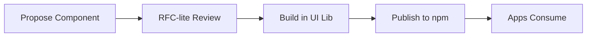
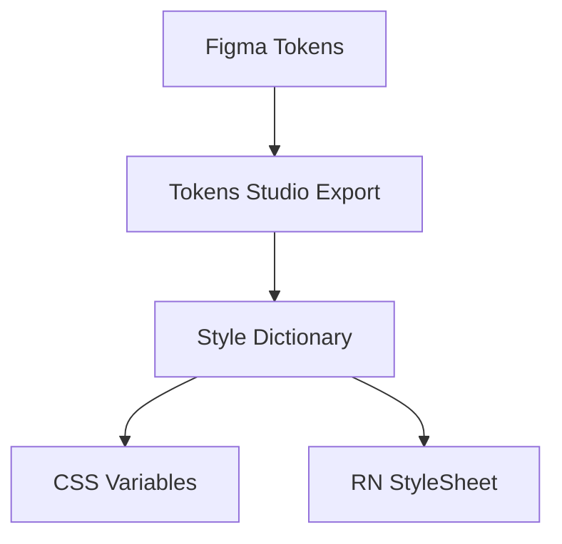

# 🎨 Design System & UX Standards

  

---

## 📑 Table of Contents

1. [Design-to-Dev Handoff](#1-design-to-dev-handoff)
2. [Design System Governance](#2-design-system-governance)
3. [Design Review Process](#3-design-review-process)
4. [Prototyping](#4-prototyping)
5. [User Research Ops](#5-user-research-ops)
6. [Accessibility in Design](#6-accessibility-in-design)
7. [Motion & Animation](#7-motion--animation)
8. [Responsive Breakpoints](#8-responsive-breakpoints)
9. [Design Tokens](#9-design-tokens)
10. [Icon System](#10-icon-system)
11. [Content & UX Writing](#11-content--ux-writing)
12. [Design QA](#12-design-qa)
13. [Multi-Platform Consistency](#13-multi-platform-consistency)
14. [Dark Mode](#14-dark-mode)
15. [Data Visualization](#15-data-visualization)

---

## 🤝 1. Design-to-Dev Handoff

### 1.1 Required States

Every component and screen design must include **all** of the following states before handoff. Missing states are grounds for returning the design for revision.

| State | Description | Required For |
|-------|-------------|-------------|
| **Default** | Normal resting state | All components |
| **Hover** | Mouse/pointer hover (web only) | Buttons, links, cards, interactive elements |
| **Active / Pressed** | During press/tap | Buttons, links, toggleable elements |
| **Disabled** | Non-interactive, visually muted | Form fields, buttons, toggles |
| **Loading** | Skeleton or spinner while data loads | Screens, cards, lists, buttons with async actions |
| **Error** | Validation error or failure state | Form fields, screens, data-dependent components |
| **Empty** | No data / first-time-use state | Lists, dashboards, search results |

### 1.2 Figma File Structure

```
{Company} Design System (Figma)
├── 🎨 Foundations
│   ├── Colors
│   ├── Typography
│   ├── Spacing & Grid
│   ├── Elevation
│   └── Icons
├── 🧩 Components
│   ├── Buttons
│   ├── Inputs
│   ├── Cards
│   ├── Navigation
│   ├── Modals & Sheets
│   └── Feedback (toasts, alerts, banners)
├── 📱 Patterns
│   ├── Forms
│   ├── Lists & Tables
│   ├── Onboarding
│   └── Error & Empty States
└── 📐 Templates
    ├── Customer App Screens
    ├── Provider App Screens
    └── Ops Portal Screens
```

### 1.3 Figma Dev Mode

- All production Figma files must have **Dev Mode** enabled.
- Developers use Dev Mode to inspect spacing, extract tokens, and copy component code snippets.
- Designers must ensure component properties and auto-layout values are clean before marking a frame "Ready for development".

---

## 🏛️ 2. Design System Governance

### 2.1 Team Composition

The Design System team is a rotating cross-functional group:

| Role | Count | Rotation |
|------|-------|----------|
| Designer (lead) | 1 | Permanent |
| Frontend Engineer | 1 | Permanent |
| Rotating Designer | 1 | Quarterly rotation from product teams |
| Rotating Engineer | 1 | Quarterly rotation from product teams |

### 2.2 RFC-Lite for New Components

Before adding a new component to `@{company}/ui`:

1. Author files an **RFC-Lite** (1-page doc): problem statement, proposed API, alternatives considered.
2. RFC is posted in `#design-system` Slack channel for **3 business days** of async feedback.
3. The Design System team reviews in the **bi-weekly sync** (30 min).
4. Approved components are assigned a sprint for implementation.

**Visual overview:**



### 2.3 Versioning

- The design system package (`@{company}/ui`) follows **semantic versioning**.
- **Patch:** Bug fixes, minor visual tweaks within existing API.
- **Minor:** New components or new props on existing components (backward-compatible).
- **Major:** Breaking API changes (prop renames, component removals).

### 2.4 Deprecation Policy

- Deprecated components carry a `@deprecated` JSDoc tag and console warning in development.
- Deprecated components are **removed after 3 months** (minimum 1 major version).
- The deprecation notice includes migration instructions and a link to the replacement.

---

## 🔍 3. Design Review Process

### 3.1 Mandate

**All UI changes** require a design review before development begins. No exceptions.

### 3.2 Review Format

| Step | Format | Duration | Required? |
|------|--------|----------|----------|
| Async Figma review | Designer annotates feedback in Figma | 15 min | Always |
| Sync design crit | Video call with designer + engineer | 30 min | Only if async feedback has unresolved questions |

### 3.3 Design Crit Protocol

1. Designer presents the design (5 min).
2. Engineer asks clarifying questions (10 min).
3. Group identifies gaps (edge cases, states, responsive behavior) (10 min).
4. Action items documented in Figma comments (5 min).

---

## 🧪 4. Prototyping

### 4.1 Tool Selection

| Prototype Type | Tool | When to Use |
|---------------|------|-------------|
| Flow / navigation | Figma prototyping | Validating user flows, usability testing |
| Interaction / animation | Code prototype (React / RN) | Complex gestures, custom transitions, haptics |
| Data-driven | Storybook (web) / Expo (mobile) | Components with real API data |

### 4.2 Prototype Lifecycle

- Prototypes are **throwaway** - they are never promoted to production code.
- Code prototypes live in `apps/prototype/` in the monorepo and are excluded from CI.
- Figma prototypes are archived after the feature ships.

---

## 👥 5. User Research Ops

### 5.1 Scheduling

- **Calendly** handles participant scheduling with pre-configured time slots.
- Research sessions are recorded (with consent) and stored in the research repository.

### 5.2 Incentive Budget

| Participant Type | Incentive | Approval |
|-----------------|-----------|----------|
| Existing customer | $25 credit | Auto-approved |
| External participant | $50 gift card | Manager approval |
| Expert review (domain specialist) | $150/hour | Director approval |

### 5.3 Insight Repository

| Tool | Purpose |
|------|---------|
| **Dovetail** (primary) | Tagging, analysis, insight synthesis |
| **Notion** (secondary) | Research planning, participant tracking |

### 5.4 Insights in Sprint Review

- At least **one research insight** is presented in every sprint review.
- Insights are tagged with the relevant product area and linked to Jira epics.
- Stale insights (>6 months without action) are reviewed quarterly and either actioned or archived.

---

## ♿ 6. Accessibility in Design

### 6.1 Annotated Focus Order

Designers must annotate **reading order** and **focus order** on every screen:

- Numbered annotations (1, 2, 3, …) indicating the sequence a screen reader will traverse.
- Tab stops for keyboard navigation (web).
- Focus traps for modals and bottom sheets.

### 6.2 Contrast Checking

- **Stark** plugin in Figma runs contrast checks on all text and interactive elements.
- Minimum contrast ratios per WCAG 2.1 AA:

| Element | Ratio |
|---------|-------|
| Normal text (< 18px) | 4.5:1 |
| Large text (≥ 18px bold or ≥ 24px) | 3:1 |
| UI components and graphical objects | 3:1 |

### 6.3 WCAG Review Before Handoff

Before marking any design "Ready for development", the designer must complete:

- [ ] Contrast check passes (Stark plugin)
- [ ] Focus order annotated
- [ ] Touch targets ≥ 44×44 pt (iOS) / 48×48 dp (Android)
- [ ] No information conveyed by colour alone
- [ ] Alt text written for meaningful images
- [ ] Motion has reduced-motion alternative

---

## 🎬 7. Motion & Animation

### 7.1 Duration Scale

| Token | Duration | Use Case |
|-------|----------|----------|
| `duration-fast` | 100 ms | Micro-interactions (toggle, checkbox) |
| `duration-normal` | 200 ms | Component transitions (expand, collapse) |
| `duration-slow` | 300 ms | Page transitions, modals, complex reveals |

### 7.2 Easing

| Context | Easing Function | CSS Value |
|---------|----------------|-----------|
| **Enter / appear** | Ease-out (decelerate) | `cubic-bezier(0, 0, 0.2, 1)` |
| **Exit / disappear** | Ease-in (accelerate) | `cubic-bezier(0.4, 0, 1, 1)` |
| **Move / resize** | Ease-in-out | `cubic-bezier(0.4, 0, 0.2, 1)` |

### 7.3 prefers-reduced-motion

All animations must respect the user's OS preference:

```css
@media (prefers-reduced-motion: reduce) {
  *, *::before, *::after {
    animation-duration: 0.01ms !important;
    transition-duration: 0.01ms !important;
  }
}
```

In React Native:

```typescript
import { AccessibilityInfo } from 'react-native';

const isReduceMotion = await AccessibilityInfo.isReduceMotionEnabled();
```

Components that animate must check this flag and provide a static alternative.

---

## 📐 8. Responsive Breakpoints

### 8.1 Breakpoint Scale

| Token | Width | Tailwind Class |
|-------|-------|---------------|
| `sm` | 640 px | `sm:` |
| `md` | 768 px | `md:` |
| `lg` | 1024 px | `lg:` |
| `xl` | 1280 px | `xl:` |

### 8.2 Mobile-First

All CSS is written **mobile-first**: base styles target small screens, breakpoints layer on larger-screen overrides.

```css
.card {
  padding: var(--spacing-4);
  flex-direction: column;
}
@media (min-width: 768px) {
  .card {
    flex-direction: row;
    padding: var(--spacing-6);
  }
}
```

### 8.3 Container Queries

For components that need to respond to their container size rather than viewport:

```css
.card-container {
  container-type: inline-size;
  container-name: card;
}
@container card (min-width: 400px) {
  .card {
    flex-direction: row;
  }
}
```

Container queries are preferred for reusable components in `@{company}/ui`.

---

## 🪙 9. Design Tokens

### 9.1 Naming Convention

Tokens follow the pattern: `{category}-{property}-{variant}`

| Category | Property | Variant | Example |
|----------|----------|---------|---------|
| `color` | `background` | `primary` | `color-background-primary` |
| `color` | `text` | `secondary` | `color-text-secondary` |
| `spacing` | `padding` | `lg` | `spacing-padding-lg` |
| `font` | `size` | `heading-1` | `font-size-heading-1` |
| `border` | `radius` | `md` | `border-radius-md` |

### 9.2 Cross-Platform Parity

Design tokens are defined once and compiled to platform-specific formats:

| Platform | Output Format | Example |
|----------|-------------|---------|
| **Web** | CSS Custom Properties | `var(--color-background-primary)` |
| **React Native** | StyleSheet constants | `tokens.colorBackgroundPrimary` |
| **iOS (native)** | Swift constants | `DesignTokens.colorBackgroundPrimary` |
| **Android (native)** | Compose Color/Dp values | `{Company}Theme.colors.backgroundPrimary` |

Token compilation uses **Style Dictionary** with platform-specific transforms. The token source lives in `packages/@{company}/design-tokens/tokens/`.

**Visual overview:**



---

## 🖼️ 10. Icon System

### 10.1 Grid & Sizing

- All icons are designed on a **24×24 px** grid.
- Stroke width: **1.5 px** (consistent across all icons).
- Available sizes: **16, 20, 24, 32** px.
- Icons are **monochrome** - they inherit `currentColor` (web) or tint color (mobile).

### 10.2 Web Delivery

Icons are delivered as an **SVG sprite** for web:

```html
<svg class="icon icon--24">
  <use href="/icons/sprite.svg#arrow-left" />
</svg>
```

### 10.3 Mobile Delivery

Mobile apps use **react-native-vector-icons** with a custom icon font generated from the same SVG sources:

```typescript
import { Icon } from '@{company}/mobile-ui';

<Icon name="arrow-left" size={24} color={tokens.colorIconPrimary} />
```

### 10.4 Adding New Icons

1. Designer creates the icon in Figma following the 24px grid.
2. SVG is exported and added to `packages/@{company}/icons/svg/`.
3. CI generates the SVG sprite (web) and icon font (mobile) automatically.
4. The icon is available in the next `@{company}/icons` release.

---

## ✍️ 11. Content & UX Writing

### 11.1 Tone

| Principle | Do | Don't |
|-----------|-----|-------|
| **Clear** | "Your order is on its way" | "Order status has been updated to in-transit" |
| **Concise** | "Save changes?" | "Would you like to save the changes you've made?" |
| **Human** | "Something went wrong. Try again." | "Error 500: Internal Server Error" |
| **Actionable** | "Add a payment method to continue" | "No payment method found" |

### 11.2 Microcopy Patterns

| Pattern | Template | Example |
|---------|----------|---------|
| **Confirmation** | `{Action} {object}?` | "Delete this address?" |
| **Success** | `{Object} {past-tense action}` | "Address saved" |
| **Empty state** | `No {objects} yet. {CTA to create}.` | "No orders yet. Browse restaurants to get started." |
| **Permission request** | `{Company} needs {permission} to {benefit}.` | "{Company} needs your location to find nearby restaurants." |

### 11.3 Error Message Taxonomy

| Error Type | Title Pattern | Body Pattern | Example |
|-----------|--------------|-------------|---------|
| **Validation** | "{Field} is invalid" | Explain the requirement | "Email is invalid. Enter a valid email address." |
| **Network** | "Connection issue" | Reassure + retry | "We couldn't reach our servers. Check your connection and try again." |
| **Server** | "Something went wrong" | Apologise + action | "Something went wrong on our end. Please try again in a few minutes." |
| **Permission** | "Access needed" | Explain why + how | "Location access is needed to show nearby restaurants. Enable it in Settings." |
| **Business rule** | Specific to context | Explain the constraint | "This restaurant is closed right now. Check back during business hours." |

---

## ✅ 12. Design QA

### 12.1 Mandate

A designer must review the implemented UI **before every release** that includes visual changes. This is a non-optional gate.

### 12.2 Tolerance

- Spacing, sizing, and alignment must match the Figma spec within **2 px**.
- Colour values must be exact (validated via design tokens - no hardcoded hex).
- Typography must match the token value (no manual font size overrides).

### 12.3 Pre-Ship Sign-Off

The designer adds a ✅ comment on the PR with:

```
Design QA: ✅ Approved
- [x] States: all 7 states verified
- [x] Spacing: within 2px tolerance
- [x] Typography: matches tokens
- [x] Responsive: checked at sm/md/lg/xl
- [x] Dark mode: verified
- [x] Accessibility: focus order correct
```

A PR with UI changes **cannot be merged** without this sign-off.

---

## 📱 13. Multi-Platform Consistency

### 13.1 Shared Patterns

The following patterns are **consistent across all platforms** (web, iOS, Android):

- Navigation structure (tab bar items, order, icons)
- Colour palette and semantic token values
- Typography scale
- Icon set
- Error message copy
- Empty state illustrations and copy

### 13.2 Platform HIG Allowances

Where platform Human Interface Guidelines (HIG) diverge, follow the platform:

| Element | iOS (HIG) | Android (Material) | Web |
|---------|-----------|-------------------|-----|
| **Back navigation** | Swipe from left edge | System back button / gesture | Browser back |
| **Bottom sheet** | iOS-style with drag indicator | Material bottom sheet | Popover or drawer |
| **Date picker** | UIDatePicker / SwiftUI DatePicker | Material DatePicker | Native `<input type="date">` or custom |
| **Haptic feedback** | UIImpactFeedbackGenerator | VibrationEffect | Not applicable |
| **System font** | SF Pro | Roboto | System font stack |

---

## 🌙 14. Dark Mode

### 14.1 Semantic Tokens

Dark mode is implemented via **semantic tokens**, not by inverting colours:

| Token | Light Value | Dark Value |
|-------|-----------|-----------|
| `color-background-primary` | `#FFFFFF` | `#1A1A1A` |
| `color-background-secondary` | `#F5F5F5` | `#2D2D2D` |
| `color-text-primary` | `#1A1A1A` | `#F5F5F5` |
| `color-text-secondary` | `#6B6B6B` | `#A0A0A0` |
| `color-border-default` | `#E0E0E0` | `#3D3D3D` |
| `color-surface-elevated` | `#FFFFFF` | `#2D2D2D` |

### 14.2 Mode Selection

- The app respects the **OS preference** by default.
- Users can override via a **manual toggle** in Settings (options: System / Light / Dark).
- The user's choice is persisted in local storage (web) or UserDefaults (mobile).

### 14.3 Image Variants

- Illustrations and decorative images must provide **light** and **dark** variants.
- Photographs do not change between modes.
- Icons inherit `currentColor` and adapt automatically.

```typescript
const illustration = colorScheme === 'dark'
  ? require('./assets/empty-state-dark.png')
  : require('./assets/empty-state-light.png');
```

---

## 📊 15. Data Visualization

### 15.1 Library Selection

| Platform | Library | Rationale |
|----------|---------|-----------|
| **Web** | Recharts | Composable, responsive, good accessibility support |
| **Mobile (RN)** | Victory Native | React Native compatible, shared API concepts with web |

### 15.2 Accessibility-Safe Colour Palette

The data visualization palette is designed to be distinguishable by users with colour vision deficiencies:

| Index | Name | Hex | Usage |
|-------|------|-----|-------|
| 1 | Blue | `#2563EB` | Primary data series |
| 2 | Orange | `#EA580C` | Secondary data series |
| 3 | Teal | `#0D9488` | Tertiary data series |
| 4 | Purple | `#7C3AED` | Quaternary data series |
| 5 | Rose | `#E11D48` | Alerts, negative trends |
| 6 | Amber | `#D97706` | Warnings, neutral trends |
| 7 | Emerald | `#059669` | Positive trends |
| 8 | Slate | `#475569` | Baseline, reference lines |

### 15.3 Chart Standards

- All charts must have **axis labels** and a **legend**.
- Interactive charts provide **tooltips** on hover/tap.
- Charts must be keyboard-navigable (web) and screen-reader-accessible (ARIA labels).
- Use **patterns** (stripes, dots) in addition to colour to differentiate data series for colour-blind users.

---

<div align="center">

⬅️ [Back to section](./README.md) · 🏠 [Back to root](../README.md)

</div>
