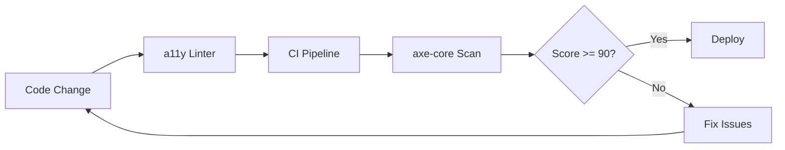

# ♿ Accessibility Standards

  

---

## 🎯 1. Overview

Accessibility is not optional. Every {Company} product - web and mobile - must meet WCAG 2.2 Level AA compliance as a minimum. Accessibility requirements apply to all new features at launch, not as a follow-up. Teams that ship inaccessible features must remediate before moving to the next sprint.

> **Rule:** No feature ships without passing automated accessibility checks in CI and a manual screen reader test for new interaction patterns.

---

## 📐 2. Compliance Targets

| Platform | Standard | Level | Enforcement |
|----------|----------|-------|-------------|
| **Web** | WCAG 2.2 | AA | CI checks + manual audit quarterly |
| **iOS** | WCAG 2.2 + Apple HIG | AA | CI checks + VoiceOver testing |
| **Android** | WCAG 2.2 + Material a11y | AA | CI checks + TalkBack testing |
| **Design system** | WCAG 2.2 | AA | Component-level audit on release |

---

## 🧩 3. Core Requirements

### 3.1 Perceivable

| Requirement | Standard | Implementation |
|-------------|----------|----------------|
| **Color contrast** | Minimum 4.5:1 for normal text, 3:1 for large text | Enforced in design tokens; CI linting |
| **Alt text** | All meaningful images have descriptive alt text | Linter rule: no `` without `alt` |
| **Captions** | Video and audio content has synchronized captions | Required before media publication |
| **Text resizing** | Content readable at 200% zoom without horizontal scroll | Responsive layout testing |

### 3.2 Operable

| Requirement | Standard | Implementation |
|-------------|----------|----------------|
| **Keyboard navigation** | All interactive elements reachable via keyboard | Tab order testing in CI |
| **Focus indicators** | Visible focus ring on all interactive elements | Design system enforces `:focus-visible` styles |
| **Touch targets** | Minimum 44x44 CSS pixels (48x48dp on mobile) | Design system component minimums |
| **Motion** | Respect `prefers-reduced-motion` | CSS media query in all animations |

### 3.3 Understandable

| Requirement | Standard | Implementation |
|-------------|----------|----------------|
| **Language attribute** | `lang` set on `<html>` and language changes | Template default; linter check |
| **Error identification** | Form errors described in text, not color alone | Design system form components |
| **Consistent navigation** | Same UI patterns across the application | Design system enforcement |

### 3.4 Robust

| Requirement | Standard | Implementation |
|-------------|----------|----------------|
| **Valid HTML** | Semantic elements used correctly | Linter rules; no `div` buttons |
| **ARIA usage** | ARIA only when native HTML is insufficient | Linter warns on redundant ARIA |
| **Screen reader testing** | VoiceOver (iOS/macOS), TalkBack (Android), NVDA (Windows) | Manual QA per release |

---

## 🔧 4. Tooling

| Tool | Purpose | Integration Point |
|------|---------|-------------------|
| **axe-core** | Automated WCAG checks | CI pipeline, pre-commit hook |
| **eslint-plugin-jsx-a11y** | JSX accessibility linting | IDE + CI |
| **Lighthouse** | Accessibility score audit | CI gate (score >= 90) |
| **Accessibility Inspector** | iOS VoiceOver debugging | Manual QA |
| **Accessibility Scanner** | Android TalkBack debugging | Manual QA |

**Visual overview:**

---

## 📋 5. Testing Checklist

Every feature must pass this checklist before release:

| Check | Method | Required |
|-------|--------|----------|
| axe-core reports zero critical violations | Automated CI | Yes |
| Lighthouse accessibility score >= 90 | Automated CI | Yes |
| Keyboard-only navigation works for all flows | Manual QA | Yes |
| Screen reader announces all content correctly | Manual QA | Yes - for new patterns |
| Color contrast meets 4.5:1 minimum | Automated CI | Yes |
| Touch targets meet minimum size | Design review | Yes - mobile |
| Content readable at 200% zoom | Manual QA | Yes - web |

---

## ⚠️ 6. Anti-Patterns

| Anti-Pattern | Problem | Fix |
|-------------|---------|-----|
| "We'll add accessibility later" | Retrofitting is 5 - 10x more expensive | Build accessible from the start |
| Color-only indicators | Colorblind users cannot distinguish states | Use icons, text, or patterns alongside color |
| Div soup | Screen readers cannot parse non-semantic markup | Use semantic HTML elements |
| Disabled focus outlines | Keyboard users cannot see where they are | Use `:focus-visible` styles from the design system |
| Mouse-only interactions | Keyboard and switch users are excluded | Every mouse action must have a keyboard equivalent |

---

⬅️ [Back to section](./README.md) · 🏠 [Back to root](../README.md)

