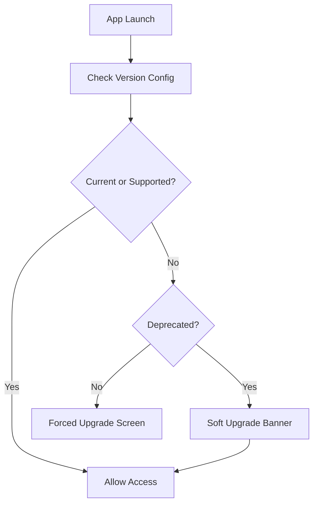

# 📱 Minimum Version and Forced Upgrade Policy

  

---

## 🎯 1. Overview

Supporting old mobile app versions indefinitely creates security risk, engineering burden, and API compatibility headaches. {Company} enforces a minimum version policy that balances user experience with operational sustainability. This policy defines when and how we deprecate, soft-upgrade, and force-upgrade mobile app versions.

> **Rule:** The minimum supported app version must be no more than 3 major versions behind the current release. Versions below minimum must trigger a forced upgrade.

---

## 📐 2. Version Support Tiers

| Tier | Definition | User Experience | API Support |
|------|-----------|----------------|-------------|
| **Current** | Latest released version | Full features, no prompts | Full API access |
| **Supported** | Within 3 major versions of current | Full features, optional upgrade prompt | Full API access |
| **Deprecated** | 1 version below supported threshold | Soft upgrade banner, all features work | Full API access with deprecation headers |
| **End of Life** | Below deprecated threshold | Forced upgrade screen, app blocked | API returns 426 Upgrade Required |

---

## 🔄 3. Upgrade Flow

**Visual overview:**

### 3.1 Soft Upgrade

- Non-blocking banner at the top of the app; dismissible but reappears each session
- Links to App Store or Google Play; tracks dismiss rate and upgrade conversion

### 3.2 Forced Upgrade

- Full-screen blocking modal with no dismiss option
- Clear messaging and a single button linking to the app store

---

## 📋 4. Version Configuration

Version policy is controlled via remote configuration, not hardcoded:

| Configuration | Location | Update Process |
|--------------|----------|----------------|
| Version thresholds (min supported, deprecated, current) | Remote config (Firebase / LaunchDarkly) | Updated with each major release |
| Upgrade messages | Remote config | Updated as needed, no app release required |
| Store URLs | Remote config | Per-platform deep links to store listings |

---

## 📊 5. Release Cadence and Version Lifecycle

| Event | Timeline | Action |
|-------|----------|--------|
| **Major release** | Every 8 - 12 weeks | Increment current version; shift support window |
| **Deprecation notice** | 4 weeks before EOL | Enable soft upgrade banner for deprecated versions |
| **Forced upgrade** | On EOL date | Enable forced upgrade for EOL versions |
| **API sunset** | 2 weeks after forced upgrade | Remove deprecated API endpoints |

### 5.1 Communication Plan

| Audience | Channel | Timing |
|----------|---------|--------|
| Users on deprecated versions | In-app banner + push notification | 4 weeks before forced upgrade |
| Users on EOL versions | In-app forced upgrade screen | On EOL date |
| Internal teams | Slack `#mobile-releases` + email | 6 weeks before EOL |
| Support team | Knowledge base article | 4 weeks before EOL |

---

## 🛡️ 6. API Compatibility

| Header | Purpose |
|--------|---------|
| `X-App-Version` | Client sends current app version on every request |
| `X-Min-Version` | Server responds with minimum supported version |
| `Deprecation` | Server indicates endpoint deprecation date |
| `Sunset` | Server indicates endpoint removal date |

### 6.1 Server-Side Version Check

The API gateway validates `X-App-Version` on every request:

| Condition | Response |
|-----------|----------|
| Version >= minimum supported | Normal response |
| Version in deprecated range | Normal response + `Deprecation` header |
| Version < deprecated threshold | `426 Upgrade Required` with upgrade URL |
| Missing version header | `400 Bad Request` |

---

## 📈 7. Metrics

| Metric | Target |
|--------|--------|
| Users on current or supported versions | > 95% of MAU |
| Forced upgrade completion rate (within 7 days) | > 90% |
| User churn from forced upgrade | < 2% |
| Time from soft upgrade to user action | < 14 days median |

---

## ⚠️ 8. Anti-Patterns

| Anti-Pattern | Problem | Fix |
|-------------|---------|-----|
| Hardcoded version checks | Requires app release to change policy | Use remote configuration |
| No deprecation window | Users forced to upgrade without warning | Minimum 4-week soft upgrade period |
| Supporting versions indefinitely | Engineering burden, security risk | Enforce 3-major-version support window |
| Silent API breakage | Old clients fail without explanation | Return 426 with clear upgrade instructions |

---

⬅️ [Back to section](./README.md) · 🏠 [Back to root](../README.md)

