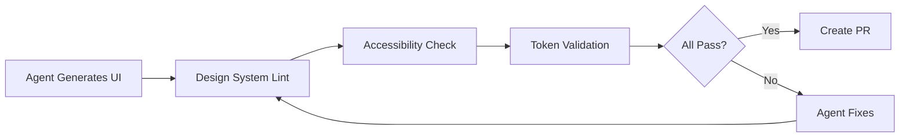

# 🤖 Agent-Generated UI Constraints

  

---

## 🎯 1. Overview

AI agents increasingly generate UI code - from component scaffolding to full page layouts. Without constraints, agent-generated UI diverges from the design system, introduces accessibility violations, and creates visual inconsistency. This guide defines the rules that agents must follow when generating or modifying UI at {Company}.

> **Rule:** All agent-generated UI must use design system components exclusively. Custom HTML elements, inline styles, and components outside the design system are rejected in code review.

---

## 📐 2. Design System Constraints

### 2.1 Component Usage Rules

| Rule | Rationale |
|------|-----------|
| Use only components from `@{company}/design-system` | Consistency, accessibility, theming |
| No custom CSS for layout | Use design system layout primitives (Stack, Grid, Box) |
| No inline styles | Styles must come from design tokens or component props |
| No raw HTML elements for interactive controls | Use Button, Link, Input from design system |
| No hardcoded colors | Use design token references |
| No hardcoded spacing values | Use spacing scale tokens (4, 8, 12, 16, 24, 32, 48) |

### 2.2 Component Selection Matrix

| Need | Component | Never Use |
|------|-----------|-----------|
| User action | `<Button>` | `
`, `<a>` styled as button |
| Text input | `<TextField>` | `<input>` |
| Selection from options | `<Select>`, `<RadioGroup>` | `<select>` |
| Navigation | `<Link>`, `<NavItem>` | `<a>` |
| Data display | `<Table>`, `<Card>`, `<List>` | `<table>`, `
` grids |
| Feedback | `<Toast>`, `<Alert>` | `window.alert()`, custom modals |
| Layout | `<Stack>`, `<Grid>`, `<Box>` | `
` with flexbox styles |

---

## 🎨 3. Design Token Requirements

Agents must reference design tokens, never raw values:

| Property | Token Format | Example |
|----------|-------------|---------|
| **Color** | `color.{semantic}.{variant}` | `color.primary.default` |
| **Spacing** | `spacing.{scale}` | `spacing.16` |
| **Typography** | `typography.{variant}` | `typography.heading.lg` |
| **Border radius** | `radius.{size}` | `radius.md` |
| **Shadow** | `shadow.{elevation}` | `shadow.sm` |
| **Breakpoint** | `breakpoint.{size}` | `breakpoint.md` |

---

## ♿ 4. Accessibility Constraints for Agents

| Constraint | Implementation |
|-----------|----------------|
| All images must have `alt` text | Agent must generate descriptive alt text or `alt=""` for decorative images |
| Interactive elements must be keyboard accessible | Use design system components (they handle this) |
| Form fields must have visible labels | Always pair `<TextField>` with `label` prop |
| Color must not be the only indicator | Use icons or text alongside color states |
| Focus order must be logical | Follow DOM order; no `tabIndex > 0` |
| ARIA attributes only when needed | Design system components include ARIA; do not add redundant attributes |

**Visual overview:**

---

## 📋 5. Layout and Responsive Rules

| Rule | Standard |
|------|----------|
| **Mobile-first** | Start with mobile layout, enhance for larger screens |
| **Breakpoints** | Use design system breakpoints only (sm, md, lg, xl) |
| **Touch targets** | Minimum 44x44 CSS pixels on mobile |
| **Content reflow** | No horizontal scroll at any breakpoint |
| **Max content width** | Constrain content to design system max-width token |
| **Spacing consistency** | Use spacing scale - no arbitrary pixel values |

---

## 🔧 6. Agent Tooling Integration

| Tool | Purpose |
|------|---------|
| **ESLint design-system plugin** | Reject non-design-system components and inline styles |
| **Stylelint** | Reject hardcoded colors and spacing values |
| **Storybook** | Agent references component examples and props |
| **Visual regression (Chromatic)** | Catch unintended visual changes from agent edits |

---

## 📊 7. Quality Gates

| Gate | Threshold |
|------|-----------|
| Design system compliance (ESLint) | 100% - zero violations |
| Accessibility score (axe-core) | >= 90 |
| Visual regression (Chromatic) | Zero unreviewed changes |
| Token usage (Stylelint) | 100% - no hardcoded values |
| Responsive check (Playwright) | All breakpoints pass |

Agents must not create new design system components, override component styles, use third-party UI libraries, or remove existing accessibility attributes.

---

## ⚠️ 8. Anti-Patterns

| Anti-Pattern | Problem | Fix |
|-------------|---------|-----|
| `
` instead of `<Button>` | Not keyboard accessible, no button semantics | Use design system `<Button>` |
| Inline `style={{ color: '#333' }}` | Breaks theming, ignores dark mode | Use design token `color.text.primary` |
| Custom modal implementation | Accessibility issues, inconsistent behavior | Use design system `<Dialog>` |
| `px` values for spacing | Inconsistent spacing, not scale-based | Use spacing tokens |
| Agent generates entire page without design system | Massive cleanup required in review | Configure agent context with design system docs |

---

⬅️ [Back to section](./README.md) · 🏠 [Back to root](../README.md)

