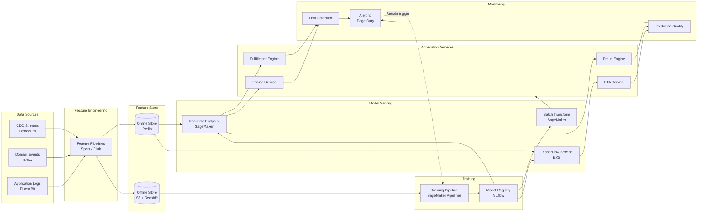
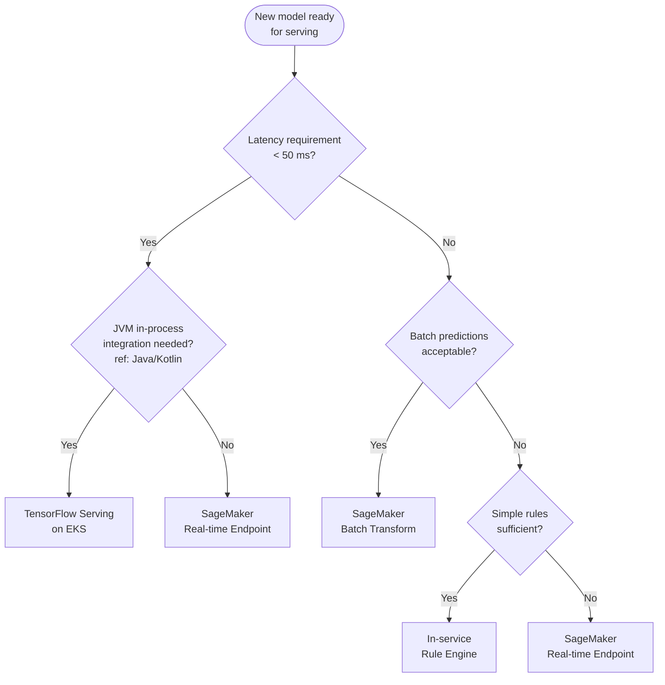
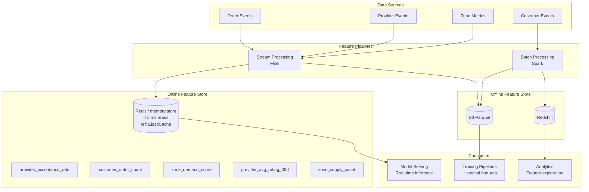
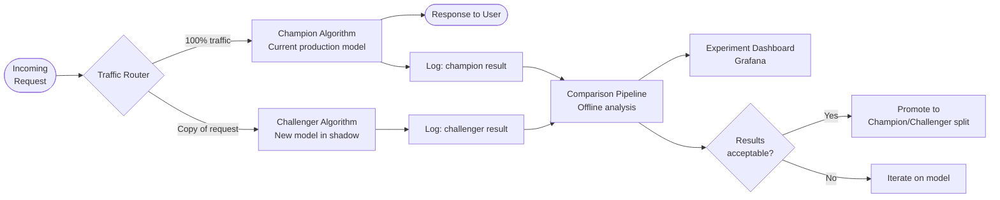
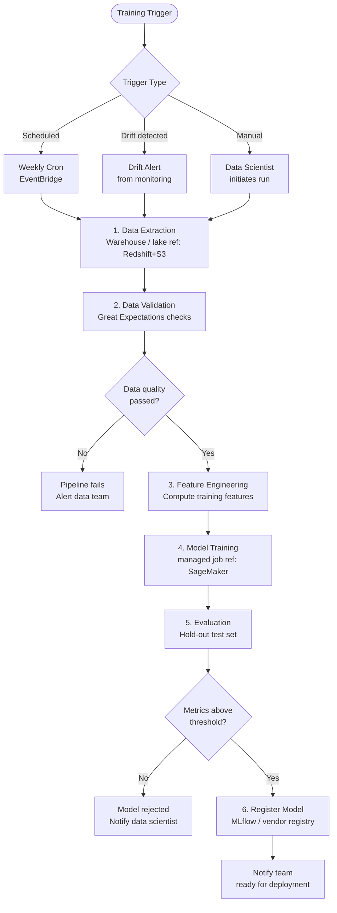
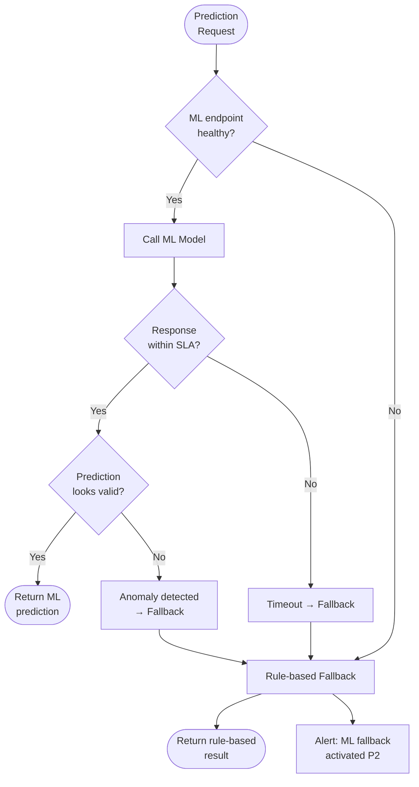

# 🤖 ML Platform


---

## 📋 1. ML Use Cases at {Company}

Machine learning is integral to {Company}'s core product - every order involves multiple ML-powered decisions. The table below catalogues our current ML portfolio.

**Framing:** Lifecycle stages (features, training, registry, serving, monitoring, fallback) are **universal**. **Reference implementation (AWS):** SageMaker-style endpoints and pipelines. **Alternatives:** Google Vertex AI, Azure Machine Learning, or self-hosted inference on Kubernetes.

| Use Case | Owning Team | Model Type | Latency Requirement | Serving Strategy |
|----------|-------------|------------|---------------------|------------------|
| Fulfillment Optimization | Fulfillment Engineering | Gradient-boosted ranking (XGBoost) | < 50 ms (p99) | Managed real-time endpoint (ref: SageMaker) |
| Dynamic Pricing | Pricing & Economics | Time-series regression + supply/demand heuristics | < 100 ms | Managed real-time endpoint (ref: SageMaker) |
| Fraud Detection | Trust & Safety | Ensemble (XGBoost + rules) | < 200 ms | Managed real-time + in-service rule engine (ref: SageMaker) |
| ETA Prediction | Maps & Routing | Deep neural network (TensorFlow) | < 100 ms | Model server on Kubernetes (ref: TensorFlow Serving on EKS) |
| Demand Forecasting | Business Intelligence | Prophet / LightGBM | Batch (hourly) | Managed batch inference (ref: SageMaker Batch Transform) |

> **Principle:** Every ML model must have a rule-based fallback. ML enhances decisions - it must never be the only path.

---

## 🏗️ 2. ML Architecture Overview

The end-to-end ML lifecycle at {Company} spans data ingestion, feature engineering, training, serving, and continuous monitoring. The diagram uses **reference implementation (AWS)** labels (S3, Redshift, SageMaker); substitute object storage, warehouse, and training/serving products from your cloud or on-prem stack.



---

## 🖥️ 3. Model Serving Infrastructure

Choosing the right serving strategy is critical. Use the decision guide below. **Reference:** the "Java/Kotlin integration" branch names one common JVM integration path; other runtimes use the same decision tree with their own in-process or sidecar options.



### Serving Patterns

| Pattern | Infrastructure | Use When | Auto-scaling |
|---------|---------------|----------|-------------|
| Managed real-time (ref: SageMaker) | Vendor inference endpoint | Low-latency predictions on demand | Per-product metrics (e.g. invocations per instance) |
| Managed batch (ref: SageMaker Batch) | Vendor batch job | Hourly/daily bulk predictions | N/A (job-based) |
| TensorFlow Serving on Kubernetes | Pod with TF Serving | TensorFlow models with tight latency to app tier | HPA on CPU/latency |
| In-service Rule Engine | Application code | Deterministic rules, no ML model needed | Standard service scaling |

**Alternatives to SageMaker:** Vertex AI endpoints and batch jobs, Azure Machine Learning managed endpoints and batch inference, or open inference servers on Kubernetes.

### SageMaker Endpoint Configuration

**Reference implementation (AWS SageMaker):**

```yaml
# terraform/modules/sagemaker-endpoint/main.tf (conceptual)
endpoint:
  instance_type: ml.m5.xlarge
  initial_instance_count: 2
  auto_scaling:
    min_capacity: 2
    max_capacity: 10
    target_value: 1000  # invocations per instance
  data_capture:
    enabled: true
    sampling_percentage: 10
```

---

## 🗄️ 4. Feature Store

Features are the lifeblood of ML models. {Company} operates a dual-store architecture - an **online store** for real-time inference and an **offline store** for training.



### Key Online Features

| Feature | Source | Update Frequency | TTL | Used By |
|---------|--------|-----------------|-----|---------|
| `provider_acceptance_rate` | Order events | Per order offer | 24h | Fulfillment |
| `customer_order_count` | Order completion events | Per order | 7d | Fulfillment, Fraud |
| `zone_demand_score` | Order requests aggregated | Every 60 seconds | 5 min | Dynamic Pricing |
| `provider_avg_rating_30d` | Rating events | Per rating | 24h | Fulfillment |
| `zone_supply_count` | Provider location pings | Every 30 seconds | 2 min | Dynamic Pricing |

### Feature Registry

Every feature is registered in Backstage with:
- **Name and description**
- **Owner** (team responsible for correctness)
- **Data source** and update frequency
- **Consumers** (which models depend on it)
- **SLA** (max staleness, availability target)

Feature deprecation requires 30 days notice and migration of all consumers.

---

## 🧪 5. A/B Testing for Algorithms

Algorithm changes - fulfillment heuristics, pricing models, fraud rules - are tested with the same rigor as product features. {Company} uses **LaunchDarkly experiment flags** to manage algorithm variants.

### Testing Modes

| Mode | Description | Risk | When to Use |
|------|-------------|------|-------------|
| **Shadow Mode** | New algorithm runs alongside old; results compared; no user impact | Zero | First validation of a new model or major algorithm change |
| **Champion/Challenger** | Traffic split between current (champion) and new (challenger) | Low | Model performs well in shadow; ready for real-world validation |
| **Full Rollout** | New algorithm serves all traffic | Medium | Statistical significance achieved; metrics confirmed |

### Shadow Mode Flow



### Statistical Requirements

Before promoting a challenger to champion:
- **Minimum sample size:** 10,000 predictions
- **Minimum duration:** 7 days (to capture weekday/weekend patterns)
- **Statistical significance:** p-value < 0.05
- **Practical significance:** ≥ 1% improvement in primary metric
- **No regression:** Secondary metrics must not degrade by more than 0.5%

### LaunchDarkly Configuration

```json
{
  "flag": "fulfillment-algorithm-variant",
  "variations": [
    { "value": "xgboost-v3", "description": "Current champion" },
    { "value": "xgboost-v4", "description": "Challenger with new features" }
  ],
  "experiment": {
    "metric": "fulfillment_acceptance_rate",
    "traffic_allocation": 0.1,
    "minimum_sample_size": 10000
  }
}
```

---

## ⚙️ 6. Training Pipeline

All model training runs through an **approved orchestrated pipeline** - no ad-hoc notebook training in production. **Reference implementation (AWS):** SageMaker Pipelines plus EventBridge for schedules; **alternatives:** Vertex AI Pipelines, Azure ML Pipelines, Kubeflow, or Airflow driving training jobs.



### Trigger Cadence

| Model | Scheduled | Drift-triggered | Manual |
|-------|-----------|----------------|--------|
| Fulfillment optimization | Weekly (Sunday 02:00 UTC) | Yes | Yes |
| Dynamic pricing | Daily (04:00 UTC) | Yes | Yes |
| Fraud detection | Weekly (Monday 03:00 UTC) | Yes | Yes |
| ETA prediction | Bi-weekly | Yes | Yes |
| Demand forecasting | Daily (05:00 UTC) | No | Yes |

### Data Validation Rules (Great Expectations)

```python
expectations = [
    expect_column_values_to_not_be_null("order_id"),
    expect_column_values_to_be_between("price_amount", min_value=0, max_value=10000),
    expect_column_values_to_be_between("order_duration_seconds", min_value=30, max_value=36000),
    expect_table_row_count_to_be_between(min_value=100000),
    expect_column_proportion_of_unique_values_to_be_between("order_id", min_value=0.99),
]
```

---

## 📦 7. Model Registry & Versioning

Every model deployed to production is versioned and tracked in the **model registry** (e.g. MLflow with object storage and PostgreSQL, or a cloud model registry - **reference:** SageMaker Model Registry).

### Model Metadata

Every registered model version records:

| Field | Example |
|-------|---------|
| Model name | `fulfillment-ranker` |
| Version | `v3.2.1` |
| Training data version | `s3://{company}-ml-data/fulfillment/2026-01-15/` |
| Feature set | `fulfillment-features-v4` (reference to feature registry) |
| Hyperparameters | `{ "max_depth": 6, "learning_rate": 0.1, "n_estimators": 500 }` |
| Evaluation metrics | `{ "ndcg@5": 0.82, "acceptance_rate_lift": "+2.3%" }` |
| Training duration | `47 min` |
| Trained by | `sagemaker-pipeline/fulfillment-weekly` |
| Approved by | `data-science-lead` |

### Canary Deployment for Models

Model updates follow the same canary strategy as service deployments:

| Stage | Traffic | Duration | Rollback Trigger |
|-------|---------|----------|-----------------|
| Canary | 5% | 30 minutes | Prediction quality drop > 2% |
| Partial | 25% | 2 hours | Prediction quality drop > 1% |
| Full | 100% | - | Ongoing monitoring |

Rollback is automatic - the inference endpoint reverts to the previous model version if quality metrics breach thresholds (**reference:** SageMaker endpoint versions).

---

## 📊 8. ML Observability

ML systems require observability beyond standard service metrics. Model predictions can degrade silently without errors.

### Monitoring Dimensions

| Dimension | What to Monitor | Tool | Alert Threshold |
|-----------|----------------|------|----------------|
| Prediction quality | Accuracy, precision, recall vs baseline | Grafana + custom metrics | Degradation > 2% from baseline |
| Feature drift | Distribution shift in input features | Drift product or custom metrics (**ref:** SageMaker Model Monitor) | KL-divergence > 0.1 |
| Prediction drift | Output distribution shift | Drift product or custom metrics (**ref:** SageMaker Model Monitor) | KS-test p-value < 0.05 |
| Data quality | Missing features, nulls, outliers | Great Expectations | Any critical expectation failure |
| Latency | Prediction latency (p50, p95, p99) | Prometheus | p99 > SLA threshold |
| Error rate | Failed predictions / total predictions | Prometheus | Error rate > 1% |

### Alert Severity

| Signal | Severity | Response |
|--------|----------|----------|
| Drift detected (feature or prediction) | P3 | Investigate within 24 hours; schedule retraining if confirmed |
| Prediction quality degraded | P2 | Investigate within 4 hours; consider rollback |
| Model endpoint unavailable | P1 | Immediate response; automatic fallback to rules |
| Data quality check failed | P3 | Block next training run; investigate data pipeline |

### Grafana Dashboard: ML Health

Every ML model has a Grafana dashboard showing:
- Prediction volume and latency (real-time)
- Feature distribution histograms (daily comparison)
- Prediction distribution over time
- Model version currently serving
- Fallback activation events

---

## 🔄 9. Fallback Strategy

Every ML-powered decision has a deterministic fallback. If the ML model is unavailable - endpoint down, latency exceeds threshold, or predictions look anomalous - the system degrades to rule-based heuristics.



### Fallback Rules per Model

| Model | Fallback Strategy | LaunchDarkly Kill Switch |
|-------|------------------|--------------------------|
| Fulfillment | Nearest-provider-first (haversine distance) | `ml-fulfillment-kill-switch` |
| Dynamic pricing | Static multiplier table by zone and hour | `ml-dynamic-pricing-kill-switch` |
| Fraud detection | Hard rules (velocity checks, amount limits) | `ml-fraud-kill-switch` |
| ETA prediction | Google Maps API estimate | `ml-eta-kill-switch` |
| Demand forecasting | Historical average by zone, day, hour | `ml-demand-kill-switch` |

### Kill Switch Protocol

LaunchDarkly kill switches allow instant fallback activation:
- **Automatic:** Circuit breaker trips after 3 consecutive failures or p99 latency > 2× SLA
- **Manual:** On-call engineer activates via LaunchDarkly dashboard or API
- **Scheduled:** Pre-activate during maintenance windows

---

## 🐍 10. Python Environment Standards

ML workloads at {Company} use Python. Consistency in the Python environment is as critical as consistency in the **primary application stack** (**reference:** Java/Kotlin for many services).

### Runtime & Tooling

| Tool | Standard | Notes |
|------|----------|-------|
| Python version | 3.11+ | Managed via `pyenv` |
| Package manager | Poetry | `pyproject.toml` for all projects |
| Linter | Ruff | Fast, replaces flake8 + isort + pyupgrade |
| Formatter | Black | Line length 100 (matches Java Checkstyle) |
| Type checker | mypy (strict mode) | Required for production code |
| Testing | pytest | Minimum 80% coverage for production packages |

### ML-specific Bill of Materials (BOM)

Pinned versions prevent "works on my machine" issues across data scientists and training pipelines.

```toml
[tool.poetry.dependencies]
python = "^3.11"
scikit-learn = "1.4.0"
xgboost = "2.0.3"
tensorflow = "2.15.0"
torch = "2.2.0"
lightgbm = "4.3.0"
pandas = "2.2.0"
numpy = "1.26.3"
mlflow = "2.10.0"
great-expectations = "0.18.8"
shap = "0.44.1"
```

### Notebook Policy

| Context | Allowed? | Notes |
|---------|----------|-------|
| Exploration & EDA | Yes | Jupyter notebooks in `notebooks/` directory |
| Prototyping models | Yes | Must be converted to Python packages before production |
| Production training code | No | Must be in Python packages under `src/` |
| Production inference code | No | Must be in Python packages or approved inference containers (**ref:** SageMaker images) |
| Scheduled reports | No | Use Airflow or your approved training orchestrator instead |

---

## 🚀 11. ML CI/CD

ML code follows the same CI/CD rigor as application code, with additional ML-specific gates.

### GitHub Actions Workflow

```yaml
name: ML Pipeline
on:
  push:
    branches: [main]
    paths: ['ml/**']

jobs:
  validate:
    runs-on: ubuntu-latest
    steps:
      - uses: actions/checkout@v4
      - name: Lint & type check
        run: |
          poetry install
          poetry run ruff check .
          poetry run mypy src/
      - name: Unit tests
        run: poetry run pytest tests/unit/ --cov=src --cov-fail-under=80

  data-validation:
    needs: validate
    runs-on: ubuntu-latest
    steps:
      - uses: actions/checkout@v4
      - name: Run Great Expectations
        run: |
          poetry install
          poetry run python scripts/validate_training_data.py

  train:
    needs: data-validation
    runs-on: ubuntu-latest
    steps:
      - uses: actions/checkout@v4
      - name: Trigger training pipeline (ref: SageMaker)
        run: |
          poetry install
          poetry run python scripts/trigger_training.py
      - name: Wait for training completion
        run: poetry run python scripts/wait_for_pipeline.py --timeout=3600

  evaluate:
    needs: train
    runs-on: ubuntu-latest
    steps:
      - uses: actions/checkout@v4
      - name: Evaluate model
        run: |
          poetry install
          poetry run python scripts/evaluate_model.py
      - name: Check metrics threshold
        run: poetry run python scripts/check_metrics_gate.py

  register:
    needs: evaluate
    runs-on: ubuntu-latest
    steps:
      - uses: actions/checkout@v4
      - name: Register model version
        run: |
          poetry install
          poetry run python scripts/register_model.py

  deploy:
    needs: register
    runs-on: ubuntu-latest
    if: github.ref == 'refs/heads/main'
    environment: production
    steps:
      - uses: actions/checkout@v4
      - name: Deploy to inference platform (ref: SageMaker canary)
        run: |
          poetry install
          poetry run python scripts/deploy_canary.py
```

### Deployment Gates

| Gate | Required | Enforced By |
|------|----------|-------------|
| Lint + type check pass | Yes | GitHub Actions |
| Unit tests pass (≥ 80% coverage) | Yes | GitHub Actions |
| Data validation pass | Yes | Great Expectations |
| Evaluation metrics above threshold | Yes | Automated check |
| No data quality issues | Yes | Great Expectations |
| Data science lead approval | Yes | GitHub required reviewer |
| Canary deployment healthy for 30 min | Yes | Inference platform + metrics (**ref:** SageMaker + CloudWatch) |

---

## 🏷️ 12. Data Labeling Pipeline

### Tooling

| Context | Tool | Deployment |
|---------|------|------------|
| Text / tabular data | Label Studio | Self-hosted on EKS |
| Image / video data | Scale AI or Labelbox | Vendor-managed |

### Workflow

```
Raw Data → Labeling Task Creation → Annotator Assignment → Annotation → Review → Approved → Feature Store
```

### Quality Metrics

| Metric | Target | Purpose |
|--------|--------|---------|
| Inter-annotator agreement (Cohen's kappa) | > 0.8 for production models | Ensures annotator consistency |
| Gold set accuracy | > 95% | Validates annotator quality against known-good labels |
| Annotation velocity | Tracked per annotator per task type | Identifies bottlenecks and training needs |

### Feedback Loop

- Model predictions are used as **pre-labels** to accelerate annotation - annotators correct rather than label from scratch
- Disagreements between model pre-labels and annotator labels are flagged for **expert review**

### Data Versioning

- Labeled datasets are versioned in S3 with **DVC** (Data Version Control)
- Each labeled dataset version is linked to the corresponding model registry entry
- Reproducing a model's training data is a single `dvc checkout` command

### Cost Tracking

- Per-label cost tracked by task type and vendor
- Monthly cost report sent to model owners
- Cost-per-label trended quarterly to identify efficiency improvements

---

## 💰 13. GPU & Training Cost Governance

### Approved GPU Instances

**Reference implementation (AWS SageMaker / EC2 GPU shapes):**

| Instance Type | Use Case | Approval Required |
|---------------|----------|-------------------|
| `ml.g5.xlarge` | Default for most training jobs | Team lead |
| `ml.g5.2xlarge` | Larger models requiring more GPU memory | Team lead |
| `ml.p4d.24xlarge` | Distributed training (multi-GPU) | **VP Engineering approval** |

### Quotas

- Per-team GPU hour budget is set **quarterly**
- Tracked in cloud cost reporting using the `ml-team` tag (**reference:** AWS Cost Explorer)
- Teams exceeding 80% of quarterly budget receive a warning; exceeding 100% requires VP Eng approval for additional hours

### Spot vs On-Demand

| Training Job Type | Required Capacity Type | Rationale |
|-------------------|----------------------|-----------|
| Standard training (> 2 hours) | **Spot instances mandatory** | Up to 70% cost savings |
| Short jobs (< 2 hours) | On-demand permitted | Spot interruption risk outweighs savings for short jobs |
| Time-critical retraining | On-demand permitted | Cannot tolerate Spot interruption delays |

### Stop-Loss

- All managed training jobs **must** set a max runtime (default: 86,400 seconds - 24 hours) (**reference:** SageMaker `MaxRuntimeInSeconds`)
- Jobs exceeding the team's per-job budget trigger an alert to the team lead
- Runaway training jobs are automatically terminated after `MaxRuntimeInSeconds`

### Cost Attribution

- Every training job must be tagged with:
  - `project` - the business initiative
  - `team` - the owning team
  - `model-name` - the model being trained
- Monthly cost review per model in the FinOps sync meeting

### Idle Resource Cleanup

- GPU notebook instances (**reference:** SageMaker Studio / Notebook Instances) are **auto-stopped after 1 hour of inactivity** via lifecycle configuration
- Weekly automated audit identifies running GPU instances with no active kernel or training job
- Instances idle for > 24 hours are flagged and auto-stopped

---

<div align="center">

⬅️ [Back to section](./README.md) · 🏠 [Back to root](../README.md)

</div>
