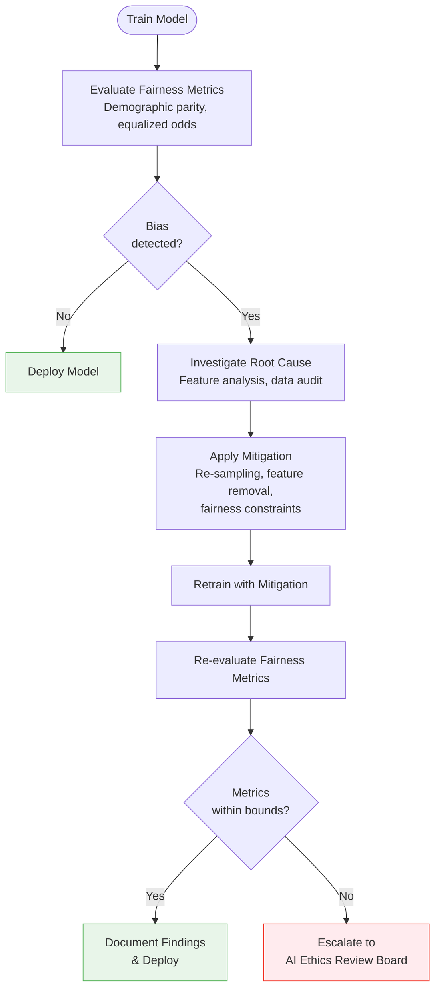
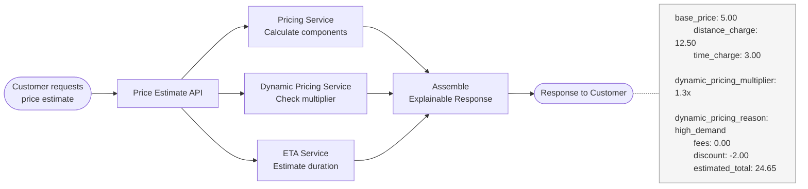
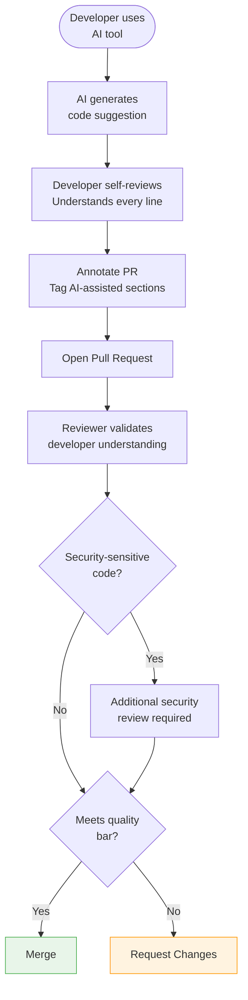
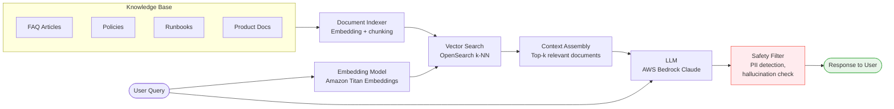

# 🧠 AI Governance


---

## ⚖️ 1. Responsible AI Principles

{Company}'s AI systems make decisions that directly affect customers, providers, and the communities we serve. We hold ourselves to four non-negotiable principles:

| Principle | Commitment | Example |
|-----------|-----------|---------|
| **Fairness** | Fulfillment and pricing algorithms must not discriminate based on protected characteristics | Dynamic pricing must not systematically disadvantage specific neighborhoods correlated with ethnicity or income |
| **Transparency** | Customers and providers understand the key factors behind decisions that affect them | Price breakdowns show distance, time, dynamic pricing adjustment, and fees - not a black-box number |
| **Accountability** | Every algorithmic decision is auditable and traceable to a model version, input features, and timestamp | Dispute resolution can replay exactly why a price was calculated or a provider was matched |
| **Safety** | AI systems fail gracefully - a model failure must never leave a customer stranded or a provider unmatched | All ML-powered paths have deterministic fallbacks (see [01-ml-platform.md](./01-ml-platform.md#9-fallback-strategy)) |

> **Governance mandate:** No AI feature ships to production without review against these four principles. The review is lightweight (checklist + data science lead sign-off) but mandatory.

---

## 🔍 2. Bias Detection & Mitigation

### Fairness Metrics

| Metric | Definition | Target |
|--------|-----------|--------|
| **Demographic parity** | Prediction rates are similar across demographic groups | Ratio between 0.8 and 1.2 |
| **Equalized odds** | True positive and false positive rates are similar across groups | Difference < 5% |
| **Calibration** | Predicted probabilities match observed outcomes across groups | Brier score difference < 0.02 |

### Audit Cadence

| Model | Audit Frequency | Auditing Team |
|-------|----------------|---------------|
| Dynamic pricing | Quarterly | Data Science + Legal |
| Fulfillment optimization | Semi-annually | Data Science + Operations |
| Fraud detection | Semi-annually | Trust & Safety + Legal |
| ETA prediction | Annually | Data Science |

### Bias Audit Process



### Remediation Toolbox

| Technique | When to Use | Trade-off |
|-----------|------------|-----------|
| **Re-sampling** | Training data is imbalanced across groups | May reduce overall accuracy slightly |
| **Feature removal** | A feature is a proxy for a protected characteristic | May reduce model performance |
| **Fairness constraints** | Post-processing to equalize outcomes | Adds complexity; requires careful calibration |
| **Threshold adjustment** | Different optimal thresholds per group | Requires per-group evaluation |

---

## 💡 3. Explainability

Customers and providers deserve to understand the decisions that affect their experience. Explainability is not optional.

### User-facing Explainability

| Decision | What the User Sees | Implementation |
|----------|-------------------|----------------|
| **Price estimate** | Breakdown: base price, distance, time, dynamic pricing multiplier, fees, discounts | Price API response includes itemized components |
| **Dynamic pricing** | "Prices are higher due to increased demand in your area" | Dynamic pricing service returns multiplier + reason code |
| **Fulfillment** | Provider sees dispatch priority factors (proximity, rating, acceptance rate) | Fulfillment service returns top-3 ranking factors |
| **Fraud block** | "Your order could not be completed. Contact support." | Generic message - details available to support agents |

### Price Estimate API - Explainability Integration



### Internal Explainability (SHAP/LIME)

For model developers and auditors:

| Tool | Use Case | Scope |
|------|----------|-------|
| **SHAP** | Global feature importance; per-prediction explanations | All tree-based models (XGBoost, LightGBM) |
| **LIME** | Local interpretability for individual predictions | Deep learning models (ETA prediction) |
| **Feature importance logs** | Top-5 contributing features logged per prediction | All real-time models (sampled at 10%) |

SHAP values are computed during model evaluation and stored in the model registry. On-demand SHAP explanations are available for incident investigation via internal tooling.

---

## 🛠️ 4. AI-Assisted Development Practices

{Company} embraces AI-assisted development while maintaining security and code quality standards.

### Approved Tools

| Tool | License | Approved Use |
|------|---------|-------------|
| **GitHub Copilot** | {Company}-licensed (Business tier) | Code completion, test generation, documentation |
| **Cursor** | {Company}-licensed | AI-assisted code editing, refactoring |
| **ChatGPT / Claude** | {Company}-licensed (Team/Enterprise tier) | Design brainstorming, documentation drafts, learning |

> **Hard rule:** Only {Company}-licensed instances are permitted. Personal accounts and public-facing AI tools must never receive {Company} proprietary code.

### Guardrails

| Rule | Rationale |
|------|-----------|
| AI-generated code passes the same review bar as human-written code | Quality is quality, regardless of origin |
| Security-sensitive logic (auth, encryption, PII handling) requires explicit human review annotation in PR | AI may generate plausible but subtly insecure patterns |
| No proprietary code pasted into public AI tools | Data loss prevention |
| Developer must understand and be able to explain every line of AI-generated code | Accountability - "Copilot wrote it" is not a valid defense |
| AI-generated tests must be reviewed for false confidence (tests that pass but don't actually validate behavior) | AI often generates tests that look comprehensive but test implementation details |

### Code Review Flow for AI-Assisted PRs



---

## 🤖 5. Generative AI Patterns

{Company} uses generative AI in controlled, well-architected patterns - never as unguarded direct model access.

### Use Cases

| Use Case | Pattern | Model | Status |
|----------|---------|-------|--------|
| Customer support chatbot | RAG (Retrieval-Augmented Generation) | AWS Bedrock (Claude) | Production |
| Intelligent dispatch notes | Structured generation | AWS Bedrock (Claude) | Pilot |
| Incident triage assistant | RAG + summarization | AWS Bedrock (Claude) | Internal tooling |
| Log analysis assistant | RAG + pattern matching | AWS Bedrock (Claude) | Internal tooling |

### RAG Architecture



### RAG Implementation Guidelines

| Concern | Standard |
|---------|----------|
| **Chunking** | 512 tokens with 50-token overlap; respect document boundaries |
| **Embedding model** | Amazon Titan Embeddings (v2) |
| **Vector store** | OpenSearch with k-NN plugin (HNSW) |
| **Top-k retrieval** | k=5 for customer support; k=10 for incident triage |
| **Context window** | Include retrieved context + system prompt; never exceed 80% of model's context window |
| **Grounding** | Every response must cite source documents; if no relevant documents found, respond "I don't have information about that" |
| **Fallback** | If confidence is low, route to human agent |

---

## 🛡️ 6. LLM Safety & Evaluation

Generative AI systems require safety measures beyond traditional ML.

### Threat Model

| Threat | Mitigation |
|--------|-----------|
| **Prompt injection** | Input sanitization; system prompt isolation; never include user input in system prompt |
| **Hallucination** | RAG grounding; confidence scoring; source citation required |
| **PII leakage** | PII detection filter on both input and output; no customer data in prompts |
| **Harmful content** | Output safety filter; content classification before returning to user |
| **Data exfiltration** | No tool-use or code execution capabilities for customer-facing LLMs |

### PII Filtering Pipeline

| Stage | Action | Tool |
|-------|--------|------|
| **Input** | Detect and redact PII from user query before sending to LLM | Amazon Comprehend PII detection |
| **Context** | Ensure retrieved documents are PII-free (anonymized at indexing time) | Pre-processing pipeline |
| **Output** | Scan LLM response for any PII that may have leaked | Amazon Comprehend PII detection |

### Evaluation Framework

Every LLM-powered feature is evaluated on a rolling basis:

| Dimension | Metric | Target | Measurement |
|-----------|--------|--------|-------------|
| **Accuracy** | Correct answer rate (human-judged sample) | > 90% | Weekly sample of 100 interactions |
| **Relevance** | Response addresses the user's actual question | > 95% | Weekly sample |
| **Safety** | No harmful, biased, or inappropriate content | 100% | Automated filter + weekly audit |
| **Groundedness** | Response is supported by retrieved documents | > 95% | Automated citation verification |
| **Latency** | Time to first token | < 2 seconds | Prometheus p95 |

---

## 🔒 7. Data Privacy with AI

AI systems at {Company} operate under strict data privacy constraints aligned with {local data protection law}, GDPR (for any EU customers), and {Company}'s internal data classification policy.

### Hard Rules

| Rule | Enforcement |
|------|-------------|
| No PII in LLM training data | Data pipeline strips PII before training data extraction |
| No customer data in prompts to external LLMs | PII filter on all prompts; architecture review for new integrations |
| AWS Bedrock preferred for data residency | Data stays in {Company}'s AWS account; no data sent to third-party model providers by default |
| Fine-tuning only on anonymized data | Anonymization pipeline required before any fine-tuning job |
| Prompt logs retained for 30 days only | Automated deletion via S3 lifecycle policy |
| No model training on user-generated content without consent | Legal review required for any UGC training |

### Data Flow for LLM Requests

```
User Query → PII Filter (redact) → LLM (AWS Bedrock, data stays in {Company}'s VPC)
                                         ↓
                                    Response → PII Filter (verify) → User
```

AWS Bedrock ensures:
- Model inference runs in {Company}'s AWS account
- No customer data is used to train foundation models
- Prompts and responses are not stored by the model provider

---

## 🏪 8. Vendor Selection

### Approved LLM Providers

| Provider | Status | Data Residency | Use Cases |
|----------|--------|---------------|-----------|
| **AWS Bedrock** | Preferred | Data stays in {Company}'s AWS account | All production use cases |
| **OpenAI API** | Approved (with DPA) | Data processing agreement required; no training on {Company} data | Internal tooling, prototyping |

### Evaluation Criteria

When evaluating a new AI/LLM vendor:

| Criterion | Weight | Notes |
|-----------|--------|-------|
| Data residency | Critical | Must support required regions for compliance |
| Data processing agreement | Critical | Vendor must not train on {Company} data |
| Latency | High | p95 < 3 seconds for interactive use cases |
| Cost | High | Cost per 1M tokens; scaling projections |
| Capability | High | Benchmark on {Company}-specific tasks |
| SOC 2 / ISO 27001 | Critical | Required for any vendor processing {Company} data |
| Model availability / SLA | Medium | 99.9% uptime for production workloads |

### Annual Review

Every approved AI vendor undergoes annual review:
- Benchmark on {Company}-specific evaluation dataset
- Cost analysis vs alternatives
- Security and compliance re-assessment
- Data residency re-verification
- Contract and DPA renewal

---

## 🏛️ 9. AI Ethics Review Board

### Composition

| Role | Representative | Responsibility |
|------|---------------|----------------|
| **Chair** | CTO | Final decision authority |
| **Engineering** | Staff Engineer (ML) | Technical feasibility, architecture review |
| **Data Science** | Data Science Lead | Model quality, fairness metrics |
| **Legal** | Legal Counsel | Regulatory compliance, liability |
| **Product** | Product Director | User impact, product alignment |
| **Operations** | Operations Lead | Provider/customer impact, ground-truth feedback |

### Meeting Cadence

Quarterly, with ad-hoc sessions for urgent reviews.

### Review Scope

| Review Item | Frequency | Trigger |
|-------------|-----------|---------|
| New AI features | Per feature | Before production launch |
| Bias audit results | Quarterly | Scheduled audit cycle |
| AI incident reports | Per incident | Any incident involving AI-driven decisions |
| Vendor changes | Per change | New vendor or significant capability change |
| Regulatory updates | Quarterly | Changes to {local data protection law}, GDPR, or AI-specific regulation |

### Review Checklist for New AI Features

| Checkpoint | Required |
|------------|----------|
| Responsible AI principles assessment (fairness, transparency, accountability, safety) | Yes |
| Bias evaluation on representative dataset | Yes |
| Fallback strategy defined and tested | Yes |
| Explainability approach documented | Yes |
| Data privacy impact assessment completed | Yes |
| User-facing communication plan (if applicable) | Yes |
| Kill switch configured in LaunchDarkly | Yes |
| Monitoring and alerting in place | Yes |
| Rollback procedure documented | Yes |

### Decision Outcomes

| Decision | Action |
|----------|--------|
| **Approved** | Feature proceeds to production rollout |
| **Approved with conditions** | Feature proceeds after specified conditions are met (e.g., additional bias testing) |
| **Deferred** | More information needed; re-review at next session |
| **Rejected** | Feature does not meet {Company}'s responsible AI standards; documented rationale provided |

---

## ⚙️ 10. LLM Operational Limits

### Token Limits per Use Case

| Use Case | Max Input Tokens | Max Output Tokens | Model | Cost Cap/Request |
|----------|------------------|-------------------|-------|------------------|
| Internal assistant | 8,000 | 2,000 | Bedrock Claude | $0.10 |
| Code review | 16,000 | 4,000 | Bedrock Claude | $0.25 |
| Customer-facing summary | 4,000 | 500 | Bedrock Claude Instant | $0.02 |
| Batch analytics | 32,000 | 4,000 | Bedrock Claude | $0.50 |

### Overflow Handling

- If input exceeds the token limit, **truncate with summarization** - never hard-cutoff mid-sentence or mid-document
- All truncation events are logged with the original input length, truncated length, and summarization method
- Truncation logs are reviewed weekly for patterns that indicate a limit needs adjustment

### Cost Caps

| Scope | Limit | Enforcement |
|-------|-------|-------------|
| Per-user daily (internal tools) | $5.00 | API gateway rate limiting; user receives "daily limit reached" message |
| Per-service monthly | Set per team in config | Budget alert at 80%; hard cap at 100% with escalation to team lead |

### Rate Limiting

| Context | Rate Limit |
|---------|------------|
| Internal tools (per user) | 10 LLM requests/minute |
| Production services (per service) | 100 LLM requests/minute |

---

## 🎯 11. LLM Red-Teaming & Adversarial Testing

### Cadence

| Scope | Frequency |
|-------|-----------|
| Customer-facing LLM features | Quarterly red-teaming exercises |
| Internal LLM tools | Annual red-teaming exercises |

### OWASP LLM Top 10 Alignment

Every red-teaming exercise must test for:

| OWASP LLM Risk | Test Approach |
|-----------------|---------------|
| Prompt injection | Attempt to override system prompt via user input |
| Data leakage | Attempt to extract training data, PII, or system prompt |
| Excessive agency | Verify LLM cannot perform actions beyond its allowlisted capabilities |
| Insecure output handling | Verify outputs are sanitized before rendering (e.g., no XSS via LLM output) |
| Model denial of service | Test with adversarial inputs designed to maximize token consumption |

### Red Team Composition

- **Security team** - adversarial testing expertise
- **ML team** - model behavior and prompt engineering knowledge
- **External contractor** - fresh perspective, rotated annually

### Tooling

- **Garak** (or equivalent) for automated adversarial prompt testing, integrated into CI for regression
- Adversarial test suites are version-controlled alongside model configuration
- CI runs a subset of adversarial tests on every prompt template change

### Allowlisted Tools

- For internal LLM assistants that support tool/API calling, the set of tools the LLM may invoke must be **explicitly allowlisted**
- Default: **NONE** - no tool access unless explicitly granted and reviewed
- Each tool grant requires security review and is documented in the LLM feature's architecture decision record

### Incident Response

| Trigger | Action | SLA |
|---------|--------|-----|
| LLM produces harmful, biased, or unsafe output | **Kill switch** - disable feature flag immediately | Immediate |
| Kill switch activated | Post-incident review (PIR) | Within 48 hours |
| PIR completed | Remediation deployed + adversarial test added | Within 1 week |

---

---
<div align="center">

⬅️ [Back to section](./README.md) · 🏠 [Back to root](../README.md)

</div>
