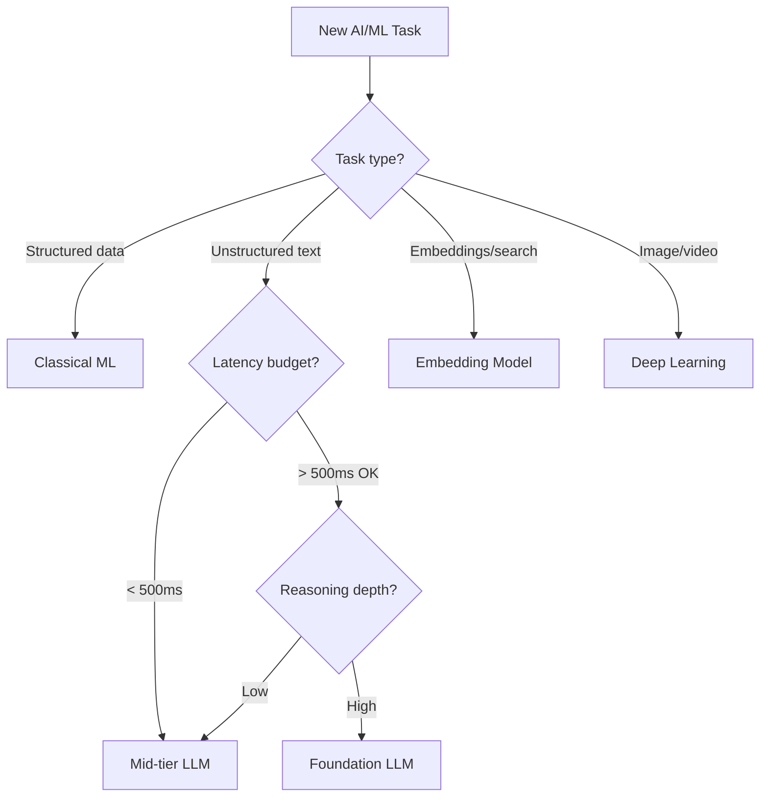

# 🧠 AI/ML Model Selection Framework

  

---

## 🎯 1. Overview

Choosing the right model for a task is the highest-leverage decision in any AI/ML project. Over-engineering with a large model wastes cost and latency. Under-engineering with a weak model wastes engineering time on workarounds. This framework provides structured criteria for selecting AI/ML models by task type, performance requirements, and cost constraints.

> **Rule:** Every model selection decision must be documented in the project's ADR. "We picked GPT-4 because it is the best" is not a valid rationale.

---

## 🗂️ 2. Model Categories

| Category | Examples | Best For |
|----------|---------|----------|
| **Foundation LLMs** | GPT-4, Claude, Gemini | Complex reasoning, code generation, analysis |
| **Mid-tier LLMs** | GPT-4o-mini, Claude Haiku, Gemini Flash | Summarization, classification, extraction |
| **Small/Local LLMs** | Llama, Mistral, Phi | On-device inference, privacy-sensitive tasks |
| **Classical ML** | XGBoost, LightGBM, scikit-learn | Tabular data, ranking, fraud detection |
| **Deep Learning** | TensorFlow, PyTorch custom models | Time-series, computer vision, NLP embeddings |
| **Embedding models** | OpenAI text-embedding, Cohere Embed | Semantic search, RAG, similarity matching |

---

## 📊 3. Selection Decision Tree

**Visual overview:**

---

## 💰 4. Cost-Performance Matrix

| Task | Recommended Tier | Approx. Cost per 1M Tokens | Latency (p50) |
|------|-----------------|---------------------------|---------------|
| Code review suggestions | Foundation LLM | $5 - $15 | 2 - 5s |
| Log summarization | Mid-tier LLM | $0.10 - $0.50 | 200 - 500ms |
| Structured data extraction | Mid-tier LLM | $0.10 - $0.50 | 200 - 500ms |
| Semantic search (embedding) | Embedding model | $0.01 - $0.10 | 50 - 100ms |
| Fraud scoring | Classical ML (XGBoost) | Infra cost only | < 50ms |
| Demand forecasting | Classical ML / DL | Infra cost only | Batch |
| Customer support triage | Mid-tier LLM | $0.10 - $0.50 | 300 - 800ms |
| Architecture analysis | Foundation LLM | $5 - $15 | 3 - 10s |

> **Rule:** Start with the cheapest model that can meet accuracy requirements. Upgrade only when evaluation data proves the cheaper model is insufficient.

---

## 🔍 5. Evaluation Criteria

Every model selection must score against these dimensions before production deployment.

| Criterion | Weight | How to Evaluate |
|-----------|--------|----------------|
| **Accuracy** | High | Golden set evaluation, A/B test against baseline |
| **Latency** | High | p50, p95, p99 under production-like load |
| **Cost per call** | Medium | Token cost + infrastructure cost per request |
| **Data privacy** | High | Does data leave {Company} infrastructure? |
| **Vendor lock-in** | Medium | Can you switch providers within 30 days? |
| **Scalability** | Medium | Can it handle 10x current volume? |
| **Maintainability** | Medium | Fine-tuning complexity, retraining frequency |

---

## 🔒 6. Governance Rules

| Rule | Rationale |
|------|-----------|
| All LLM calls route through the LLM gateway | Cost tracking, rate limiting, audit trail |
| No PII in prompts to external models | Data privacy compliance |
| Model changes require canary rollout | Prevent silent quality regressions |
| Fine-tuned models require quarterly revalidation | Detect drift and staleness |
| Foundation LLM use requires cost approval above $500/month | Prevent runaway spend |

---

## 🔗 7. Cross-References

- [ML Platform](./01-ml-platform.md) - Training pipelines, feature store, and serving infrastructure
- [AI Governance](./02-ai-governance.md) - Approved tools, data privacy, and compliance requirements

---

⬅️ [Back to section](./README.md) · 🏠 [Back to root](../README.md)

