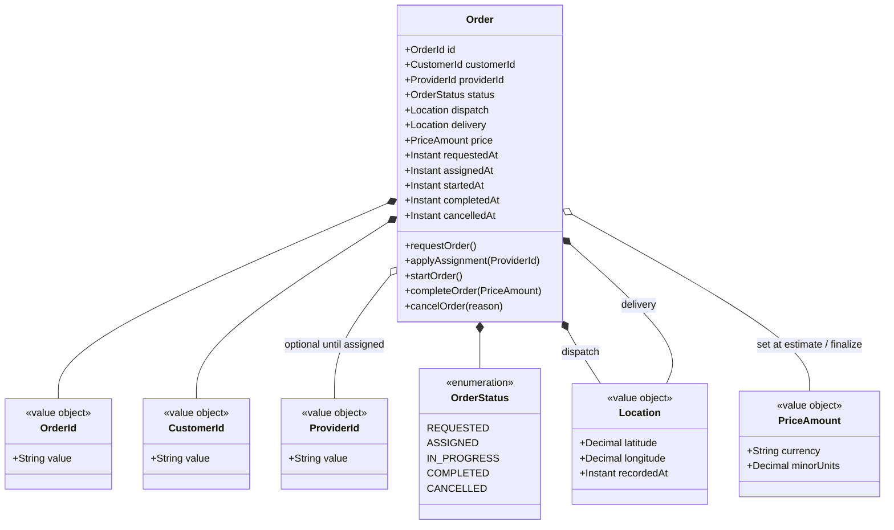
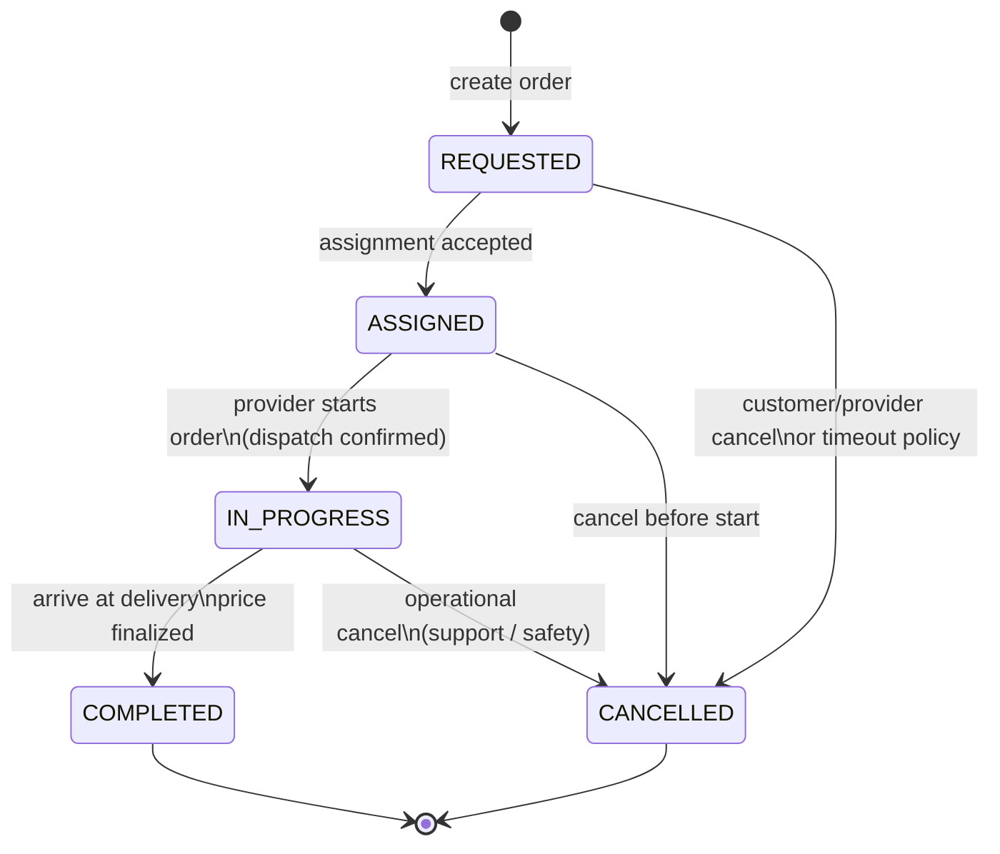

# 📦 Order Service


---

## 📋 1. Overview

The **Order Service** (`com.{company}.orders`) is the **central orchestrating bounded context** for the platform. It owns the order aggregate from the moment a customer confirms a request through completion or cancellation, coordinates synchronous calls to peer domains for pricing and fulfillment, and publishes the canonical order lifecycle on Kafka so Payments, Notifications, Dynamic Pricing, Fraud, Analytics, and Fulfillment can react without tight coupling.

### 1.1 What this service owns

| Area | Ownership |
|------|-----------|
| Order aggregate | Creation, status transitions, persistence, audit trail |
| Order lifecycle API | REST surface used by Customer/Provider BFFs for request, read, cancel, complete |
| Outbound order events | Authoritative `orders.order.*` events on the event backbone |
| Order read models | Current order state and history exposed via APIs (not cross-domain joins) |

### 1.2 What this service does **not** own

| Concern | Owning domain |
|---------|----------------|
| Provider/customer profile data | Provider Profile, Customer Profile (`com.{company}.providers.*`, `com.{company}.customers.*`) |
| Price rules, estimates, dynamic pricing math | Pricing Service (`com.{company}.pricing`) |
| Geospatial fulfillment, provider pool | Fulfillment Engine (`com.{company}.fulfillment`) |
| Card capture, wallets, payouts | Payment Service (`com.{company}.payments.*`) |
| Push/SMS content and delivery | Notifications (`com.{company}.notifications`) |
| Location, ETAs, routing | Geolocation Service (proxies) |

### 1.3 Orchestration role (high level)

```mermaid
flowchart TB
    subgraph bff [BFF Layer]
        CBFF[Customer BFF]
        PBFF[Provider BFF]
    end

    subgraph orders [Order Service - com.{company}.orders]
        API[REST API]
        ORCH[Lifecycle orchestration]
        DB[(Aurora - orders)]
        OUT[Outbox → Kafka]
    end

    subgraph sync [Synchronous peers - gRPC]
        PR[Pricing Service]
        FE[Fulfillment Engine]
    end

    subgraph async [Asynchronous peers - Kafka]
        PAY[Payments]
        NOT[Notifications]
    end

    CBFF --> API
    PBFF --> API
    API --> ORCH
    ORCH --> PR
    ORCH --> FE
    ORCH --> DB
    ORCH --> OUT
    OUT --> PAY
    OUT --> NOT
```

---

## 🧩 2. Domain Model

Core types live under `com.{company}.orders.domain`. Identifiers are opaque UUIDs (or branded string types) at the API boundary; the diagram shows conceptual relationships.



---

## 🔄 3. Order State Machine

All transitions are enforced in the domain layer; invalid transitions return a domain error and are never persisted. Terminal states: **COMPLETED**, **CANCELLED**.



---

## 🔌 4. API Surface

Base path: **`/v1/orders`**. Clients use the Customer or Provider BFF; internal callers use service mesh host `orders.{company}.internal` with mTLS. Package for generated clients: `@{company}/api-client-orders`.

| Method | Path | Description |
|--------|------|---------------|
| `POST` | `/v1/orders` | Create an order request: validates customer context, calls Pricing for price snapshot, persists `REQUESTED`, publishes `orders.order.requested`. Returns `201` + `Order` resource. |
| `GET` | `/v1/orders/{id}` | Idempotent read of a single order by `OrderId`; includes status, locations, price snapshot, and timestamps. Used by BFFs for order detail and polling. |
| `POST` | `/v1/orders/{id}/cancel` | Idempotent cancel: valid from `REQUESTED`, `ASSIGNED`, or `IN_PROGRESS` per policy; transitions to `CANCELLED`, appends audit, publishes `orders.order.cancelled`. |
| `POST` | `/v1/orders/{id}/complete` | Completes an `IN_PROGRESS` order: finalizes price (may re-validate with Pricing), sets `COMPLETED`, publishes `orders.order.completed` for capture and downstream analytics. |

Additional internal or versioned endpoints (e.g. provider **start** actions) are documented in Backstage; the four above are the **primary** REST contracts for lifecycle orchestration.

---

## 📤 5. Events Published

Producer application: `com.{company}.orders` - Avro schemas in Schema Registry under subject prefix `orders.order`.

| Topic | Payload summary | Key consumers | Retention |
|-------|-----------------|---------------|-----------|
| `orders.order.requested` | `orderId`, `customerId`, `dispatch`, `delivery`, price estimate ref | Fulfillment Engine, Fraud Engine, Analytics | 7 days |
| `orders.order.assigned` | `orderId`, `customerId`, `providerId`, `assignedAt` | Notifications, Provider BFF cache invalidation, Analytics | 7 days |
| `orders.order.started` | `orderId`, `providerId`, `startedAt` | Dynamic Pricing, Notifications, Analytics | 7 days |
| `orders.order.completed` | `orderId`, `price`, `completedAt` | Payment Service (capture), Notifications, Analytics | 30 days |
| `orders.order.cancelled` | `orderId`, `reason`, `cancelledAt`, party | Payment Service (void/release), Fulfillment (release provider), Notifications, Analytics | 7 days |

All topics use **compaction disabled** (time-based retention) for audit replay; critical financial follow-ups also read from Orders outbox with idempotent consumers.

---

## 📥 6. Events Consumed

Consumer group naming follows the platform standard: `{consuming-service}.{topic-short-name}.consumer` (e.g., `order-service.payment-captured.consumer`). See [Kafka Patterns](../06-developer-guides/04-kafka-patterns.md).

| Topic | Description | Handler behavior |
|-------|-------------|------------------|
| `payments.payment.captured` | Payment successfully captured for an order | Confirm billing side-effect, optional order receipt projection update |
| `payments.payment.failed` | Capture or authorization failed | Mark order billing issue, trigger retry/compensation policy per Payments playbook |
| `fulfillment.assignment.found` | Fulfillment Engine proposed or committed a provider | Transition `REQUESTED` → `ASSIGNED`, set `providerId`, publish `orders.order.assigned` |

---

## 🔗 7. Dependencies

```mermaid
flowchart LR
    subgraph orders_svc [Order Service]
        T[com.{company}.orders]
    end

    subgraph sync_dep [Synchronous - gRPC]
        P[Pricing Service\nGetPrice / ValidatePrice]
        M[Fulfillment Engine\nRequestAssignment / Release]
    end

    subgraph async_dep [Asynchronous - Kafka]
        KIN[(Kafka consume)]
        KOUT[(Kafka produce)]
        PAY_TOPIC[payments.payment.*]
        FULFILL_TOPIC[fulfillment.assignment.found]
    end

    T -->|gRPC mTLS| P
    T -->|gRPC mTLS| M
    T --> KOUT
    KIN --> T
    PAY_TOPIC --> KIN
    FULFILL_TOPIC --> KIN
```

Orders **does not** open JDBC connections to Pricing, Fulfillment, or Payments databases - only APIs and events, per platform boundaries (`11-domain-catalog/README.md`).

---

## 💾 8. Data Store

| Attribute | Value |
|-----------|--------|
| Engine | **Amazon Aurora PostgreSQL** (orders cluster) |
| Schema | `orders` (owned by @{company}/team-orders) |
| Migration tool | Flyway / Liquibase per `06-developer-guides/03-database-migrations.md` |

### 8.1 Key tables

| Table | Purpose |
|-------|---------|
| `orders` | One row per order aggregate: ids, status, JSON or columns for dispatch/delivery, price snapshot, timestamps, cancellation reason |
| `order_events` | Append-only domain history (status change, assignment applied, price updated) for support and replay |
| `outbox_events` | Transactional outbox rows for reliable Kafka publication (published by outbox relay) |

### 8.2 Indexes (representative)

| Table | Index | Rationale |
|-------|-------|-----------|
| `orders` | `PRIMARY KEY (id)` | Order lookup by `OrderId` |
| `orders` | `(customer_id, requested_at DESC)` | Customer active / history queries |
| `orders` | `(provider_id, status)` WHERE status active | Provider current order |
| `order_events` | `(order_id, occurred_at)` | Ordered audit per order |
| `outbox_events` | `(published_at) WHERE published_at IS NULL` | Relay polling |

---

## 📊 9. Key Metrics & SLOs

| Category | Metric / SLO | Target |
|----------|----------------|--------|
| Availability | Orders API + health checks | **99.9%** monthly |
| Latency | `POST /v1/orders`, `GET /v1/orders/{id}` P99 (excluding client network) | **< 500 ms** |
| Error rate | 5xx on tier-1 endpoints | < 0.1% over rolling 7d |
| Business | `orders.requested` (counter) | Dashboard + alert on anomaly vs baseline |
| Business | `orders.completed` (counter) | Funnel KPIs |
| Business | `orders.cancelled` (counter, by reason tag) | Experience / fulfillment health |

Instrumentation: OpenTelemetry traces from `com.{company}.orders`, Prometheus metrics exported via platform sidecar; SLO burn alerts wired to PagerDuty.

---

## 👥 10. Team & Ownership

| Item | Detail |
|------|--------|
| Team | **Team Orders** - Slack `@{company}/team-orders`, GitHub `{company}/order-service` |
| On-call | Primary / secondary rotation in PagerDuty |
| Service catalog | [Backstage - Order Service](https://backstage.{company}.internal/catalog/default/component/order-service) *(internal URL - replace with live link)* |
| PagerDuty | Service **order-service** - escalation to Team Orders manager after 15 minutes unacknowledged |

For cross-domain changes, use the platform RFC process and notify **Payments** and **Fulfillment** for contract changes on consumed/produced topics.

---
<div align="center">

⬅️ [Back to section](./README.md) · 🏠 [Back to root](../README.md)

</div>
