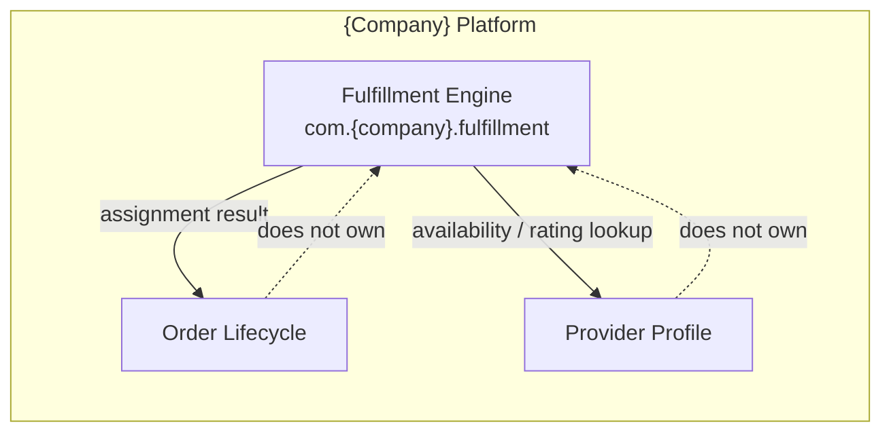
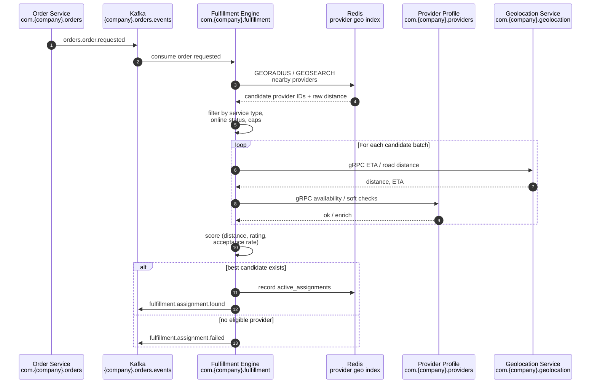
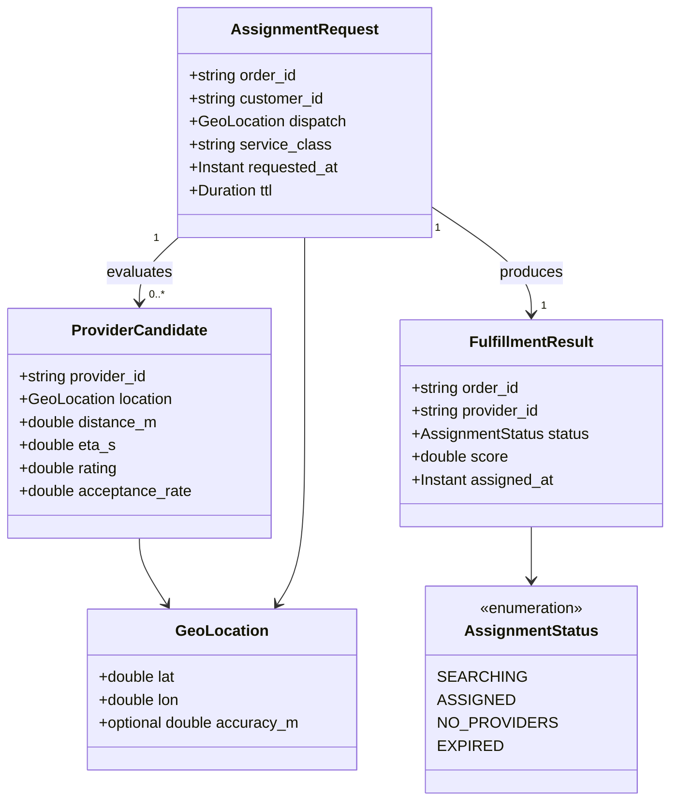
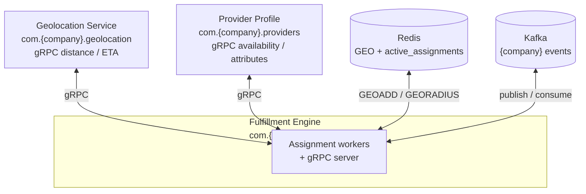
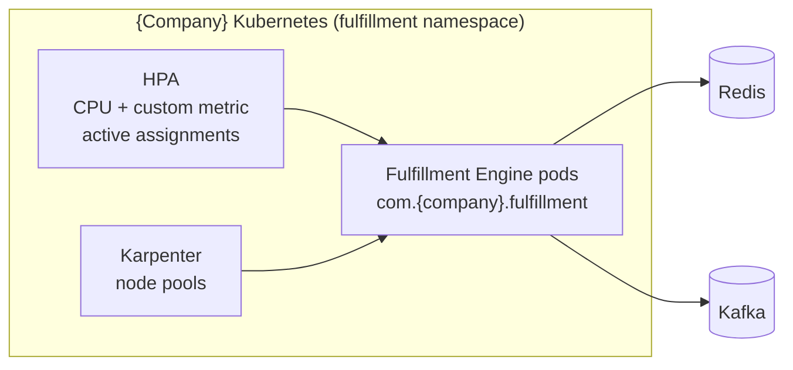

# Fulfillment Engine

| Field | Value |
| --- | --- |
| **Status** | Active |
| **Owner** | Team Orders |
| **Last Updated** | 2026-03-31 |

---

## 1. Overview

The **Fulfillment Engine** (`com.{company}.fulfillment`) is the real-time subsystem that pairs orders with available providers. It applies **geospatial algorithms** on a live provider index, scores candidates, and emits deterministic assignment outcomes for downstream order orchestration.

**Owns**

| Capability | Description |
| --- | --- |
| Assignment decisions | Binding an order request to a selected provider for handoff to the Order domain |
| Provider availability index | Ephemeral geospatial view of providers eligible for assignment (backed by Redis GEO) |

**Does not own**

| Concern | Owning domain |
| --- | --- |
| Order lifecycle | Order orchestration (`com.{company}.orders`) |
| Provider profile data | Provider Profile (`com.{company}.providers`) — ratings, documents, long-lived attributes |



---

## 2. Assignment Algorithm Flow

End-to-end flow from order request to published assignment event.



---

## 3. Domain Model

Core types for the fulfillment bounded context. Enums and messages align with `com.{company}.fulfillment.v1` protobuf package.



---

## 4. API Surface

The Fulfillment Engine exposes a **gRPC** API under `com.{company}.fulfillment.v1.FulfillmentService`, secured with standard platform service auth (mTLS / bearer as per platform policy).

| RPC | Purpose |
| --- | --- |
| `FindBestProvider` | Synchronous or streaming resolution of the best provider for an `AssignmentRequest` (used for admin replay, load tests, or internal tools; primary path remains event-driven) |
| `CancelAssignment` | Invalidate an in-flight assignment (e.g. customer cancelled before provider accepted) |
| `GetAssignmentStatus` | Read current `AssignmentStatus` and metadata for an `order_id` |

**Proto service definition (illustrative snippet)**

```protobuf
syntax = "proto3";

package com.{company}.fulfillment.v1;

option java_multiple_files = true;
option java_package = "com.{company}.fulfillment.v1";

import "com/{company}/fulfillment/v1/model.proto";

service FulfillmentService {
  rpc FindBestProvider(FindBestProviderRequest) returns (FindBestProviderResponse);
  rpc CancelAssignment(CancelAssignmentRequest) returns (CancelAssignmentResponse);
  rpc GetAssignmentStatus(GetAssignmentStatusRequest) returns (GetAssignmentStatusResponse);
}

message FindBestProviderRequest {
  AssignmentRequest assignment_request = 1;
}

message FindBestProviderResponse {
  FulfillmentResult result = 1;
}

message CancelAssignmentRequest {
  string order_id = 1;
  string reason_code = 2;
}

message CancelAssignmentResponse {
  bool cancelled = 1;
}

message GetAssignmentStatusRequest {
  string order_id = 1;
}

message GetAssignmentStatusResponse {
  FulfillmentResult result = 1;
}
```

---

## 5. Events Published

All topics live under the Kafka namespace `{company}.fulfillment` (logical); payloads use `com.{company}.fulfillment` event envelopes.

| Event | Key fields | Typical consumers | Retention (guidance) |
| --- | --- | --- | --- |
| `fulfillment.assignment.found` | `order_id`, `provider_id`, `score`, `assigned_at` | Order orchestration (`com.{company}.orders`), notifications, analytics | 7 days (ops) / compacted changelog optional |
| `fulfillment.assignment.failed` | `order_id`, `reason` (`NO_PROVIDERS`, `TIMEOUT`, …) | Orders (retry / UX), support tooling | 7 days |
| `fulfillment.assignment.expired` | `order_id`, `expired_at` | Orders (cleanup), dead-letter review | 3–7 days |

---

## 6. Events Consumed

| Event | Source domain | Use in Fulfillment Engine |
| --- | --- | --- |
| `orders.order.requested` | Order Service (`com.{company}.orders`) | Trigger assignment pipeline for new `order_id` |
| `orders.order.cancelled` | Order Service | Stop assignment, cancel `active_assignments`, emit `fulfillment.assignment.failed` or silent no-op if already terminal |
| `providers.provider.location-updated` | Provider presence (`com.{company}.providers.presence`) | Feed Redis `GEOADD` for `provider:locations` (or equivalent shard key) |
| `providers.provider.status-changed` | Provider / Fleet (`com.{company}.providers.status`) | Include/exclude providers from candidate set (online, on-assignment, suspended) |

---

## 7. Data Store

Fulfillment Engine persistence is **ephemeral only** — no relational database for assignment state.

| Store | Usage | Conventions |
| --- | --- | --- |
| **Redis** | Geospatial index + hot assignment state | Cluster mode; keys prefixed `{company}:fulfillment:assignment:` |
| Geospatial | `GEOADD`, `GEORADIUS` / `GEOSEARCH` | Member = `provider_id`, score = geohash; **P99 geo query target < 10 ms** (see section 8) |
| `provider:locations` | Logical key pattern for GEO set(s); may be sharded e.g. `{company}:fulfillment:assignment:provider:locations:{region}` | Updated from `providers.provider.location-updated` |
| `active_assignments` | Redis `HASH` (or hash per shard): `order_id` → serialized assignment metadata | TTL aligned with request TTL; cleared on terminal status |

**Not used:** PostgreSQL, MySQL, or other durable OLTP for assignment rows — Order domain owns durable order records after handoff.

---

## 8. Performance Requirements

| Requirement | Target |
| --- | --- |
| End-to-end assignment (request consumed → `fulfillment.assignment.found` or terminal failure) | **< 3 seconds** at P99 under nominal load |
| Redis geospatial query (single radius search, regional shard) | **P99 < 10 ms** |
| Concurrent active assignments (platform capacity planning) | **10,000** concurrent active assignment operations across the fleet |
| Kafka consumer lag | Kept within SLO via partition count and dedicated consumer group `fulfillment-engine.order-requested.consumer` |

---

## 9. Dependencies

External and platform dependencies for `com.{company}.fulfillment`.



---

## 10. Scaling Strategy

| Layer | Approach |
| --- | --- |
| **Workload** | Horizontally scaled stateless assignment workers; Redis cluster and Kafka partitions sized for peak QPS |
| **HPA** | **CPU-based** scaling plus **custom metric**: `{company}_fulfillment_active_assignments` (or equivalent Prometheus metric exported from the service) to scale before CPU saturates during assignment storms |
| **Nodes** | **Karpenter** (or equivalent) for rapid node provisioning during **peak demand** (events, weather, market launches) |
| **Redis** | Scale-out via sharding by region; avoid single hot key on `provider:locations` where possible |



---

## 11. Team & Ownership

| Item | Detail |
| --- | --- |
| **Team** | **Team Orders** |
| **Service** | Fulfillment Engine — `com.{company}.fulfillment` |
| **On-call** | Orders PagerDuty rotation (primary), platform Redis/Kafka escalations as secondary |

---

← [Back to Domain Catalog](./README.md)
