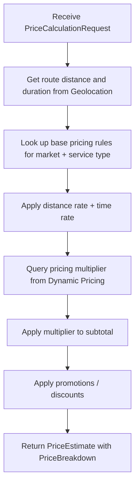
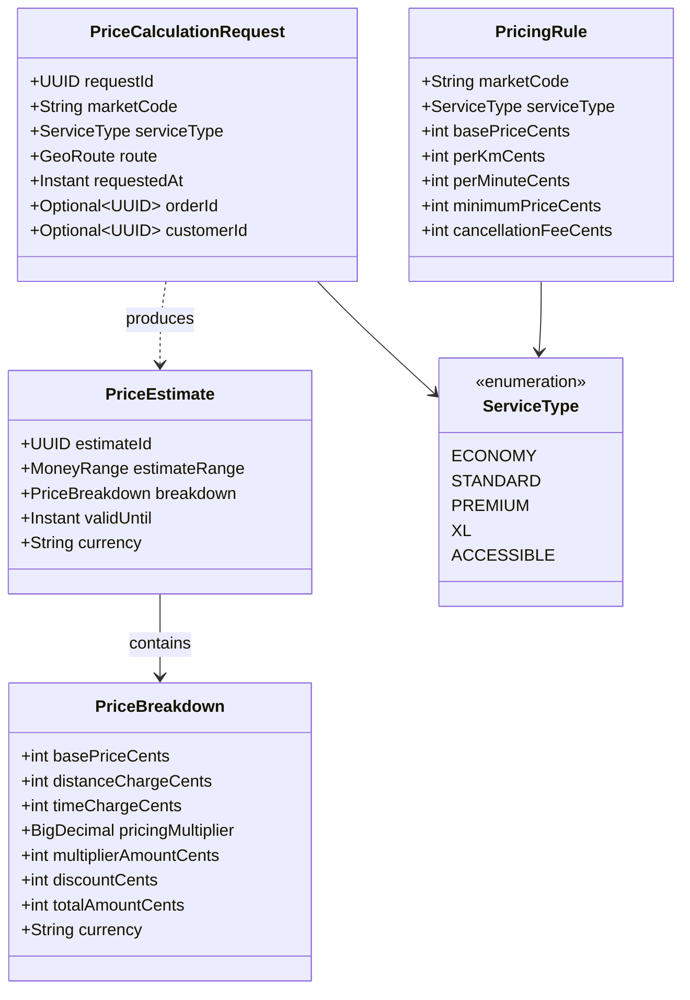
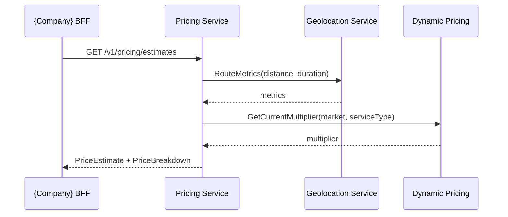
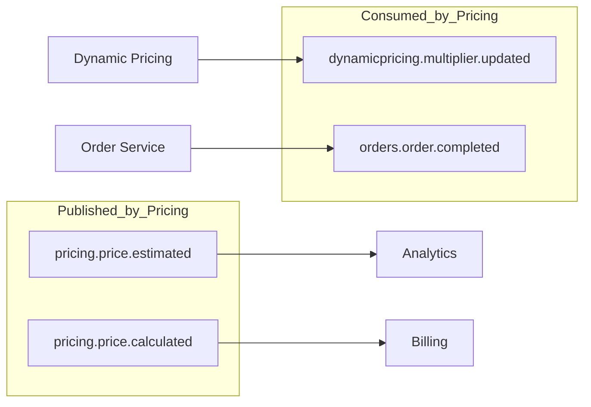
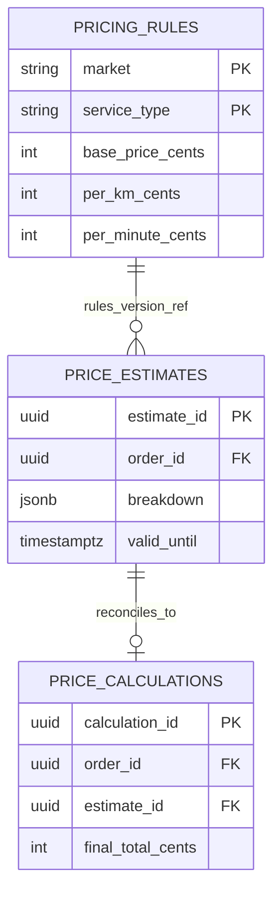
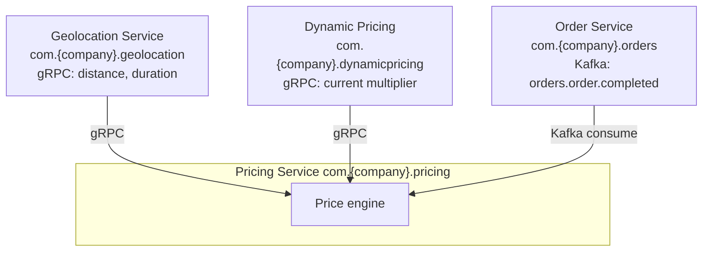

# 💲 Pricing Service

---

## 📋 1. Overview

The **Pricing Service** (`com.{company}.pricing`) is the system of record for **how much an order costs** before and after fulfillment. It turns route geometry, time, service class, and applicable rules into transparent price numbers that customers see in the app and that downstream systems use for receipts and analytics.

**Core responsibilities**

- **Price calculation** — Combine base price, distance, and time according to published rules for the customer's market and service type.
- **Estimates** — Produce pre-order price ranges and point estimates for order planning and customer consent.
- **Final price computation** — Reconcile estimated logic with actual distance/duration (and policy) after order completion to produce the billed amount consumed by billing and receipts.

**This domain owns**

| Concern | Description |
| --- | --- |
| Pricing rules | Per-market, per-service-type parameters (base, per-km, per-minute, minimums, cancellation fees). |
| Pricing models | How components (base + distance + time) compose into a subtotal before external multipliers. |
| Estimates | Creation, storage, and retrieval of price estimates tied to order intent or quotes. |

**This domain does not own**

| Concern | Owning domain |
| --- | --- |
| Dynamic pricing multipliers | **Dynamic Pricing** — defines and publishes current multipliers; Pricing **consumes** them. |
| Payment collection | **Payments / Billing** — charges cards, wallets, and settlement. |

---

## 🔄 2. Price Calculation Flow

The following flow describes how the platform produces a **price estimate** (final price follows the same structural steps with order-completed inputs and reconciliation rules).

**Notes**

- Geolocation integration uses the platform's **Geolocation Service** (`com.{company}.geolocation`) over gRPC for canonical distance and duration.
- Dynamic Pricing is **read-only** from Pricing's perspective; multiplier source of truth remains the Dynamic Pricing domain.

---

## 🧩 3. Domain Model

---

## 🔌 4. API Surface

### 4.1 gRPC (`com.{company}.pricing.v1`)

| RPC | Purpose |
| --- | --- |
| `CalculatePriceEstimate` | Pre-order quote from route (or origin/destination) and context; persists estimate for idempotency and audit. |
| `CalculateFinalPrice` | Post-order final amount from actual distance/duration and linked estimate or order. |
| `GetPriceBreakdown` | Retrieve a stored breakdown by `estimateId` or `orderId` for support, receipts, and BFF hydration. |

gRPC API package: **`com.{company}.pricing.v1`**. Shared order identifiers and enums align with **`com.{company}.orders`** types where applicable.

### 4.2 REST (BFF-facing)

| Method | Path | Purpose |
| --- | --- | --- |
| `GET` | `/v1/pricing/estimates` | Query-string parameters for mobile/web BFFs (e.g. `origin`, `destination`, `service_type`, `market`) returning estimate payload aligned with gRPC `PriceEstimate`. |

REST is **read-optimized** for estimates; authoritative writes and final price triggers remain on gRPC and events.

### 4.3 Request lifecycle (API ↔ domain)

---

## 📤 5. Events Published

All topics use the platform naming prefix `com.{company}.events`.

| Event | Topic / type | Payload highlights | Typical consumers | Retention |
| --- | --- | --- | --- | --- |
| `pricing.price.estimated` | `com.{company}.events.pricing.price.estimated` | `estimateId`, `orderId?`, `breakdown`, `validUntil` | Analytics, Search ranking, Notifications | 7 days |
| `pricing.price.calculated` | `com.{company}.events.pricing.price.calculated` | `orderId`, `finalTotalCents`, `estimateId`, `deltaFromEstimate` | Billing, Orders state, Data warehouse | 30 days |

---

## 📥 6. Events Consumed

| Event | Source domain | Purpose in Pricing |
| --- | --- | --- |
| `dynamicpricing.multiplier.updated` | Dynamic Pricing | Invalidate or refresh cached multipliers per market/service slice; ensures new estimates use current pricing. |
| `orders.order.completed` | Order Service (`com.{company}.orders`) | Trigger **final price reconciliation**: pull actual distance/duration, re-run rule engine, emit `pricing.price.calculated`, persist `price_calculations`. |

---

## ⚙️ 7. Pricing Rules Configuration

Pricing parameters are **authoritative in Aurora PostgreSQL**, keyed by **market** and **service type**. Operational changes go through the platform's config pipeline (validation, audit, gradual rollout).

**Example logical table: `pricing_rules` (excerpt)**

| market | service_type | base_price_cents | per_km_cents | per_minute_cents | minimum_price_cents | cancellation_fee_cents |
| --- | --- | --- | --- | --- | --- | --- |
| `US-NYC` | `ECONOMY` | 800 | 120 | 35 | 1200 | 1500 |
| `US-NYC` | `STANDARD` | 1200 | 180 | 50 | 2000 | 2000 |
| `US-LAX` | `ECONOMY` | 750 | 110 | 32 | 1100 | 1500 |

**Constraints (recommended)**

- Unique `(market, service_type)` per effective dating row if versioning is used.
- Currency implied by market or explicit `currency` column in production schemas.

---

## 💾 8. Data Store

**Primary store:** Aurora PostgreSQL (provisioned for Pricing).

| Table | Role |
| --- | --- |
| `pricing_rules` | Versioned or current effective pricing parameters per market and service type. |
| `price_estimates` | Immutable records of estimates (ids, inputs hash, breakdown JSON, `valid_until`). |
| `price_calculations` | Final price outcomes linked to `order_id` / `estimate_id`, actual metrics, and audit fields. |

---

## 📊 9. Key Metrics

### 9.1 SLOs and quality

| Metric | Target | Notes |
| --- | --- | --- |
| Estimate path P99 latency | **< 100 ms** | End-to-end Pricing handler after Geolocation + Dynamic Pricing calls; excludes extreme cold starts. |
| Price accuracy | **≥ 85%** of orders within **15%** of pre-order estimate | Measured as `abs(final - estimate) / estimate` capped distribution; excludes customer-caused route changes per policy. |

### 9.2 Business metrics

| Metric | Dimensions |
| --- | --- |
| `estimates_calculated` | `market`, `service_type`, `source` (app, BFF, API) |
| `final_prices_computed` | `market`, `service_type`, success/failure |

---

## 🔗 10. Dependencies

| Dependency | Integration | Used for |
| --- | --- | --- |
| Geolocation Service | gRPC | Route distance and duration for estimates and final price. |
| Dynamic Pricing | gRPC | Current pricing multiplier (read-only). |
| Order Service | Kafka (`orders.order.completed`) | Final price reconciliation trigger. |

---

## 👥 11. Team & Ownership

| Role | Team |
| --- | --- |
| Service owner | **Team Commercial** |
| Escalations | Team Commercial on-call → Platform Engineering |

---

⬅️ [Back to section](./README.md) · 🏠 [Back to root](../README.md)

