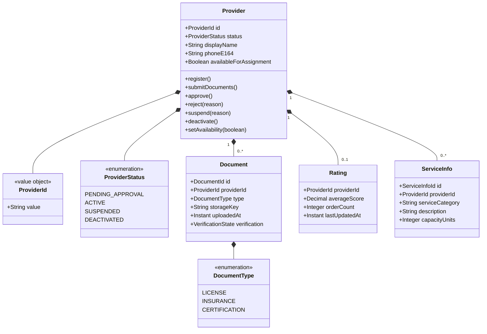
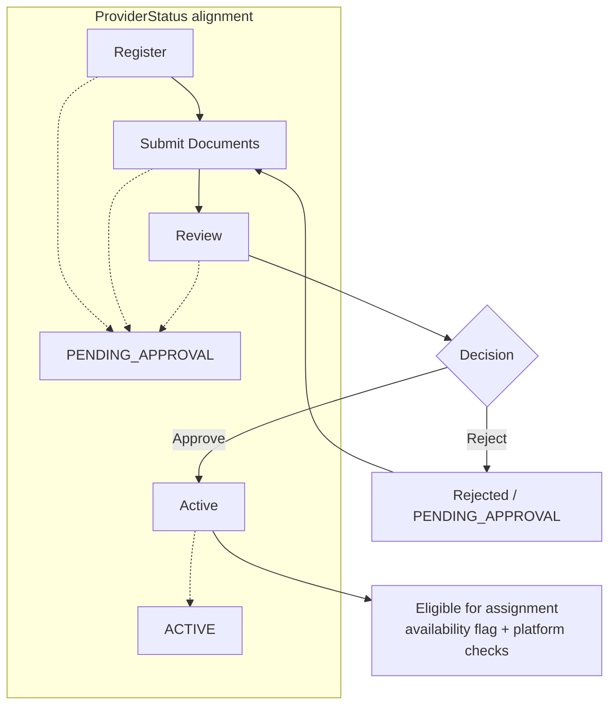

# 👤 Provider Profile


---

## 📋 1. Overview

The **Provider Profile** bounded context (`{company}.providers`) manages **provider onboarding**, **document verification and storage**, **ratings**, and **availability** as represented in the provider account - not live geolocation. It is the system of record for who may serve on the platform and whether their credentials are valid.

### 1.1 What this domain owns

| Area | Ownership |
|------|-----------|
| **Provider entity** | Identity in the provider context, lifecycle status, core profile fields |
| **Documents** | License, insurance, certifications metadata, verification state, links to object storage |
| **Ratings** | Aggregates and history used for provider reputation in profile and APIs |
| **Availability status** | Whether a provider is marked available for assignment (logical flag; not GPS) |

### 1.2 What this domain does **not** own

| Concern | Owning domain |
|---------|----------------|
| **Provider location / geospatial pool** | Fulfillment Engine (`{company}.fulfillment`) |
| **Payouts, balances, settlements** | Payment Service (`{company}.payments.*`) |
| **Order orchestration** | Order Service (`{company}.orders`) - consumes its events for ratings |

---

## 🧩 2. Domain Model

Core types live under `{company}.providers.domain`. Identifiers are opaque UUIDs at the API boundary.



---

## 🚀 3. Provider Onboarding Flow

End-to-end from first registration to an **ACTIVE** provider eligible for assignment (subject to Fulfillment Engine rules).



---

## 🔌 4. API Surface

Base path: **`/v1/providers`**. Clients typically call through the Provider BFF; internal callers use the service mesh host documented in Backstage. Package for generated clients follows `@{company}/api-client-providers`.

| Method | Path | Description |
|--------|------|-------------|
| `POST` | `/v1/providers` | Create provider record after auth identity exists; initial `PENDING_APPROVAL`; publishes `providers.provider.registered`. |
| `GET` | `/v1/providers/{id}` | Read provider profile, status, and summary rating for authorized callers. |
| `PATCH` | `/v1/providers/{id}` | Update allowed profile fields; may publish `providers.provider.status-changed` when relevant. |
| `POST` | `/v1/providers/{id}/documents` | Multipart document upload: persists metadata, stores blob in **S3**, returns document ids. |
| `GET` | `/v1/providers/{id}/documents` | List documents and verification state for ops and provider app. |
| `POST` | `/v1/providers/{id}/approve` | Ops / automated rule: transition to `ACTIVE`; publishes `providers.provider.approved`. |
| `POST` | `/v1/providers/{id}/reject` | Reject application or document set; remains or returns to review state. |
| `POST` | `/v1/providers/{id}/suspend` | Set `SUSPENDED`; publishes `providers.provider.suspended` and `providers.provider.status-changed`. |
| `POST` | `/v1/providers/{id}/deactivate` | Terminal deactivation; publishes `providers.provider.status-changed`. |
| `PATCH` | `/v1/providers/{id}/availability` | Set availability for assignment (logical flag only; not location updates). |

---

## 📤 5. Events Published

Producer application: `{company}.providers` - Avro subjects under prefix `providers.provider` (Schema Registry).

| Topic / event | Payload summary | Consumers |
|---------------|-----------------|-----------|
| `providers.provider.registered` | `providerId`, `registeredAt`, basic profile snapshot | Fraud Engine, Analytics, Notifications |
| `providers.provider.approved` | `providerId`, `approvedAt`, `approvedBy` (system or user) | Fulfillment Engine (eligibility cache), Notifications, Analytics |
| `providers.provider.suspended` | `providerId`, `reason`, `suspendedAt` | Fulfillment Engine (remove from pool), Orders (policy hooks), Support tooling, Analytics |
| `providers.provider.status-changed` | `providerId`, `fromStatus`, `toStatus`, `occurredAt` | BFF caches, Analytics, internal dashboards |
| `providers.provider.location-updated` | `providerId`, `location` (if emitted for profile/BFF sync - **canonical live location remains Fulfillment**) | Provider BFF, Analytics (optional); Fulfillment may correlate for debugging only |

Compaction and retention follow platform Kafka standards (`06-developer-guides/04-kafka-patterns.md`).

---

## 📥 6. Events Consumed

Consumer group naming follows the platform standard: `{consuming-service}.{topic-short-name}.consumer` (e.g., `provider-profile.fraud-signal.consumer`).

| Topic | Description | Handler behavior |
|-------|-------------|------------------|
| `fraud.signal.raised` | Fraud Engine risk signal for a provider | Evaluate policy; may auto-**suspend** and publish `providers.provider.suspended` / `providers.provider.status-changed`. |
| `orders.order.completed` | Order completed with price and parties | Update **rating** aggregates and history linked to `providerId`. |

---

## 💾 7. Data Store

| Attribute | Value |
|-----------|--------|
| Engine | **Amazon RDS PostgreSQL** (providers cluster) |
| Schema | `providers_profile` (owned by Team Providers) |
| Migration tool | Flyway / Liquibase per `06-developer-guides/03-database-migrations.md` |

### 7.1 Key tables

| Table | Purpose |
|-------|---------|
| `providers` | Provider aggregate: `id`, status, profile fields, availability flag, timestamps |
| `documents` | One row per uploaded doc: type, S3 key, verification state, foreign key to `providers` |
| `provider_ratings` | Rolling / snapshot rating per provider for fast reads |
| `service_info` | Service capability records linked to `providers` |

---

## 🔗 8. Dependencies

Provider Profile does **not** query Orders or Fraud databases directly - only APIs and Kafka.

```mermaid
flowchart TB
    subgraph dp [Provider Profile - {company}.providers]
        API[REST API]
        DOM[Domain / DB]
        OUT[Kafka produce]
        IN[Kafka consume]
    end

    subgraph storage [Object storage]
        S3[(Amazon S3\ndocument blobs)]
    end

    subgraph kafka [Kafka]
        FRAUD[fraud.signal.raised\nFraud Engine]
        ORDERS[orders.order.completed\nOrder Service]
    end

    API --> DOM
    DOM --> S3
    DOM --> OUT
    FRAUD --> IN
    ORDERS --> IN
    OUT -->|providers.provider.*| KOUT[(Downstream topics)]
```

---

## 📊 9. Key Metrics

| Category | Metric | Use |
|----------|--------|-----|
| Onboarding | **Onboarding completion rate** | % of registrations reaching `ACTIVE` |
| Operations | **Document approval time** | P50/P95 time from submit to approve/reject |
| Retention | **Provider churn rate** | Deactivations and long-term inactive providers vs cohort |

---

## 👥 10. Team & Ownership

| Item | Detail |
|------|--------|
| Team | **Team Providers** |
| Bounded context | `{company}.providers` |

For cross-domain changes, coordinate **Fulfillment** (availability vs location), **Payments** (payouts), and **Fraud** (suspension policy).

---

## 📈 11. SLOs and Error Budgets

| SLO | Target | Measurement |
|-----|--------|-------------|
| **Availability** | 99.9% (measured monthly) | Successful responses / total requests (excluding scheduled maintenance) |
| **Latency (p99)** | < 200ms for profile reads | Prometheus histogram on gRPC/REST handler duration |
| **Error rate** | < 0.1% 5xx responses | Istio telemetry + application error counters |

**Error budget policy:** When the monthly error budget is exhausted (>0.1% of the budget remaining), the team pauses feature work and focuses on reliability improvements until the budget recovers in the next window.

---

## ⚠️ 12. Failure Modes

| Failure Scenario | User Impact | Fallback Strategy |
|-----------------|-------------|-------------------|
| **Profile DB read unavailable** | Provider profile cannot be loaded in BFF/consumer apps | Return cached profile from Redis (stale read, TTL 5 min); degrade gracefully with "profile temporarily unavailable" in non-critical UI sections |
| **Profile DB write unavailable** | Profile updates, approval, and suspension fail | Queue write operations; return 503 with `Retry-After` header; alerts fire for operator intervention |
| **Document upload (S3) degraded** | Providers cannot upload license/insurance documents | Return user-friendly error with retry guidance; uploads are idempotent so clients can retry safely |
| **Kafka producer failure** | Downstream consumers (Fulfillment, Fraud) miss status change events | Outbox table ensures events are persisted to DB first; outbox poller retries publishing; no data loss |
| **Fraud signal consumer lag** | Delayed auto-suspension of flagged providers | Acceptable up to 5 minutes; beyond that, consumer lag alert fires and on-call investigates |

---

## 📐 13. Capacity Sizing

| Resource | Configuration |
|----------|--------------|
| **Min replicas** | 3 (production) |
| **Max replicas** | 15 (HPA) |
| **HPA target** | 60% CPU utilization |
| **DB connection pool** | 20 connections per pod (PgBouncer sidecar) |
| **Peak QPS** | ~500 req/s (read-heavy; 80% reads, 20% writes) |
| **Memory** | 1Gi request / 2Gi limit per pod |
| **CPU** | 500m request / 2000m limit per pod |

---

## 🗃️ 14. Data Retention Matrix

| Store | Data | Retention | Deletion Mechanism |
|-------|------|-----------|-------------------|
| **RDS PostgreSQL** - `providers` table | Provider profile, status, timestamps | Duration of engagement + 1 year | Deactivation workflow + scheduled cleanup job |
| **RDS PostgreSQL** - `documents` table | Document metadata and verification state | Duration of engagement + 1 year | Cascade delete with provider offboarding |
| **Amazon S3** - document blobs | License, insurance, certification images | Duration of engagement + 1 year | S3 lifecycle policy triggered by provider offboarding event |
| **RDS PostgreSQL** - `provider_ratings` | Rating aggregates and history | Indefinite (anonymized after deactivation) | Anonymize `providerId` on deactivation |
| **Kafka** - `providers.provider.*` topics | Provider domain events | 14 days (platform default) | Kafka topic retention policy |
| **CloudWatch Logs** | Application logs | 30 days | CloudWatch log group retention policy |

---
<div align="center">

⬅️ [Back to section](./README.md) · 🏠 [Back to root](../README.md)

</div>
